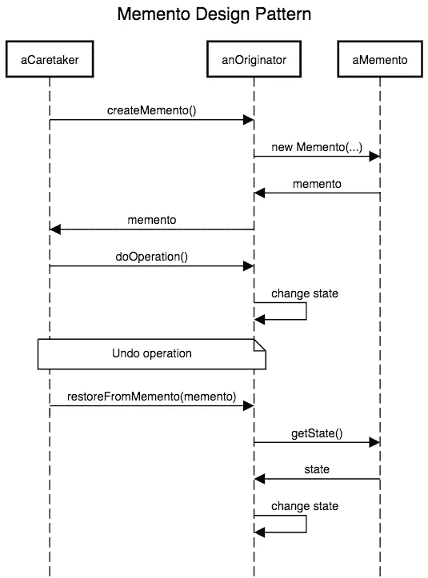
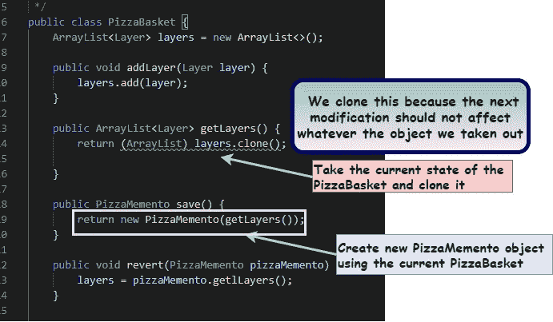
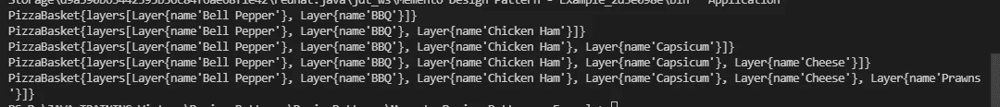
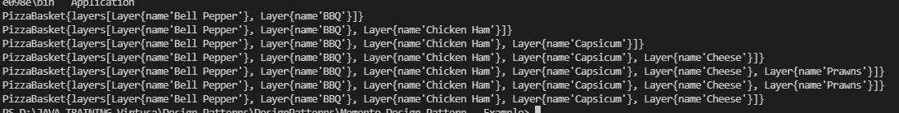
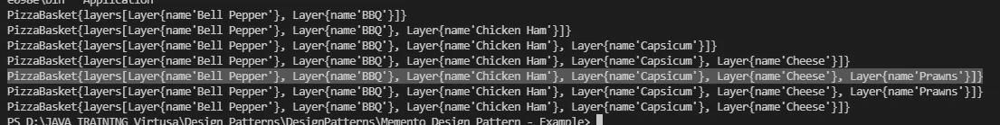
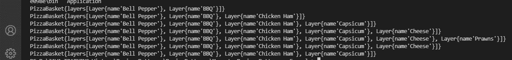
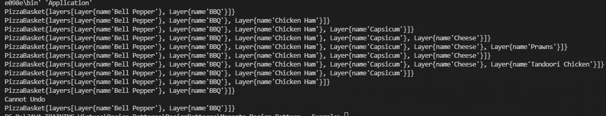

# 纪念品设计图案✨😎

> 原文：<https://medium.com/geekculture/memento-design-pattern-df23d8351ff7?source=collection_archive---------23----------------------->

Memento 设计模式的概述及其在真实场景中的实现！


📍根据四人组的《设计模式:可重用面向对象软件的元素》一书，Memento 设计模式属于行为设计模式的范畴，也称为快照模式。

📍Memento 是一种设计模式，旨在将对象恢复到其以前的状态。

## 考虑下面我们使用 Memento 设计模式的技术例子

> *🌞* *您一直在使用 Microsoft Word 进行工作，您是否见过撤销功能 there🧐* *通过单击撤销选项，您可以返回到之前的状态。*
> 
> *🌞在计算器应用程序中，我们只需点击一个按钮，就可以回滚我们在内存中进行的所有计算..*
> 
> *🌞在我们用来编辑计算机程序源代码的代码编辑器中，我们可以用简单的命令撤销和重做任何代码更改。*
> 
> *🌞* `*javax.swing.text.JTextComponent*` *该类提供了撤销支持机制。* `*javax.swing.undo.UndoManager*` *可以充当看守者，* `*javax.swing.undo.UndoableEdit*` *可以充当纪念者，而`*javax.swing.text.Document*` *可以充当发起者。(Ref:*[https://howtodoinjava . com/design-patterns/behavioral/memento-design-pattern/](https://howtodoinjava.com/design-patterns/behavioral/memento-design-pattern/))*

# 何时使用纪念品设计模式

⚡️:在大多数情况下，Memento 设计模式主要用于我们需要撤销、回滚或恢复的时候。

⚡️当我们需要直接访问对象的字段/getter/setter 违反了它的封装时，我们可以使用这种模式。(编号:[https://refactoring.guru/design-patterns/memento](https://refactoring.guru/design-patterns/memento))

# 纪念品设计模式的三大支柱

Memento 设计模式使用 3 个对象来实现。他们是发起人、看管人和纪念品。

## 发起人

📍简单来说，我们可以说这是我们需要维持的状态。此外，该对象知道保存和恢复自身的方法。

## 看门人

📍看护人是跟踪发起者的人。因此相应地，我们可以说这个对象知道*发起者* 何时以及为什么想要保存&恢复自身。

## 纪念品

📍纪念物由创建者创建、书写和阅读，并由看护者指导。一旦它被创建，没有人能改变它的状态，因为纪念品是不可变的对象。

……………………………………………………………………………………..

✨所以，在实施时，发起人加上纪念物，把状态传给看守人。因此，每当我们需要回到以前的状态时，我们就与管理员交谈，检查以前的状态并移动。

为了更好的理解，请看下面的类图和序列图。

# 纪念品设计模式的类图


Ref:[https://dzone.com/articles/memento-design-pattern-in-java](https://dzone.com/articles/memento-design-pattern-in-java)

# 纪念品设计模式序列图



Ref:[https://javadevcentral.com/memento-design-pattern](https://javadevcentral.com/memento-design-pattern)

让我们通过一个真实的例子来理解这种设计模式的实现。

# 💥方案

> 有一款名为“Pizza Express”的披萨订购应用程序，可以为您选择的特定披萨添加或移除额外的层。
> 
> *所以在这里，你需要添加甜椒，烧烤，鸡肉火腿，辣椒，奶酪和虾作为额外的层。然后需要移走虾，添加一层新的额外的 TandooriChicken，并再次恢复。*

让我们来看看这个场景的实现🤓

## 迈步⓵

▪️让我们创建如下的发起者类。

▪️在第 9 行中，我创建了添加图层的方法。

▪️为了纪念，我在这个 PizzaBasket 类中创建了一个内部类，如第 31 行所示。(但是如果你愿意，你可以为纪念品使用一个单独的类)

▪️***private ArrayList<layer>getllayers()*，**这里 getLayers 方法(在第 38 行)被声明为 private，这意味着只有 PizzaBasket 可以访问这个 getLayers 方法。

▪️，这个类里面有两个具体的方法。他们是

✨保护比萨市场州。-在这里，我们有一个管理员，我们必须向管理员提供披萨市场的状态。但是返回 Pizzabasket 对象本身并不好，因为我们不能改变它，也不能在不影响先前状态的情况下添加层。因此，在这里，我将 PizzaMemento 归还给管理员，如下所示。

```
**public PizzaMemento save() {
return new PizzaMemento(getLayers());}
// here, it has created a new PizzaMemento object using the current PizzaBasket.**
```

✨来恢复 PizzaBasket 状态——这里的 revert 方法用于恢复对象

```
**public void revert(PizzaMemento pizzaMemento) {
layers = pizzaMemento.getlLayers();}**
```



## 迈步⓶

▪️让我们实现如下看守类。

▪️管理员是保持前一个对象状态的人。

️Let's 说你分配一个层，并保存它。然后再分配一层，保存。你又做了同样的事。现在如果你需要回滚，你需要先给出第一个状态。那就意味着是**“后进先出”。这意味着我们需要将看守者实现为一个堆栈。**

这里，

```
☀️ This method is used to save the pizzaBasket's state. And [pizzaBasket.save()] will return the PizzaMemento.️**public void save(PizzaBasket pizzaBasket) { history.push(pizzaBasket.save()); }
....................................................................**☀️ In the below method. "If - else" is used to check the current state of the PizzaBasket.**public void revert(PizzaBasket pizzaBasket) {
if (!history.isEmpty()) {
pizzaBasket.revert(history.pop());
}else{
System.out.println("Cannot Undo");}}**
```

## 迈步⓷

▪️这是层类，我只声明了一个变量。

## 迈步⓸

▪️这是主要的方法。

输出:



▪️在这里作为第一层，我们有 2 层，因为我们在添加 2 层后保存了披萨饼。

📍这里实际发生的是，我们创建了披萨市场，并将整个披萨市场交给管理员。

️According:现在我们需要从披萨饼上去掉虾层。

现在请看下面的代码➔

输出:



因此，根据输出，您可以看到下面突出显示的部分重复了两次。



## 为什么会这样？😨🥵

在这里，我们将图层添加到 pizza sket，并将 pizza sket 交给管理员。然后说要还原这个。所以在那个时候，管理员会把我们上次给他的比萨饼盒子给你，这意味着它就是我们现在在你手里的比萨饼盒子。

所以我们可以将代码修改如下。

在这里，我们添加了对虾，但没有给管理员。所以现在管理员拥有的是装有“奶酪”的手推车。



现在让我们把 TandooriChicken 加入到披萨饼中。

输出:



所以在这里，在恢复坦杜里鸡后，它又回到了辣椒的状态。但是奶酪之州发生了什么？🙄🧐

发生这种情况是因为我们添加了对虾，但我们没有给管理员，我们恢复了它。这意味着管理员返回了最后状态的有奶酪的比萨包。所以现在管理员没有奶酪作为最后状态的披萨饼，而是有辣椒作为最后状态的披萨饼。

然后，我们添加了坦杜里鸡(没有保存到看守)，并再次恢复它。所以现在管理员把最后一个状态是辣椒的披萨饼还了回去。

点击下面的 Github 链接，查看该场景的完整源代码:

[](https://github.com/Irushinie/Krish-LP-Training/tree/main/Memento%20Design%20Pattern%20-%20Example) [## irushinie/Krish-LP-培训

### 在 GitHub 上创建一个帐户，为 Irushinie/Krish-LP-Training 的发展做出贡献。

github.com](https://github.com/Irushinie/Krish-LP-Training/tree/main/Memento%20Design%20Pattern%20-%20Example) 

# 纪念品设计模式的利与弊

## 纪念品设计模式的优势

⚡️:这种纪念品设计模式最重要的好处是，你总是能够丢弃不必要的更改，并将它们恢复到稳定状态。

这种模式提供了⚡️轻松恢复技术。

⚡️纪念品设计模式保留了封装边界。

## 纪念品设计模式的缺点

⚡️如果用户多次创建纪念品，应用程序将消耗大量的内存。

⚡️保存状态的额外时间会降低应用程序的整体性能。

# 参考

[](https://www.javatpoint.com/memento-pattern) [## 纪念品图案-Java point

### 一个纪念品模式说“将一个对象的状态恢复到它以前的状态”。但它必须做到这一点，没有…

www.javatpoint.com](https://www.javatpoint.com/memento-pattern) [](https://www.geeksforgeeks.org/memento-design-pattern/) [## 纪念品设计模式- GeeksforGeeks

### 纪念品模式是一种行为设计模式。Memento 模式用于将对象的状态恢复到以前的状态…

www.geeksforgeeks.org](https://www.geeksforgeeks.org/memento-design-pattern/) [](https://refactoring.guru/design-patterns/memento/php/example) [## PHP 中的纪念品

### Memento 是一种行为设计模式，允许制作对象状态的快照，并在将来恢复它…

重构。领袖](https://refactoring.guru/design-patterns/memento/php/example)