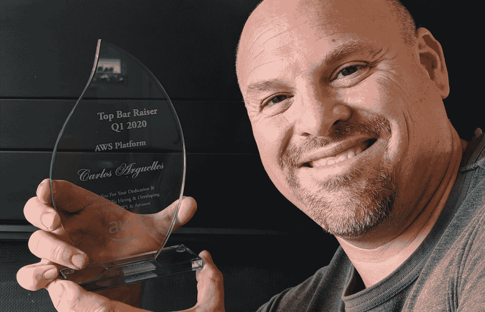
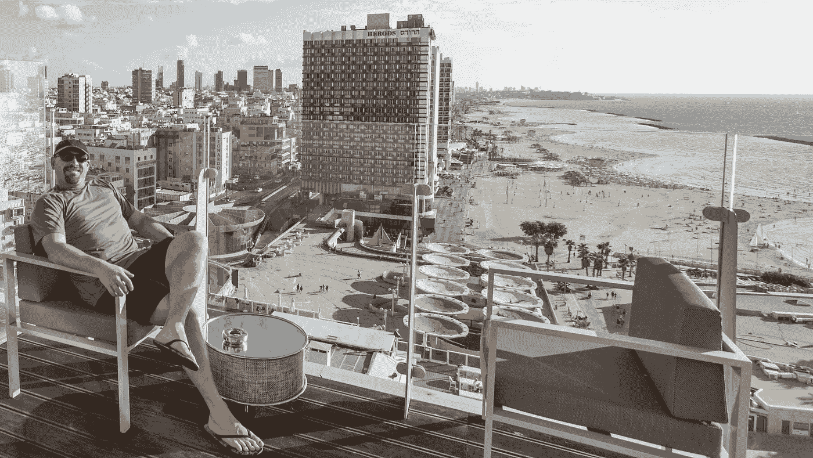

# 亚马逊酒吧经营者回忆录

> 原文：<https://medium.com/geekculture/memoirs-of-an-amazon-bar-raiser-718e36241310?source=collection_archive---------1----------------------->

## 揭秘亚马逊访谈

Top Amazon AWS Bar Raiser, Q1 2020, after 813 interviews

“嘿，卡洛斯，这个星期五你打算做什么？”我迅速看了一眼我的日历。“不多，需要什么？”招聘人员停顿了一下。“有现行护照吗？你能飞到特拉维夫吗？我们在海滨的五星级酒店住了整整一周。总有一天我们会去耶路撒冷。如果你能在 48 小时内赶到，演出就是你的了。”我微笑着，疯狂地搜索着飞往以色列的最后一分钟航班。在亚马逊当酒吧招待确实有一些额外的好处。

如果你在亚马逊面试过，你就会有一个吧台服务员。 **酒吧老板(“BR”)是亚马逊循环中的特殊采访者。**在我在亚马逊的 11 年里(2009 年至 2020 年)，我进行了 813 次面试。在亚马逊之前，我在微软进行了几百次面试。在亚马逊之后，我在谷歌(我现在所在的地方)进行了大约 30 次。所以总的来说，我做了一千多次采访。*我坚信面试是你在软件公司工作的一部分。*

BRs 是亚马逊文化中独特的一部分。在面试之前，你负责确保循环设置正确(审核面试者的经验和水平以及要涵盖的能力)。你面试，像其他人一样。面试结束后，你主持汇报(包括同一房间的所有面试官讨论他们的数据点),并做出最终录用/不录用的决定。你对所有的招聘决定都有否决权(没有你的赞许，招聘是不可能的)。你被认为是一个有高度判断力的经过校准的面试官。如果任何一个面试官没有被校准或者没有提供足够的反馈，教育他们是你的工作。

有一种不正确的看法，认为 BR 面试是最难的。它不是。事实上，我曾多次挑战那些对编码问题抱有不切实际期望的面试官。我参加的大多数面试都集中在[领导原则](https://www.amazon.jobs/en/principles)上。当我想到我个人认识的所有在亚马逊、微软或谷歌做得不好的人时，这总是归结于领导力的差距，而不是缺乏技术技能。然而，我们总是在技术面试的编码问题上过度索引！

*你是候选人是否获得录用的最终决定者，*这对候选人和亚马逊都是一项巨大的责任。有时人们会卖掉他们的房子，举家搬迁到西雅图，他们的小孩会换学校，远离他们所有的朋友。有时甚至来自其他国家。*如果你做了错误的决定，你真的可以毁了某人的一生。不得不解雇某人对个人来说是一次痛苦的经历，对招聘经理和公司来说也是一次巨大的资源流失。但是在你的招聘决定上过于保守，你会错过那些可以让你的公司变得更好的优秀人才，而且你会非常努力地为这一刻做准备。*

*这就是为什么成为一名 BR 是一个漫长、痛苦(但值得)的过程。*

为了参加 BR 培训计划，您需要完成一定数量的面试，并且您需要在这些面试中表现出高度的判断力，并达到一些准确性指标。你通常会被其他 br 邀请加入这个项目。

*BR 训练*严格而密集。我先跟踪了一群业务代表，观察他们的风格以及他们是如何进行汇报的，并在展示自己的风格时，对每一个人都吸取了一点。然后，就轮到我被其他 br 盯梢了。这太残忍了。更有经验的 BRs 直言不讳地批评了我面试的每一分钟。“嘿，我注意到你在问题 X 上花了 2 分钟，你从这 2 分钟里得到了什么具体数据？”我学会了对时间管理深思熟虑，以及那 45 分钟的每一分钟是多么珍贵。在任何给定的时刻，我都需要提取对决策过程有价值的具体数据。

BR 培训，以及成为一名 BR，教会了我许多面试过程之外的宝贵生活技能。

我学会了如何拥有一个结果。最终的录用/不录用决定是我的，也仅仅是我的，为了公司和候选人，我应该做出正确的决定，即使这很难、不清楚或者我不喜欢。有很多次，在对一个棘手的案件辩论了一会儿后，我希望我能把决定权交给别人，但责任在我身上。拥有它。我变得更适应做决策者。公司非常信任我能做出正确的决定。

我学会了如何促成一次有强烈不同意见的会议。BR 毕业的要求之一是表现出*处理有争议的汇报的能力*。汇报是一个 30 分钟的会议。你有 5 个以上的面试官在进行了他们自己的面试后出现在那里，通常对某人是否被雇佣有强烈的意见。通常情况下，你会得到几票雇佣票，一票不雇佣票，还有一些不确定的人。一些汇报可能会变得非常激烈。我的举止和用词会显著提高或降低房间的温度。对于不同的面试官来说，候选人有理由表现得非常不同，但我的一些有过负面经历的面试官很难相信候选人会有很好的面试机会(反之亦然)。在高风险的情况下，让一群非常固执己见的人在很短的时间内达成共识是很难的！虽然 BR 拥有*否决*的权力，但使用它凸显了领导力的失败——我从来没有这样做过，我专注于与招聘经理和面试官合作，达成一个我们支持的共同决定，即使我们并不都喜欢它。

我学会了如何指挥一个房间。这是我的会议。管理它是我的工作，我经常不得不应付那些试图垄断谈话或东拉西扯的指手画脚的人。我必须坐在驾驶座上，让人们集中注意力，并对非常紧张的流程进行时间管理。在 30 分钟内做出决定的压力迫使我无情地(尊重地)打断那些对结果没有贡献的人，或者从冗长的陈述中提取可操作的数据。

我变得乐于挑战和被挑战。面试官有时候会讲自己的*感受*，我的工作之一就是把他们带回*数据*。他们喜欢候选人与我无关(实际上也与选举过程无关)，我希望就候选人的实际优点展开一场健康、相互尊重的辩论。*“你有什么数据来支持那个断言？”*在整个汇报过程中，我多次问道。面试官有时没有经过校准，对标杆的位置抱有不切实际的期望。有时候，他们的问题对候选人的水平来说太难了。有时他们得到的答案并不太好，但是他们太宽容了。最终，我们都明白，通过挑战，我们不是在攻击对方，我们只是试图为候选人和公司做出正确的决定，所以这绝不是针对个人的。

我学会了如何权衡利弊，风马牛不相及。也许候选人有一些技术差距，但有惊人的领导能力，或者反之亦然，所以往往会归结为你脑海中的一个复杂公式，比较许多梯度，得出二元是/否的结论。一个 BR *客观地*在 30 分钟或更短的时间内汇总所有面试的所有数据点，寻找模式，并编织一个每个人都能认同的关于候选人的平衡叙述。

有机会练习这些技能，数百次，是非常宝贵的。我并不是每次都做得很好。但是我从我犯的每一个错误中吸取了教训。直到今天，我还在使用这些技能，即使我不在亚马逊，也不是酒吧老板。我在各种会议中使用它们！

我有幸参加过两次*的 BR 培训项目*。我实际上…失败了…我的第一次尝试。我有一个 BR 导师，他固执己见地认为我应该是什么样的人。我摸索了一会儿，试图找到我自己的风格。我没有及时将他的反馈融入到我的风格中，最终我被踢出了培训项目，因为我的进步被认为太慢了。这很尴尬，我很羞愧，但是这种逆境给了我更多的决心再试一次。我联系了我的 BR 朋友，问他们我是否可以跟踪他们，即使我已经不再正式参与这个项目了。一年后，我又试了一次，通过了程序，成为了一名认证 BR。

作为一名 BR，我采访过各种角色的人。如果你是一名软件工程师，你通常只面试其他软件工程师或者工程经理。但作为一名 BR，我经常面试产品经理、IT 支持技术人员、平面设计师、销售助理和其他我从未听说过的角色。像这样的面试真的能拓展你的引导技能，还能让你一瞥你通常不会得到的其他关键角色。

成为一名愿意出差的 BR 有着令人敬畏的额外津贴。亚马逊极其[节俭](https://fortune.com/2012/03/26/amazons-core-frugality/)(ehem……*便宜*……)。但是当亚马逊进行国际行业招聘时，他们一般会住在五星级酒店(或至少四星级酒店！)，因为面试是在酒店里进行的，而且他们必须展现出一家价值万亿美元的全球企业的成功和权力的形象。于是我环游世界，去了特拉维夫、明斯克、萨格勒布、布宜诺斯艾利斯(两次)、圣地亚哥(两次)、杭州、悉尼和墨西哥城。

My hotel in Tel Aviv, right on the Mediterranean!

Glamour and bling in Buenos Aires, Alvear Palace Hotel

这些招募活动非常激烈。你在早上面试了 4-5 个人(45 分钟的连续面试，可能有 5 分钟的休息时间)，在午餐时做了汇报，在下午面试了 4-5 个人，做了汇报，出去吃了一顿大餐，和同事喝了很多酒，然后睡觉。你学会了信任你的团队，100%地支持他们。我一般会在这之前或之后增加几天时间去观光。

悉尼之旅是最紧张的，因为我们没有考虑到正在举行的[墨尔本杯](https://en.wikipedia.org/wiki/Melbourne_Cup#:~:text=The%20Melbourne%20Cup%20is%20Australia,the%20Melbourne%20Spring%20Racing%20Carnival.)。整个国家关闭了一整天来观看一场 5 分钟的赛马。那天没有一个候选人愿意来和我们面谈！所以我们不得不把五天的面试压缩成四天，也就是 12 个小时的工作日。太残忍了。经验教训:在计划您的国际招聘之旅时，您必须考虑国家的具体事件！

**我们经常不得不稍微调整一下采访，以考虑到文化因素。**

我们在白俄罗斯的明斯克举行了一次招募活动。这个国家在铁幕后度过了几十年，公开表达异议是有后果的。就在去年，从雅典飞往立陶宛的瑞安航空 4978 号航班被迫在明斯克临时停靠，以便白俄罗斯当局逮捕机上的一名政治活动家。然而，亚马逊在采访中探讨的[领导原则](https://www.amazon.jobs/en/principles)之一是*不同意和承诺*，其中包括*“当你不同意时，尊重地挑战决定，即使这样做令人不舒服或令人疲惫。”*问这类问题会让我们的一些白俄罗斯候选人陷入极其尴尬的境地，所以我把措辞从更直白的美国式“告诉我一次你与你的经理意见相左，并阐述了你的立场”转向了更微妙的提问方式。

当我们在布宜诺斯艾利斯、圣地亚哥或墨西哥 DF 时，我注意到拉丁候选人往往有更冗长的答案。我自己也是在这种文化中长大的(我在阿根廷出生和长大)，对此我略知一二——当你交流时，有一种“拉丁风格”被期待/鼓励。但是亚马逊风格的交流是清晰、精确、真实和中肯的，所以这种冗长是有问题的。不过，转变总是一条微妙的线——我试图根据文化差异做出适当的调整，但最终这些候选人将不得不在一种非常特殊的文化中工作，所以我需要确保他们将成功适应亚马逊办公室的期望。

在拉丁文化中，习惯上亲吻脸颊作为问候的一部分。这让圣地亚哥和布宜诺斯艾利斯的一些面试官大吃一惊，当他们向一名候选人介绍自己时，候选人径直走向他们，天真地吻了他们！

其中一些采访发生在已知恶意黑客活动的地方(白俄罗斯和中国)，所以我们的代表团可能会成为攻击目标。我们被要求使用特殊的租借笔记本电脑，这些电脑只能有限地访问亚马逊的公司网络(包括不能访问任何亚马逊的代码库)。回来后，按照协议，在国外的机场关闭笔记本电脑，永远不要开机，并在第二天立即将其返回服务台粉碎。这些设备被破坏的风险太高了。

另一个出乎意料的激动人心的活动是 2020 年 1 月在杭州举行的。是的，中国，就在新冠肺炎刚刚起步的时候。我带着我 13 岁的儿子去看看这个国家。形势迅速恶化，这个国家开始对我们关闭。我们到达长城时，那天早上他们正在关门。在一个火车站的强制健康检查中，我的体温测试很高，在人山人海中，我被不会说英语(我也不会说中文)的武装士兵强行与我的孩子分开了几分钟，令人害怕。当我们到达拥有 2600 万人口的上海时，街道上空无一人。我们乘坐的是机场关闭前离开上海的最后一班飞机。

偶尔，我会在走廊上碰到一些人，他们会说“嘿，你是我的酒吧老板！”我总是为自己肩负的责任和我带进公司的员工的素质感到非常自豪，当我看到他们做得很好时，我的脸上总是挂着微笑。就在最近，我看到我的一个雇员被提升为高级工程师，我很自豪。

总而言之，成为一名 BR 是一个极好的机会，可以学习很多很棒的技能，改变一些人的生活，也可以享受旅行的乐趣——真正体现了[努力工作，享受乐趣，创造历史](https://www.cnbc.com/2019/02/20/amazon-ceo-jeff-bezos-this-choice-is-the-key-to-success.html)！