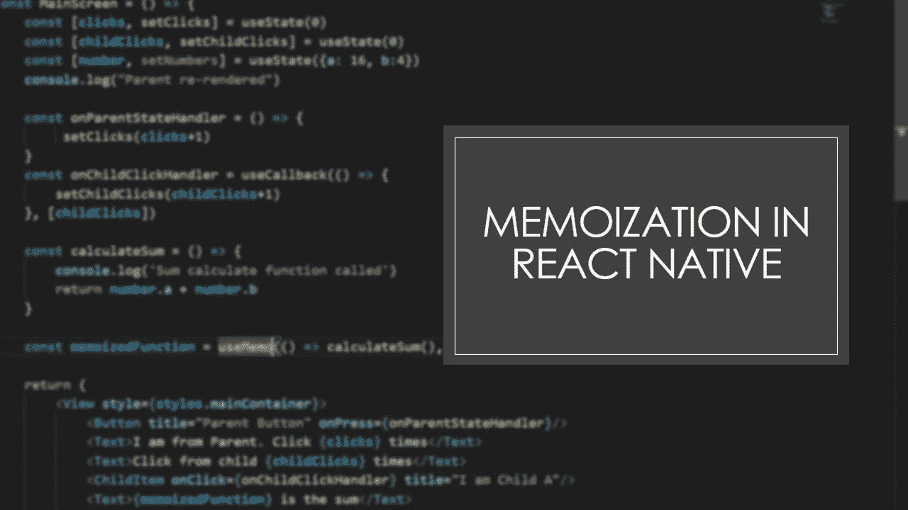
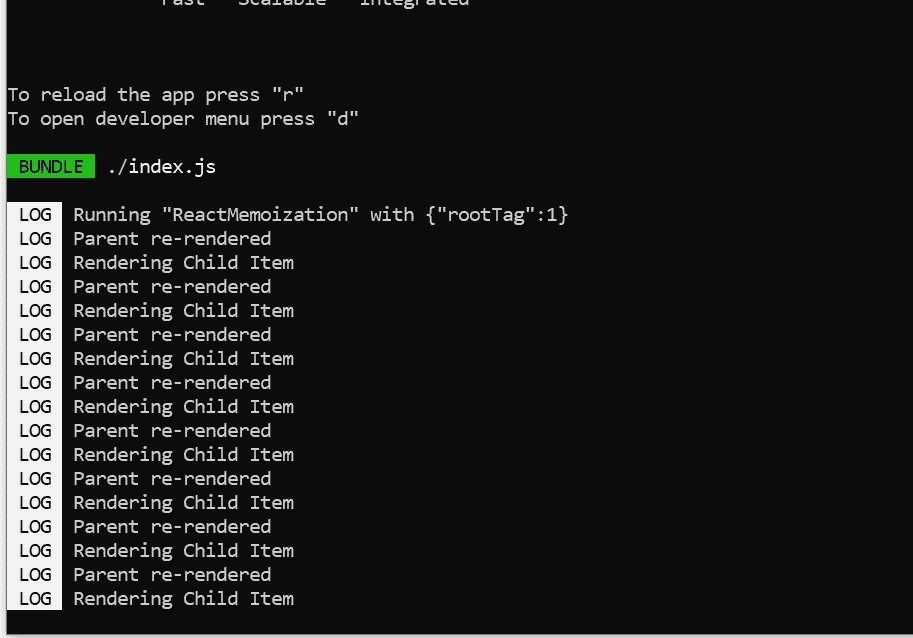
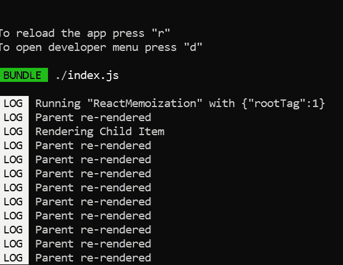
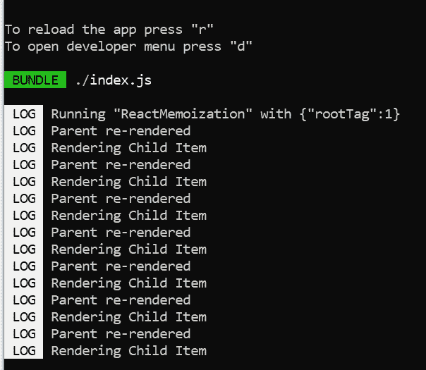
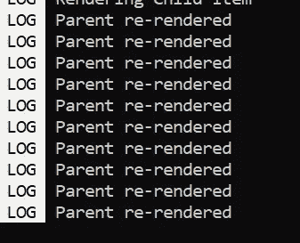
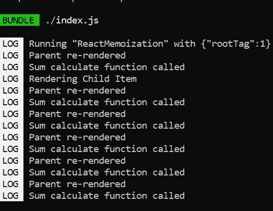
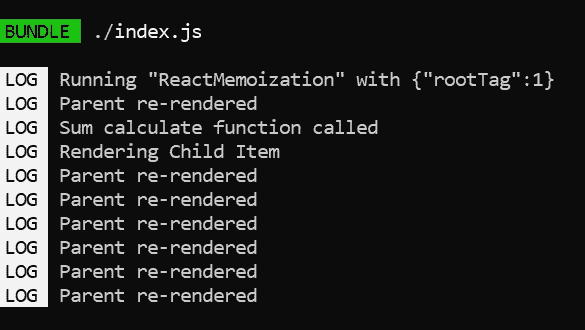

# 反应中的记忆化

> 原文：<https://medium.com/geekculture/memoization-in-react-native-ca894819ccff?source=collection_archive---------0----------------------->

如果你是一个编写代码和开发令人兴奋的东西的人，这些东西对用户界面进行了大量实时更新，包括动画、手势控制，让你的用户界面看起来不可思议，就像迪士尼/皮克斯电影一样，那么我必须说，你已经经历了作为一个能够做到所有这些神奇的开发者的真正痛苦。显然，当我说魔法的时候，听起来确实像是用魔杖敲了一下。如果是这样的话，这有多容易呢？但事实并非如此。你在创造魔法，而不仅仅是使用它。等一下！！！现在你们可能会奇怪，为什么我要用一个名为“记忆化”的故事来做一个类似迪士尼的讲座。我知道我开始有点偏离轨道，但伙计们相信我，我希望你们所有人都意识到你们做得很好。你应该受到表扬。现在就做！！深入理解这些概念并以最小的缺陷实现它们并不容易。我说了上面所有不相关的东西来告诉你一点，你们目前关注的是应用程序的性能或优化应用程序。你在这里是因为你对你的应用性能和应用功能给予了同等的重视。好了，不多说了，让我们进入正题吧！！

对于使用 JavaScript 的人来说，记忆化的概念并不陌生。简而言之，内存化就是缓存代价高昂的函数调用的结果，并在函数调用再次使用相同的输入时返回缓存的结果。在我们的应用中实现记忆化是很重要的，因为如果输入没有改变，它可以避免对函数的许多不必要的调用，从而提高我们的应用性能。

在 React Native 中，确保您的代码得到优化并且应用程序的性能足够好是非常重要的，因为我们正在构建用户希望像魅力一样工作的移动应用程序。记忆化是加速程序的优化技术之一。

在你的应用程序中开始使用记忆之前，有一些术语你必须理解。下面列出了它们。如果你已经知道这些，你可以跳到下一部分。

1.  **Pure component:-**React 中的纯组件是基于 JavaScript 中的纯函数。纯函数只不过是为特定的输入参数返回相同输出的函数。此外，输出不应该在功能范围之外有任何依赖。当状态和道具获得相同值的更新时，React 中的纯组件不会重新渲染。*shouldcomponentdupdate()*在 React 中的 PureComponent 类中隐式实现。在这里，它对状态和道具做了一个粗浅的比较。如果前一个状态和属性数据与下一个属性或状态相同，则组件不会被重新渲染。*做出反应。PureComponent* 只对类组件可用。因此，由于它限制了呈现，因此确保了组件的更高性能。阅读下面的文章来了解更多关于 PureComponent 的信息。[https://reactjs.org/docs/react-api.html#reactpurecomponent](https://reactjs.org/docs/react-api.html#reactpurecomponent)
2.  **浅层比较** :-在浅层比较中，使用“===”或严格相等来比较对象的属性，不会对属性进行更深入的比较。当浅层比较原始值(数字、字符串)时，它比较它们的值。比较对象时，它不比较它们的属性，只比较它们的引用。所以如果你对一个深度嵌套的对象进行浅层比较，它只会检查引用，而不是对象内部的值。这可能会在比较嵌套对象时产生假阴性。[https://reactjs.org/docs/shallow-compare.html](https://reactjs.org/docs/shallow-compare.html)
3.  **渲染:-** 每当组件的状态更新时，React 就会进行渲染。渲染是 React 将收集所有信息的过程，包括当前状态、道具和 UI 中所需的更改。它将调用功能组件，如果是类组件，它将调用 render()方法。虚拟 DOM 在这个过程中还没有改变。通常，会有一种误解，认为渲染是将更改同步到 DOM 的过程。但事实并非如此。
4.  **协调:-** 虚拟 DOM (VDOM)是一个编程概念，其中 UI 的理想或“虚拟”表示保存在内存中，并通过 ReactDOM 之类的库与“真实”DOM 同步。这个过程叫做和解。它是计算和比较应用于虚拟 DOM 的更改的过程。
5.  **DOM 操作:-** 一旦 React 完成了应用程序树中需要应用的计算，它将使用 react-native 包将所有需要的更改应用到 DOM。这些变更同步应用，DOM 更新。这被称为 DOM 操作。这发生在提交阶段。
6.  **重新渲染:-** 在第一次渲染之后，更新状态的第二次或后续渲染通常被称为重新渲染。在以下三种情况下都会导致重新渲染:当组件中的属性被更新时，当组件中的状态被更新时，以及当父组件的 render 方法被调用时。

> *“当您使用 React 时，在单个时间点，您可以将 render()函数视为创建 React 元素树。在下一次状态或 props 更新时，render()函数将返回一个不同的 React 元素树。React 然后需要找出如何有效地更新 UI 以匹配最新的树。”*

现在我们熟悉了所有与记忆有关的术语。这稍微偏离了我们的主题，但是相信我，在开发应用程序时，理解这些概念是非常重要的。

在这一部分，我们将讨论与记忆相关的三个要素。我假设你在应用程序中使用了功能组件。因为下面提到的钩子对类组件不起作用。首先，我将解释这些组件是什么，然后将讨论示例代码。

1.  **react . memo():-**react . memo 是优化功能组件性能的高阶组件。其功能类似于 React。PureComponent，但是这个是针对功能组件的。也就是说，如果功能组件被提供了相同的道具，并且如果它所呈现的输出是相同的，那么我们可以每次都跳过这个组件的重新呈现。这由 React.memo()负责。它通过记忆结果来帮助快速渲染。React 将跳过组件的渲染过程，并且不执行虚拟 DOM 差异计算，它将只重用上一次渲染的结果。就像开头说的 React.memo()像 PureComponent 一样做浅层比较。因此，如果我们的组件有任何嵌套的数据结构作为支撑，那么我们将需要编写自己的比较函数，并将其传递给 React.memo()。
2.  使用回调钩子:- 这个钩子也用来防止我们代码中不必要的重新渲染，从而使它更快更有效。有时我们可能需要结合使用 React.memo 和 useCallback。正如我前面提到的，React.memo 使用浅层比较来查找前一个道具和下一个道具之间的差异。这对原始类型来说非常好。但是如果函数组件有一个数组、对象，甚至回调函数作为它的道具，那么肤浅的比较会给出错误的否定。因此，当父组件重新呈现时，每次创建新的回调函数时，即使我们已经用 React.memo 包装了组件。我们必须使用 useCallback 包装回调函数并传递依赖关系。所以每当函数调用发生时，useCallback 钩子将返回一个记忆的函数。只有当依赖关系改变时，它才会创建一个新函数。
3.  **useMemo 钩子** :-这个类似于 useCallback。但是它不是记忆回调，而是记忆任何值类型。我们还必须将依赖列表传递给 useMemo。因此，每当依赖关系改变时，它将再次调用函数，重新计算并记忆新值。

好了，现在我们已经谈论了太多的理论。让我们看一些代码，了解如何使用每个钩子来优化我们的代码。

**情况:- 1 —无记忆**

这个示例应用程序有一个包含两个组件的屏幕。一个是父组件，另一个是子组件。我们将看到当父组件的状态改变时，子组件和父组件会发生什么，我们需要在父组件而不是子组件中进行一些 UI 更新。

现在，如果你检查控制台，你可以看到子控件在父控件中的每次点击都会被重新渲染。但是为什么呢？这是多余的权利。因为子组件没有 UI 更新。那么它就没有被重新渲染的意义。不幸的是，这是 React 默认行为。如果父树中有状态更新，则父树中的所有组件都将重新呈现。

**案例:- 2 —带 React.memo**

现在我们将使用 React.memo()包装 ChildItem，看看会发生什么。如前所述，它将触发当前和先前属性的浅层比较，如果任何属性发生变化，那么只有子项目会重新渲染。

现在你看到魔法了。只有父对象被重新渲染。

目前，如果你看到 ChildItem，我们只传递一个原始值作为 prop。在下一个例子中，我们将传递一个回调函数，让我们看看会发生什么。

**情况:-3 —以回调函数为道具**

我在这里添加了一个回调函数。它将向父组件更新子按钮被按下的次数。

以上是我们只按下父组件中的按钮时的日志。如果您查看日志，您可以再次看到 childItem 被重新呈现，尽管我们已经用 React.memo()包装了它。这是因为浅层比较将为当前和上一个属性返回 false，因为我们有一个非原始值作为属性。在下一个案例中，我们将看到如何解决这个问题。

**案例:- 4 —带有 useCallback()挂钩**

为了解决前面讨论的问题，我们将使用 useCallback 包装回调函数。因此，useCallback 将缓存该函数，并在其依赖关系发生变化时只创建一个新函数。

现在，如果您看到父按钮点击的日志，它将只重新呈现父组件。

**案例:-5 —带 useMemo()钩子**

如前所述，useMemo 和 useCallback 的区别在于 useMemo 记忆函数的结果，而不是函数本身。

在下面这段没有 useMemo 的代码中，如果你看到每次组件重新渲染时 calculateSum()函数都会被调用。但是想象一下如果功能巨大。如果每次渲染都不必要地调用该函数，将会影响应用程序的性能。

下面的代码展示了对函数调用的相同输入使用 useMemo 钩子。您可以在日志中看到该函数只被调用了一次。是啊！！我们已经实现了优化。

您可以在下面的 git 资源库中找到完整的源代码。

 [## GitHub-mohitau/反应记忆化

### 通过在 GitHub 上创建帐户，为 mohitau/ReactNativeMemoization 开发做出贡献。

github.com](https://github.com/mohitau/ReactNativeMemoization) 

Uff…！！那是相当巨大的权利。但是没关系。你已经学到了 react 原生应用开发中非常重要的一个概念。如果有必要的话，确保在编写下一个功能组件时遵循这一点。

我想说，内存化给了我们一个巨大的优化方法，但在 RAM 的使用上有所妥协。因此，请确保只有在非常必要的情况下才在代码中实现这一点，并且在添加这一点后，您可以看到应用程序性能的提高。

暂时就这样了。如果你喜欢这篇文章，请给我一些掌声，这将是我写下一篇文章的巨大动力，也让这篇文章带给需要的人。另外，请“关注我”了解文章的更多更新。

保持安全…保持饥饿..！！