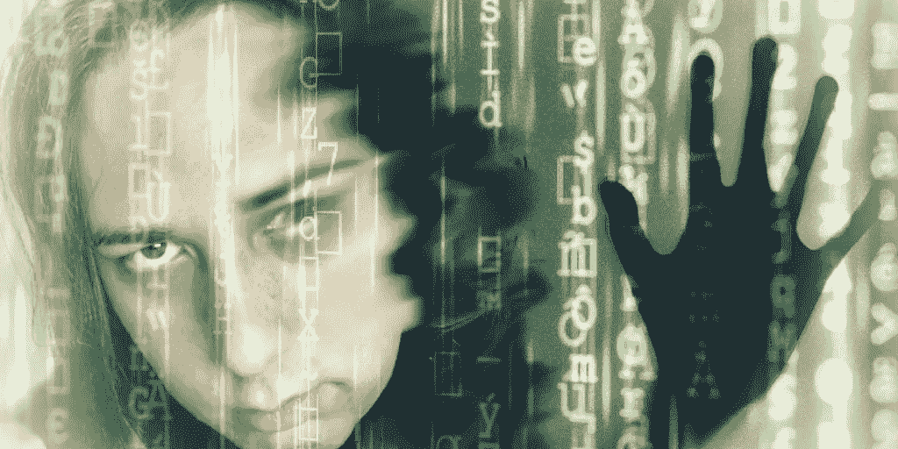

# 我，我自己，还有艾

> 原文：<https://medium.com/geekculture/memyselfandai-293ccb1ee2ce?source=collection_archive---------17----------------------->

Do we live in a simulation, or am I the simulation?

很难知道这个世界有多少是真实的。我属于自闭症谱系，在我发现自闭症是什么之前，我的整个生活感觉像是过度刺激、无法解释但显然看不见的冲动和严重照本宣科的互动的脱节集合。只有经过多年的研究和与其他自闭症患者的交谈，我才意识到自闭症可能是那些感觉的原因——但即使是现在，仍有几次我觉得没有什么是真实的。人工智能最近也在我的脑海中，因为我们正在迅速接近一个时代，人工智能将接管社会中的许多工作——包括我作为演员的工作。虽然有些人可能会认为这很棒，因为他们无论如何都不想做这些工作，但这让我感到害怕，因为如果机器人做什么都比人类好，那么人类的意义何在？总的来说，我不知道什么是真实的了。

我对人工智能的兴趣让我想知道人工智能或机器是否可能比人类更聪明。意识的本质是什么？我不断观察其他人的行为，收集自然和人类互动中明显的变量和常数的数据。每天，我越来越相信所有的现实都是模拟的。

“高功能自闭症”(更准确地说:不明显的自闭症)有时被视为智力的标志，因为自闭症患者通常比其他人更容易看到模式。对于计算机来说，识别复杂模式是它们最擅长的。

我已经在这个星球上生活了近三十年，但只是在最近几年，我才真正开始理解自闭症与我如何与世界互动的关系。有趣的是，我已经开始揭开这个令人难以置信的时代的面纱，在这个时代，自动化和人工智能真正开始大步前进。

我们都很熟悉关于“强迫机器人阅读一些东西，然后输出类似的材料”的迷因虽然这些通常很幽默，但也很容易误导人。想想这篇文章，你现在正在读的这篇文章，主要是由人工智能代笔的。

我实际上是在至少三个独立的人工智能程序的大力协助下创作这篇文章的:听写软件(Dragon)、高级语法分析器(Grammarly)和文案 [(Jarvis)](https://conversion.ai?fpr=persephone) 。这只是我有意识地意识到我在使用的那些。

自闭症在我的一生中都很难与其他人进行清晰的交流，现在它为人工智能的能力提供了一个独特的视角。人工智能有多种形式——具有类似人类外表和功能的机器人；通过计算机服务器远程运行的软件；像 Alexa 或 Siri 这样的智能设备在我们的日常生活中指导着我们，却从未被发现过…它每天都在我们周围！我对这些程序试验得越多，就越明显地发现我自己的大脑的功能与它们有多么相似。

从 90 年代我还是个孩子的时候，就有人告诉我，我在电脑方面很有天赋。我的父母、老师、同学以及网上的陌生人都向我寻求帮助来解决他们的电脑问题。我没有接受过使用电脑或与电脑互动的正规教育，但这对我来说感觉很自然。以至于我质疑了很久，如果我，我自己，可能是一个不可思议的拥有有机成分的高级机器人。

我和电脑相处的这么好是因为我是电脑吗？我的大脑和一个模拟人类行为，同时实时适应连续、不相关的感官输入/刺激的人工智能程序有什么区别？

虽然我并不总是能理解字面上的代码，但我经常能凭直觉解决复杂的技术问题…只是当其他人看着我的时候不行。当另一个人靠得太近时(无论是物理观察还是远程观察)，我会僵住。我说不清楚。我看起来像个白痴。周围的人对我的能力失去信心。然而，与此同时，我从未见过一个人能清楚地说出他们自己的大脑是如何工作的。

我只知道我按下一些键，输入命令，点击东西，突然问题就解决了。除了其他人似乎没有能力做这件事之外，我不会去想它。

我怎么能确定我不仅仅是一个有自我意识(或者令人难以置信的令人信服)的计算机程序，就像《黑客帝国》中的先知一样？我不能。但这并不重要，因为我的自闭症意味着计算机是我唯一知道如何成为的东西。

也许自闭症让我比普通人更能感知和欣赏科技。也许是我大脑中化学物质的不平衡使我无法像其他人一样思考，或者也许是人类进化的下一个阶段——心智能力的增强。也许 AI 代表了我们未来的自己？如果看似“技术上的量子飞跃”实际上只是进化，我不会感到惊讶。

这篇文章还没有结论，但是其中提出的一些问题可能会在读者中引发有趣的讨论。

你怎么想呢?

你相信人类会创造出比我们更好的人工智能吗？到底是谁决定了智能的定义和含义——人类还是机器？自闭症和自闭症谱系障碍只是以另一种形式增强了认知能力，在神经类型学看来像是精神疾病吗？