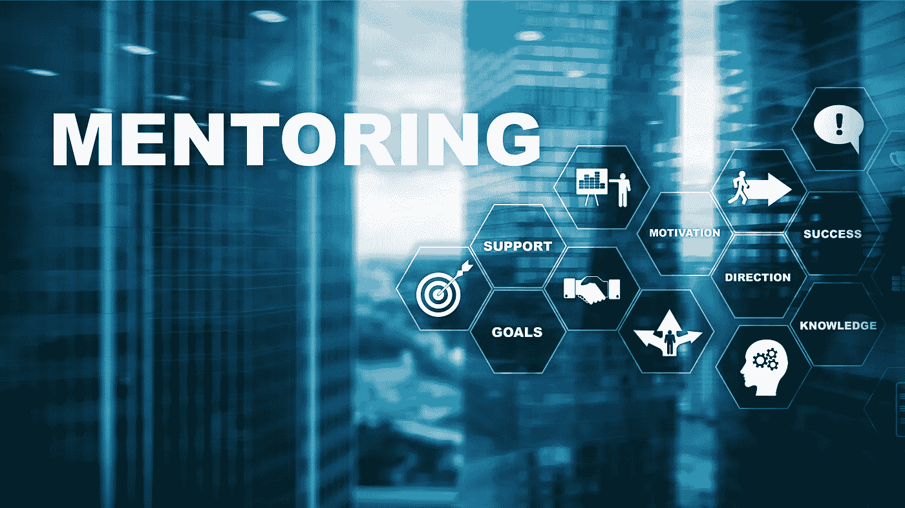
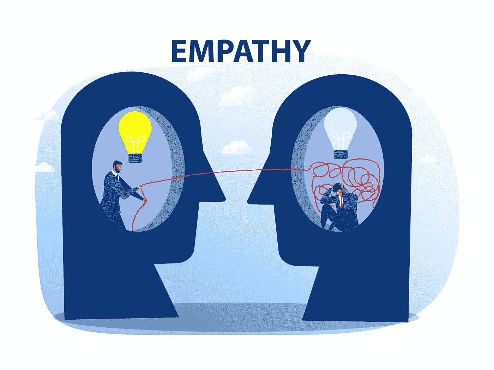

# 导师培养 101:导师和学员指南

> 原文：<https://medium.com/geekculture/mentorship-cultivation-101-a-guide-for-both-mentors-and-mentees-9b9103384bc8?source=collection_archive---------14----------------------->

数据科学是一个多方向发展的领域。我们很容易对我们可以学习的材料的密度感到不知所措。即使你正在攻读该领域的学位，技能的实现也不一定包括在内，因为它主要是教授的技术。有一个可以指导你完成这个过程的导师是一笔巨大的财富，甚至可以影响你的长期职业发展。任何人都可以成为导师，即使你没有多年的经验。做一名导师就是与那些乐于学习解决问题的新观点的人分享你的经验。在接受方面，学员必须愿意接受新观点，而不一定要马上接受。在学习的过程中，双方都有责任，这也是本文要讨论的内容。更具体地说，我们将着眼于使导师和学员在工作中表现出色的一些特征。绝不是说，这是一个每个人都应该成功的技能的广泛列表，而是理解两组之间最佳动态的第一步。

在本文的第一部分，我们将看看一个伟大的导师应该展示的几个特征，以支持良好的教学实践。或者，我们也可以将学员视为一个利益群体来解决类似的问题。

# **对于导师**

成为优秀导师的目标是在学员成为数据科学家的过程中激励、教导和指导他们。此外，它还为学员提供工具，使他们能够达到一定的自信水平，成为独立思考者。

以下是我作为数据科学导师两年多来收集的一些见解。

## 同理心是真正的设身处地为他人着想

如果你想做好工作，你必须对你的学员表现出同理心。你必须能够设身处地为他们着想。有趣的是，说起来容易做起来难。感同身受还意味着要认识到学员当前的知识状态。后一点经常被遗忘，甚至经常被忽视。这就是为什么在试图向某人强行灌输新信息之前，问问题是很重要的。例如，你可能需要向一个刚开始编程的业务分析师和一个计算机科学的研究生解释 Python 库的概念。另一方面，你可能想花更多的时间向后一个人解释选择一个机器学习指标的理由，而业务分析师可能已经明白这里的利害关系。

表现出同理心也可以转化为人们可以用来描述问题的例子类型。直觉水平可以与学员对材料的舒适程度联系起来。我确实相信，当受到挑战时，我们会学到更多，但如果跨越太大，我们会感到气馁。

## 对群体和其他人的同理心

当你开始指导一个新的团队时，你可以放心地假设每个人都是从零开始学习。因此，作为一名导师，你应该开始讨论基础知识，并在你和你的团队一起成长的过程中以此为基础。随着你与你的学员一起进步，你将开始讨论更微妙的概念，你将看到他们开始整理东西时眼睛发亮。问题变得越来越具有挑战性和错综复杂。然后，一个新学员可能会过来问你:“我想学习数据科学；什么是数据科学？”。对于一个导师来说，快速适应不同的观众可能是相当具有挑战性的。如果你已经详细记录了你之前所做的一切，你可能会倾向于让新学员参考你之前记录的研讨会。这对你来说很方便，但对学员来说不方便。如果我们认为指导是一个涉及两方的过程，那么指导要么对双方都有效，要么对双方都无效。一个伟大的导师会先为别人着想。一个伟大的导师会愿意给予他人。目标是影响尽可能多的人，让他们将来能做大事。

## 从教科书到现场:如何将工业专业知识融入您的解决方案

当学员熟悉不同的工具时，他们可能会试图找到一个数据集并开始分析。第一，祝贺倡议；这正是他们需要做的！假设你有一个关于顾客是否会购买你的产品的数据集。你可以创建一个模型来预测这种行为。但是，您可能会怀疑准确性是否是正确的衡量标准。精度呢？回忆？当你做一个 Kaggle 比赛，优化目标通常是与问题一起定义的。但是现实生活中呢？

在现实生活中，这是所有关于你将做什么后，你的模型，将证明你将选择哪个指标。例如，如果目标是确定你的下一个营销活动应该以哪些客户为目标，那么一个合适的方法可能是根据客户获得产品的可能性对他们进行排名。然后，您可以提取接近决策边界(或更低)的客户，并只将这些客户作为目标。最终，您希望将您想要转换的客户作为目标，而不是无论如何都要转换的客户。最后，您可以提供一个解决方案，对您的客户进行分类，提取概率，并生成一个您的营销活动的目标客户列表。那是现实生活中值得解决的问题。在这个练习之后，推荐一个特定的度量标准会更容易。

## 对自己的知识保持谦逊

数据科学是一个非常大的领域，每个公司都将解决其市场中的典型问题。一家自动驾驶汽车公司可能会专注于为计算机视觉实施卷积神经网络，而一家营销机构将有兴趣寻找利用行为数据为营销活动创建客户细分的方法。作为一名导师，你必须承认，你不可能对所有事情都有答案。你应该接受这个事实，因为在这里你会发现成为一名数据科学家最重要的技能之一:寻找答案的策略。在这里，我谨慎地选择了“寻找答案”的表述，而不是“寻找答案”。你可能会面临没有答案的情况。然而，你仍然需要一个策略来做适当的研究。作为一名数据科学家，大部分时间你的任务是为你的公司从未解决过的问题创造新颖的解决方案。有一种方法来调查潜在的路径是必不可少的。这正是导师传授这种技能的方式:当你对一个问题没有答案时，你需要指导你的学员，告诉他们如果你在寻找信息，你会如何找到它。你需要具体而系统地调查和总结所有潜在的途径。

# **针对学员**

现在，我们来谈谈学员。学员在学习中也有共同的责任。最后，你在和一位在你身上投入时间的导师交谈。为了让这种体验对双方来说都尽可能有益，我推荐以下几条建议。

## 明确你想学什么

在过去的两年里，我收到了一些向我寻求帮助的电子邮件。我总是热衷于帮忙，但有时任务可能太艰巨了。过去，我曾多次收到这条信息的变体:

*“嗨 X，*

*我想成为一名数据科学家，但我没有这方面的知识。我想成为你的学生，我会学习你告诉我的一切，我会是一个忠诚的学生。我现在就可以开始，你可以教我一切。你可以教我如何编码、统计、机器学习、深度学习、数据可视化等等……”*

尽管人们可以欣赏这个充满激情的人的奉献精神，但让任何人承担这样的任务都是不现实的，通常会导致被导师所替代。作为学员，你有责任更多地了解该领域，并找出你知识不足的领域。你可能不知道你需要学习一个主题到什么程度，但至少你可以和导师交谈来确定学习计划。让我们以统计学为例。说到数据科学，统计学可能是最容易被误解的领域之一。在寻求帮助之前，做一些研究以突出与数据科学相关的统计主题。这可能是概率论，中心极限定理，假设检验，或不同类型的分布，等等。然后，考虑您在做数据科学项目时会如何遇到这些主题。最后，与导师讨论你认为对你更有问题的话题。

这种方法将帮助你专注于对你真正重要的主题。换句话说，你会把时间花在不太理解的话题上，而放弃那些你已经感觉很舒服的话题。

## 思考应用

当你学到新东西时，想想你将如何在现实生活中使用这些新信息。然后，应用！我再强调这一点也不为过:找一个能让你运用知识的小问题。如果你不确定在什么情况下可以应用它，就去找一个导师。确保你留下了痕迹，这样你就可以稍后回来，以防你忘记了它的目的。数据科学非常多样化，有可能一年后你还会使用同样的技术。如果你没有一个例子可以参照，很有可能你将不得不重新学习，而不是依靠你过去的记忆。此外，它将加强你的理解和记忆。因此，你减少了再次向导师寻求帮助的机会。最后，它将增加不同概念之间建立联系的机会。

## 努力工作，快速提问

作为一名未来的数据科学家，你可能不得不花一些时间来想办法解决问题。你可能已经在编码问题上花费了数小时。学会顽强是一个数据科学家的大本事，生活中也是。坚持不懈肯定是令人钦佩的，但要确保你对此是明智的。在一个阻碍你学习的问题上坚持几天是没有意义的。我建议你有一个处理问题的系统，你可以通过一个系统的协议来确定解决方案。然而，如果你无法达成解决方案，寻求帮助，这样有人可以给你一个体面的方法来克服这个障碍。例如，当我为一个个人项目进行探索性数据分析时，我想创建一个完美的可视化，其中包括一些常见的定制。我知道这是可行的，并且花了将近两天的时间终于弄明白了。几天后，我和同事一起吃午饭，我提到了这个挑战，我带着一点自豪克服了这个挑战。我的经理微笑着表示同意，但接着说:

当你在一个项目中挣扎的时候，问问自己这是一个技术问题还是你正在研究的解决问题的技巧。如果是后者，请随意向他人暴露你的问题，以获得潜在解决问题的新想法。然而，如果是前者，你可能会因为在错误的问题上耗费精力而阻碍自己的进步。”

底线是避免在一个很容易解决的技术问题上花费太多时间。这并不意味着你不应该试图解决这些问题，而是要有效率。学习理论表明，如果你与某事进行过斗争，你将有更大的机会记住它；然而，斗争的*量*无关紧要。你要确保记住新的信息，而做到这一点的方法就是与它斗争。同时，解决问题永远应该是最终目标:努力，问得快。

## 通过最大化清晰度来最小化挫败感的艺术

好消息，你将在后天参加一家大型科技公司的面试。你非常兴奋，但你也感到有点焦虑，因为这是你梦想中的公司。你想确保你已经准备好让他们大吃一惊，所以你打电话给你的导师，他在整个面试过程中有很多帮助别人的经验。你的导师会很快为你提供成功所需的洞察力。你给她发了以下信息:

*“你能和我分享一些大公司的指标吗？我有一个关于指标和 SQL 的面试。”*

你的导师回答道:

*“你在说什么？”*

然后你对自己说，你的导师可能没有你想象的那么好，因为她工作的公司没有你将要面试的公司那么大。也许她没有你想的那么好。也许这就是你还没有进入大公司的原因:她给你建议，所以你会留在较低的级别。毕竟，如果她不明白你在说什么，她可能不像她让你相信的那样足智多谋。

或者问题是你的问题怎么办。你说的是一家大型零售公司吗？科技公司？咨询公司？公司类型如何影响这些指标？SQL 与指标定义有什么关系？有多种因素会影响这个问题的答案。强迫你的导师问你一个澄清性的问题会产生两件事。第一，会耽误你得到答案。其次，花更多时间问另一个问题可能会激怒你的导师。每当你发现自己处于这种情况下，问问自己是否提供了足够的信息，这样你的读者就会知道问题的目的和背景。如果你不确定，你也可以问问自己，如果没有这个领域的知识的人能够找到你的问题的最初表述的答案。夸大一个显而易见的事实比推断你的听众会根据你目前的知识状态给你提供一个答案要好。保持清晰以避免不必要的来回:最大化清晰以最小化挫败感。

# **结论**

对于导师和学员来说，保持成长心态非常重要。耐心是双方保持可持续关系的关键。如果一个导师不尝试其他的教学策略来帮助一个努力学习的学生，那么移情就不会真正得到满足。另一方面，如果学员因缺乏理解而变得过于急躁，那么清楚地强调他/她的问题可能不会很好地暴露出来。不幸的是，重要的是要认识到不是所有的关系都会成功，这也是应该承认的事实。以下是双方都应该鼓励自己的行为列表:

*   协作
*   积极
*   感同身受
*   友好地微笑
*   专业点
*   满怀希望
*   有建设性
*   随机应变
*   有弹性

作为一名导师，我对自己了解了很多，希望我能日复一日地成为一名更好的导师。我犯了很多错误，而且还在继续犯错。然而，对于什么是真正的错误，我的看法已经发生了很大的变化。除非你通过投射自私的考虑并最终提供糟糕的建议来阻止某人追求成为数据科学家的梦想，否则我所犯的所有错误都被视为我的学习技巧。

成为一名数据科学家不是一个目的地，而是一段旅程。不要关注结果，享受过程。正是这一旅程让它如此令人振奋:你会惊讶于你昨天在哪里，你现在在哪里，以及为明天的到来而奋斗是多么令人兴奋。记得你昨天在哪里，向某人伸出援助之手，帮助他们成长。

继续前进！

本文由博士让·塞巴斯蒂安·教务长供稿。*本文原载于*[*@ DataCanOrg*](/@DataCanOrg)*。*

*与* [*数据保持联系*](https://datacan.network/)*&*[*数据科学中的女人*](https://www.linkedin.com/company/wids-vancouver/) ！

简历审核服务，请查看:[https://data can . network/resources/](https://datacan.network/resources/)