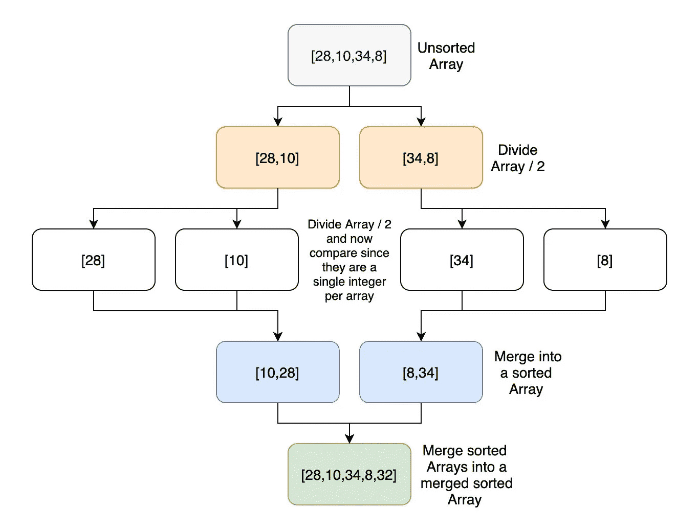
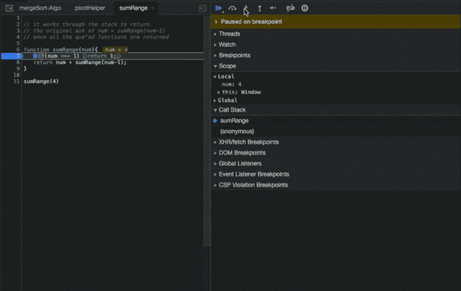
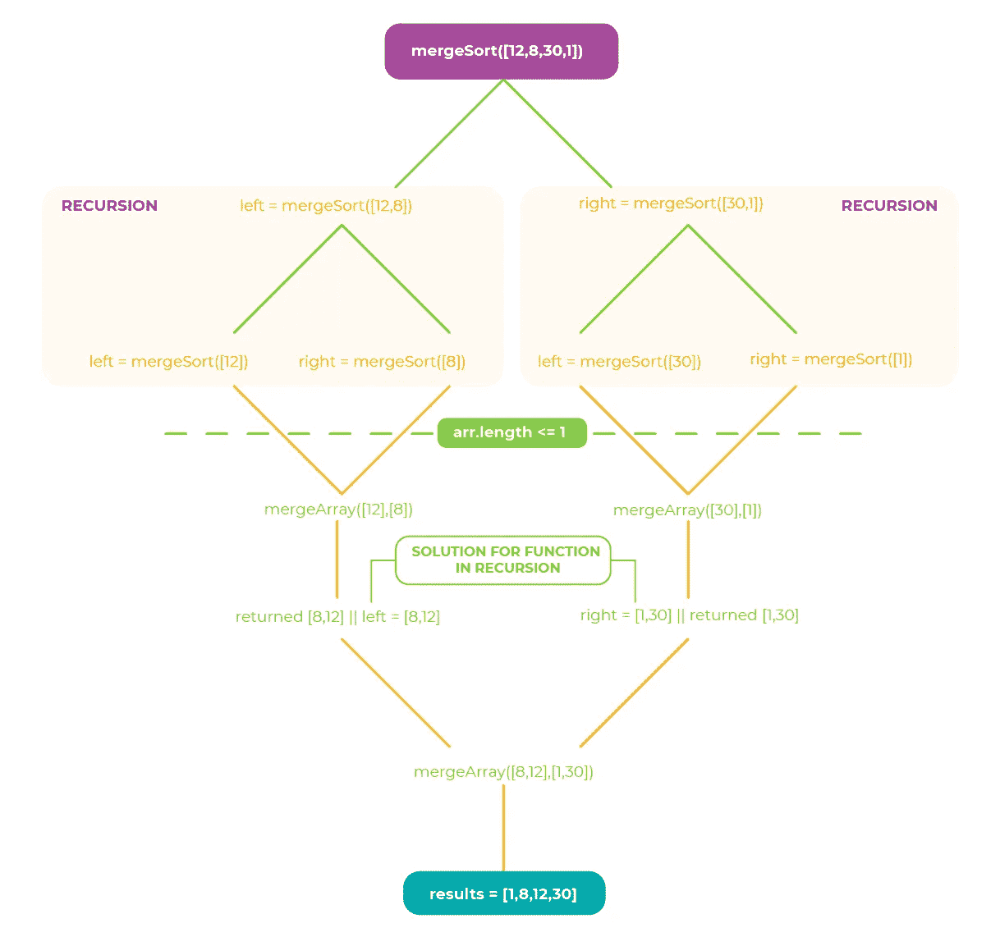

# 归并排序，对它的一个解释

> 原文：<https://medium.com/geekculture/merge-sort-an-explanation-of-it-b7c76108fc9b?source=collection_archive---------3----------------------->

什么是合并排序？它是如何工作的？实际的递归和我认为的递归。合并排序的一个例子。有什么优缺点？


Photo by [Yash Jain](https://unsplash.com/@_yashrjain?utm_source=medium&utm_medium=referral) on [Unsplash](https://unsplash.com?utm_source=medium&utm_medium=referral)

我目前正在上柯尔特·斯蒂尔的 Udemy class JavaScript 算法和数据结构大师课。[https://www . udemy . com/course/js-algorithms-and-data-structures-master class/](https://www.udemy.com/course/js-algorithms-and-data-structures-masterclass/)，我会推荐给任何想学习更多关于 Javascript 中算法的人。其中一个主题是排序算法。特别是，我今天要讨论的是归并排序。

# 什么是合并排序？

合并排序是一种排序算法。根据[维基百科](https://en.wikipedia.org/wiki/Merge_sort)，它是约翰·冯·诺依曼早在 1945 年发明的。这是一个分治算法。[分而治之](https://en.wikipedia.org/wiki/Divide-and-conquer_algorithm)是一种算法设计模式，在这种模式下，你接受输入，并将其递归地分成子问题，直到它简单到足以解决。通过利用这种设计模式，与其他排序算法(如冒泡排序)相比，时间复杂度大大降低到 O(n log n)。换句话说，对于大型数据集，它比简单的排序算法要快得多。



Visual reference of the Merge Sort Algorithm

# 它是如何工作的？

在上图中，您可以看到算法如何工作的可视化表示。该算法接受一个输入，它可以是各种数据类型，但我们现在使用数组。然后，输入被递归分割，直到得到一组每个只包含 1 个元素的数组。一旦你到了这个阶段，你就可以应用你的排序逻辑了。在上面的例子中，由于我们处理的是整数，所以只是对 array1 和 array 2 的简单比较。然后，将排序后的数字合并到两个数字的合并数组中。接下来，继续递归排序和合并数组，直到只剩下一个排序后的数组。

# 关于递归的一个旁注

所以在开始 Javascript 算法和数据结构大师课之前。我以为我知道什么是递归。在某种程度上，我的看法是正确的。它是一个在函数内部调用自身的函数。我的典型递归函数是这样的:

事实证明，真正的递归确实需要更少的代码行，但是从概念上来说更难理解。我在这里提到它的唯一原因是递归是合并排序的关键部分。

我不想在这里纠缠于细节，但是我想让你注意真正的递归是如何工作的。真正的循环利用调用堆栈并将返回值保存在内存中，直到满足返回条件，然后处理并返回值堆栈。请注意，在下面的 gif 中，调用堆栈先增长，然后收缩。



# 合并排序的示例和说明

好，现在来看一个实际的例子，并解释一下发生了什么。通常，当您使用合并排序时，会有一个巨大的数据集，但是我们将使用一个由四个随机整数组成的数组。

## 首先，我们需要一个助手函数。

正如我前面提到的，合并排序的基础是先划分然后合并排序后的数组。所以我们需要一个辅助函数来合并所有这些数组。它不知道数组的长度。它只关心我们输入两个数组。

所以在上面的辅助函数中，代码接受两个任意长度的数组，然后依次比较数组-1 和数组-2 的值。需要注意的一点是，为了让这个函数工作，我们的数组需要排序。这已经完成了，因为，如前所述，在执行该函数之前，我们已经将未排序的数组分解为每个数组中的单个元素。

## 现在是秘制酱料。

如上所述，如果你对真正的递归不了解/不习惯，这个函数可能有点让人摸不着头脑。我会试着向你介绍正在发生的事情，希望对你来说更有意义。

好的，虽然只有 6 行代码，但是这里发生了很多事情。因此，希望下面的图表可以帮助解释正在发生的事情。



Diagram of Merge Sort Algorithm

```
if (arr.length <= 1) return arr;
```

我们通过调用`mergeSort([12,8,30,1])`来启动这个函数。第一行检查数组的长度。如果它小于或等于 1，则返回 arr。这是针对边缘情况和递归函数的返回条件。

```
let mid = Math.floor(arr.length/2);
```

接下来，我们找到数组的中点。

```
let left = mergeSort(arr.slice(0,mid));
```

这是我们第一次递归调用。它递归调用数组左侧的函数。由于它是递归的，所以它将被添加到调用堆栈中，并等待解决方案。

现在用两个左边的值调用`mergeSort([12,8])`。条件不满足，所以它将`[12]`设置为左值。再次调用函数，但是这次满足条件。所以返回的值是`[12]`。现在函数可以继续运行了，因为已经为`left`返回了一个值。所以下一个是对的，也就是`8`。它递归调用`mergeSort([8])`。并且满足条件，所以返回值 8。然后因为有一个值为`right mergeArrays([12],[8])`被调用，它返回`[8,12]`。所以我们的调用栈可以被执行，因为现在我们有了所有递归调用的返回值。

```
our initial mergeSort([12,8,30,1]) now has a value for left = [8,12]
```

因此，与递归过程一样，最初的 mergeSort()调用可以移到右边的值上。`right = mergeSort([30,1])]`哪个递归调用 mergeSort 的条件不满足，所以左现在是`left = mergeSort([30])`。与前一次执行时不同，这一次满足条件，返回 30。操作顺序中的下一步是`right = mergeSort([1])`再次调用 mergeSort，但是条件立即被满足，所以`[1]`它被返回。现在我们已经为`left`和`right`取了一个值，并调用了`mergeArrays([30],[1])`。

```
mergeArrays([30],[1]) returns [1,30] which is a value for right of the original call of mergeSort
```

希望到现在为止，你还没有完全糊涂。概括地说，我们用`mergeSort([12,8,30,1])`初始化函数，左半部分定义在一个递归函数中，它执行自己的任务，直到返回值。现在已经为`left`返回了一个值，我们可以再次转移到`right`上，调用一个递归函数，直到返回一个值。有了`left`和`right`的值，我们就可以移动到原始`mergeSort()`的`return mergeArrays(left, right)`

```
return mergeArrays([8,12]),[1,30])
```

因为所有高阶函数都已返回，所以我们返回

```
results = [1,8,12,30]
```

这就是归并排序的工作原理。我强烈建议将该算法插入一个设置断点的 Chrome 代码片段中，并探索在引擎盖下发生了什么。我甚至花了一些时间来理解实际的递归函数。

# 合并排序的优点和缺点

归并排序的优势？对于大型数据集，它比简单的排序算法(如冒泡排序)要快得多。不像某些算法的时间复杂度最好、一般、最差都是 O(n log n)。这又一次不同于冒泡排序，它相当一致。

归并排序的弊端？它不像不太复杂的排序算法那样简单。假设您正在处理一个包含 20 个条目的数组。时间复杂度之间的差异将非常小。此外，不同于简单排序算法的空间复杂度是 O(n)，其中冒泡排序的空间复杂度将是 O(1)。

说到这里，我对归并排序的解释就结束了。我们讨论了什么是合并排序，合并排序是如何工作的。实际的递归和我最初对递归的理解。合并排序的一个例子。最后，合并排序的优点和缺点。编码快乐！