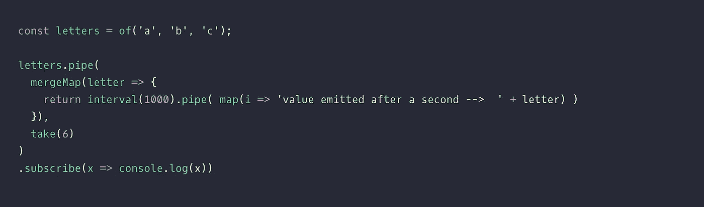
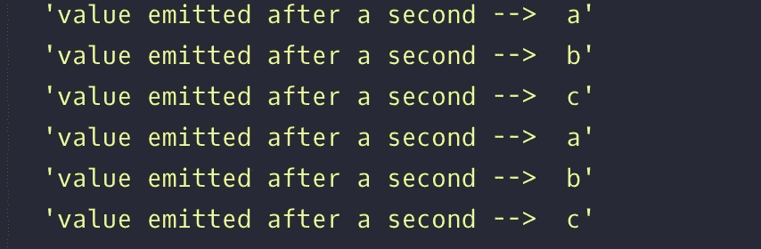
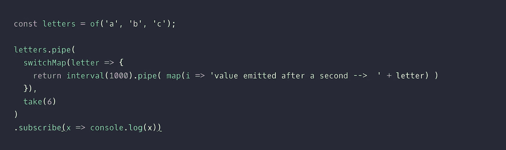
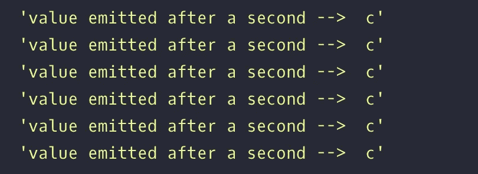

# mergeMap 与 switchMap —最简单的区别

> 原文：<https://medium.com/geekculture/mergemap-vs-switchmap-the-simplest-difference-63e970171353?source=collection_archive---------2----------------------->

RxJS 是一个非常棒的反应式编程库。但是，该库提供的操作符有时可能会令人困惑。我是这个图书馆的新成员，我们在一个 angular 项目中使用了它。在那里，我碰到了这两个运算符: **mergeMap 和 switchMap。**

在使用这些操作符时，我不确定这两者之间的区别，因为它们似乎以相似的方式工作。于是我开始通过看各种博客来寻找两者的区别。但由于我是 RxJS 新手，所以我无法理解其中的大部分内容。我并不完全理解其中的区别，但对此有所了解。所以我开始自己做实验来消除我的疑虑，以下是我的理解。

我想通过一个例子来说明两者的区别。

## **合并地图**

在本例中，我们在可观察到的'**字母**上使用管道运算符，该运算符连续发出 3 个值，即' a '，' b '，' c' **，没有任何延迟**。

这个例子的类比可以这样想:

流程是这样的→

对于这种情况，假设 xMap 为“mergeMap”。

1.“letters”首先发出值“a ”, merge map**知道它必须在每秒后打孔值“a”**。

2.然后“letters”发出值“b ”, merge map**知道它必须在每一秒后打孔值“b”*****以及*** 。

3.最后，它发出值“c ”,并且 mergeMap **知道它必须在每秒后打孔值“c”*以及*** 。

因此，在每一秒钟之后，mergeMap 对所有的值‘a’、‘b’、‘c’进行打孔，导致所有这些值的发射。

因此，在我们的例子中，我们得到的前六个值是‘a，b，c，a，b，c’。

> **这意味着即使我们用最新数据重新订阅相同的可观测值，mergeMap 也会记住以前的订阅。**

**开关图-**

这个例子的类比与前面的例子相同。同样可以参考上图。

流程是这样的→

现在，让 xMap 成为“switchMap”。

1.“letters”首先发出值“a ”, switch map**知道它必须在每秒后打孔值“a”**。

2.“letters”然后发出值“b”，switchMap **知道它必须在每秒 ***后打孔值“b”***，但忘记它也必须打孔“a”**。

3.最后，它发出值‘c’，开关映射**知道它必须在每秒 ***后打孔值‘c’***，但忘记它也必须打孔‘b’**。

因此，每秒钟后，开关映射仅打孔值“c ”,导致仅发射值“c”。

因此，在我们的例子中，我们得到的前六个值是‘c，c，c，c，c，c’。

> **这意味着 switchMap 取消所有先前的订阅，只记住当前的最新数据。**