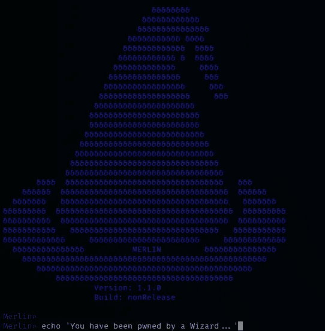

# 梅林·C2:基础

> 原文：<https://medium.com/geekculture/merlin-c2-the-basics-d733487786ed?source=collection_archive---------1----------------------->

## 将代理部署到受损主机

你好，世界！有许多精彩的 C2 框架，但我最喜欢的肯定是 **Ne0nd0g** 的*梅林*。它是用我最喜欢的编程语言 Golang 编写的。因为 Merlin 是用 Go 编写的，所以代理可以部署在几乎任何操作系统/架构组合上。在这篇博客中，我将演示一些非常基础的设置…