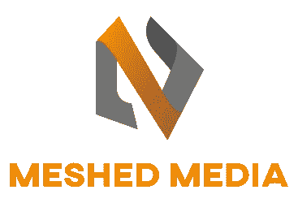

# 网状媒体

> 原文：<https://medium.com/geekculture/meshedmedia-985f41ed5360?source=collection_archive---------16----------------------->

Logo for MeshedMedia website

嘿，伙计们，我写这个故事是因为我发现了 YouTube 的另一个替代品，人们可以用它来代替谷歌的平台。它基本上是一家新的创业公司，拥有一个新的视频流媒体网站，名为 Meshed Media。这项服务的网站是[http://mesed . ca .](http://meshed.ca.)再一次，这是一个非常新的 YouTube 替代方案，比我之前提到的区块链替代方案和我在之前的故事中提到的替代方案 AtoPlay 要新得多。在…