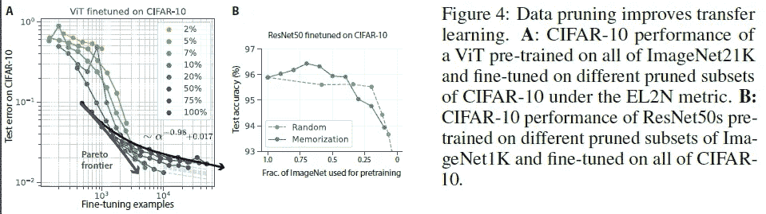
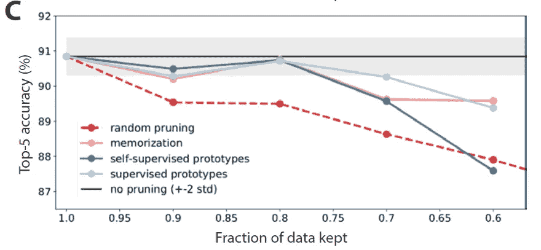
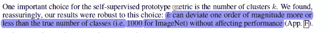
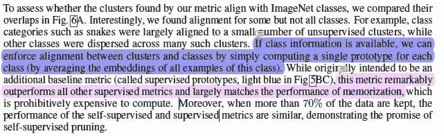

# Meta 是关于大数据和深度学习的惊人见解

> 原文：<https://medium.com/geekculture/meta-ais-shocking-insight-about-big-data-and-deep-learning-857f9f2b9ac5?source=collection_archive---------0----------------------->

## 没有人，绝对没有活着的人能预测到这一点

为了帮助我了解您[请填写此调查(匿名)](https://forms.gle/7MfQmKhEhyBTMDUD7)

由于人工智能的惊人成功，我们已经看到越来越多的组织在他们的管道中实现机器学习。随着数据访问和收集的增加，我们已经看到大规模数据集被用来训练达到超人性能的巨大深度学习模型。这导致了对数据科学和大数据等领域的大肆宣传，最近大型语言模型的繁荣更是火上浇油。

大型科技公司(以及 Twitter/YouTube 上的深度学习专家)真的爱上了“添加更多数据，增加模型大小，训练几个月”的方法，这已经成为这些天机器学习的现状。然而，来自 Meta AI 的异教徒发表了由撒旦- **和 it** **资助的研究，结果证明这种做事方式效率极低。**而且完全没有必要。在这篇文章中，我将回顾他们的论文- [**超越神经标度定律:通过数据修剪实现幂律标度**](https://arxiv.org/abs/2206.14486v1) ，其中他们分享了关于如何智能地选择样本可以提高模型性能，而不会使成本失控的“证据”。虽然这篇论文的重点是计算机视觉，但不管你的专业是什么，他们的研究原理都会让你感兴趣。

> 如此卓越的伸缩性意味着我们可以通过添加一些精心选择的训练样本，而不是收集 10 倍以上的随机样本，将误差从 3%降低到 2%
> 
> -报纸上的。

我们将介绍添加更多随机样本效率低下的原因，以及 Meta AI 研究人员提出的允许您挑选最有用的数据样本添加到管道中的协议。听起来像异教巫术？请继续阅读并找出答案。

> 在这里，我们重点关注误差随数据集大小的缩放，并展示如何在理论和实践中突破幂律缩放，将其缩减为指数缩放

Dropping significant amounts of data from the benchmarks had no impact on the overall performance. Yes, Deep Learning has been extremely wasteful.

# 为什么添加更多数据会变得低效

当涉及到小数据集时，“添加更多数据”是你会遇到的最常用的想法之一。这很有效。不幸的是，人们将此应用于更大的数据集/项目，而没有考虑周全。不幸的是，随着您继续向训练数据中添加每个新样本，添加该样本的预期收益将会下降。非常快。尤其是当你的训练数据量达到数百万时(大型研究项目使用数 Pb 的数据来获得 1-2%的性能)。

为什么会这样？想想梯度下降是如何工作的。您的模型参数会根据计算的误差进行更新。如果您的误差不是很高，您将不会看到模型权重的巨大变化。这是有道理的。如果你几乎是对的，你不希望你的模型改变太多。

> 传统的随机选择数据产生缓慢的幂律误差缩放，因为每个额外的训练示例提供的关于正确决策边界的新信息比前一个示例少。

在这种情况下，向您的训练中添加更多的标准样本不会有太大作用。您的模型将预测与您的原始模型非常接近的东西，因此对您的参数的更改是疏忽的。你实际上只是在浪费计算。如果你已经用数十亿个样本进行了训练(这些 99%准确率的项目很多都是这样)，那么任何给定的图像都不会给你的整体训练增加太多新的信息。这个逻辑也适用于像树这样的架构，它们不计算梯度，而是依赖于其他种类的误差。

相反，你可以节省大量的时间、电力和计算资源，只需选择那些能给你的整体训练增加一些信息的样本。如果您已经获得了大量数据，这将是实现混沌数据扩充/注入模型噪声以使您的系统更加健壮的好时机。我已经在我的内容中多次涉及这些，所以查看我的其他文章/视频以了解更多信息。

Well-constructed datasets can be a goldmine for all kinds of tasks.

现在，我们已经讨论了需要一个修剪/过滤协议来选择最佳样本，以便为预测添加更多信息，让我们来看看如何挑选最佳样本。Meta 研究人员提出的方法不同于我建立并广泛使用的一个系统，但不管怎样，它有一些很好的结果。我很快会将它与我所做的进行比较。现在，让我们检查一下他们的系统。

# 如何为机器学习挑选最佳数据样本

那么 Meta AI 想出了什么样的程序来挑选最好的样本呢？一些尖端的非常奇特的深度学习计算。不。事实证明这个研究团队很叛逆。他们的解决方案简单、经济高效，适用于多种规模和功能的项目。

他们的想法相对简单。对样本进行聚类。对于任何给定的样本，这取决于它离最近的质心有多远。相当优雅。用他们的话说-

> 为了计算 ImageNet 的自监督修剪度量，我们在 ImageNet 预训练自监督模型(这里:SWaV [31])的嵌入空间中执行 k-means 聚类，并通过到其最近的聚类质心或原型的距离来定义每个数据点的难度。**因此简单(困难)的例子是最(最不)典型的**。

我真的很喜欢这个解决方案。它具有直观的意义，使用起来并不昂贵，**并且不需要明确地标记**(这是一个巨大的优势)。尽管如此，当与其他用于剔除无信息样本的昂贵方案相比时，它仍然保持得很好。这是令人兴奋的，肯定需要进一步的调查。将自我监督整合到数据质量检查中是我以前谈到过的事情，但这清楚地表明这种方法在未来有很大的潜力。

Image Caption- Comparing top-5 performance on ImageNet when pruning according to the best existing supervised metric (memorization) and our supervised and self-supervised prototype metrics. In all 3 cases, training on 80% of ImageNet matches training on 100%

然而，这并不是我最感兴趣的。说到集群，拥有适当数量的集群非常重要。然而，这种方法对于选择真正例外的东西是非常稳健的。

Keep in mind with decent EDA, you should have a rough idea of the number of clusters. Or use another clustering algo.

这使得研究人员不必花费大量资源来设置实验，我对此表示赞赏。太多的论文是不切实际的，因为有多少投入到获得完美的条件。这使得他们能够贯彻在论文中做出的承诺，并真正交付一个实用且创新的解决方案。

本文还有几个其他有趣的方面需要探索。例如，他们提到了针对小型和大型数据集的不同修剪策略(分别保留简单和困难样本)。他们对不同类别以及它们如何聚集的分析也非常有趣。另一个让我印象深刻的是他们在聚类(无监督的)和类(有监督的)之间强制对齐的方法。他们取了班上所有的样本，并平均出嵌入量。**这种方法胜过其他一切**，对潜在空间编码有一些有趣的影响，我将在另一个时间讨论。如果你对此感兴趣，请务必联系我，不要错过。我所有的相关链接都在本文末尾。

This reminds me of the argument for working with downscaled latent spaces since they preserve the most valuable information.

如果你想进入 ML，t [他的文章给了你一个逐步发展机器学习能力的计划](/geekculture/how-to-learn-machine-learning-in-2022-9ef2ea904986)。它使用免费资源。与其他训练营/课程不同，该计划将帮助你发展基本技能，并为你在该领域的长期成功做好准备。

对于机器学习来说，软件工程、数学和计算机科学的基础至关重要。它将帮助你概念化，建立和优化你的 ML。我的每日时事通讯，[Technology interests make simpled](https://codinginterviewsmadesimple.substack.com/)涵盖了算法设计、数学、最近的技术事件、软件工程等主题，让你成为更好的开发人员。 [**我目前正在进行全年八折优惠，所以一定要去看看。**](https://codinginterviewsmadesimple.substack.com/subscribe?coupon=1e0532f2)

我创造了[技术面试，通过指导多人进入顶级科技公司，利用发现的新技术使面试变得简单](https://codinginterviewsmadesimple.substack.com/p/faqs-and-about-this-newsletter?r=4tnbw&s=w&utm_campaign=post&utm_medium=web)。时事通讯旨在帮助你成功，避免你在 Leetcode 上浪费时间。我有一个 100%满意的政策，所以你可以尝试一下，没有任何风险。[您可以阅读常见问题解答，并在此了解更多信息](https://codinginterviewsmadesimple.substack.com/p/faqs-and-about-this-newsletter?r=4tnbw&s=w&utm_campaign=post&utm_medium=web)

如果你也有任何有趣的工作/项目/想法给我，请随时联系我。总是很乐意听你说完。

# 向我伸出手

使用下面的链接查看我的其他内容，了解更多关于辅导的信息，或者只是打个招呼。

机器学习重要更新的免费每周总结(赞助)-[https://lnkd.in/gCFTuivn](https://lnkd.in/gCFTuivn)

查看我在 Medium 上的其他文章。https://rb.gy/zn1aiu

我的 YouTube:[https://rb.gy/88iwdd](https://rb.gy/88iwdd)

在 LinkedIn 上联系我。我们来连线:[https://rb.gy/m5ok2y](https://rb.gy/f7ltuj)

我的 insta gram:[https://rb.gy/gmvuy9](https://rb.gy/gmvuy9)

我的推特:[https://twitter.com/Machine01776819](https://twitter.com/Machine01776819)

如果你正在准备编码/技术面试:[https://codinginterviewsmadesimple.substack.com/](https://codinginterviewsmadesimple.substack.com/)

获得罗宾汉的免费股票:[https://join.robinhood.com/fnud75](https://join.robinhood.com/fnud75/)