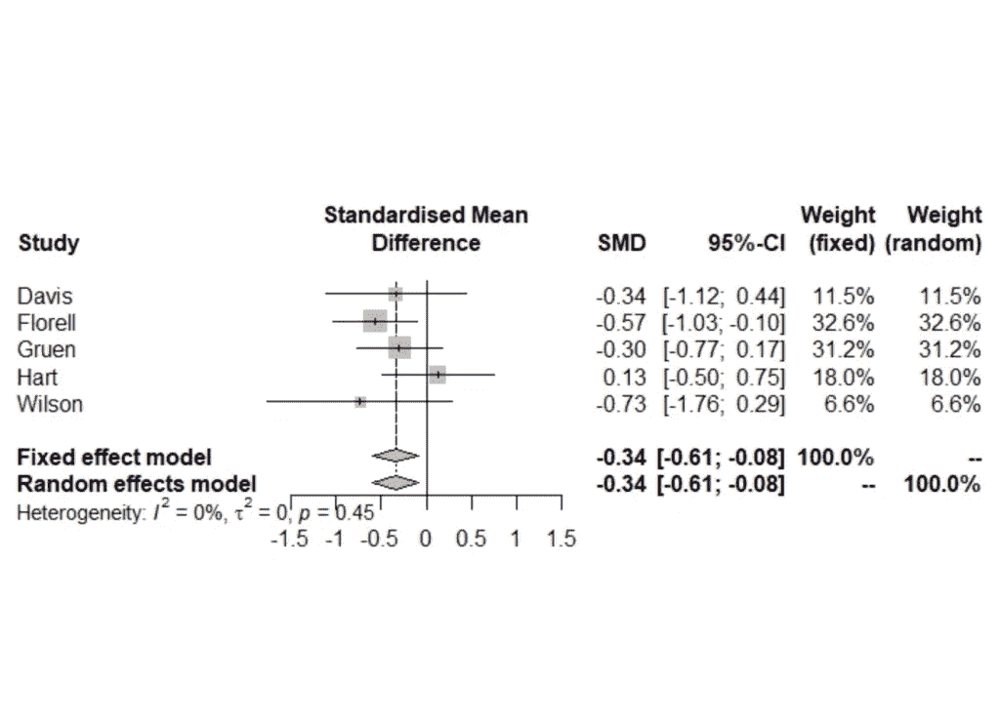

# R 中的 Meta 分析

> 原文：<https://medium.com/geekculture/meta-analysis-in-r-f75715f30162?source=collection_archive---------9----------------------->

## 使用 R 和元库的元分析示例

 [## 用我的推荐链接加入媒体-乔治皮皮斯

### 阅读乔治·皮皮斯(以及媒体上成千上万的其他作家)的每一个故事。您的会员费直接支持…

jorgepit-14189.medium.com](https://jorgepit-14189.medium.com/membership) 

# 介绍