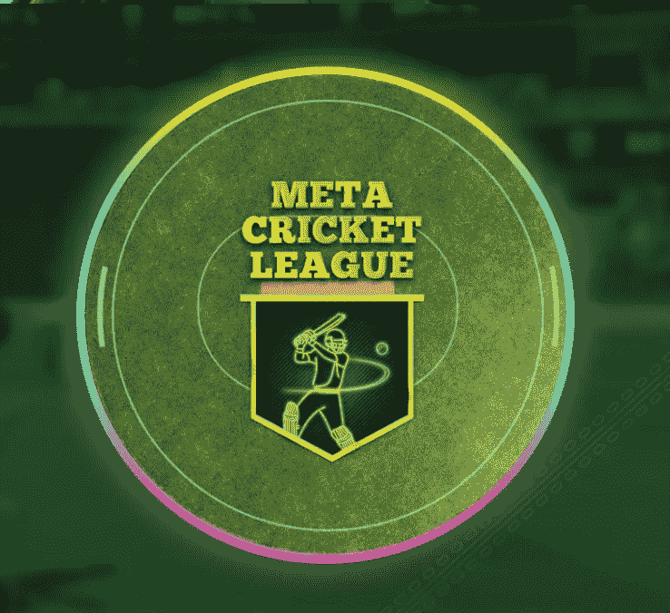
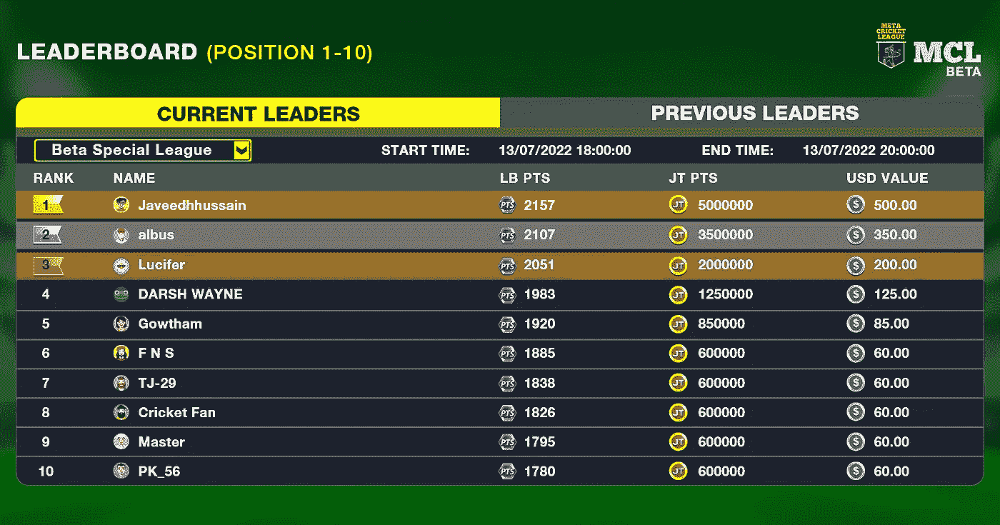

# 元板球联盟-体验板球在一个全新的境界

> 原文：<https://medium.com/geekculture/meta-cricket-league-995ca17f66af?source=collection_archive---------16----------------------->

自从 Crypto kitties 的出现，游戏玩家已经将他们的注意力从传统游戏转移到 NFT 游戏上。像 Axie Infinity 这样的 NFT 游戏为玩家在游戏中付出的时间和努力带来了财富。它甚至让玩家辞去日常工作来玩游戏。他们提供足够的食物来满足日常需求。尽管批评家将 NFTs 称为泡沫，但具有可用性的不可替代的代币正受到全世界人们的关注。不仅仅是游戏玩家，NFT 投资者也对这些 NFT 游戏感兴趣。[**Meta Cricket League**](https://www.jump.trade/mcl-game)是有史以来第一款赢得板球 NFT 游戏的游戏，受到了 NFT 投资者、游戏玩家和板球爱好者的共同关注。Jump.trade NFT 游戏市场为用户提供了一个平台，让他们获得真正的板球 NFTs，并在所有新的比赛中玩板球。

参加封闭社区测试赛的人在两个小时内就能赚到 500 美元。你能想象吗？这个元板球联盟有什么特别之处？你为什么要进入这个充满生机和活力的 NFT 奥运会新世界呢？在这里了解更多。

# **元板球联赛**

Meta Cricket League，缩写为 MCL，是世界上第一个赢得 NFT 板球比赛的比赛。作为第一个，它已经得到了国际板球运动员的支持，如 Harbhajan Singh，Chris Jordan，Mithali Raj 和其他人。

这款游戏在 NFT 发布会、市场发布会和预告片发布会上获得了巨大的反响。随后是两次对社区和拥有 NFTs 的人开放的测试运行。 [**正宗蟋蟀 NFTs**](https://www.jump.trade/) 自发布以来身价不断攀升。beta 测试的成功对此起到了推波助澜的作用，预计在游戏发布后，NFTs 的价格会进一步上涨。

要玩这个游戏，你应该拥有板球运动员 NFTs。必须有两个 NFT，一个击球手和一个投球手，才有资格进入游戏。

# **NFT 商贸城**

最初，NFT drop 是在 Jump.trade 网站上推出的。下降包括大约 55，000 个板球 NFT，包括击球手、投球手和球棒。他们作为超级掠夺者出售，1983 年元板球集合，2003 年元板球集合，2011 年元板球集合。虽然超级战利品的购买价格定为 25 美元，但世界杯收藏 NFT 以同样的底价拍卖。

所有的超级战利品 NFT 在发布后仅仅 9 分钟就被抢购一空，世界杯 NFT 收藏品也出现了竞价大战。

所有三个世界杯系列都包括不朽的蝙蝠 NFT，由当年的世界杯冠军签名。他们还包括一个有价值的蝙蝠侠和一个保龄球。

***1983、2003、2011 系列分别以 7000 美元、6000 美元和 11111 美元的价格售罄。***

在 NFT 下跌后，NFT 博彩市场的 Jump.trade 开始上线，错过下跌的人开始涌向平台。

## **测试赛**

一个来自社区的人评论说，这是他看到的唯一一个按照路线图进行的加密项目。正如承诺的那样，市场出来了，随后是游戏预告片和白皮书。

白皮书向人们提供了他们应该知道的关于这个项目的每一个细节。白皮书的细节和提到的盈利可能性鼓励人们投资正确的项目。它也给 NFT 世界带来了许多新的游戏玩家和板球迷。

白皮书发布后不久，一个封闭的社区 beta 测试就开始了。从 NFT 买家社区中选出的成员是在随机的基础上选出的，并被允许玩这个游戏。球员们练习了一个小时，他们参加了一场持续了两个小时的比赛。还宣布了一项臭虫奖励计划。

玩家玩游戏并获得 JT 点数(跳跃交易)；每得一分，他们都将获得美元作为奖励。排行榜上的最高分获得者仅用了 2 小时就赚了 500 美元。如果这是 2 小时的收入，想象一下游戏的反应。

## **游戏**

给每个拥有 NFT 奖的人一个瞥见比赛的机会是公平的。热身赛是为了让 NFT 的持有者熟悉这项运动而设立的。体验过这款游戏的玩家都对这款游戏及其画面感到兴奋，并表达了他们对提高投篮准确性和技巧的想法。

## **期待什么？**

超级板球联赛**将于 7 月 22 日与大众见面，给他们一种全新的板球体验。游戏将会提供一个 NFT 租赁选项，采用元宇宙，NFT 房地产，以及更多的未来。测试运行令人满意，NFTs 的价值已经比实际价格高出 3 倍。随着 NFT 游戏即将推出，预计它将在推出前增长 7 倍。如果有人告诉你打板球永远不会帮你赚钱，这里是 MCL 证明他们都错了。**