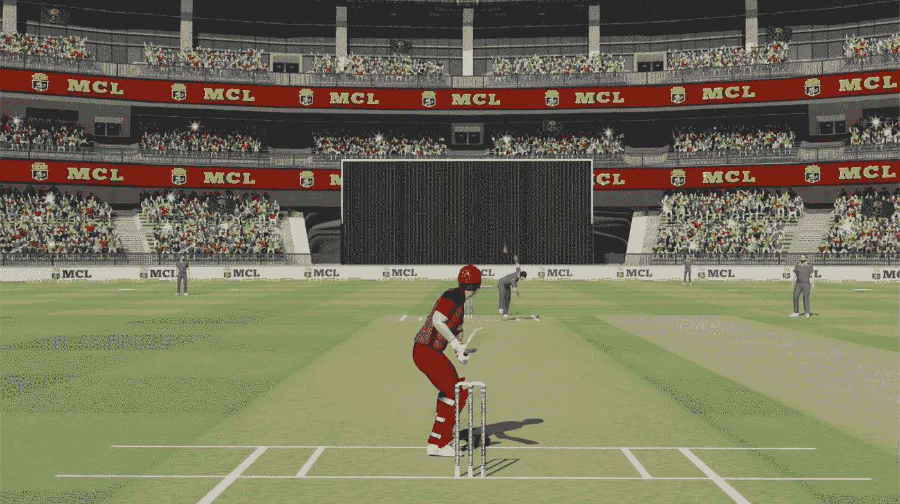

# 元板球联盟——重新定义 P2E 和游戏领域

> 原文：<https://medium.com/geekculture/meta-cricket-league-redefining-p2e-and-the-gaming-realm-6452e5b36c03?source=collection_archive---------14----------------------->

所以游戏是我非常喜欢的东西，而且是一件非常有趣的事情。尽管这并不能增加收入，但却是打发时间的好方法。嗯，有一种特殊类型的游戏确实可以让你赚钱。然而，赔钱的机会也大大增加了。这些基本上是玩赚游戏，涉及现金的使用，以便玩游戏，如在线扑克或拉米纸牌游戏，使体面的，如果不是中等的回报。这种特殊类型的游戏有很大的问题，因为人们不仅会输掉很多钱，还会沉迷于一些非常依赖运气的东西。人们还必须考虑到运气并不总是站在你这边，它像风一样变化无常。这也可能最终影响到 P2E 博彩 的整个部分 [**的整体目的。因此，直到最近，这个领域或这个概念还是相当危险的。**](https://www.jump.trade/mcl-game)

这个世界现在被引入了一些革命性的东西，与它的前辈不同，这实际上可以被称为一种投资。其原因是因为 P2E 领域随着 NFT 游戏的复兴。NFT 基本上是不可替代的代币，它们是独一无二的，其价值取决于稀有性、需求和排他性。这些游戏中的大多数都有不同种类的赚钱机制，其中角色、物品和游戏中的物体基本上都是 NFT，可以用来交换更好的，甚至可以升级以增加 NFT 的整体价值。因此，一个不同的游戏领域开始成长，或者准确地说，一个曾经依赖运气的领域现在更加依赖技能，也成为等待世界的未来的关键角色。

# **元板球联赛**

作为一个印度人，我怎么能不喜欢板球呢？无论是维拉特用来把球投在正确位置的技术，还是哈迪克结束一局的风格。正是在这段时间，这些 NFT 游戏变得流行起来，我仍然在阅读有关它们的资料，无法决定是否应该投资它们。所以经过大量的思考和研究，我投资了我发现的唯一合理的游戏，那就是 MCL(元板球联盟)。这是一场真正的板球比赛，但选手们相当时髦和现代。最重要的是，有趣的事实是，这些 NFT 可以升级，签名的 bat 也可以。更不用说这些玩家的 NFT 可以通过找到类似的升级卡升级，升级卡可以在一个人玩游戏并获胜时在战利品盒中收到。

这只是好处之一。

MCL 是同类中的第一个。鉴于有几种不同类型的 NFT 游戏，MCL 将永远是第一个在元宇宙玩的板球游戏。这个概念很简单:你所需要的就是赢一个玩家，避免出局，因为如果你出局，你会得到负 6 分。现在来看看人们是如何在游戏中赚钱的。用户需要获得一对 NFTs 击球手和投球手各一名。也有这些锦标赛是不同的时间和赢家将获得 JT 点，从总奖金池。这是从投资中获得合理回报的一种可靠而明智的方式，也是让新用户玩游戏的一种特殊方式。

## **如何入门**

在 [**Jump.trade NFT 市场**](https://www.jump.trade/) 上，买卖过程相当简单。你所要做的就是使用任何指定的支付方式将所需的加密货币加载到你的钱包中，或者也可以使用 UPI 进行购买。你选择的 NFT 是可以购买的，守护钱包会装着它。元板球联盟是你有资格参加的，只要你有两个 NFT。这个游戏和你已经熟悉的板球游戏非常相似。你必须在注意时间和准确性的同时击球。单打、双打、四人和六人都可以得分。这不仅让人们明白这不是一个靠运气的游戏，而且不像其他 P2E 游戏，一个人必须精通才能玩这个游戏。也有不同的球员 NFT 像史诗，传奇，新秀，罕见，等等，甚至蝙蝠。这就产生了排他性因素。

你的每一次得分都会得到 JT 积分。您收到的每一个点数都是以美元表示的。对于你的每一次击球和每一次失误，你将分别得到正分和负分。该白皮书可在官方 Jump.trade MCL 网站上获得，该网站上有关于每个主题的更多信息。白皮书中还提供了每个积分的奖励法定货币的详细信息。考虑到所有这些因素，NFT 奥运会实际上将在未来几年变得非常突出和流行。MCL 只是一个执行良好的 P2E NFT 游戏的一个很好的例子，虽然图形稍低，但随着更新，它变得越来越好。截至目前，这款游戏只在 Android 和 Windows 上可用，但它可能很快就会在所有平台上可用。

## **结论**

MCL 是一个令人难以置信的游戏，它允许用户在获胜的同时赚钱。除此之外，我还可以利用 NFT 市场 Jump.trade 来 [**买卖我的板球 NFTs**](https://www.jump.trade/nft-marketplace) 。在过去的几周里，我一直是一个狂热的玩家，但我的收入水平肯定上升了，通过玩游戏获得的总收入也上升了。游戏不可思议，背后的团队更是如此。他们提供持续的更新，甚至勤勉地处理一些不可避免的机器人和错误。非物质文化遗产是世界的未来，能够参与到如此令人惊奇的事情中，即使是以最小的方式，也是不可思议的