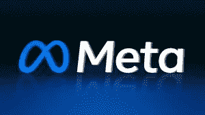

# 元平台|社交元宇宙公司

> 原文：<https://medium.com/geekculture/meta-platforms-social-metaverse-company-dd4fea085a1d?source=collection_archive---------19----------------------->

# 介绍

元平台。这是一家美国跨国科技公司，成立于加利福尼亚州芒托帕克。该公司拥有脸书、Instagram 和 WhatsApp，周围还有其他产品和服务。Meta 是世界上最受赞赏的公司之一。它反映在美国五大信息技术公司之一。

# Meta 的产品和服务

Meta 的主要产品和服务有脸书、Messenger、Facebook Watch 和 Meta Portal。它还开发了 Oculus、Giphy、mapi pile、Kustomer 和 Presize。该公司 97.5%的收入来自广告销售。

# 数据中心

脸书在 2019 年激活了 16 个数据中心。它致力于购买 100%的可再生能源，到 2020 年减少 75%的温室气体排放。前述数据中心技术包括作为分布式网络系统的结构聚合器。该系统可适应更大的区域和不同的交通模式。

# 元平台库存在当前水平

Meta Platforms 的库存(NASDAQNDAQ -1.5%: META)年初至今错置了 71%，而 S&P500 的库存下降了 20%。此外，该库存目前以大约 96 美元的价格进行买卖，这与其真实价格 174 美元相比低了 44%——tre fis 对[Meta Platforms](https://www.technologiesinindustry4.com/)估值的估计。社交媒体 massive 公布的 2022 年 1/3 区域内的收入低于预测。它宣布互联网销售额同比下降 4%，至 277 亿美元——连续几个季度增长乏力。此外，该组织预计，第四个领域的 12 个月同比增幅也将较低。值得注意的是，它发布了第四季度 300-325 亿美元的销售指导。这让买家对库存感到担忧。

尽管在过去的 12 个月里，股价经历了过度上涨。元库存同样遭遇了额外的问题。投资者问题的动机之一是事实实验室[(元宇宙)的过度支出。](https://www.technologiesinindustry4.com/)年初至今，该组织已经花费了超过 90 亿美元，这种时尚有可能在接下来的几个季度保持下去。此外，在过去的六个月里，市场营销和市场销售的下降使这些主题变得更糟。另一方面，该公司拥有强大的消费者基础。其自己的亲戚圈子天天热闹的人在第三季度变成了 29.3 亿(同比增长 4%)，伴随着通过脸书的方式天天热闹的消费者基数达到了 19.8 亿(同比增长 3%)。

由于宏观经济状况，市场营销和销售的下降变成了普遍现象。据预测，这将促进经济内部的愈合。此外，该公司正在对事实实验室进行长期投资，该阶段不会在 12 个月内显示出价值。总体而言，我们估计 2022 财年[元平台](https://www.technologiesinindustry4.com/)的销售额约为 1164 亿美元。此外，调整后的互联网利润可能在 12 个月内减少到 239 亿美元(下降 39%)。再加上 9.20 美元的年每股收益和低于 19 倍的市盈率，估值将达到 174 美元。

# 核心业务继续交付

时尚收入文件的适当元素是，中心企业仍然控制增强其主导指标，最终结果是缓解了组织因 Reality Labs 的负面整体表现而面临的压力。尽管销售额下降，广告费用下降，但 Meta 仍然通过自己的亲属圈应用程序(包括脸书、Instagram 和 WhatsApp)的氛围，控制住了各种各样的日常和月度客户，与最后 12 个月的相同持续时间形成对比。

与此同时，在过去的一个月里，我开始写 Meta 的 Reels，这是脸书和 Instagram 中的一个简短视频产品，就像抖音一样，在这 12 个月里朝着正确的方向发展，创造了 10 亿美元的销售额，然后通过时尚的电话会议，[马克·扎克伯格](https://www.technologiesinindustry4.com/)介绍了 Reels 的年销售价格已经达到 30 亿美元。这对 Meta 来说是一笔巨大的交易，因为来自卷轴的销售至少能够缓解潜在的 100 亿美元的销售损失，该组织的控制表示，他们可能会在这 12 个月内发生这种情况，因为苹果(AAPL)引渡的隐私覆盖限制了对 iPhone 客户的监控。为了保持规模卷轴，Meta 最近推出了一套全新的设备和内容材料创作者的货币化替代方案，这可能会吸引新的客户，推动脸书和 Instagram 的普遍参与，从长远来看，甚至额外提高尖端的年度销售价格。

此外，考虑到美国官员已经呼吁禁止抖音，因为它与中国政府有联系，如果禁令获得通过，Meta 可能有机会提高卷轴的规模，这可能有助于企业提高整体业绩，并掩盖 Reality labs 的损失。时间会告诉我们是否会是这样。

我们现在意识到的可能是，由于[现实实验室](https://www.technologiesinindustry4.com/)的损失，Meta 的库存总体上升幅度小于之前。如果一个月前，我的 DCF 版本确认 Meta 的真实价格变成了 203.03 美元，与股价一致——那么在新的假设下，价格会更低。

全新的版本在下面得到了证明，其中的许多内容在过去的一个月里已经被修改。首先，营销和营销企业的周期性衰退似乎比先前预测的更严重，因此根据全新的事实对顶线增长假设进行了修正，并且总体上与全新的道路估计一致。在新版本中，EBIT、税收和 D&A 假设保持不变。

根据管理层的最新预测，由于[现实实验室](https://www.technologiesinindustry4.com/)费用的激增，2022 财年和 2023 财年的资本支出假设大幅增加，同时，在最后几年内，支出占销售额的百分比开始放缓，但是，与之前的历史时期相比，仍然有所改善。网络内销售额的百分比已经减少，因为有时天气很好，这与接下来几年内流行的历史持续时间一致。WACC 和终端加价继续不变。

更多详情请访问:[https://www . technologiesinindustry 4 . com/2022/11/meta-platforms-social-元宇宙-company.html](https://www.technologiesinindustry4.com/2022/11/meta-platforms-social-metaverse-company.html)

YouTube 频道:[https://www.youtube.com/channel/UCbHQ84DcJ_mZG6W4L1S1b2g](https://www.youtube.com/channel/UCbHQ84DcJ_mZG6W4L1S1b2g)