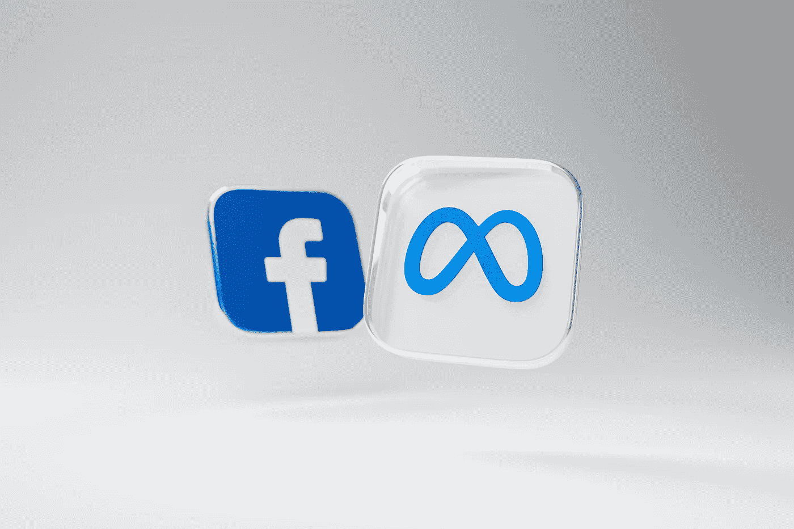
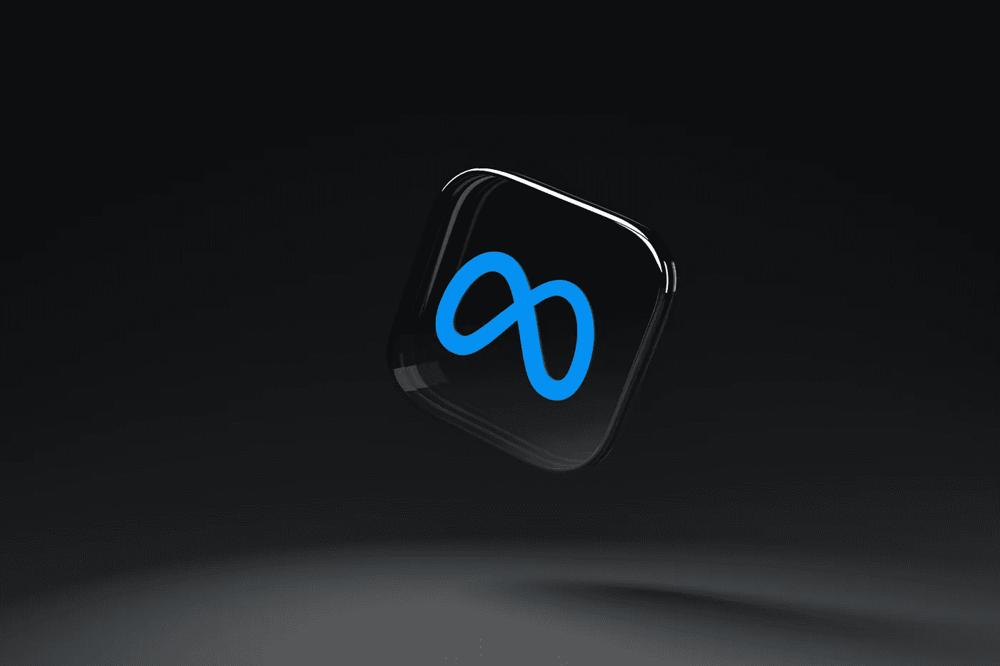
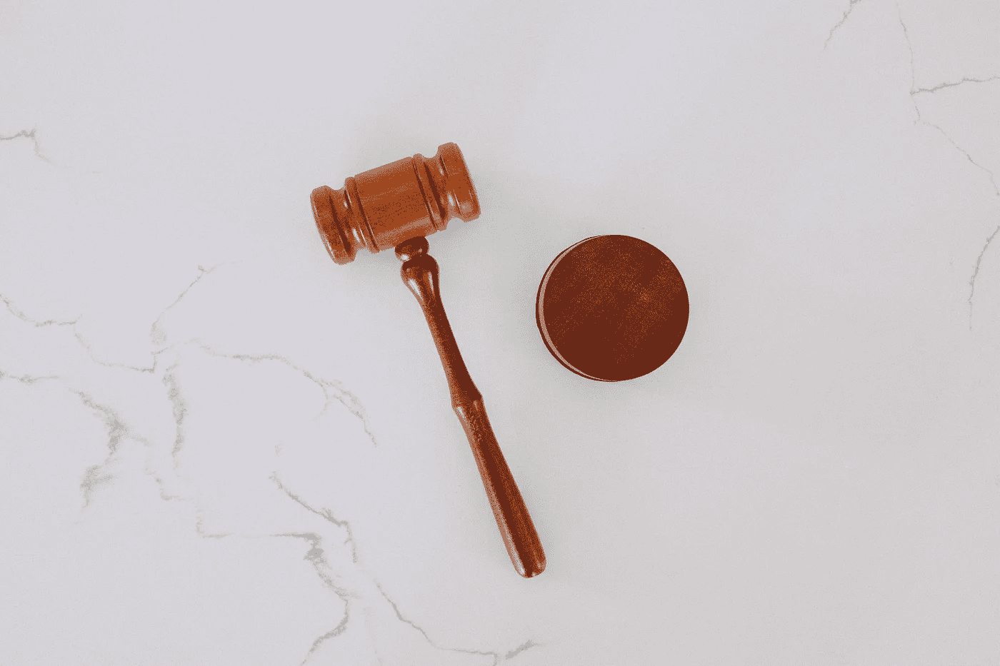

# Meta 被告知转到 GIF 本身

> 原文：<https://medium.com/geekculture/meta-told-to-go-gif-itself-ffbd10ae9b5d?source=collection_archive---------18----------------------->

Dima Solomin

考虑到 Meta 可以说是这个星球上最有影响力的公司之一，不管是好是坏，它被允许毫无问题地收购 Instagram 和 WhatsApp 有点令人惊讶。绝对令人震惊的是，随着对 Giphy 的收购告吹，它刚刚遇到了第一个确认的障碍。是的，你没看错，Meta 被允许垄断一大块社交媒体，成为一个通讯巨头，但 gif 是他们不能跨越的界限。为什么？让我们仔细看看。

# 多少才算多？

Dima Solomin

这个故事比你想象的要长。对 Giphy 的收购可以追溯到 2020 年 5 月，当时两家公司达成了交易。据报道，这个价格为 4 亿美元，对 Meta 来说只是小数目，特别是考虑到 Giphy 的*一半的流量来自脸书，Meta 对该公司非常感兴趣。据报道，Meta 计划从一开始就将 Giphy 直接集成到 Instagram 中，但麻烦立即开始酝酿。从人们[质疑【Giphy 的用户数据落入 Meta 之手后会发生什么，到最终扼杀整个交易的主要问题:英国竞争和市场管理局(CMA)发现该交易是反竞争的。所以那个整合计划？立刻离开桌子。CMA 裁定 Giphy 不能并入脸书，直到当局就此事发布具体裁决。](https://www.forbes.com/sites/kateoflahertyuk/2020/05/16/facebook-just-gave-700-million-giphy-users-a-reason-to-quit/)*

# *第一个决定*

**

*CMA 在 2021 年 8 月给出了一些初步结论，表达了对 Meta 将限制 Giphy 用于竞争对手或开始收集额外用户数据的担忧。如果你认为这有点苛刻，请记住这是 Meta 以前做过的事情。*

*然后是 11 月，第一次裁决 CMA 声明 Meta 必须剥离 Giphy，并补充说 Meta 在英国广告市场控制了太大的份额。当然，梅塔试图上诉，并发表了一份声明，称脸书和吉菲相处得很好。然而，没有什么能动摇 CMA，唯一的障碍出现在 2022 年 7 月，当时有史以来最好的缩写词的所有者——竞争上诉法庭——表示，由于一些程序问题，CMA 必须重新评估其决定。*

# *最后的决定*

*现在，10 月份到了，不受束缚的 CMA 确认了它之前的裁决——Meta*必须* [出售 Giphy](https://www.theguardian.com/technology/2022/oct/18/facebook-meta-sell-giphy-cma) 。CMA 重申 Meta 对广告市场的控制是危险的，收购 Giphy 会给它太多的权力。在这一点上，Meta 勉强同意，并可能遵守裁决。*

*然而，有趣的是，Giphy 自己现在对这一结果并不满意，因为它说 gif 已经不受年轻互联网用户的青睐，而且并没有一排追求者等着收购该公司。很难指责 Giphy 的管理层，他们从眼皮底下偷走了一笔利润丰厚的交易，但这对 Meta's 帝国的打击对用户和竞争对手来说都是一个重大胜利。*