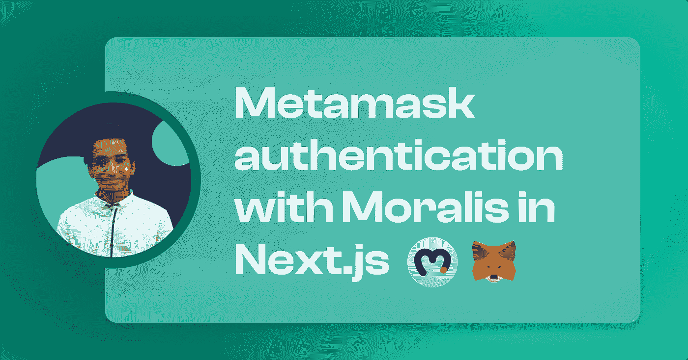
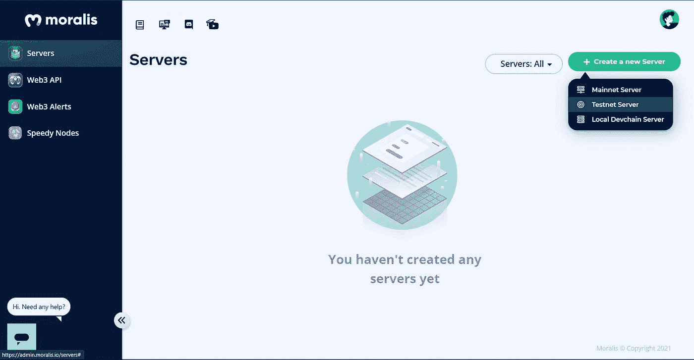
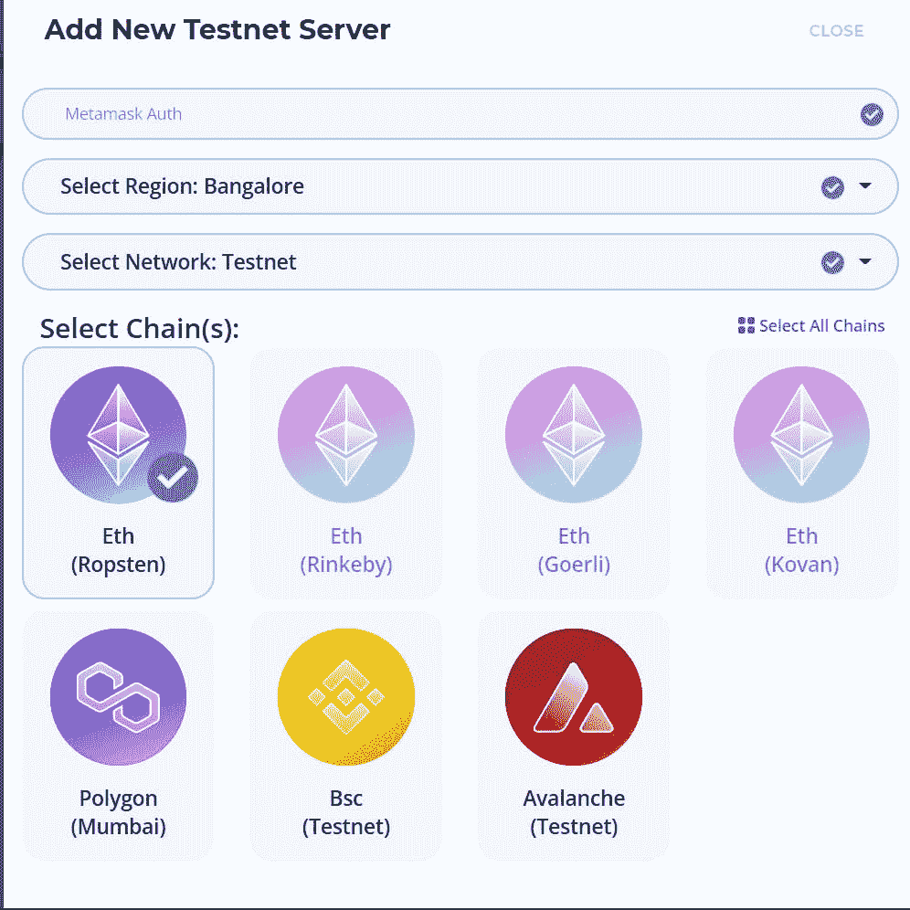
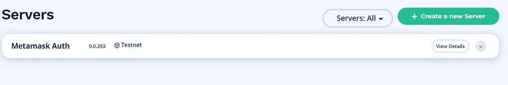
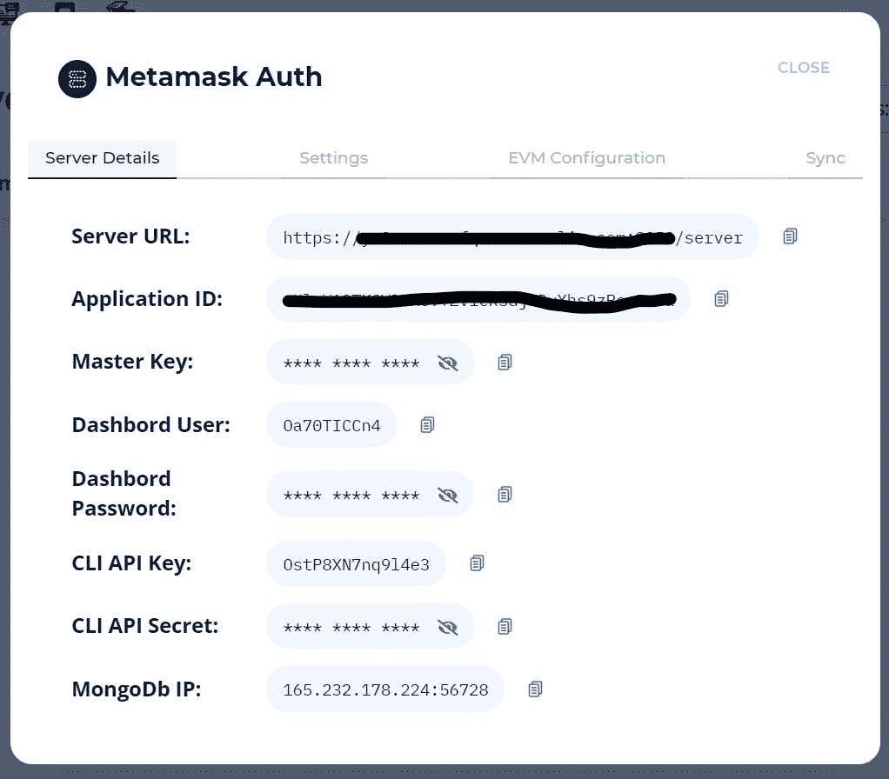
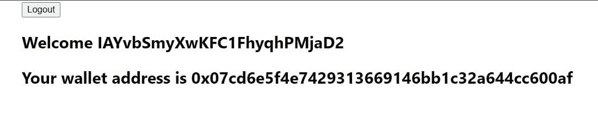

# Next.js 中使用 Moralis 的元掩码身份验证

> 原文：<https://medium.com/geekculture/metamask-authentication-with-moralis-in-next-js-33972b242b05?source=collection_archive---------5----------------------->



如果你没有生活在岩石下，你可能听说过 Web 3.0！


全栈最重要的部分之一是身份验证。因此，让我们看看如何在 Next.js 应用程序中授权用户使用他们的元掩码钱包。

如果你不知道什么是 metamask，那就去看看他们的[网站](https://metamask.io/)

# 设置应用程序

**创建新的下一个应用**

```
npx create-next-app next-metamask
```

**导航至应用程序**

```
cd next-metamask
```

**安装所需的依赖关系**

```
npm i [@walletconnect/web3-provider](http://twitter.com/walletconnect/web3-provider) moralis react-moralis # npmyarn add [@walletconnect/web3-provider](http://twitter.com/walletconnect/web3-provider) moralis react-moralis # yarn
```

**启动服务器**

```
npm run dev # npmyarn dev # yarn
```

# 获取道德证书

前往 [moralis](https://moralis.io/) 并注册/登录。之后，点击创建新服务器并选择`TestNet Server`



选择它，你会看到一个弹出窗口。填写详细信息，并点击`Add Instance`按钮。



服务器创建完成后，点击`view details`



我们需要服务器 URL 和应用程序 ID



# 构建认证系统

**添加环境变量**

在文件夹的根目录下创建一个`.env.local`文件，并添加 env 变量，如下所示

```
NEXT_PUBLIC_MORALIS_APP_ID=<app_id>
NEXT_PUBLIC_MORALIS_SERVER_ID=<server_id>
```

您需要用从 Moralis 获得的凭证替换变量的值。

**用道德供应商包装应用**

转到`_app.js`,用道德提供者用 env 变量包装`<Component {...pageProps} />`,如下所示

现在从 react-moralis 导入`MoralisProvider`

```
import { MoralisProvider } from "react-moralis";
```

**创建签到按钮**

我将在主页上创建登录按钮，你可以随意在任何你需要的页面上创建它。

从 useMoralis 钩子中获取 authenticate 函数-

```
const { authenticate } = useMoralis();
```

您还需要从 react-moralis 导入钩子

```
import { useMoralis } from "react-moralis";
```

创建一个这样的按钮-

现在，如果我们单击登录，将会打开登录的元掩码扩展。

**如果用户已注销，则显示注销按钮**

我们需要从像这样的`useMoralis`钩子中得到更多的东西-

```
const { authenticate, isAuthenticated, logout } = useMoralis();
```

创建一个三元运算符来显示注销按钮，如果用户已登录，则显示登录按钮-

现在，我们的登录和注销在🥳🥳正常工作

**获取用户数据**

让我们看看如何获得一些基本数据，如他们的 eth 地址和用户名。

当用户通过身份验证后，您可以添加这个片段来显示用户名和他们的地址 wallet-

你还需要从`useMoralis`钩子中获取用户-

```
const { authenticate, isAuthenticated, logout, user } = useMoralis();
```



用户名是非常随机的😂但它在某些情况下会有所帮助，eth 地址可用于交易。

# 签署

用 moralis 实现元掩码的身份验证很容易🤯

希望你觉得这个教程有用，并继续关注更多的 web 3.0 教程✌️

[GitHub 回购](https://github.com/avneesh0612/metamask-next)

[道德家](https://moralis.io/)

[Metamask](https://metamask.io/)

[和我联系](https://links.avneesh.tech/)