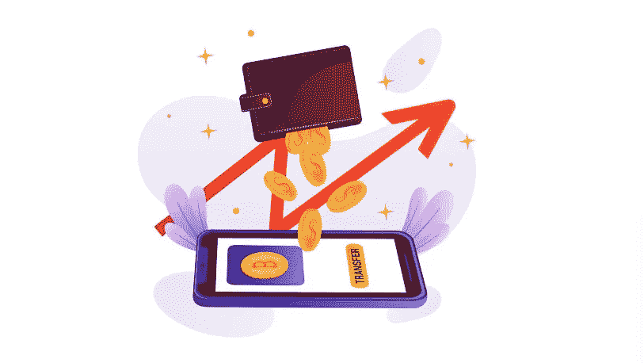

# 类似钱包开发的元掩码——安全加密交易的关键

> 原文：<https://medium.com/geekculture/metamask-like-wallet-development-a-key-for-secure-crypto-transactions-468c83e39041?source=collection_archive---------9----------------------->

你可能已经用你的货币在商店买了任何东西。此外，你也有可能用信用卡携带物品。交易是安全的。但现在，一切都被数字化了，这里可能会发生欺诈交易，所以你需要一个安全的钱包。有许多钱包可以让您的交易变得轻松，然后有一个 metamask 钱包可以以安全的方式处理一切。

因此，如果您需要进行任何交易，这可以在未来引导您走向更好的方式。利用[的**元蒙版像钱包一样从合适的地方开发**的](https://bit.ly/3JGLM2y)。

Crypto wallet

> 让我们从这篇博客中学习如何创建一个类似 metamask 的加密钱包。

**什么是加密货币钱包？**

据说，加密货币钱包是一种硬件或软件，可以存储你的私钥，并允许你访问你的硬币。然而，这些钱包持有您签署加密货币交易所需的**私钥**和**公钥**(钱包地址)。与该地址相关联的硬币由拥有私钥的人控制。此外，钱包有多种款式，每种都有独特的功能和不同的安全级别。各种加密货币的密钥可以保存在各种 [**的加密钱包**](https://en.wikipedia.org/wiki/Cryptocurrency_wallet) 中。

**什么是元掩码？**

T21 eta mask 是一个浏览器插件，可以作为以太坊钱包使用。一旦安装，**用户可以通过存储以太或任何其他 ERC-20 令牌**使用任何以太坊地址进行交易。此外，用户可以在游戏中花费硬币，在赌博应用程序中下注代币，并通过将 MetaMask 连接到基于以太坊的 DApps 在分散式交易所(dex)进行交易。然而，它允许用户一起访问[**DeFi 应用**](https://bit.ly/3Qxnf1U) ，如 Compound 和 pool，它们是新兴的分散金融部门的一部分。

> 类似 metamask 的钱包有哪些特点和优势？
> 
> Metamask 是一款市场领先的钱包，能够支持加密领域的大多数令牌类型，目前正在开发中。为此，它们具有许多功能，使您能够享受其最广泛的优势，包括:
> 
> **跨链兼容性**
> 
> 类似于 Metamask 的 wallet 提供了对来自各种区块链的所有类型的资产的支持，该 wallet 以其跨链兼容性而闻名。这使得钱包更加用户友好，从而推进它通过各个阶段。
> 
> **认证**
> 
> 根据需要，您的钱包的真实性可以与许多加密方案相结合。它们通常为加密钱包提供最好的服务，从复杂的无钥匙认证到单向散列加密。
> 
> **匿名**
> 
> 元掩码在用户和用户体验方面具有更高的优先级；因此，所有与用户相关的数据都存储在一个分散的平台上。这使得能够以较少的数据处理来采取中间步骤，用户只能访问这些步骤。
> 
> **多用户认证模式**
> 
> 为了访问资产，用户现在可以使用 Metamask wallet 中的多用户身份验证模型以多种方式验证自己。除了标准的 pin 和密码认证，他们还改进了生物认证。
> 
> **两栖平台支架**
> 
> 这些钱包是独立于平台的，可以在任何平台上完美运行，没有任何平台特有的问题。此外，钱包可以在所有类型的操作系统上以更快的响应时间运行。
> 
> 加密货币钱包可以证明是安全的，因为它们以安全的方式处理一切，这就是为什么像 metamask 这样的加密货币钱包开发是必不可少的。

Metamask like wallet

**如何创建类似 Metamask 的钱包**

元掩码被认为是这个加密领域最安全的钱包。它们支持具有高端优势的安全存储选项。然而，建立一个类似 metamask 的钱包将需要时间，因为类似 meta mask 的钱包开发公司 将从零开始这个过程，因为当你向他们寻求这种服务时，它会以令人难以置信的方式实现每一项功能。它构建的钱包具有与元掩码相同的优势和功能。

你需要做的是:

*   您需要确定您的钱包的设计，并指定您的钱包中可以存储和接收多少种不同的加密货币和加密令牌。
*   雇佣一群**知识渊博、技术娴熟的加密货币钱包开发者**，他们拥有开发**类似 metamask 的区块链钱包**的经验。
*   初始化您的钱包的私人和公共密钥的代码。
*   从一个可靠的服务提供商那里选择最好的元掩码(如钱包开发服务)会使工作变得容易。
*   通过一家认证公司轻松推出钱包，该公司旨在提供类似钱包的 metamask。

建立一个像 Metamask 这样的去中心化的加密钱包是任何一个进入这个领域并渴望成功的人的终极任务。你需要让 [**最好的钱包开发服务商登上**](https://bit.ly/3JGLM2y) **。**

**结论**

在工作人员的帮助下开发类似 Metamask 的加密钱包，减轻您的工作负担。只有一小部分加密货币钱包的范围比你要选择的更广。然而，它最终有潜力显著增长，并在加密货币钱包中占据领先地位。因此，选择正确的公司以正确的方式进入。