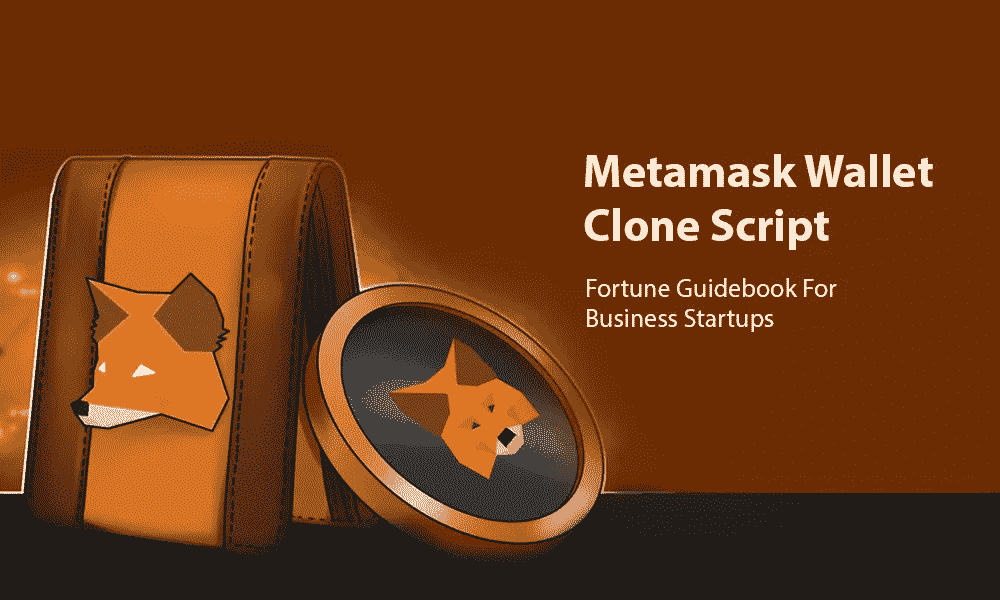

# Metamask 钱包克隆脚本——创业财富指南

> 原文：<https://medium.com/geekculture/metamask-wallet-clone-script-fortune-guidebook-for-business-startups-d9c0c8f06b5c?source=collection_archive---------8----------------------->

前几天，每个人都用人民币在商店里买东西。于是，卡出现了，交易也就安全顺利了。在目前的情况下，一切都是数字的，因此可能会发生欺诈性交易，所以你需要一个安全的钱包。这些钱包用于存储、转移和接收货币和代币。

Metamask Wallet Clone Script

有很多钱包可以让您的交易变得轻松，但 Metamask 钱包可以安全地管理一切。因此，从最好的提供商那里获得一个类似 Metamask 的钱包可以帮助你进行安全交易，并在未来引领你走向更好的道路。

创业公司和企业家正计划推出类似 Metamask 的加密钱包。

# 加密货币钱包

加密货币钱包是一个在线平台，它存储您的私钥，并提供对您的硬币的访问。同时，加密钱包保存您的私人 ad 公钥(钱包地址),这是签署加密货币交易所必需的。与地址相关联的加密货币由拥有私钥的人控制。此外，加密钱包出现了许多风格，特殊功能和各种安全级别。

# 元掩码 Wallet 克隆脚本

[**Metamask Wallet 克隆脚本**](https://www.alwin.io/blog/metamask-wallet-clone-script) 是一个预制的软件，是原始 Metamask Wallet 的复制品，包含所有内置特性和功能。有了这个克隆脚本，人们可以在短时间内在期望的区块链上有效地启动他们自己的加密钱包。该克隆脚本可根据业务需求进行 100%定制。此外，它还支持各种数字货币，如比特币，以太坊，莱特币等等…

# 元掩码概述

在加密市场上有很多加密钱包。但是，Metamask 被认为是最好的加密钱包之一，因为它通过向全球观众提供一些高级功能而赢得了一个高质量的名称。

这个 Metamask 钱包是一个在线软件，它是以太坊区块链上运行的去中心化金融中常见的加密钱包。这种钱包既可以作为浏览器扩展，也可以作为移动应用程序，还允许用户以一种无障碍的方式在所有类型的正规网站上进行交易。

# Metamask Wallet 克隆脚本是如何工作的？

Metamask Wallet 克隆脚本的工作机制与 Metamask Wallet 相同。想象自己是元蒙版克隆的用户，以便更好地理解所涉及的过程。确保您是否有 chrome、firefox 或任何其他浏览网站用于添加扩展。

获取元掩码 wallet 克隆，并安装元掩码克隆作为扩展。安装设置完成后，发送和接收加密硬币需要执行以下步骤。

1.  安装扩展后，您将看到元掩码克隆图标。点击图标并登录。
2.  出现登录屏幕，接受所提供的条款和条件。
3.  成功登录后，您应该通过单击主网络并选择名为 ropsten 的测试网络来更改网络。
4.  找到一个以太图标，点击“卖出”或“买入”按钮。出现一个显示购买或出售以太坊的框。你需要点击 ropsten 测试水龙头按钮。
5.  最后一步是点击绿色按钮向水龙头请求 1 以太坊。在那里你被要求等待几分钟，然后收到一个地址交易，这是你确认的地址。点击图标验证 1 以太坊。

# 元掩码 Wallet 克隆脚本的重要功能

交易功能被认为是平台的卖点，因为用户首先寻找的是平台提供的交易功能。所以，提供高级功能可以有效地打动全球用户。下面提供了 Metamask Wallet 克隆脚本中支持的一些基本功能。

*   多种货币援助
*   双因素认证
*   高清设置
*   自动会话终止
*   内置硬币购买
*   多个加密支付网关
*   受密码保护的访问
*   多语言帮助
*   所有权
*   网络选项
*   本地密钥存储
*   多重签名保险库
*   二维码扫描仪
*   主屏幕的定制
*   平台兼容性

# Metamask 钱包克隆支持的硬币

Metamask 钱包克隆软件支持所有主要和流行的加密硬币和令牌。以下是 Metamask 钱包克隆版支持的一些加密货币。

*   币安硬币(BNB)
*   创(TRX)
*   宇宙(原子)
*   泰佐斯(XTZ)
*   比特币现金(BCH)
*   Dogecoin (DOGE)
*   纳米(纳米)
*   永恒之塔(Aion)
*   韦钱(文)
*   恒星(XLM)
*   以太坊
*   以太坊相关代币

# 独家 Metamask 钱包克隆解决方案的价格

独家 Metaask 克隆脚本的成本是企业家关注的主要问题之一，因为他们必须保持业务的财务稳定。Metamask 克隆软件的价格从 7000 美元起，包括非常基本的功能和选项。此外，如果您根据业务需求添加或删除任何功能或选项，成本可能会相应变化。根据您的业务理念选择最适合您的财务环境的功能和选项。

# 从哪里获取高级元掩码 Wallet 克隆脚本？

最后，世界各地的市场上都有很多元蒙版克隆开发者。由于激烈的竞争，选择最佳的解决方案提供商是进入这个领域的新手的最终任务。不断研究，找到最好的 [**加密货币钱包开发公司**](https://www.alwin.io/cryptocurrency-wallet-development-company) ，能够有效满足您的业务期望。只有极少数公司提供最好的 Metamask 钱包克隆，具有所有高级安全选项和交易功能。因此，在竞争对手中选择一家有发展潜力的公司。