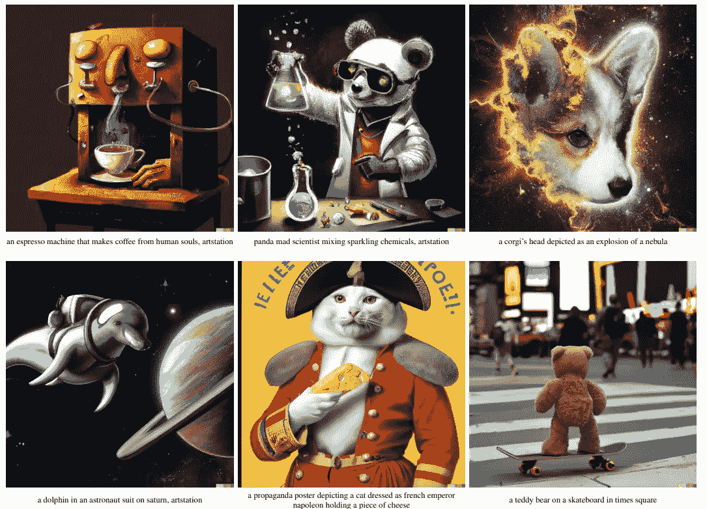
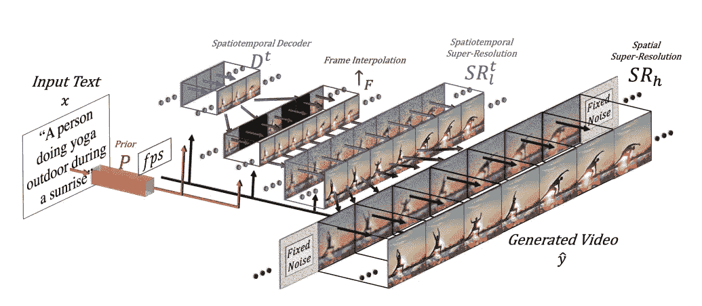
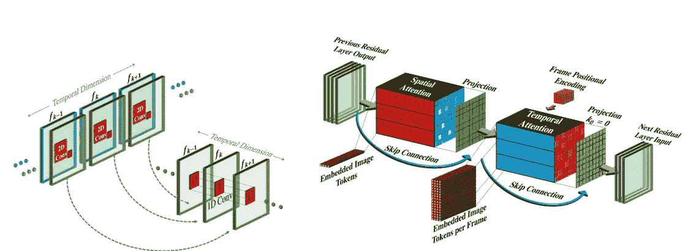
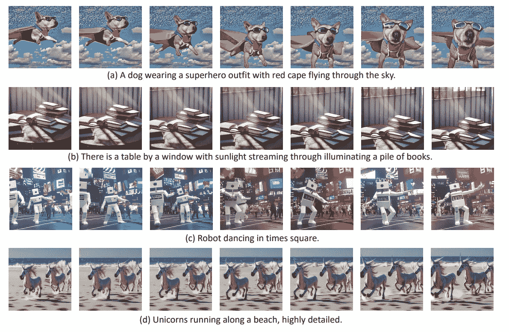

# Meta 的新模型可以将文本提示转化为视频

> 原文：<https://medium.com/geekculture/metas-new-model-can-turn-text-prompt-into-videos-b6dadb94ab3b?source=collection_archive---------7----------------------->

制作视频——生成艺术的新突破

image generated by the author using OpenAI’s [DALL-E 2](https://arxiv.org/pdf/2204.06125.pdf)

几个月前，DALL-E2 震惊了世界，它能够在几秒钟内将文本提示变成图像。上周，Meta 发布了其最新的视频制作模型，该模型可以将文本提示转化为几秒钟的短视频。

**生成艺术正在迅速发展**

DALL-E 2 是 OpenAI 在 4 月份公布的。新模型似乎能够以令人难以置信的精确度从文本中生成图像。

Image source: [DALL-E2 original article](https://cdn.openai.com/papers/dall-e-2.pdf)

结果令世界震惊，因为似乎还需要一段时间才能克服它。相反，此后不久，谷歌发布了两款能够超越 DALLE2 的机型。[谷歌的 Imagen](https://imagen.research.google/) 和 [Parti](https://parti.research.google/) 在短时间内发布，它们也没有保持最先进的状态很长时间。事实上，几个月前发布了稳定扩散。

在接下来的几个月里，生成领域发展迅速，许多模型都以开源方式开放或发布。最近 [DALL-E2 向公众开放](https://techcrunch.com/2022/09/28/openai-removes-the-waitlist-for-dall-e-2-allowing-anyone-to-sign-up/)(不再有等待名单)并宣布了呼出能力。DALL-E mini 已经被纳入 HuggingFace，甚至 Photoshop 现在也纳入了稳定扩散。

所有这些模型都将一个简短的文本描述作为输入，并生成一个图像作为输出。另一方面，Meta 宣布了一种可以将文本提示转化为短视频的模式

# **制作视频**

制作视频于上周公布。Meta 研究人员还发表了一篇科学论文( [arXiv 链接](https://arxiv.org/pdf/2209.14792.pdf))，详细描述了这个模型。Meta 最近一直在研究生成模型，事实上，它已经在今年发布了 [Make-A-scene](https://ai.facebook.com/blog/greater-creative-control-for-ai-image-generation/) ，这是一个能够使用单词、文本行和自由草图来创建照片般逼真的插图的模型。

**简要技术描述**

Image source: [Meta’s original article](https://arxiv.org/pdf/2209.14792.pdf)

该模型由三个主要部分构成:

*   一个基本的文本到图像模型，在文本-图像对上跟踪。模型的这一部分与我们目前在其他文本到图像模型中看到的非常相似(正如他们在文章中所写的，它与用于 DALL-E2 的模型非常相似)
*   时空卷积和注意力层允许我们切换到时间维度。事实上，作者修改了卷积和注意力层，以便能够在不增加太多计算成本的情况下，从图像切换到时间维度。
*   允许生成高帧速率的时空网络(这部分网络用于增加视频中的帧数，以获得更平滑的视频)

from the article: The architecture and initialization scheme of the Pseudo-3D convolutional and attention layers, enabling the seamless transition of a pre-trained Text-to-Image model to the temporal dimension.

作为一个数据集，他们使用了 23 亿张图像(Laion 5b 数据集的子集，这是一个包含图像示例和相关文本的庞大数据集)。作者描述，他们过滤了带有有毒文字的图像或水印概率大于 0.5 的 r 图像。他们还使用了 WebVid-10M 和 HD-VILA-100M 或训练他们的视频生成模型。

T2V generation examples. image source: original article

作者解释说，使用标记图像的数据集有助于向模型解释对象的名称和外观。此外，视频的使用使模型能够理解这些物体在世界上是如何运动的。这种训练模型的新方法被证明在教导模型如何从文本生成视频方面是有效的。

> 使用无监督学习从数量级更多的视频中学习世界动态有助于研究人员摆脱对标记数据的依赖。目前的工作已经展示了标记图像如何与未标记的视频片段有效结合来实现这一点。—原始文章

**模型能做什么？**

> 制作视频可以让你用几个单词或几行文字制作出异想天开、独一无二的视频，从而让你的想象力发挥到极致。— Meta 制作视频[网站](https://makeavideo.studio/?fbclid=IwAR2qmh03xaed6H3VsOtnp3pBrjAh2F5VHdQhdt77wY2B_grZQOkj5z7XonA)

Meta 简要描述了其新模型的功能:

*   从文本生成视频，提供一个简短的文本模型能够生成一个几秒钟的小视频
*   给图像添加运动，提供一个输入图像，模型返回一个短视频
*   创建视频的变体，用户可以提供一个小视频并生成变体

文章的作者还描述了未来的步骤:

> 下一步，我们计划解决几个技术限制。如前所述，我们的方法无法学习文本和现象之间的关联，这些关联只能在视频中推断。如何结合这些(例如，生成一个人从左到右或从右到左挥手的视频)，以及生成具有多个场景和事件的更长的视频，描绘更详细的故事，留待未来的工作来完成。——[原创文章](https://arxiv.org/pdf/2209.14792.pdf)

事实上，有些视频相当奇怪，无论是动作还是细节都远非完美。运动不是很流畅，有时物体以一种超现实的方式相互作用(好像模型不能理解物体的边界和它们应该如何相互作用)

此外，研究人员试图从训练数据集中消除带有相关有毒单词的图像。决定也使用公共数据集的动机是增加训练过程的透明度，以便任何人都可以检查所使用的数据。然而，提交人指出:

> 正如所有基于网络数据训练的大规模模型一样，我们的模型已经学会并可能夸大了社会偏见，包括有害的偏见

**离别的思念**

制作视频只是一个开始，正如在其他案例中看到的那样，对[多模态模型的研究是未来几年的趋势](https://towardsdatascience.com/googles-pali-language-image-learning-in-100-languages-31d32f9b74fe)。几个能够从文本生成高质量图像的模型已经在一年内问世，因此生成短视频可能只是时间问题。

虽然这是意料之中的，但该模型提出了几个技术上有趣的解决方案，也旨在降低每个提示生成几个帧的计算成本。

正如前面提到的模型一样，这些生成模型仍然有几个未解决的伦理问题。第一个问题是这些数据集是使用爬虫组装的。事实上，它们包含了许多艺术家的作品，没有经过许可，也没有提供鸣谢。第二个问题是，它们通常包含偏见和带有有毒含义的图像。OpenAI Dall-E 的第一个版本包含了一些作者难以纠正的偏见。

这些模型在深度伪造视频生成中可能是危险的，这就是为什么 Meta 在所有生成的视频中添加了水印。

梅塔说，这种模式为创作者和艺术家开辟了新的机会。技术层面的结果令人鼓舞，尽管目前第一个模型仅限于短片。目前，在潜在风险减轻之前，Meta 没有计划将其公之于众。

# 如果你觉得有趣:

你可以寻找我的其他文章，你也可以 [**订阅**](https://salvatore-raieli.medium.com/subscribe) 在我发表文章时获得通知，你也可以在**[**LinkedIn**](https://www.linkedin.com/in/salvatore-raieli/)**上连接或联系我。**感谢您的支持！**

**这是我的 GitHub 知识库的链接，我计划在这里收集代码和许多与机器学习、人工智能等相关的资源。**

** [## GitHub - SalvatoreRa/tutorial:关于机器学习、人工智能、数据科学的教程…

### 关于机器学习、人工智能、数据科学的教程，包括数学解释和可重复使用的代码(python…

github.com](https://github.com/SalvatoreRa/tutorial) 

或者随意查看我在 Medium 上的其他文章:

 [## AlphaFold2 第一年:它改变了世界吗？

### DeepMind 向我们承诺了一场革命，它发生了吗？

towardsdatascience.com](https://towardsdatascience.com/alphafold2-year-1-did-it-change-the-world-499a5a38130a)  [## 对数据集的批判性分析

### 停止微调你的模型:你的模型已经很好了，但不是你的数据

towardsdatascience.com](https://towardsdatascience.com/a-critical-analysis-of-your-dataset-2b388e7ca01e)  [## 说生命的语言:AlphaFold2 和公司如何改变生物学

### 人工智能正在重塑生物学研究，并开辟治疗的新领域

towardsdatascience.com](https://towardsdatascience.com/speaking-the-language-of-life-how-alphafold2-and-co-are-changing-biology-97cff7496221)  [## 融合人工智能的力量和诗歌的细腻

### 人工智能现在能够从文本中生成图像，如果我们给它们提供伟大诗人的话语会怎么样？梦幻之旅…

towardsdatascience.com](https://towardsdatascience.com/blending-the-power-of-ai-with-the-delicacy-of-poetry-3671f82d2e1)**