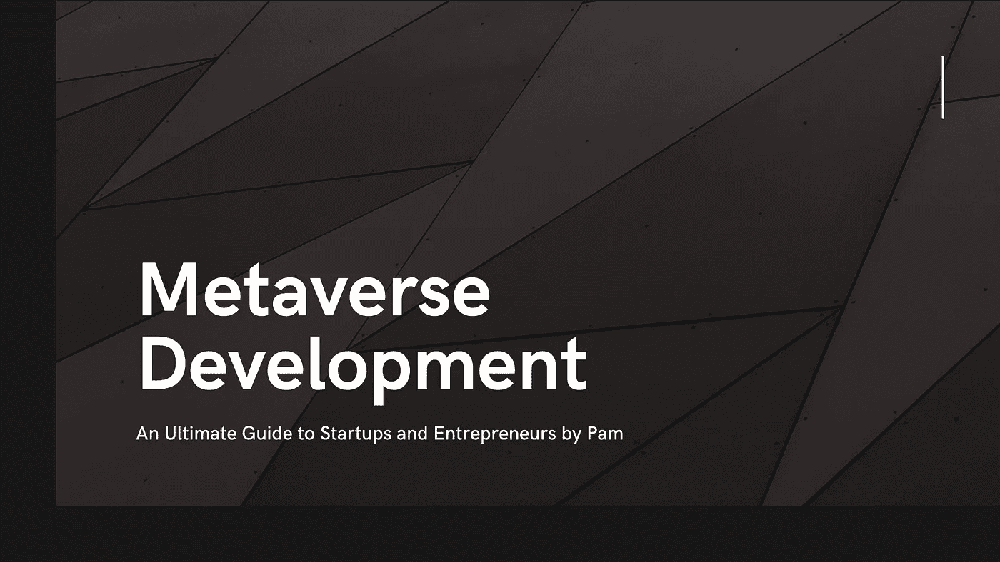

# 元宇宙发展——终极指南

> 原文：<https://medium.com/geekculture/metaverse-development-an-ultimate-guide-25a24a09a9a2?source=collection_archive---------14----------------------->

## 为你的企业开发专属元宇宙并不需要太多。想知道怎么做吗？

元宇宙——虚拟空间，人们可以在这里工作、学习、购物、赚钱、与人交往和娱乐。元宇宙世界可以与模拟人生游戏相提并论:在那里你可以创建一个数字化身，在游戏中过着正常的生活。在元宇宙，你可以决定如何生活。你可以改变新的现实。截至目前，加密货币市场资本为 91823 亿美元。它们是从集中式 web 2.0 向去中心化 web 3.0 过渡的基础。各种技术应用随着智能合约、不可替代令牌(NFT)、去中心化自治组织以及当前加密市场中更受欢迎的元宇宙而发展。元宇宙是目前 web3 的流行趋势。

## **元宇宙——数字世界**

“元宇宙”一词首次出现在斯蒂尔·斯蒂芬森 1992 年的小说《冰雪奇缘》中。区块链技术的发展引发了元宇宙的增长。第一个元宇宙是一个 P2E 尽管游戏。

在元宇宙，人们可以使用头像来代表他们，交流，并可以虚拟地创建自己的社区。在这个世界里，数字货币被用于购买武器或衣服，以及在电子游戏中屏蔽。用户还可以使用虚拟现实控制器和耳机在元宇宙世界中进行虚拟旅行，没有任何目标。

在元宇宙，人们可以通过他们的数字化身相互交流。一些像音乐会、展览和会议这样的社交聚会可以在这个平台上举行。目前，这些元诗句是游戏，它们是 Aixe Infinity，沙盒，分散地和 Illuvium。其中大部分是 P2E 的游戏赚取平台。元宇宙正在慢慢地繁荣和发展。用户可以通过带有 AR/VR 耳机的台式机、笔记本电脑和手机访问元宇宙平台。一些公司如 Meta、微软和谷歌已经投资了元宇宙项目。

## 元宇宙对行业的影响

如今，开发元宇宙应用程序已经非常普遍，大规模的公司正在进入 Web3 领域。这些公司更愿意建立自己的分散平台，在自己的虚拟生态系统中茁壮成长。

*   **元宇宙房地产 NFT 发展**——虚拟世界中提供的数字资产可以购买，这击败了最近的 NFTs 销售。他们还打破了最高工资，购买了分散土地持有的虚拟土地。
*   **元宇宙游戏开发**——顾名思义，它正在开发一个支持真实游戏角色、游戏资产和配件的平台。这向用户发起了真实的游戏体验。
*   **元宇宙社交媒体平台开发** —用于管理社交媒体平台网络。你可以从一个平台发布到更多的社交网络平台，发布日程安排，并跟踪在线活动。

一些其他领域促进了虚拟世界发展的分散化应用程序的开发，这些应用程序可以为任何规模的企业创建，使他们能够参与到 web3 运动中。

# **元宇宙发展**

大多数人认为元宇宙将是互联网的下一站。到目前为止，这个元宇宙属于游戏世界。一个活生生的例子是 Roblox，它发起了一个巨大的虚拟体验来庆祝 GUCCI 品牌的 100 周年纪念。

此外，超宇宙开创了“坐以待赚”和“活以待赚”的新方法。

元宇宙有史以来的第一个项目是“股权宠物 NFT +元宇宙虚拟生活+可穿戴工具 NFT + 3A 游戏画面+知名 IP 合作”的《索拉纳生态》第一集 RealyMetaverse。每个用户都可以饲养宠物，与街头时尚互动，参与建筑工程。

在元宇宙数字领域的发展中，接受新来者的时间正在缩短。人们开始在另一个平行宇宙的第二人生中体验他们巨大的个人环境。这通过观看现场虚拟音乐会、购买虚拟商品和数字化艺术展览在他们的生活中普及了元宇宙。这样做可以促进个人自身的经济发展。

## **如何打造元宇宙？**

创建自己的元宇宙没什么大不了的，选择正确的元宇宙发展公司

1.  最初选择您的元宇宙用例
2.  你想在其中建立你的元宇宙的最佳区块链网络
3.  为 NFT 市场开发用户界面
4.  在订单执行阶段为某些功能创建智能合同
5.  创建一个数据库来监控 NFTs、管理和客户端
6.  使用 IPFS 存储安全 NFT 存储
7.  开发自己的人工智能和虚拟现实功能
8.  集成前端和后端
9.  调查智能合同代码，测试它并修复错误
10.  发布该平台的测试版
11.  部署您自己的元宇宙平台

**用于构建您的元宇宙平台的一些下一代技术**

*   分散土地
*   罗布乐思
*   沙箱
*   一致
*   虚幻引擎
*   沃斯勒·韦巴尔
*   第八面墙

**支持元宇宙发展的区块链**

*   信用
*   多边形
*   以太坊
*   搅拌机
*   玛雅人
*   3DS Max
*   索拉纳

## **建造元宇宙的成本**

然而，元宇宙的概念还没有被定义。我们制定了一些关键的操作原则。值得注意的是，元宇宙并没有复制整个物理世界。发展需要标准化的区块链技术。普华永道估计，到 2030 年，其增长将达到 1.5 万亿美元。谷歌和脸书已经投资了虚拟现实创业公司。

元宇宙的确切成本估计无法最终确定，它将根据您的业务需求而有所不同，例如阻止技术、安全功能、硬件、VR 耳机、基础设施、数字化身、开发团队、独立数据库、UI/UX 开发人员、4-5 名技术堆栈开发人员、4-3 名 3D 建模人员、Max3Ds 开发人员、一名虚幻、unity 和 CRYENGINE 开发人员、一名 dApp 开发人员和制作人员。费用大约在 2 万到 40 万美元之间。

**结论**

随着 NFTs 和元宇宙的出现，加密世界正在变得越来越混乱。所以，现在是时候开始你自己的元宇宙平台了。元宇宙的世界是新的下一代科技。人们可以创建自己的元宇宙平台。用户可以将自己的 id 放在域中。此外，许多元宇宙开发公司出现在一个市场中，企业家正在积极寻找合适的元宇宙开发公司，以推出他们自己的元宇宙平台。

与 [**最好的元宇宙发展公司**](https://www.firebeetechnoservices.com/metaverse-development-company?utm_source=mevrse&utm_medium=geekmedium&utm_campaign=kartz) 一起创造它，用激动人心和独特的功能吸引无数的用户，这将引导你的企业走向成功之路。