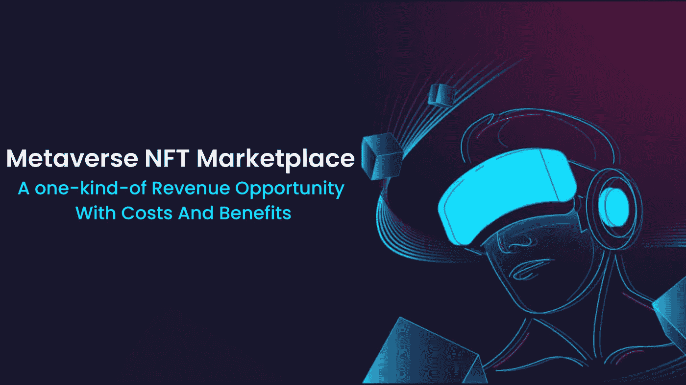

# 元宇宙 NFT 市场——一种有成本和收益的收入机会

> 原文：<https://medium.com/geekculture/metaverse-nft-marketplace-a-one-kind-of-revenue-opportunity-with-costs-and-benefits-38f1d12fff3c?source=collection_archive---------16----------------------->

在这个时代，技术进步正引领我们进入虚拟世界，在那里我们可以探索新的领域，与他人互动，并做各种其他事情，而不必亲自去任何地方旅行。现在，世界上所有的资产都可以以 NFT 或不可替代代币的形式获得。因此，现在推出 NFT 市场是一个明智的决定，因为你的公司还很新，准备利用 NFT 热。

虚拟世界的高科技未来听起来像是科幻小说里的东西，但这是现实。NFT 元宇宙平台试图通过使用由区块链技术支持的虚拟现实来弥合虚拟和现实世界之间的差距。这个博客是发展元宇宙 NFT 市场的一步一步的方法。继续阅读了解更多信息。

# **元宇宙 NFT 市场**

顾名思义，元宇宙 NFT 市场是一个开发和整合 NFT 市场到元宇宙虚拟世界的技术概念。元宇宙是一个并行环境，在其中化身(用户的唯一身份)可以执行真实世界的活动。化身可以在元宇宙内互动、工作、旅行、计划和参加现场活动、玩游戏、从事交易以及从事各种其他活动。然而，元宇宙的贸易是最常见的活动。

为了促进交易，品牌必须建立一个功能丰富的 NFT 市场，并将其与他们的元宇宙项目联系起来，允许大众标记和交易他们的数字资产。元宇宙 NFT 市场建立在区块链生态系统之上，为用户提供分散的体验。NFT 市场的使用正在逐步扩大，这表明 NFT 市场在不久的将来将继续增长。创建一个元宇宙市场，充满其所有独特的功能和创造性的运作模式，将吸引大量的消费者。

# **分析&市场概况**

元宇宙和市场分析的受欢迎程度预计在不久的将来会飙升。据加密巨头称，元宇宙代表着每年 1 万亿美元的收入机会。元宇宙显然是一个数字或虚拟世界，在这个世界中，人们以数字化身的身份进行互动。就像在现实世界中一样，存在着买卖商品的可能性。

元宇宙有巨大的增长潜力。这个市场预计将从 2020 年的 1071 亿美元扩大到 2026 年的 7586 亿美元。鉴于元宇宙 NFT 市场开发的受欢迎程度，大多数企业主都对区块链技术表现出浓厚的兴趣。此外，一些企业巨头，如脸书，Rebook，耐克，微软和其他公司已经开始投资元宇宙 NFT 解决方案。脸书更名是元宇宙进入全球市场的明显证据。

# **为什么元宇宙会在 NFT 发生下一件大事？**

现在你知道了“什么是 NFT 市场”，让我们来谈谈元宇宙发展服务如何吸引人们加入这个革命性的行业。NFT 元宇宙最近变得越来越突出。元宇宙 NFT 市场在寻求扩大经营规模的企业主和企业家中很受欢迎。

元宇宙 NFT 市场平台可以处理所有类型的用户，从市场新人到寻求更多保护的经验丰富的交易者。随着越来越多的人了解它的好处，用例的数量迅速增长，这意味着需求将很快上升。

NFT 的下一件大事是元宇宙，它不受创造者想象力的限制。元宇宙 NFT 交易所的数字交易是通过元宇宙发展服务实现的。这是一个平行宇宙，企业可以在其中创建自己的 NFT 元宇宙市场，并与 NFT 消费者和交易商互动。

# **元宇宙 NFT 市场发展有什么好处？**

元宇宙提供完全由区块链技术支持的公平开放的经济。带着您的产品和服务进入元宇宙 NFT 市场将为您提供一个发展业务、拓展新客户和增加销售额的绝佳机会。让我们来看看元宇宙 NFT 市场发展的一些优势。

*   加密安全性
*   透明度
*   高效的交易体验
*   收入增长洞察
*   更快的资产转移
*   未来证明
*   即时支付
*   平稳不间断的交易

# **今天存在的不同的元宇宙 NFT 市场**

元宇宙的巨大人气已经导致许多企业推出自己的元 NFT 市场，并通过使用游戏化和虚拟游戏概念来吸引用户。让我们看看目前有多少不同的行业在使用元宇宙市场:

*   元宇宙博彩 NFT 市场
*   元宇宙房地产市场
*   元宇宙 NFT 艺术市场
*   元宇宙电子商务市场

# **不容忽视的特性**

元宇宙 NFT 市场的演变包括值得强调的具体因素。因此，在你深入元宇宙世界并开始开发你的元宇宙 NFT 市场之前，有几件事你应该考虑。

*   **去中心化系统:**这是一个真正去中心化的市场，没有第三方控制。
*   **安全:**元宇宙 NFT 市场建立了各种高等级、多层的安全机制来保护它免受黑客和网络攻击者的攻击。
*   **方便的令牌化:**元宇宙市场平台是一个安全、可靠、简单的数字资产管理系统，允许用户快速进行令牌化。
*   互操作性:它将成为下一个全球市场。它将让每个用户都可以无限制地访问全球生态系统中的所有加密货币。
*   **多区块链支持:**元宇宙 NFT 市场平台可以建立在各种区块链网络上。
*   **NFT 钱包:**集成多种第三方钱包，实现用户交易。
*   **体验式学习:**该平台将更具吸引力，为元宇宙市场的消费者提供更好的用户体验。

# **你如何建立元宇宙 NFT 市场？**

在创建元宇宙 NFT 市场时，有许多流程必须考虑在内。随着技术手段的更新，我们的目标是策划最好的，这不仅会推动您的业务，而且会给您带来荣耀。我们有最优秀的技术官僚，他们擅长建设元宇宙 NFT 市场。现在让我们来看看促成元宇宙 NFT 市场创建的关键步骤。

遵循经过精心规划的战略性发展步骤:

*   挑一个区块链网络
*   制作一个易于使用的界面
*   根据用户需求选择可爱的功能
*   开发智能合同
*   设置数据库和 IPFS
*   测试、优化和部署

# **要花多少钱？**

鉴于元宇宙 NFT 市场的受欢迎程度，任何商业爱好者都会投资这个领域是可以理解的。当涉及到管理应用程序时，有许多变量需要考虑。了解元宇宙及其与未来的联系至关重要。在投资之前，你应该意识到它的好处。

了解构建虚拟环境的成本计算，以及其中包含的复杂性，也是至关重要的。您还应该考虑一些技术方面的问题，这些问题会影响您的 [**元宇宙 NFT 市场开发**](https://www.clarisco.com/metaverse-nft-marketplace-development) 的成本计算。

*   选择应用平台
*   开发团队
*   技术堆栈的使用
*   该应用程序的功能和复杂性
*   应用程序的用户界面/UX
*   独特技术的灌输
*   应用维护和支持

以上是开发 [**元宇宙 NFT 市场**](https://www.clarisco.com/metaverse-nft-marketplace-development) 时需要考虑的一些技术特性。此外，目前的密码市场有许多高科技质量的专家来创造数字空间。在尖端技术的影响下，我确信发达的元宇宙 NFT 市场将统治数字世界。但是，要精确估算成本，请联系各自的技术专家并加快业务发展。

**结论**

元宇宙和 NFTs 相辅相成，从而增加公司的增长前景。因此，现在是企业投资这种未来技术并创建高端 NFT 市场和 metaverses 的时候了。它使公司能够为其用户提供更好的体验，在 3D 沉浸式现实世界中探索所提供的产品和服务。