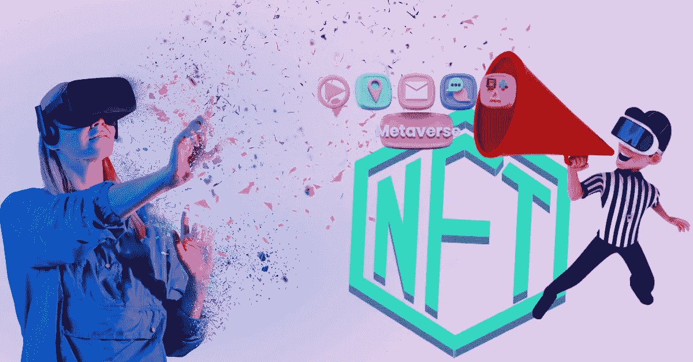
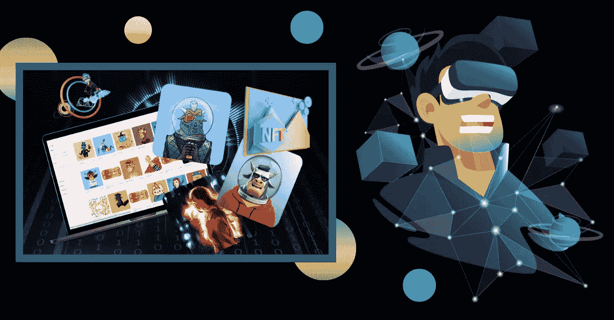

# 元宇宙 NFT 市场——一个赚取财富的有用的投资选择！

> 原文：<https://medium.com/geekculture/metaverse-nft-marketplace-a-useful-venture-option-to-earn-riches-3a9751963bc7?source=collection_archive---------14----------------------->

Metaverse NFT Marketplace

> Web3 的出现只向我们传达了一个观点:它将永远存在并改变生活。虽然 Web3 的整体影响得到了很好的评估，但研究更擅长预测未来，因为每份报告都显示出未来十年惊人的增长率。元宇宙 NFT 市场是最近流行的商业模式之一。这种模式的本质意味着它将在元宇宙生态系统中无处不在，风险投资者可以通过创新来利用它。此时此刻，更重要的是关注元宇宙 NFT 市场的发展。

# 元宇宙 NFT 市场:令人大开眼界

元宇宙 NFT 市场解决方案是一种用户可以身临其境地购买 NFT 产品的解决方案。要做到这一点，他们将需要使用数字化身来代表他们在虚拟环境中。这些平台可以存在于一个独立的元宇宙中，也可以存在于现有的元宇宙应用程序(如分散土地、沙盒和其他)中。这种元宇宙 NFT 市场的性质使用户能够虚拟地试穿或使用商品，以找到它们是否适合自己。这些平台甚至可以成为现实世界电子商务企业的附加产品，为用户提供更好的服务和前所未有的体验。

## 元宇宙 NFT 市场解决方案中的基本要素

Metaverse NFT Marketplace Solution

✰元宇宙 NFT 市场开发解决方案中的**店面**提供了查看产品和相关信息的功能，包括价格。

元宇宙 NFT 市场平台[中的✰ **3D 环绕**允许用户使用他们的 VR 头戴设备有虚拟沉浸的感觉。](https://www.blockchainappfactory.com/metaverse-nft-marketplace-development?utm_source=geekculture&utm_medium=10-30-2022&utm_campaign=Pavun)

此类平台中的✰ **令牌化条款**允许创建者/销售者根据偏好和要使用的区块链，使用不同的令牌标准来创建他们的 NFT。

✰ **懒人造币**使卖家能够在元宇宙 NFT 市场上列出他们的 NFT，而无需花费汽油费用，因为买家会在购买时铸造它们。

✰ **MFA 登录**使平台免受黑客攻击，因为用户将被要求进行多因素验证才能登录应用程序。

✰ **平台中的 P2P 交易**将允许使用智能合同驱动协议的相关方之间直接进行 NFT 销售，消除对中介的需求。

✰独家打造的 **NFT 钱包**方便持有和交易在元宇宙 NFT 市场平台购买的 NFT 物品。

智能合同条件驱动的✰ **支付网关**在 P2P 销售过程中实现了 NFT 资产的快速顺畅交易。

✰ **分散自治组织(Dao)**允许平台社区成员参与决策过程，并对运营做出改变。

✰ **元宇宙 NFT 市场中的 NFT 赌注**使用户能够通过锁定他们的 NFT 项目来获得加密奖励，以保持流动性。

✰ **元宇宙 NFT 市场开发解决方案的跨链互操作性**对于吸引更广泛的受众至关重要。

## 使用元宇宙 NFT 市场的不同商业可能性

**元宇宙 NFT 博彩市场**协助交易在“玩到赚”(P2E)和“移动到赚”(M2E)游戏中使用的游戏内 NFT 资产。这种市场在魅力和功能方面将与这些游戏不相上下，为游戏玩家提供有趣的体验。

**元宇宙 NFT 房地产市场**允许在现有的元宇宙应用程序中交易虚拟地块。这些平台需要尽可能地身临其境，使用户能够在没有第三方参与的情况下以数字方式游览地块和进行交易。

元宇宙 NFT 电子商务市场可以使用 VR/AR 功能提供增强的体验，因为用户可以在购买 cryptos 之前虚拟试穿或使用 NFT 产品。这种平台可以是现实世界和虚拟世界之间的联系，通过运营计划发送购买的 NFT 的物理版本(例如服装)。

元宇宙 NFT 艺术市场可以用来以画廊的形式展示新的有才华的数字艺术家，P2P 销售消除了服务商，导游为观众提供了新奇的体验。

## 最后的话

因此，我们可以说，对于一个努力为新时代的世界服务的人来说，元宇宙 NFT 市场平台是一个理想的创业选择，这个世界已经开始进行端到端的技术创新。如果你想创建新的元宇宙 NFT 市场，这可能是开始的最佳时机，一家专业的[元宇宙 NFT 市场发展](https://www.blockchainappfactory.com/metaverse-nft-marketplace-development?utm_source=geekculture&utm_medium=10-30-2022&utm_campaign=Pavun)公司可以提供帮助。这样的公司在该领域的技术能力和经验可以在开发过程中变得很方便，以确保建立一个功能性的、平稳的和安全的市场。