# 分类混淆矩阵的度量

> 原文：<https://medium.com/geekculture/metrics-for-classification-confusion-matrix-43ee441d2947?source=collection_archive---------21----------------------->

为了评估你的分类模型，你应该知道混淆矩阵。

unsplash.com

*真阳性，假阳性，真阴性，假阴性*？厌倦了一遍又一遍地寻找它们却仍然不记得？大多数初学者都没有遇到这个问题，但是一旦你对其背后的直觉有了更好的理解，你就会对这些术语感到舒服了。

让我们从混淆矩阵开始，它是基础。对混淆矩阵的理解越好，对所有度量的理解就越容易。**混乱矩阵**究竟是什么？

**混乱矩阵**

顾名思义，它让:D 人感到困惑(这是个笑话),我会尽量使它简单，而不是写下最初的定义

> 混淆矩阵基本上是评估你的分类 ML 模型的度量。这是一个正方形矩阵，它的维数完全取决于类的数量。

假设你将动物分为**猫和**狗。在这种情况下，维度将是 2，如果您将类别增加到**猫对狗对猴子**，那么维度将增加到 3。随着目标变量中类别数量的增加，维数也会相应增加。

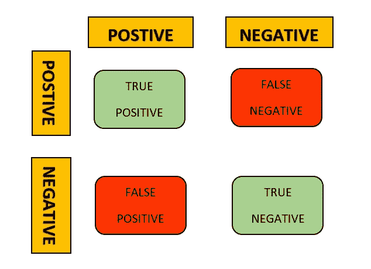

CONFUSION MATRIX

那么*到底是什么真阳性、假阳性、真阴性、假阴性呢？*让我们通过**猫** vs **狗**的例子来理解

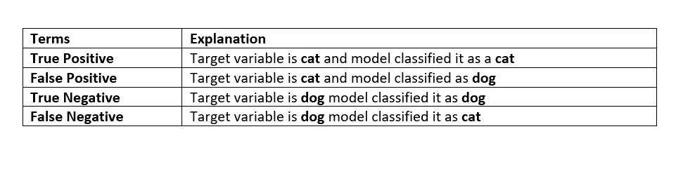

因此，当类别为**正**且模型将其归类为**正**时，为真正；当类别为**负**且模型将其归类为**负时，为真负。**同样，被模型归类为**阴性**的**阳性**类为**假阳性**，被模型归类为**阳性**的**阴性**类为**假阴性。我希望你现在已经理解了这些术语。如果仍然没有经历一遍，因为它的基础。**

在 Python 中，这就是你创建混淆矩阵的方式。

Confusion Matrix implementation in Python

准确(性)

正确分类的等级比率。

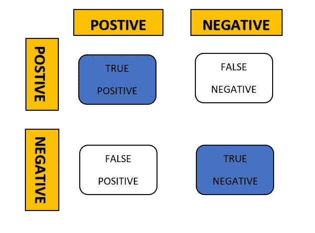

精确度的公式是

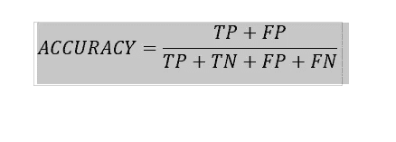

ACCURACY FORMULA

通过使用 Scikit-Learn，您可以像这样计算模型的精确度:

Accuracy implementation in Python

但这里的问题是评估模型的准确性更好的度量。是的，直到你有完全平衡的职业，但是在不平衡的职业中使用准确度分数不是好的选择，这会导致被称为**高准确度悖论的问题。**

**高精度悖论？**

> 在处理不平衡类时，准确性会产生误导。

这次考虑医疗场景，假设 100 个病人中有 5 个患病，95 个没有。模型预测如下

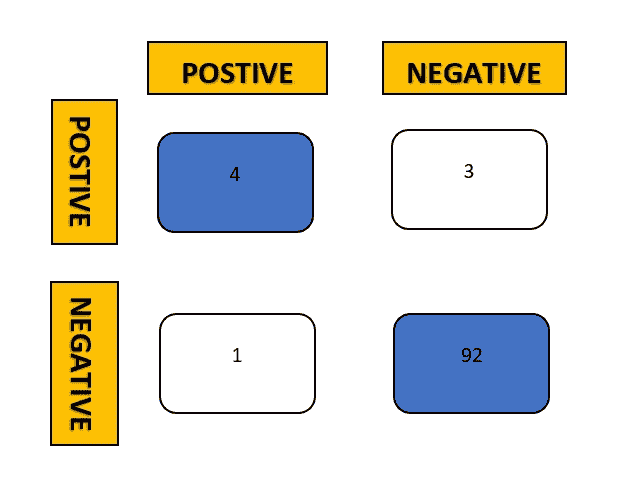

那么在这种情况下，准确度是多少，准确度=96%，准确度在这里引起麻烦。不要在不平衡的情况下使用它。

**精度**

精确度是预测积极结果的准确性。

它完全忽略了混淆矩阵中的否定(真否定，假否定)部分。

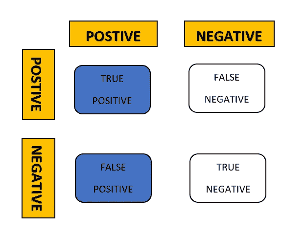

计算精度公式为:

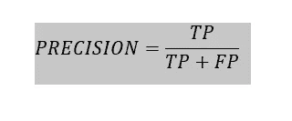

Precision formula

精度值接近 0 表示性能较差的模型，接近 1 表示性能较好的模型。

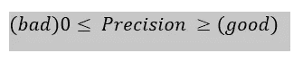

精度的 Python 实现

Precision implementation in Python

接近 0 精度值被认为是差模型，而接近 1 的精度值表示模型更好。

**回忆**

那是她说的**😅**让我们试着理解**回忆的东西**实际上被正确地识别为真阳性。它也被称为**灵敏度。**

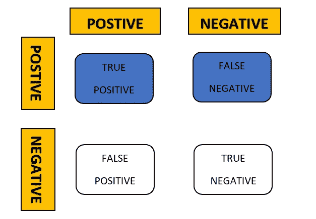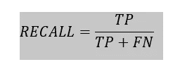

Mathematical Formula

使用 Scikit-Learn，您可以找到回忆:

Recall implementation in Python

高召回率代表性能良好模型，低召回率代表性能较差的模型。

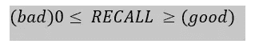

**F1-得分**

这只是精确度和召回率的调和平均值。

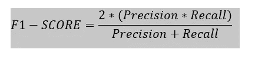

F1-SCORE

当我们具有高精度和召回率时，我们将具有较高的 F1 分数，并且当它们中的一个或两个较低时，F1 分数将较低。

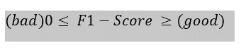

**结论**

这些是有助于评估 ML 分类模型的少数指标，除此之外，还有一些这里没有提到的其他指标。

我们已经讨论了什么是真正的混淆矩阵，以及我们如何利用混淆矩阵来获得一些其他指标，如准确度分数、精确度、召回率和 F1 分数。