# 微观流动性:一个新的开始还是一个死胡同？

> 原文：<https://medium.com/geekculture/micro-mobility-a-new-beginning-or-a-dead-end-bc3b08bba1d4?source=collection_archive---------1----------------------->

最近在 Vice 上看到这篇关于“跳跃”的新闻，以及被优步收购如何导致成千上万的跳跃自行车被摧毁。
—[https://www . vice . com/en _ us/article/5dz94x/Uber-acquisition-jump-bike share-destroyed-千千万万辆自行车](https://www.vice.com/en_us/article/5dz94x/uber-acquisition-jump-bikeshare-destroyed-thousands-of-bikes)

这立刻引起了共鸣，我意识到一年前我也做过类似的关于微观流动性的研究。我联系了我的伙伴[奥尔特](https://medium.com/u/6eaa1fc5e0f4?source=post_page-----bc3b08bba1d4--------------------------------)——gaur av Chauhan，他在这个领域非常活跃，我们就这个问题进行了进一步的讨论。

这促使我们进一步挖掘并提取一些关于微移动性的关键工件，以及它在未来的应用。

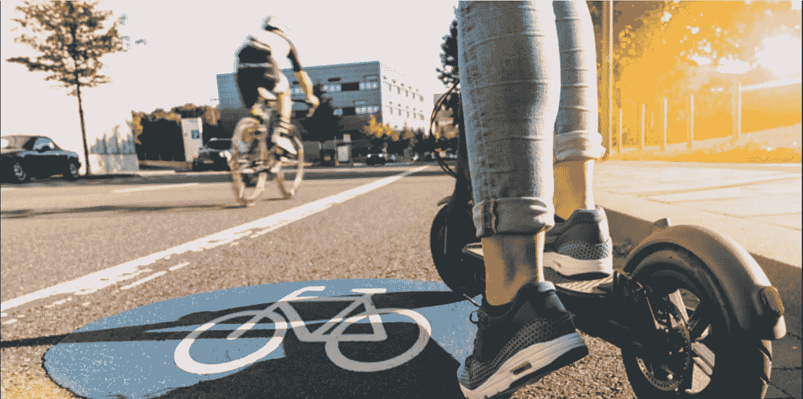

Source: [https://www.intelligenttransport.com/](https://www.intelligenttransport.com/)

# Bird 是有史以来估值达到 10 亿美元最快的初创公司

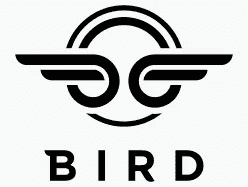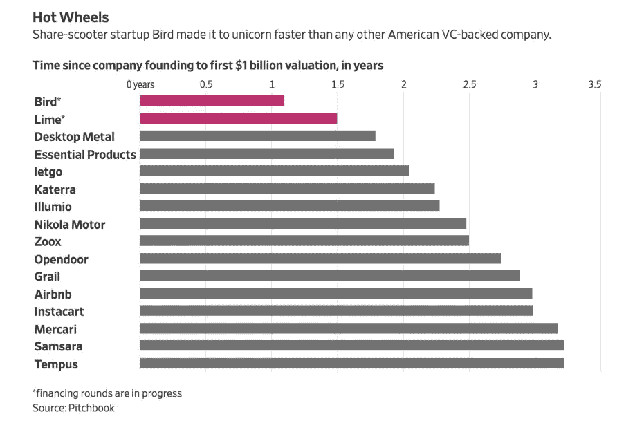

# 一篇文章的摘录—2018 年 6 月 15 日

“电动滑板车初创公司 Bird 是最快达到 10 亿美元估值的公司。

Bird 是目前席卷美国的许多滑板车初创公司之一，在 3 月初完成 1 亿美元的 B 轮融资后，最近一次估值为 4 亿美元。5 月下旬，据报道，Bird 在由红杉资本(Sequoia Capital)牵头的 C 轮融资中筹集了 1.5 亿美元，估值为 10 亿美元。

熟悉该交易的人士告诉 Quartz，该轮投资中至少有三家投资者——红杉、Accel 和 Tusk Ventures——已经签署了文件，并将资金汇给了 Bird。"

来源:[https://qz . com/1305719/electric-scooter-company-bird-is-the-fast-startup-ever-to-be-a-unicorn/#:~:text = Founded % 20in % 20 September % 2017% 2C % 20 bird，作者% 20VC % 20 research % 20 firm % 20 pitch book。](https://qz.com/1305719/electric-scooter-company-bird-is-the-fastest-startup-ever-to-become-a-unicorn/#:~:text=Founded%20in%20September%202017%2C%20Bird,by%20VC%20research%20firm%20Pitchbook.)

# 切到 2020 年(新冠肺炎——颠覆者)

微移动服务似乎已经奄奄一息。对于大多数公司来说，这个数字已经下降到一位数。这场危机加剧了从一开始就隐藏的问题。

*危机不仅导致交通流量和踏板车部署量大幅下降，而且从长远来看，预计还会改变客户行为。最大的问题是，这些公司能挺过危机吗？现在的趋势会转向拥有车辆而不共享吗？这些公司需要寻找其他收入来源吗？*

*covid 19 危机期间游乐设施使用率的下降*

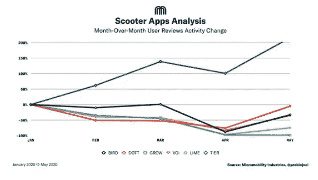

Tier(一款德国滑板车应用)正在呈指数级增长，但那些庞然大物呢？这也可以归因于德国的病例数量没有增加。

来源:[https://www . business insider . com/tier-german-scooter-startup-raises-2300 万-during-冠状病毒-2020-6？IR=T](https://www.businessinsider.com/tier-german-scooter-startup-raises-23-million-during-coronavirus-2020-6?IR=T)

【https://www.tier.app/ 

尽管我们应该看看应用程序的未来会是什么样子。

> 在我们开始回答这些问题之前，我们需要更好地理解微动力概念及其价值链。让我们更深入地研究微移动性，并理解——“嗡嗡声是什么？”以及其他一些方面。

> *1。微移动性——什么是嗡嗡声？*
> 
> *2。市场格局*
> 
> *3。硬件与软件—平台引领潮流*
> 
> *4。业务场景*
> 
> *5。*业务设置(入门费用)
> 
> 6..可持续性问题——电动滑板车的单位经济性
> 
> *7。挑战——前进的道路…*
> 
> 8..原始设备制造商有什么好处？威胁还是机遇
> 
> 9。结论

# 1.热门话题是什么:什么是微移动性，为什么会如此迅猛地增长？

微移动服务为解决第一英里/最后一英里问题和缩小运输沙漠提供了一个诱人的解决方案。例如，中国的无码头自行车共享系统摩拜单车(Mobike)声称，通过瞄准距离北京公共交通 500 米以上的地区，并部署他们的车队来填补这些空白，就业、教育和医疗保健的可及性提高了近一倍

微移动的其他优势包括

→增加使用公共交通的机会

→减少路上的汽车数量

→降低环境足迹

→短途旅行的便捷交通方式

→被证明对消费者来说具有成本效益

来源:[https://www . CB insights . com/research/report/micro mobility-revolution/](https://www.cbinsights.com/research/report/micromobility-revolution/)
[https://www2 . Deloitte . com/us/en/insights/focus/future-of-mobility/micro-mobility-is-the-future-of-urban-transportation . html](https://www2.deloitte.com/us/en/insights/focus/future-of-mobility/micro-mobility-is-the-future-of-urban-transportation.html)

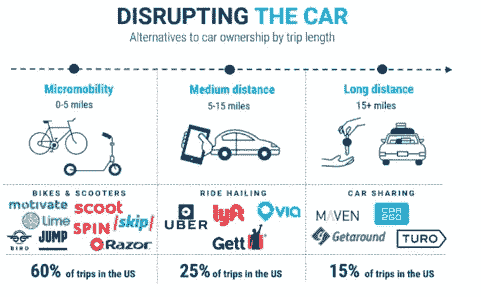

***微移动的主要优势:-***

> *1。增加使用公共交通工具的机会*
> 
> *2。减少路上的汽车数量*
> 
> *3。降低环境足迹*
> 
> *4。为短途旅行提供便捷的交通方式*
> 
> *5。已被证明是消费者经济高效的选择*

# 2.市场格局

2030 年，共享微移动市场可能达到**3000 亿到 5000 亿美元。**从长远来看，这相当于 2030 年全球共享自动驾驶市场潜力约 1.6 万亿美元的四分之一

基于车站的自行车份额为 3650 万次，比 2017 年增加了 9%

# 3.微移动中的平台商业模式

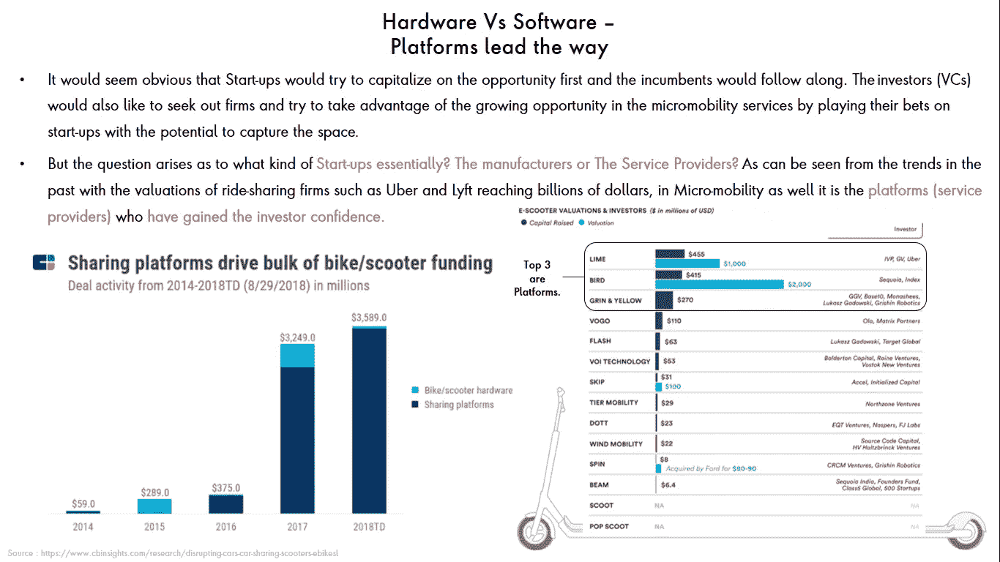

# 4.微移动的业务场景——主要参与者和活动

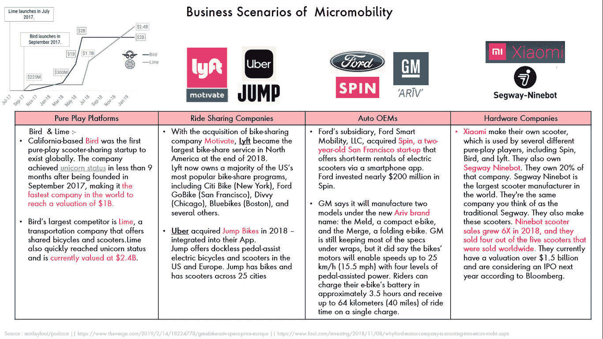

# 5.微型移动业务的业务建立(进入成本)

# 6.可持续性问题——电动滑板车的单位经济性

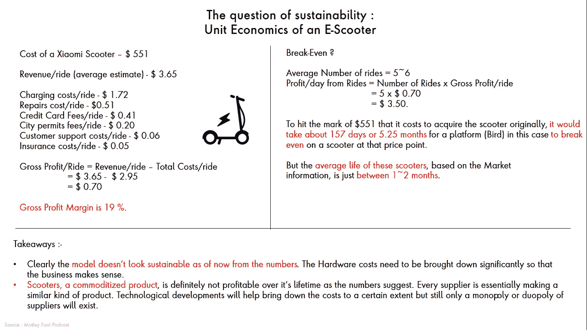

**规定:-**

如果支持性的生态系统仍然存在，这看起来是可能的。但随着接受度的上升，监管的呼声也越来越高，政策制定者开始注意到这一点。

# 7.挑战和前进的道路…

> **1。城市基础设施:微观交通本质上是一个生态系统游戏。-**

缺乏适当的基础设施，如足够的自行车道，共享自行车和滑板车的采用对公众来说变得困难甚至危险。*这是微观流动性在非洲国家以及印度尚未启动的原因之一。*

在印度，初创公司正在与政府和原始设备制造商合作，通过采用 B2G2C 和 B2B2C 模式作为大型服务(如地铁)的馈线来帮助系统，从而利用这一差距。

> 2.**盈利能力:其他大象中最大的大象。**

虽然许多微型移动公司通过投资者获得了数百万美元，但他们的努力是为了实现可持续的盈利。

据报道，截至 2018 年 10 月，波导的毛利率仅为 19%左右。为了提高利润率，波导一直在改变其定价结构，甚至在一些城市将每分钟费用提高了一倍。

*虽然印度初创企业也吸引了大量投资，但它们面临着类似的挑战。目前的重点是降低烧钱率(公司赔钱的速度)。对于印度领先的微型移动公司 eg Bounce 来说，2019 年收入增长了 2 倍，支出增长了约 6 倍，亏损增长了约 9 倍*

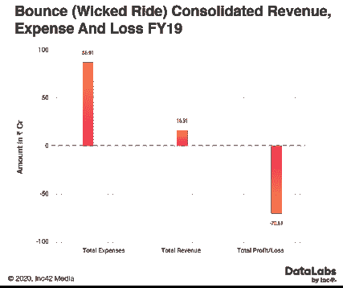

降低车辆(小型摩托车)的成本是提高盈利能力的主要举措之一。尤鲁与 Bajaj 的合作有望降低小型摩托车 30%的成本。

[https://Inc 42 . com/features/what-the-financials-bounce-tumbles-on-loss-as-it-revs-up-growth/](https://inc42.com/features/what-the-financials-bounce-stumbles-on-losses-as-it-revs-up-growth/)

> 3.**监管:**

由于无码头自行车和踏板车仍然是一个非常新颖的概念，大多数城市都没有适当的法规来管理这些项目，使得政府急于想出如何处理突然出现在城市周围的自行车和踏板车车队。例如，在印度，对低速电动滑板车的限制很少(<25 公里/小时)。这使得客户更容易加入，因为它减少了文件验证步骤

电动滑板车和传统滑板车在上车步骤上的区别

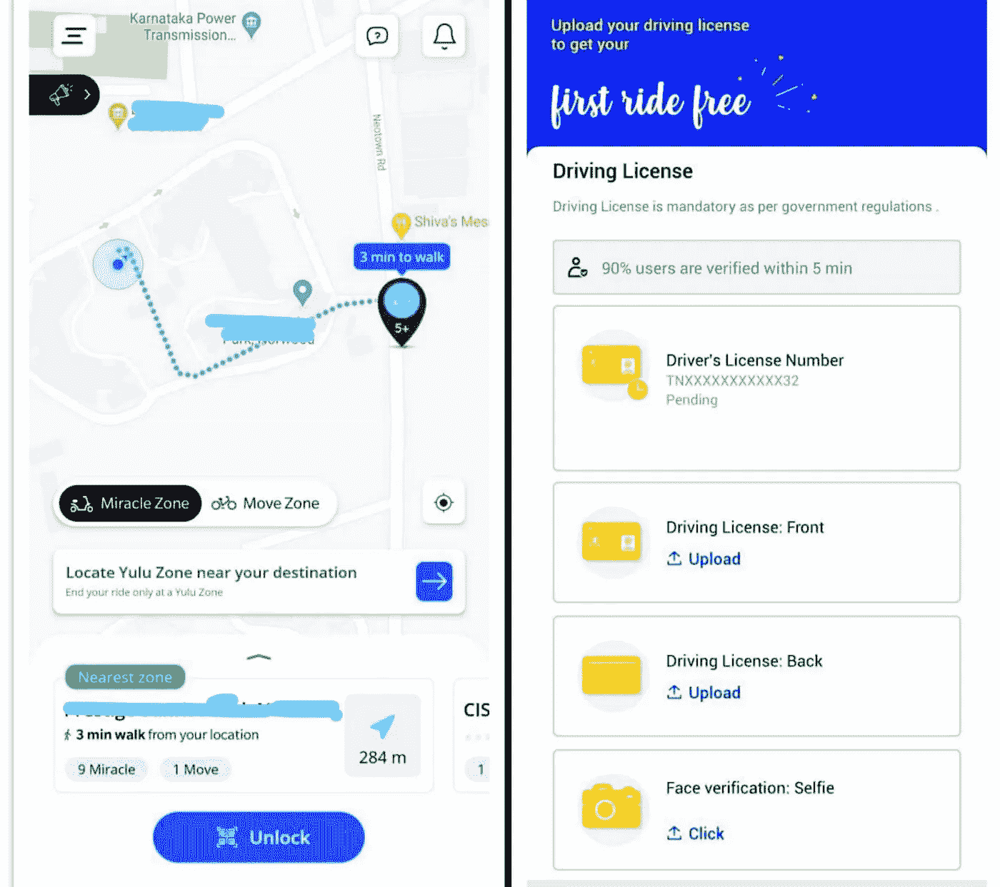

> 4.**硬件健康:**

微移动创业公司之间的激烈竞争导致数百万辆无码头自行车涌入街道。

当自行车坏了，公司往往没有足够的人力及时修理，导致沮丧的用户不得不测试几辆自行车，然后才能找到一辆正常工作的自行车。这增加了事故发生的几率，并影响了用户体验。

> **5** 。**通勤者的疏忽**

对这些公司来说，装载废弃车辆的车辆是常见的景象。这不仅是公司的额外成本，也是行人的烦恼。

在印度，上述问题目前仅将无码头系统限制在几个城市。对不适当停放的车辆的额外收取，对行人和交通警察都是一种麻烦，增加了费用。固定拾取点是减少这种行为的措施之一。

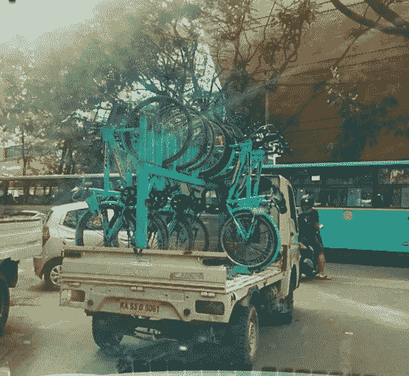

值班的小货车

> **6。天气:**

对于气候更恶劣的城市，如北欧城市，采用共享自行车和滑板车并不可行。在雨雪天气，情况变得危险，事故激增。此外，当天气太冷而无法使用未封闭的车辆时，需求就会减少

# 8.原始设备制造商的问题

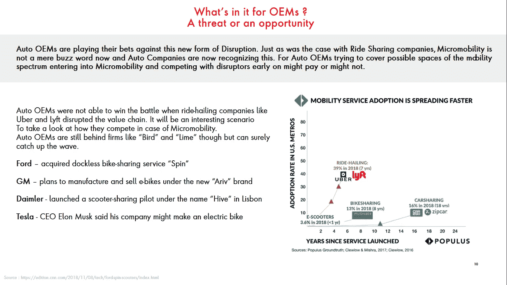

# 9.结论

> **微型移动创业公司仍然没有赚到钱**

*截至 2019 年 7 月 11 日——波导亏损近 1 亿美元，收入大幅缩水至仅约 1500 万美元。今年春天，它告诉《人物》杂志，尽管在一年半的时间里筹集了超过 7 亿美元，但它的现金已经减少到大约 1 亿美元。*

*正如优步和 Lyft 的情况一样，我们可以看到，即使是新的电动自行车平台也在烧钱，而且看起来它们不会很快盈利。*

*正如在* ***单位经济学研究*** *中所讨论的，电动自行车的制造成本超过了回报，这也体现在电动自行车公司的财务表现中。*

> 投资者正在说到做到地投资

从本质上讲，微型移动创业公司是靠融资过程中筹集的现金来运营的。投资人(红杉资本、贝恩资本风投、富达创投、铰链资本等 VC 基金。)一定要了解市场潜力，多关注现金流而不是利润。华尔街的趋势是，甚至连一分钱利润都没有赚到的公司也可以进行 IPO。

*因此，否定这种颠覆者的成功还为时过早，相反，汽车原始设备制造商有必要采取行动，应对这些破坏价值链的发展。*

> **后 COVID 时代——危机使公司收入下降至个位数，并增加了额外成本(4 %- 5 %),用于提高安全性，如定期消毒、座椅套等。还有绿芽**

社交距离时代有望增加用户数量。此外，现有用户为了避免共享他们的车辆，可能会将车辆用于更长的距离。这反映在公司推出长期租赁计划。

这些公司正利用这场危机使业务多样化。物流服务在收入中的份额以前约为 10 %,预计将增长到 25%。

https://economic times . India times . com/small-biz/startups/news buzz/shared-mobility-companies-take-a-u-turn-to-stay-on-the-road/articleshow/75543475 . CMS

# **看看这些颠覆者是继续推动增长还是在这个过程中自我破坏，将会很有趣。**

你可以联系我:

[https://www.linkedin.com/in/shubhamtripathi-iimb/](https://www.linkedin.com/in/shubhamtripathi-iimb/)或
shubham5strings@yahoo.in

请在下面写下你的意见，如果有任何反馈，请通过 LinkedIn 联系我。让我们一起增长知识。