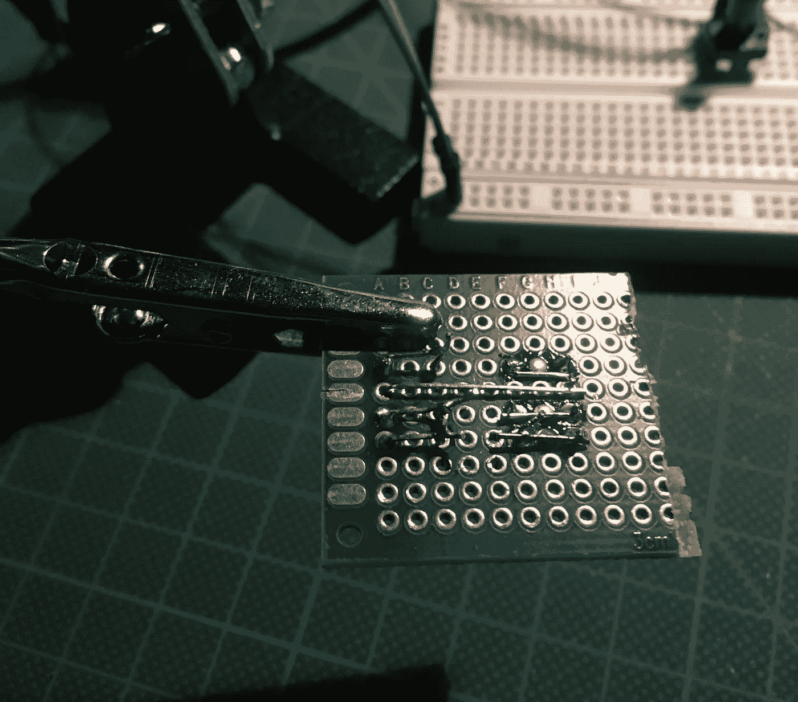
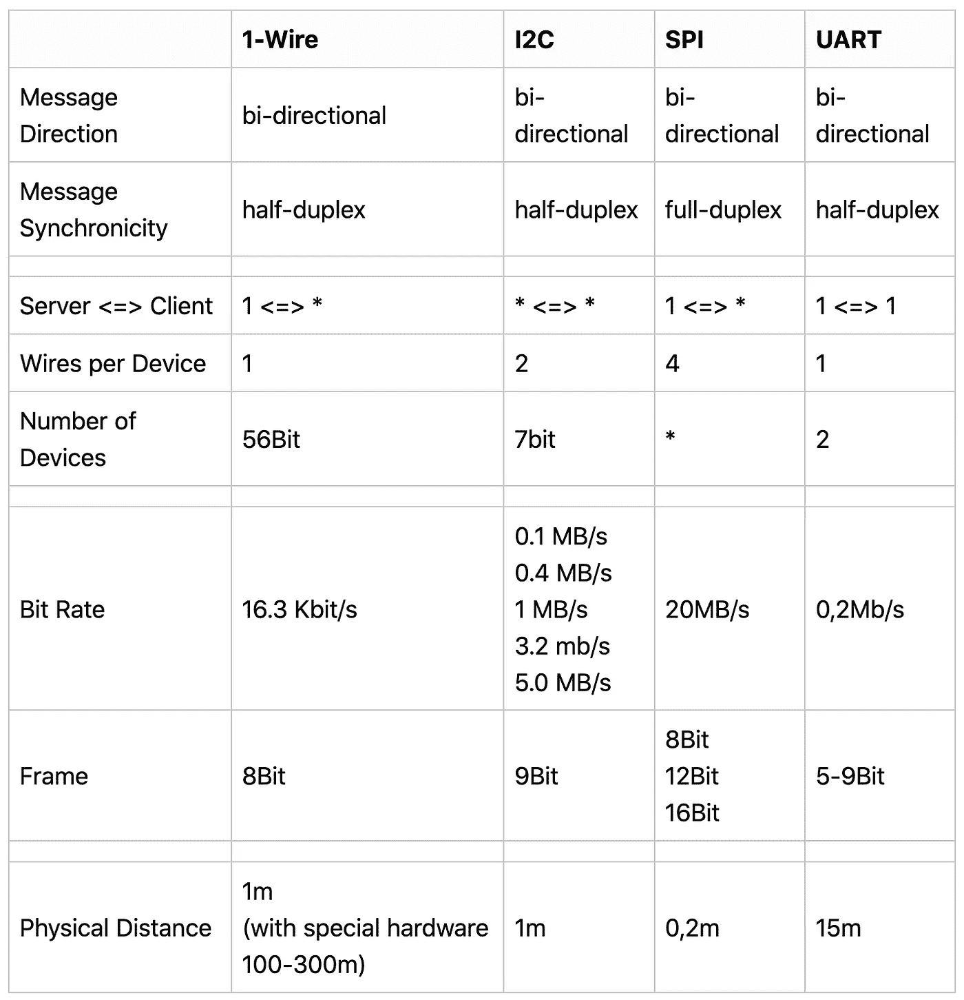

# 微控制器连接协议:W1、I2C、SPI、UART

> 原文：<https://medium.com/geekculture/microcontroller-connection-protocols-w1-i2c-spi-uart-7625ad013e60?source=collection_archive---------1----------------------->

像 Arduino 这样的微控制器是包括机器人在内的 DIY 项目的重要组成部分。在上一篇文章中，我们看到了 Arduino Uno、Raspberry Pi 和 Raspberry Pico 的引脚布局和 GPIO 功能。GPIO 引脚既可以读取或写入数字数据，即连续的高电压或低电压，也可以处理模拟数据，即在压缩时间帧内在高电压和低电压之间交替变化的 PWM 信号。我们还看到，这些微控制器和单板计算机支持不同的 GPIO 功能，包括与其他硬件进行数据通信的协议。

本文对所有这些连接协议进行了概述。为了明确起见，我将介绍需要设备直接连线的协议，因此不包括无线电、蓝牙和 WLAN 之类的协议。对于每个协议，我将解释基本的工作原理，详细说明如何设置和连接设备，并讨论数据传输范围和数据量等方面。我将使用客户机-服务器的通用术语[来区分参与节点的角色。](https://en.wikipedia.org/wiki/Master%2Fslave_(technology))

在第一部分，我们将了解串行通信的基本知识。接下来的几节将详细介绍以下每个协议:

*   W1(单线)
*   I2C (2 线)
*   SPI (4 线)
*   UART/RS232

*本文原载于* [*我的博客*](https://admantium.com/blog/micro05_wired_connection_protocols/) 。

# 串行通信

*来源:*[*wikipedia.org*](https://en.wikipedia.org/wiki/Serial_communication)

串行通信形成了许多集成电路设备的基本数据传输方法。本质上，数据是以一种方式从发送者传输到接收者的，一次一位。为了防止传输错误，传输的数据可以包括错误校验码，通常为 [CRC](https://en.wikipedia.org/wiki/Cyclic_redundancy_check) 。为了确保传输成功，接收器可以发送确认信息。

在具有多个连接(管线、电线、电缆等)的成本较高的情况下，串行通信优于并行通信。)由于距离或制造成本太高。直到今天，串行通信还被广泛用于连接不同类型的硬件，形成了非常不同的协议的基础。

# 单线

*来源:*[*【wikipedia.org】*](https://en.wikipedia.org/wiki/1-Wire#cite_note-1)*|*[*【maximnintegrated.com】*](https://www.maximintegrated.com/en/design/technical-documents/app-notes/7/74.html)

使用 1-Wire 协议，仅使用一条数据传输/电源线 [1](https://dev.to/admantium/microcontroller-connection-protocols-w1-i2c-spi-uart-57kl-temp-slug-3191988?preview=795a605a3f2955072ef67ddee563a592769a70e54b098edf6f8531a4646df2a2db271e3135eb9400ee25b3054746063fff3349b48d61e583a5572a6c#fn1) 就可以在服务器和多个客户端之间建立一对多连接。该连接是半双工、双向的，传输速度为 16.3Khz。

通常，开漏 [MOSFET](https://en.wikipedia.org/wiki/Open_collector#MOSFET) 用于连接器件。通过使用上拉电阻，服务器和客户端之间的连接处于高电压状态。为了传输数据，上拉电阻连接到地，然后在服务器和客户端之间建立低压连接用于数据传输。高电压状态用于给电容器充电，该电容器向连接的客户端供电。

消息为 8 位 [MSB](https://en.wikipedia.org/wiki/Bit_numbering#Most_significant_bit) 。一个典型的事务工作如下:

*   服务器发送一个复位脉冲
*   客户端发送确认消息
*   服务器发送一个 8 位命令
*   服务器和客户端交换 8 位数据组
*   为了防止传输错误，可以使用 8 位[CRC](https://en.wikipedia.org/wiki/Cyclic_redundancy_check)

# I2C

*来源:【wikipedia.org】*

*集成电路间 I2C 是一种双线协议，支持客户端和服务器之间的多对多连接:两条线是串行数据(SDA)和串行时钟(SCL)。该连接是半双工、双向的，具有 0.1、0.4、1.0、3.4 或 5.0 MBit 的固定、可配置传输速度。*

*SDA 和 SCL 线始终保持在高电压级，其中 SDA 线使用上拉电阻。当服务器开始传输时，它会关闭 MOSFET 栅极，将 SDA 线拉低至低电平状态。然后，通过向 SDA 线和 SCL 线施加不同的电压，传输信息。SDA 线路上的低电压也意味着一个主节点正在通信，使其它节点保持安静。SCL 线上的低电压对客户意味着相同的信息。*

*I2C 总线上的所有设备都有 7 位地址。为了寻址设备和接收配置，需要使用 2 位。因此，I2C 的所有消息都是 9 位 MSB。典型的交易是:*

*   *服务器发送一个 7 位地址和一个读/写位*
*   *被寻址的客户端用一个位进行确认(从而完成 9 位消息格式)*
*   *根据消息，服务器或者向客户端发送写入数据，以区分寄存器/缓冲区和要写入的数据，或者期望客户端将其数据写入服务器从中读取的指定寄存器/缓冲区*
*   *当 SDA 和 SCL 再次处于高电平状态时，传输结束*

*I2C 系统有一组复杂的寄存器，用于捕获系统的全局状态，并协调不同设备如何交互。寄存器地址及其数据因供应商和器件而异。*

# *精力*

**来源:*[*【wikipedia.org】*](https://en.wikipedia.org/wiki/Serial_Peripheral_Interface)*|*[*【byteparadigm.com】*](https://www.byteparadigm.com/applications/introduction-to-i2c-and-spi-protocols/?/article/AA-00255/22/Introduction-to-SPI-and-IC-protocols.html)*

*SPI(串行外设接口)是一种多对一的连接协议，可将多个客户端连接到一台服务器。它需要 4 根线:SCL 用于时钟，SCS 用于选择客户端，SDTS 用于服务器的数据传输，SDTC 用于客户端的数据传输。该连接是全双工、双向的，并且对传输速度没有限制(可以达到 10MB 或更高)。*

*位帧是可配置的，通常为 8 位，但也可使用 12 位或 16 位。数据以 LSB 发送。*

*在基极状态，SCS 为高(使用上拉电阻)，SCL、SDTS 和 SDTC 为低。当服务器启动通信时，它使用 MOSFET 栅极将 SCS 拉低，并通过 SCL 发送数据。然后，服务器使用 SDTS，选定的客户端使用 SDTC 进行全双工通信。*

*典型的通信如下:*

*   *服务器确定连接到客户端的时钟速度*
*   *服务器将 SCS 设置为低电压，并通过 SDTS 发送数据*
*   *被寻址的客户端在 SDTC 线路上以选定的时钟速度响应*
*   *服务器和客户端交换数据*
*   *服务器将 SCS 设置为高电压，将 SCL 设置为低电压*

*SPI 要求每个连接的客户端都有一根专用的 SDTC 线，这对集成电路设计有很大影响。因此，[菊花链](https://www.maximintegrated.com/en/design/technical-documents/app-notes/3/3947.html)可用于设计一个只有 SDTC 线的电路，并对数据传输协议进行额外的修改。有趣的是，SPI 协议没有固定的标准，但有几个供应商特定的实现遵循相同的准则。*

# *UART 和 RS-232*

**来源:UART*[*wikipedia.org*](https://en.wikipedia.org/wiki/Universal_asynchronous_receiver-transmitter)*| RS-232*[*wikipedia.org*](https://en.wikipedia.org/wiki/RS-232)*

*这两种协议管理两个设备之间的直接一对一连接。具体来说，RS-232 定义了物理传输特性:电信号、它们的时序和含义，以及硬件引脚和连接器的物理尺寸。一个最小的 RS-232 连接只需要两根线就可以实现:TXD 用于传输数据，RXC 用于接收数据。在这个身体标准之上。UART 定义了逻辑消息，这是非常可配置的:单工、半双工或全双工，具有至少 115，2 KBit 的可变通信速度。*

*在基准州，TXD 和 RXD 线都很高。发送方将 TXD 切换到高电平，并立即开始传输数据，而接收方使用 RXD 来确认数据。发送者和接收者也使用这些线路来同步他们的时钟*

*传输数据为 7–11 位 LSB，包括起始位和停止位。*

*典型的消息交换如下:*

*   *发送方发送起始位、5 位或 9 位消息和停止位*
*   *接收者在他的移位寄存器中缓冲输入的信息*
*   *当不再接收到数据时——例如，一个完整的时钟周期处于逻辑低状态——来自移位发送器的数据被刷新到集成电路的其他部分*

*UART 标准的历史意义很有趣。虽然 RS-232-COM 端口的早期物理表现形式几乎从今天的终端消费者计算机中消失，但该标准在许多微控制器中被模仿，以允许 usb 上的串行连接。*

# *比较*

*下表总结了每种协议的特征:*

**

*注意:SPI 系统的特性取决于整体设置:微处理器的时钟速度、电阻总数等。*

# *结论*

*在微控制器和传感器之间形成有线连接以交换数据是您在项目中会遇到的一项任务。本文解释了单线、I2C、SPI 和 UART/RS232 连接协议的基础知识。我们解释了消息同步性、比特率和帧结构等方面，以及物理方面，如有多少客户端可以连接以及所有线路的总距离有多长。您将在项目中使用哪种协议？*

# *脚注*

1.  *集成电路中的所有器件都需要接地，所以从技术上来说，需要两根导线。 [↩](https://dev.to/admantium/microcontroller-connection-protocols-w1-i2c-spi-uart-57kl-temp-slug-3191988?preview=795a605a3f2955072ef67ddee563a592769a70e54b098edf6f8531a4646df2a2db271e3135eb9400ee25b3054746063fff3349b48d61e583a5572a6c#fnref1)*