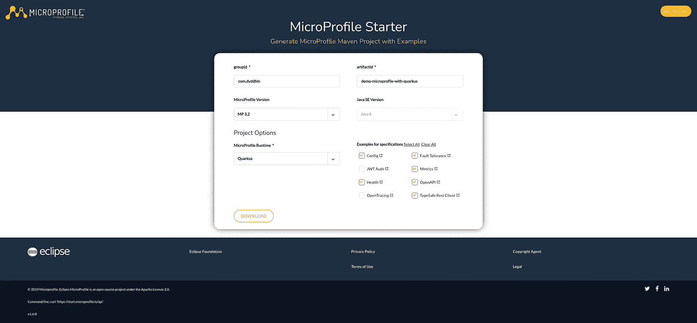

# 微轮廓及其生态系统

> 原文：<https://medium.com/geekculture/microprofile-and-its-eco-system-731dad36eb48?source=collection_archive---------39----------------------->


**MicroProfile** 4.1 版本即将发布，很快就可以使用了。有人可能会问，这到底意味着什么，以及**微文件**到底是关于什么的？在几个供应商之间共同努力提供统一一致的 **API 规范**有什么坏处？在本指南中，我将展示几个例子，说明如何在实践中使用作为供应商选择的 Quarkus 实现。


[https://microprofile.io/](https://microprofile.io/)

看一下最新的版本，我们会发现下面的概要。

# 微配置文件 4.1

**上映日期:**2021 年 7 月 7 日星期三

 [## 4.1

### MicroProfile 遵循其平台版本的训练模型。计划每年发布三个平台…

projects.eclipse.org](https://projects.eclipse.org/projects/technology.microprofile/releases/4.1) 

**注意**micro profile Health 3.1 是此版本中唯一更新的规范。生态系统本身由几个规范组成，涵盖了不同领域的不同主题。在最新版本中，我们可以看到这些变化。

*   配置 2.0
*   容错 3.0
*   **健康 3.1***
*   JWT RBAC 1.2
*   指标 3.0
*   开放式 API 2.0
*   开放式跟踪 2.0
*   Rest 客户端 2.0

# 什么是 MicroProfile？

那么它是什么，它真正解决了什么？


> 当您使用 MicroProfile 时，您可以自由选择任何兼容的运行时，口号“编写一次，在任何地方运行”再次变得伟大。能够将您的应用程序移动到不同的运行时使您能够自由地选择满足您需求的最佳供应商，当您不再满意时，或者如果出现了更好的供应商，您可以切换它，因为使用 MicroProfile 可以帮助您避免供应商锁定。

这叫怎么走到一起的？

# 微档案社区创建

看到 Java EE 进展缓慢，几位业界领袖聚在一起讨论 Java 在企业和微服务 domin 中的影响的前进道路。2016 年 6 月 14 日，IBM、Red Hat、Payara、LJC、Tomitribe 和其他独立公司自豪地建立了 MicroProfile 社区，域名[https://micro profile . io](https://microprofile.io)得到了保护。2016 年 6 月 27 日，在加利福尼亚州旧金山的 DevNation keynote 上，正式宣布了 MicroProfile。

许多创新的"**微服务**"企业 Java 环境和框架已经存在于 Java 生态系统中。这些项目利用 Jakarta EE/Java EE 和非 Jakarta EE 技术，为微服务架构创造了新的特性和功能。

**MicroProfile** 项目的目标是在短周期内迭代和创新，提出新的**通用 API**和功能，获得社区批准，发布，并重复。

微概要文件基本上提供了一个一致的 API 规范，无论什么项目都可以决定遵循、实现和推广它。

这有助于选择适当的技术，利用基于 **Java 企业**的**微服务**和最佳实践来构建弹性和一致性应用。

# 供应商实施

目前，我们可以找到以下受支持的供应商实现。

*   **KumuluzEE**https://ee.kumuluz.com/
*   **开放自由**https://openliberty.io/
*   **野花**[https://www.wildfly.org/](https://www.wildfly.org/)
*   **https://www.payara.fish/[帕亚拉微](https://www.payara.fish/)**
*   **赫利登**https://helidon.io/
*   **夸尔库斯**https://quarkus.io/

有人可能想知道为什么 [micronaut](https://micronaut.io/) 在供应商列表中看不到。Micronaut 也支持重试、回退和断路器模式，但是它更依赖于面向方面的编程实现，因此避免使用反射来解决横切关注点。Micronaut 使用了自己的定义，这些定义受到了 Spring 等其他框架的启发。

# Eclipse **微概要文件**启动器

每个微文件版本都提供了一套规范，并由一组应用服务器实现。不同的规格可以使用下面的 microprofile starter 生成。

MicroProfile Starter 帮助开发人员启动他们的微服务开发之旅，从所选 MicroProfile 版本的可用实现列表中选择他们最熟悉的运行时。



[https://start.microprofile.io/](https://start.microprofile.io/)

这意味着您可以使用任何运行时平台版本，并查看哪个 **MicroProfile** 兼容版本可用，以及您希望用于您的应用程序的规范。我选择了几个来演示在不同规格下使用脚踏启动器时会提供什么。所有这些都是用 **Quarkus** 作为实际的供应商实现选择的。

# 微文件容错

[](https://github.com/eclipse/microprofile-fault-tolerance) [## eclipse/micro profile-容错

### 构建容错微服务变得越来越重要。容错就是利用不同的…

github.com](https://github.com/eclipse/microprofile-fault-tolerance) 

为了实现弹性，供应商实现包含一个微文件容错规范的 implementatioMicroProfile n，以提供`@Retry`、`@Timeout`、`@Fallback`和`@CircuitBreaker`功能(如下面的 [c](https://quarkus.io/guides/microprofile-fault-tolerance) 类所示)。有许多资源描述了断路器的行为以及如何将它们应用于应用，以及在连接浪涌的情况下可以提供什么类型的策略。

# 微轮廓度量

[](https://github.com/eclipse/microprofile-metrics) [## eclipse/microprofile-metrics

### 该规范旨在为微档案服务器提供一种统一的方式，将监控数据(“遥测”)输出到…

github.com](https://github.com/eclipse/microprofile-metrics) 

一个规范旨在为 **Microprofile** 服务器提供一个统一的方式来统一 Java API，所有(应用)程序员都可以使用它来公开他们的遥测数据。 **MicroProfile Metrics** 提供了一种注册特定于应用程序的指标的方法，以允许应用程序公开*应用程序*范围内的指标，并且稍后可以通过例如 **Promethus** 兼容端点公开这些指标。

# 微文件开放 API

这个微文件规范旨在为 [OpenAPI v3 规范](https://github.com/OAI/OpenAPI-Specification/blob/master/versions/3.0.0.md)提供一个统一的 Java API，所有的应用程序开发者都可以使用它来公开他们的 API 文档。

[](https://github.com/eclipse/microprofile-open-api) [## eclipse/microprofile-open-api

### 这个微文件规范旨在为 OpenAPI v3 规范提供一个统一的 Java API，所有的…

github.com](https://github.com/eclipse/microprofile-open-api) 

在查看我们的启动项目时，我们得到了以下内容。

# 微配置文件健康

[](https://github.com/eclipse/microprofile-health) [## eclipse/micro profile-健康

### 健康检查用于从另一台机器(即 kubernetes 服务控制器)探测计算节点的状态…

github.com](https://github.com/eclipse/microprofile-health) 

该规范提供了不同种类的健康检查程序。它们之间的区别只是语义上的。程序的性质是通过用特定注释对*健康检查*程序进行注释来定义的。

*   用`@Readiness`注释定义的就绪检查
*   用`@Liveness`注释定义的活性检查

健康检查过程是 CDI beans，因此，它们也可以用 CDI 生产者来定义。所以上面的例子可以是这样的。

最后，对于最简单的健康检查。所有检查都属于同一语义健康检查。

```
@ApplicationScoped
@Liveness
@Readiness
public class MyCheck implements HealthCheck {

    public HealthCheckResponse call() {
        [...]
    }
}
```

# 微文件 Rest 客户端

[](https://github.com/eclipse/microprofile-rest-client) [## eclipse/micro profile-rest-客户端

### MicroProfile Rest 客户端提供了一种类型安全的方法来通过 HTTP 调用 RESTful 服务。尽可能多地…

github.com](https://github.com/eclipse/microprofile-rest-client) 

MicroProfile Rest 客户端提供了一种类型安全的方法来通过 HTTP 调用 RESTful 服务。MP Rest 客户端尽可能尝试使用[Jakarta RESTful Web Services 2.1](https://jakarta.ee/specifications/restful-ws/2.1/)API，以实现一致性和更容易的重用。

```
package com.dvddhln.demo.microprofile.with.quarkus.client;import org.eclipse.microprofile.rest.client.inject.RegisterRestClient;import javax.enterprise.context.ApplicationScoped;
import javax.ws.rs.GET;
import javax.ws.rs.Path;
import javax.ws.rs.PathParam;[@RegisterRestClient](http://twitter.com/RegisterRestClient)
[@ApplicationScoped](http://twitter.com/ApplicationScoped)
public interface Service {[@GET](http://twitter.com/GET)
    [@Path](http://twitter.com/Path)("/{parameter}")
    String doSomething([@PathParam](http://twitter.com/PathParam)("parameter") String parameter);}
```

# 微配置文件配置

[](https://github.com/eclipse/microprofile-config) [## eclipse/microprofile-config

### 微配置文件配置特性大多数应用程序都需要基于运行环境进行配置。它必须…

github.com](https://github.com/eclipse/microprofile-config) 

微配置文件配置使用上下文和依赖注入 *(CDI)* 将配置属性值直接注入到应用程序中，而不需要用户代码来检索它们。注入值被定义为*静态*，因为它们仅在应用启动时设置。

API 组合了来自多个来源的配置值，每个来源被称为一个 *ConfigSource* 。每个 ConfigSource 都有一个指定的优先级，由它的*序号*值定义。较高的序号意味着从此 ConfigSource 获取的值将覆盖来自序号值较低的 ConfigSources 的值。

考虑到这一点，如果需求发生变化，理论上可以将他们的供应商堆栈替换为另一个供应商，但是这完全取决于上下文。在版本之间没有已知兼容性问题的情况下，不应该有任何重大变化。

我在下面省略了这些，以防有人想深入了解符合 **Microprofile** 的应用程序的*安全*和*跟踪*的细节和用法。

祝你好运！

[](https://github.com/eclipse/microprofile-jwt-auth) [## eclipse/microprofile-jwt-auth

### 该规范概述了如何验证由 OIDC 和其他可信提供者签发的签名 JWT 令牌

github.com](https://github.com/eclipse/microprofile-jwt-auth) [](https://github.com/eclipse/microprofile-opentracing) [## eclipse/microprofile-open tracing

### 微文件 OpenTracing 规范定义了行为和 API，用于访问符合 OpenTracing 的跟踪器…

github.com](https://github.com/eclipse/microprofile-opentracing)