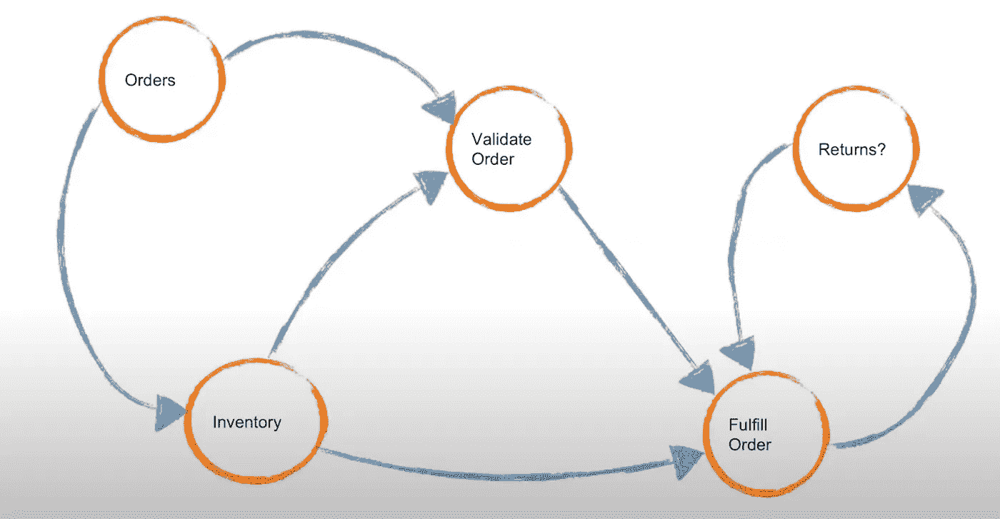
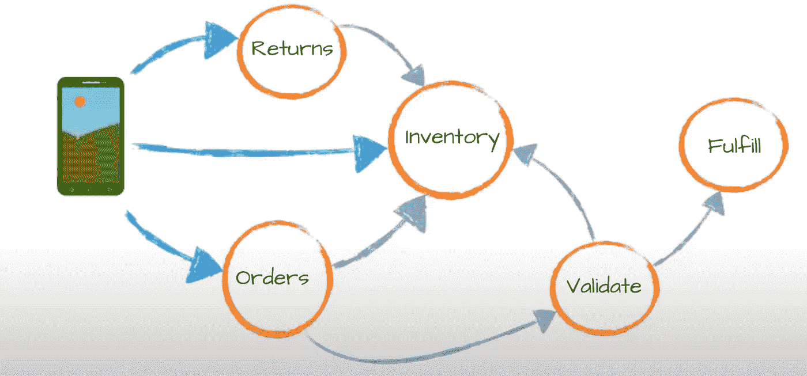
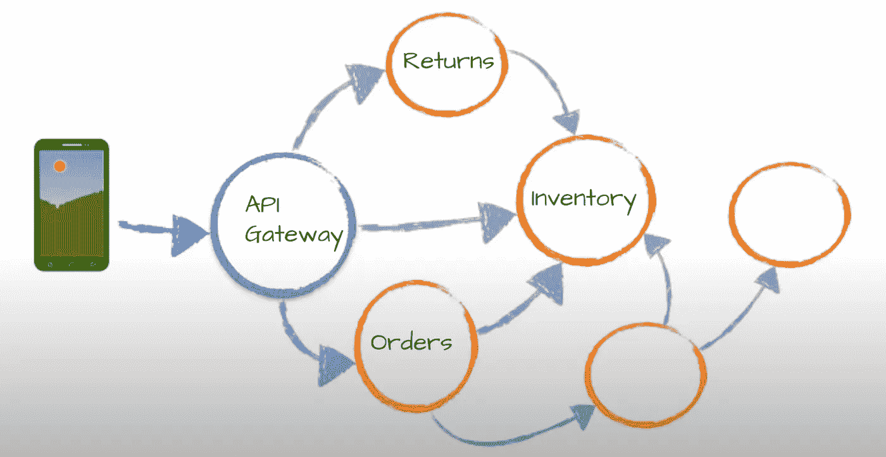
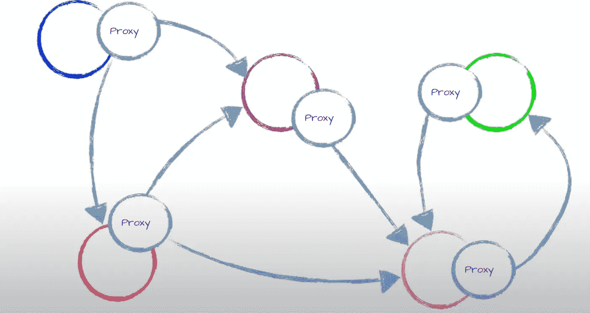
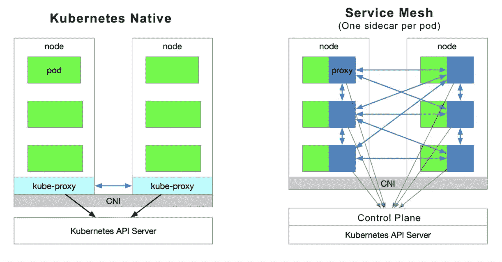
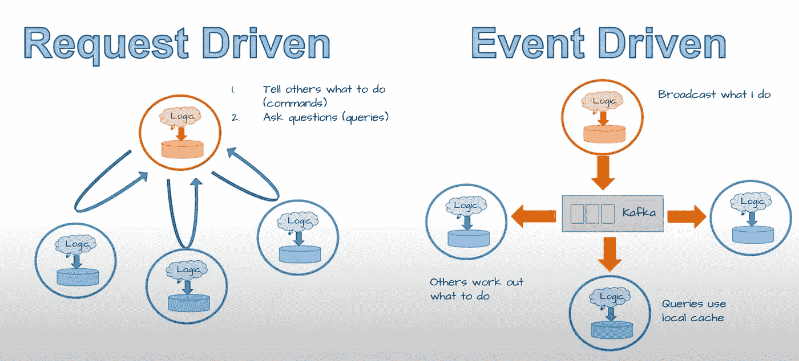
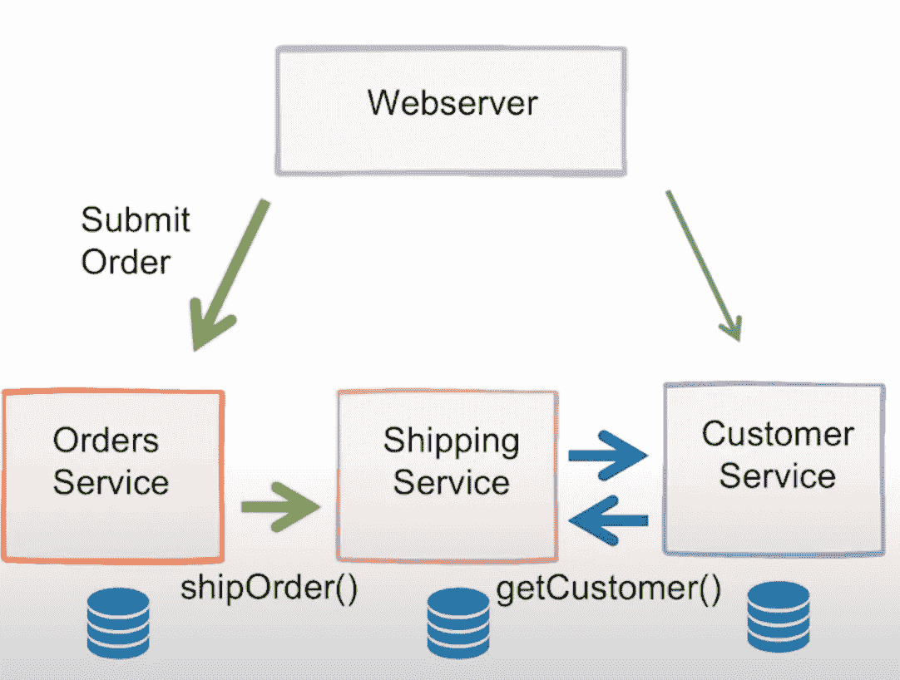
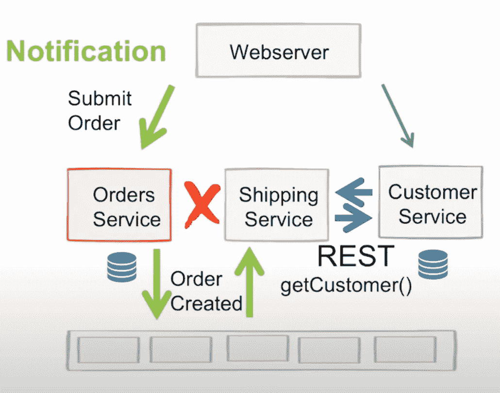
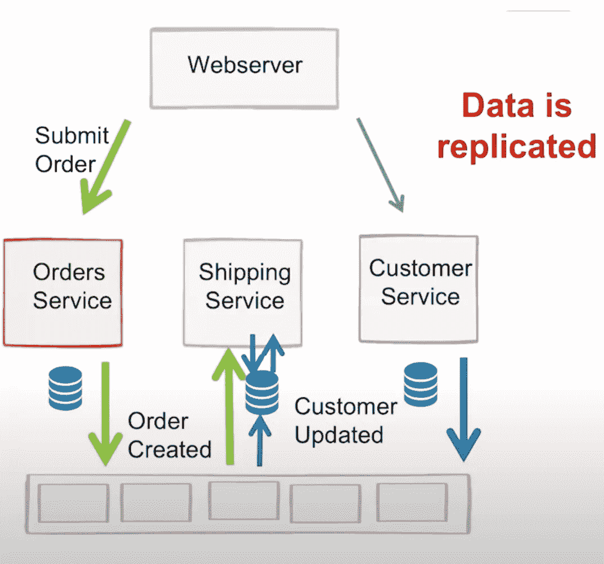

# 微服务和超越微服务

> 原文：<https://medium.com/geekculture/microservices-and-beyond-microservices-ed65300363b?source=collection_archive---------28----------------------->

假设您有一个大型单片系统，并计划迁移到微服务架构。因此，让我们来看看为什么以及如何实现这一点。

**为什么要做微服务？**

以下是选择微服务的三大理由，来自微服务的先驱之一 Sam Newman。

1.  零停机独立部署能力。
2.  数据处理的隔离
3.  实现更高程度的组织自治。用微服务体现组织结构。

**什么是微服务**这里是你在维基百科上寻找定义时会找到的内容。

**微服务**架构——面向服务架构(SOA)结构风格的一种变体——将应用程序安排为松散耦合的服务集合。

**如果您仔细看看微服务的定义和选择微服务的原因，就会发现它们几乎是一样的。**

当您将整体架构转换为微服务架构时，您应该始终关注以下几点。

*   高度可维护和可测试
*   松散耦合
*   可独立部署
*   围绕业务能力组织
*   由一个小团队拥有

**超越微服务**

利用我们从上述指针中学到的知识，我们决定迁移微服务。

简单介绍并指出我们的微服务架构中存在的问题。我将使用流行的电子商务服务模式。

但是在现实世界中，没有一个微服务可以独立完成所有事情。他们需要互相交流。让我们用一个电子商务服务的例子来看看这一点。

我们决定这不是大问题，我们可以用 rest 与他们交流。

然后，我们使用我们选择的云部署服务，并开始为客户提供服务

这个系统为我们工作，然后我们开始看到问题。

**有哪些问题？**

1.  顾客知道得太多。
2.  我们的服务点对点地紧密相连。

**我们如何解决这个问题？**

1.  让我们介绍一下 API 网关

什么是 API 网关？

API 网关接收来自客户端的所有 API 调用，然后通过请求路由、组合和协议翻译将它们路由到适当的微服务。通常，它通过调用多个微服务并汇总结果来处理请求，以确定最佳路径。它可以在 web 协议和内部使用的对 web 不友好的协议之间进行转换。

**总结使用 API 网关的优势**

*   证明
*   限速
*   按指定路线发送
*   日志记录和分析

**我的微服务之间是否应该使用 API 网关进行通信？不，你应该用 Servish Mesh。**

**什么是服务网格？**

服务网格是微服务应用程序的可配置基础设施层。它使得服务实例之间的通信灵活、可靠且快速。网格提供服务发现、负载平衡、加密、认证和授权、对断路器模式的支持以及其他功能。

这是您的 Kubernetes 集群，有无服务网格

2.让我们尝试不同的服务间通信方法，以减少紧密的点对点耦合。如果我们仔细观察我们的架构，我们正在设计完全由请求驱动的服务。有一些现代工具可以帮助我们从请求驱动转向**事件驱动。**

**什么是事件驱动架构？**

事件驱动架构是一种软件架构范例，它促进事件的产生、检测、消费和反应。事件可以定义为“状态的重大变化”。例如，当消费者购买汽车时，汽车的状态从“待售”变为“已售”。

**注意-你不能在任何地方都使用一种型号。根据您的用途，两者可以互换使用。但是尽可能选择事件驱动，因为它们比请求驱动更快更可靠。**

下面三幅图片将展示事件驱动设计如何将你从不可用中解救出来。

Request Driven shopping service

Request Driven shopping service when shipping service is down

Event Driven Service

*   如果在请求驱动的方法中发现运输服务停止，那么我们必须计算出我们需要尝试运输服务的次数。以及 shiping service 回来后如何了解新订单。
*   现在，如果我们为运输服务引入事件驱动服务。它必须监听事件并完成所需的工作。停机时的事件没有问题。当它回来的时候，它会完成它的使命。

考虑在您的微服务中引入事件驱动设计。了解更多关于最流行的事件流系统[卡夫卡](https://kafka.apache.org/intro#intro_platform)。

2.1 **无服务器？**顾名思义就是在没有服务器的情况下运行服务。

