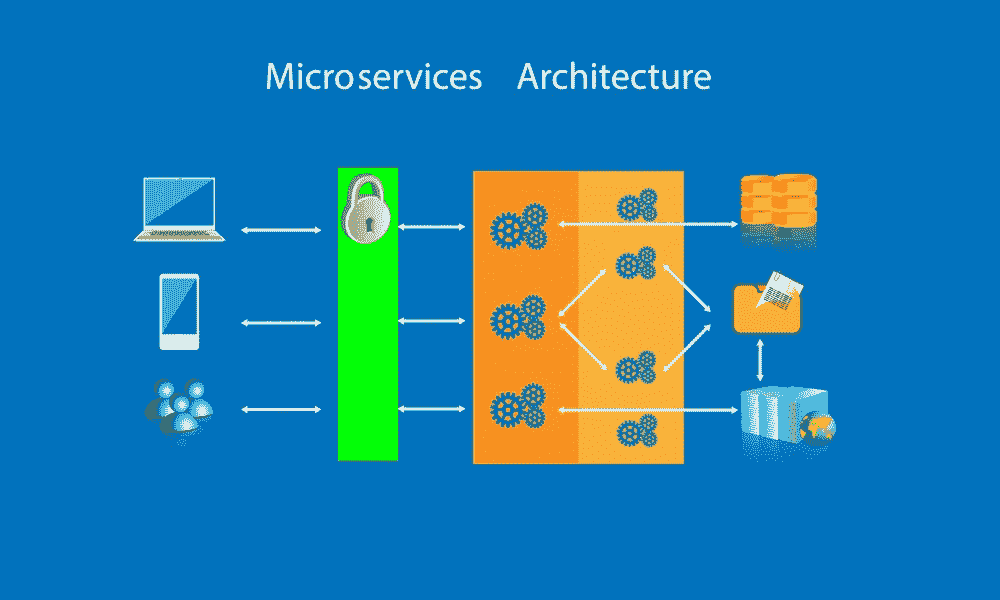
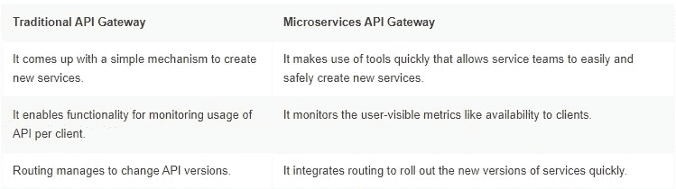
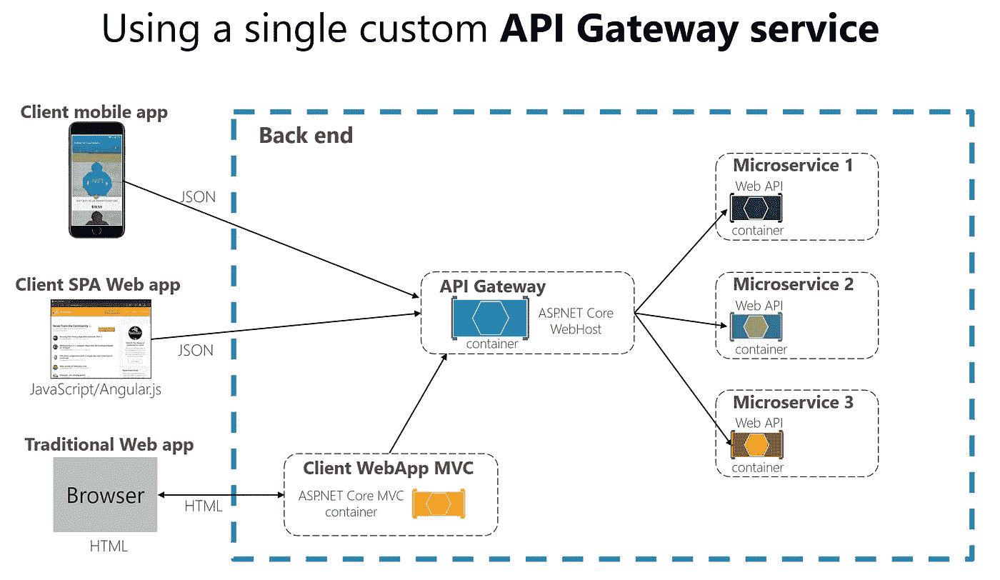

# 微服务 API 网关与传统 API 网关

> 原文：<https://medium.com/geekculture/microservices-api-gateway-vs-traditional-api-gateway-a1be7b6c4b19?source=collection_archive---------2----------------------->

微服务 API 网关的主要目的是加速服务的独立开发。它为团队提供了独立有效地发布、更新和监控[微服务](https://marutitech.com/microservices-architecture-in-2019/)的功能。这种功能在传统的 API 网关中是找不到的，因为它侧重于在内部管理 API。

行业和公司通过定义 API 来彻底理解这个内部系统。因此，向客户展示数千个 API 的挑战导致了 API 网关的暴露。随着时间的推移，API 网关成为访问这些 API 的基础设施中心。

下表更好地展示了微服务 API 网关与传统 API 网关之间的*差异。*

因此，传统的 API 网关解决了 API 管理面临的挑战，但未能解决微服务采用的困难。因此，集成到您的应用中的微服务 API 网关允许服务团队安全快速地监控、更新和发布服务，使您的组织能够高效地开发更多软件。

# 微服务架构中 API 网关的工作

假设您正在为客户构建一个电子商务移动应用程序，该应用程序显示产品详细信息。当使用单一架构创建这个应用程序时，客户端使用对应用程序的一个 REST 调用来检索数据。当我们用微服务架构开发同一个应用时，每个微服务都揭示了细粒度端点的指令。

让我们利用微服务架构。产品详细信息页面按多个微服务显示数据，例如，订单服务、购物车服务、评论服务、运输服务等等。

在这里，客户端直接调用每个微服务，并将请求分布到可用的实例中。但是当客户端直接调用微服务时，会面临许多问题，例如客户端调用和 API 之间的不匹配，或者使用对 web 不友好的协议。API Gateway 可以有效解决这个问题。API gateway 合并了应用程序的内部系统，并允许每个客户端采用一个 API。

下图解释了 API 网关如何管理 API 调用以及如何与其他架构组件进行交互。

在微服务架构中实现 API 网关时，API 网关的可扩展性和性能通常至关重要。API 网关负责包括路由、计费、监控、速率限制、认证、足够的安全性、警报、策略等功能。它有助于拦截来自客户端的传入请求，并将它们传递给 API 管理系统，以应用必要的函数并获得输出。各种技术被用来实现 API 网关的可伸缩性和性能。

API 网关通过将请求路由到后端服务来处理请求。例如，在获取配置文件的知识之前，API 网关首先检索包含个人信息的客户端配置文件。最好是编写 API 网关代码，而不是使用难以理解的传统方法编写 API 代码。

API gateway 利用了系统的好处，不像其他任何服务客户端，无论是服务器端发现还是客户端发现。API 网关总是需要知道每个微服务的 IP 地址才能进行通信。但是决定应用程序的位置并不容易，因为应用程序服务有多个指定的位置。

使用 API gateway 时需要考虑的最重要的事情是，当一个服务调用另一个响应缓慢或不存在的服务时，系统会出现部分故障。但是，根据场景和服务故障，使用 API Gateway 可以解决这个问题。

# 后端对前端(BFF)模式

在前端模式的后端中，来自微服务架构模式的后端服务充当请求前端的端点。

我们知道 API 是应用程序的一部分，它们为了一个目的而相互作用。但是随着使用时间的推移，这一小段代码中可能会出现裂缝或错误，这有助于所有内容保持相互一致。因此，后端对前端模式有助于开发后端利基，以获得更好的用户体验。你可以说它是前端和请求后端调用之间的层。

此外，有时微服务返回到前端的数据输出不是前端所需的精确格式或过滤器。为了解决这个问题，前端应该有一些逻辑来重新格式化数据，因此，我们可以使用 BFF 将一些逻辑转移到中间层。后端对于前端模式的主要功能是

*   通过调用适当的微服务 API 获取所需的数据
*   格式化前端数据表示
*   将格式化的输出发送到前端

因此，BFF 有助于减少前端的逻辑处理责任，并为应用程序的前端提供一个格式良好的接口。

您可以从现有的遗留应用程序中获得更多的商业价值。我们的 [*传统应用程序现代化服务*](https://marutitech.com/enterprise-application-modernization-services/) 可以帮助您实现业务灵活性、生产力和长期成本节约。"

阅读完整的指南，了解 API 网关的[实现—问题和解决方案](https://marutitech.com/api-gateway-in-microservices-architecture/)。