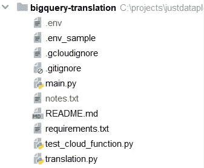
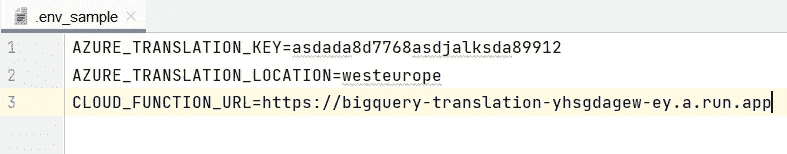
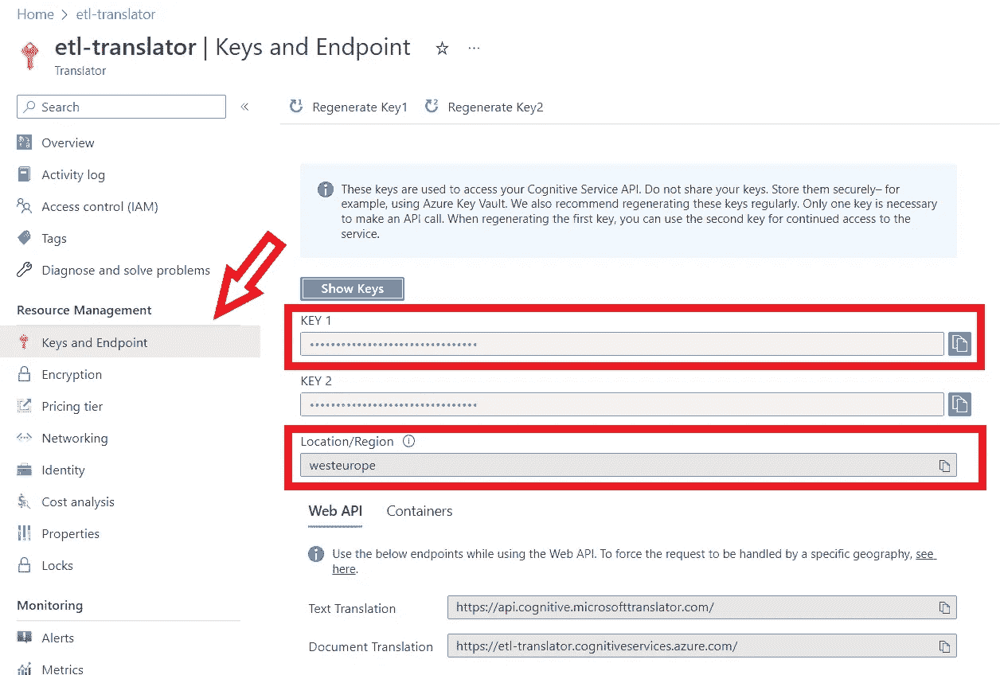
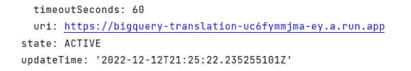

# 微服务作为 BigQuery 中的函数——使用 SQL 进行语言翻译(第 1 部分)

> 原文：<https://medium.com/geekculture/microservices-as-functions-in-bigquery-language-translation-using-sql-part-1-bd875b291338?source=collection_archive---------9----------------------->

了解如何在 SQL 查询中使用翻译 API。


Photo by [Patrick Fore](https://unsplash.com/@patrickian4?utm_source=medium&utm_medium=referral) on [Unsplash](https://unsplash.com?utm_source=medium&utm_medium=referral)

# 动机

我已经用 BigQuery 用户定义函数(UDF)进行了一段时间的试验，我发现它们很强大——但也很有限。

简而言之，UDF 允许您定义自己的用 SQL 或 Javascript 编写的定制 SQL 来处理 BigQuery 中的数据。这样，您可以执行标准 BigQuery 函数中没有的复杂数据转换或操作。

我注意到的局限性如下:

*   它们不能用于对外部服务进行 API 调用——这意味着如果您想要从外部服务访问元数据，您将需要使用不同的方法。
*   它们只能用 Javascript 或 SQL 编写——这意味着如果您更习惯使用另一种编程语言，如 Python，您将无法使用 UDF。

今年早些时候发布了一个解决这些限制的方法，叫做[远程功能](https://cloud.google.com/bigquery/docs/reference/standard-sql/remote-functions)。

> *Google 文档:BigQuery 远程函数允许你用 SQL 和 Javascript 之外的其他语言实现你的函数，或者用 BigQuery* [*用户自定义函数*](https://cloud.google.com/bigquery/docs/reference/standard-sql/user-defined-functions) *中不允许的库或服务实现你的函数。*

在这个由两部分组成的教程中，我们将使用云函数构建两个微服务，并在 BigQuery 中将它们实现为 SQL 函数。

在第 1 部分中，我们将构建一个 web 应用程序，它使用 Azure Translator API 获取文本输入并将其翻译成所需的语言。

在第 2 部分中，我们将构建一个 web 应用程序，该应用程序使用 MaxMind 的离线数据库将 IP 地址作为输入，并检索地理位置信息，如国家、城市和邮政编码。

在这两种情况下，我们都将在 BigQuery 的玩具数据集中测试最终的 SQL 函数。

# 运行成本

现在你应该想知道运行一个 web 应用程序的成本，以及使用翻译 API 的成本。值得这么麻烦吗？是的，确实如此。

对于网络应用，我们将使用谷歌的云功能，这比租用服务器更具成本效益，因为它们只在使用时收费。我们将使用免费层，目前每月免费提供 200 万次调用。在这里阅读更多。

对于翻译 API，我们将使用 Azure 的翻译 API。我们将使用免费层，目前每月免费提供 200 万个字符。点击阅读更多[。](https://azure.microsoft.com/en-us/pricing/details/cognitive-services/translator/)

# 语言翻译功能

完整的代码可以在这里找到[。](https://github.com/justdataplease/bigquery-translation)

# 0.先决条件

要继续，我们需要确保完成以下工作:

*   启用谷歌云功能。在这里阅读更多。
*   本地安装和配置 gcloud CLI。在这里阅读更多。
*   启用 Azure 翻译器 API。点击阅读更多[。](https://learn.microsoft.com/en-us/azure/cognitive-services/translator/translator-text-apis?tabs=csharp)

此外，为了运行下面的代码片段，我们需要用我们自己的变量替换下面的变量:

*   <gcf-conn-name>(第二步)</gcf-conn-name>
*   <gcf-endpoint>(第四步)</gcf-endpoint>

*遵循教程的一个简单方法是复制 Readme.md 并搜索——使用编辑器用您自己的值替换上面的值。*

# 1.克隆存储库(CLI)

我们将从克隆回购开始。

```
git clone https://github.com/justdataplease/bigquery-translation.git
```

```
cd bigquery-translation
```

回购目录具有以下结构:



Language Translation app structure, Photo by Author.

**。env_sample** :包含带有一些样本值的环境变量。
稍后，我们将从*开始对其进行重命名。env_sample - >。env* 并用我们自己的值替换样本值。



Variables with sample values in .env file, Photo by Author.

**translation.py** :包含 Translator 类，用于将文本从一种语言翻译成另一种语言。translate_text()方法接受一个文本字符串和一种目标语言，并返回翻译后的文本。它还提供了指定文本的原始语言(from_language)或自动检测它的选项。对于本教程，我们将自动检测原始语言。Translator 类使用 Azure 的 Translator 文本 API 来执行翻译。



Translator API keys, Photo by Author.

**main.py:** 包含了我们的云函数的代码。

```
import json

import functions_framework
from translation import Translator

@functions_framework.http
def translate(request):
    """
    Defines translate Google Cloud Function
    :param request:
    :return:
    """
    request_json = request.get_json()
    calls = request_json['calls']
    replies = []
    trans = Translator()
    for call in calls:
        text = call[0]
        to_language = call[1]
        rs = trans.translate_text(text=text, to_language=to_language)
        # each reply is a STRING (JSON not currently supported)
        replies.append(json.dumps(rs, ensure_ascii=False))

    return json.dumps({'replies': replies})
```

为了使用 BigQuery，这个函数有一个特殊的形式。它应该接受多行(调用)作为输入，并遍历每一行(*调用*)来执行翻译过程。对于每一行(*调用*，它拉两列(*调用【0】**调用【1】*)。第一个被视为我们要翻译的文本( *text = call[0]* )，第二个被视为我们要将文本翻译成的所需语言( *to_language = call[1]* )。最后，我们将每个响应收集到一个名为 *replies* 的列表中，并将这个列表转换成一个字符串。

**test _ Cloud _ Function . py:**包含测试我们的云函数的代码。我们会在云功能部署后使用。

# 2.部署云功能(CLI)

首先，要部署我们的云功能，我们需要确保

*   我们位于*大查询翻译*目录的根目录。
*   我们已经改名了。环境样本到。env 和我们已经用我们自己的改变了 *AZURE_TRANSLATION_KEY* 和 *AZURE_TRANSLATION_LOCATION 的样本值(我们将在部署云函数后指定 *CLOUD_FUNCTION_URL* )。*

然后，我们应该运行下面的命令，将我们的目录部署为云功能。要了解所用参数的更多信息，请阅读此处的。

```
gcloud functions deploy bigquery-translation --gen2 --runtime python39 --trigger-http --project=<your-project-id> --entry-point=translate --source . --region=europe-west3 --memory=128Mi --max-instances=3 --allow-unauthenticated
```

**- allow-unauthenticated:为了简单起见，我们添加了这个参数，使我们的函数成为公共函数。如果再现，最好避免使用该参数。**

从最后一条命令的输出中，我们应该注意到 URI(即 https://big query-iplookup-XXXXXX . a . run . app)或者访问 [Google Cloud 控制台函数](https://console.cloud.google.com/functions/list)。



Cloud Function output when deployed successfully, Photo by Author.

现在为了测试云函数，我们可以在我们的*中更新 *CLOUD_FUNCTION_URL* 。env 文件*并运行下面的代码。

```
python test_cloud_function.py
```

```
# Input
data = {
    "calls": [
        ["Programming is great", "es"],
        ["Support me as a writer", "es"]
    ]
}

# Output
{'replies': [
'{"detected_lang": "en", "detected_conf": 1.0, 
"trans_text": "la programación es genial", "trans_lang": "es", "error": ""}', 
'{"detected_lang": "en", "detected_conf": 1.0, 
"trans_text": "apóyame como escritor", "trans_lang": "es", "error": ""}'
]}
```

从我们得到的输出中，我们可以看到我们的云功能正在工作！

# 3.在 BigQuery 和云函数(CLI)之间创建连接

我们需要连接 BigQuery 和云函数，以便将云函数用作远程函数。

```
gcloud components update
bq mk --connection --display_name='my_gcf_conn' --connection_type=CLOUD_RESOURCE --project_id=<your-project-id> --location=EU gcf-conn
bq show --project_id=<your-project-id> --location=EU --connection gcf-conn
```

从最后一个命令的输出( *bq show* )中，我们应该记下这个名称(即 xxxxxx.eu.gcf-conn)，因为我们稍后会用到它。

# 4.创建玩具数据集(CLI)

为了测试我们的功能，我们将创建一个玩具数据集。这个数据集将包括我们的远程函数和一个包含一些测试数据的表。

```
bq mk --dataset_id=<your-project-id>:translation --location=EU
```

# 5.创建一个示例表(BigQuery)

为了测试我们的远程函数，我们将创建一个包含测试数据的表。

```
CREATE OR REPLACE TABLE `<your-project-id>.translation.example_table` (
      text STRING,
      to_language STRING
    );

INSERT INTO `<your-project-id>.translation.example_table`(text, to_language)
    VALUES ('I love programming', 'es'),
           ('We are learning great things today', 'es'),
           ('Support me as a writer', 'es'),
           ('Support me as a writer', 'fr'),
           ('Support me as a writer', 'de');
```

# 6.创建远程函数(BigQuery)

最后，我们将创建我们的远程函数。

```
CREATE OR REPLACE FUNCTION `<your-project-id>.translation.translate`(text STRING, to_language STRING)
RETURNS STRING
REMOTE WITH CONNECTION `<gcf-conn-name>`
        OPTIONS (
        -- change this to reflect the Trigger URL of your Cloud Function (look   for the TRIGGER tab)
            endpoint = '<gcf-endpoint>'
        );
```

# 7.测试远程函数(BigQuery)

为了测试我们的远程函数，我们将在测试数据上运行它。该函数的输出是一个字符串，所以我们需要解析它，将信息提取到列中。

```
WITH A AS (SELECT `<your-project-id>.translation.translate`(text,to_language) trans_rs,text origin_text FROM `<your-project-id>.translation.example_table`)

select
origin_text,
json_value(trans_rs, '$.detected_lang') detected_lang,
json_value(trans_rs, '$.detected_conf') detected_conf,
json_value(trans_rs, '$.trans_text') trans_text,
json_value(trans_rs, '$.trans_lang') trans_lang,
json_value(trans_rs, '$.error') error
from a A;
```


Language Translation using SQL, Photo by Admin.

我们做到了！我们的功能起作用了。

我提醒你，这个功能正在使用付费的外部 API，即使我们是免费的，我们也不应该忘记明智地使用它。

# 8.删除所有内容(CLI)

要删除云函数、远程函数和玩具数据集，我们需要运行以下命令:

```
# Remove Cloud Function (gcf)
gcloud functions delete bigquery-translation --region=europe-west3 --project=<your-project-id> --gen2

# Remove DATASET
bq rm -r -f -d <your-project-id>:translation

# Remove connection between BigQuery and Cloud Functions (gcf-conn)
bq rm --connection --location=EU <gcf-conn-name>
```

# 结论

在本系列的第 1 部分中，我们展示了如何使用 SQL 执行语言翻译，这是一项用标准的 Bigquery UDFs 无法完成的任务。在接下来的第 2 部分中，我们将探索如何在不调用 API 的情况下查找 IP 地址来检索地理位置数据，敬请关注！

您可能还会对我的故事感兴趣，这个故事讲述了如何使用 BigQuery Javascript UDFs 来执行复杂的预处理任务，比如词干提取。

[](/mlearning-ai/extend-bigquery-nlp-armory-with-stemmers-995fae853b0e) [## 用词干分析器扩展 BigQuery NLP 库

### 使用 Javascript UDFs 实现英语、西班牙语和希腊语词干分析器。

medium.com](/mlearning-ai/extend-bigquery-nlp-armory-with-stemmers-995fae853b0e) 

如果你喜欢阅读这样的故事，并想支持我作为一名作家，请考虑**跟随我**和**砸那个拍手按钮**。
谢谢你的支持！