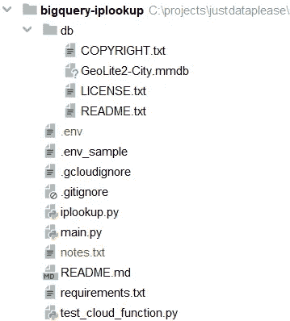
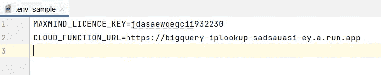
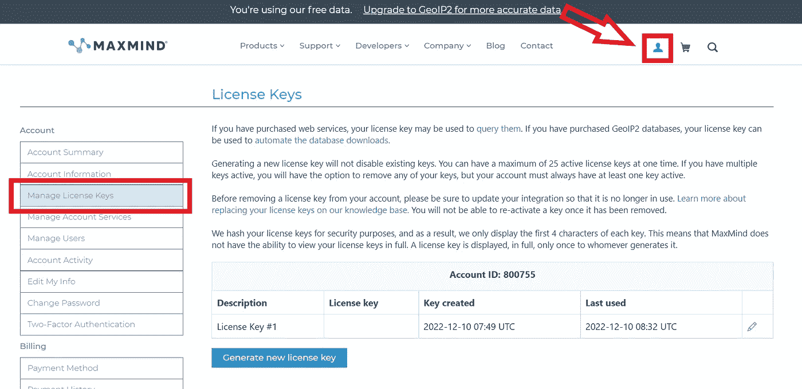
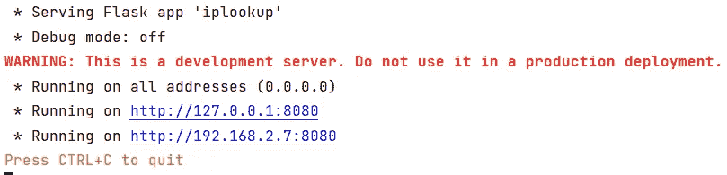
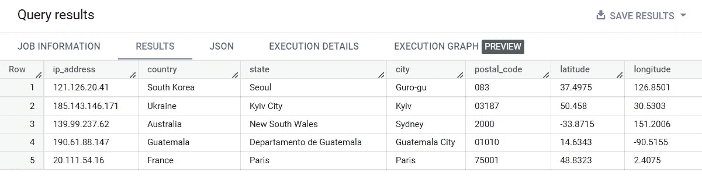

# 微服务作为 BigQuery 中的函数——使用 SQL 进行离线 IP 地址查找(第 2 部分)

> 原文：<https://medium.com/geekculture/microservices-as-functions-in-bigquery-offline-ip-address-lookup-using-sql-part-2-7b0b91fa5700?source=collection_archive---------17----------------------->

了解如何使用 SQL 检索 IP 地址的地理位置信息。


Photo by [Stijn Swinnen](https://unsplash.com/@stijnswinnen?utm_source=medium&utm_medium=referral) on [Unsplash](https://unsplash.com?utm_source=medium&utm_medium=referral)

# 动机

在[第 1 部分](/geekculture/microservices-as-functions-in-bigquery-language-translation-using-sql-part-1-bd875b291338)中，我们确定了 BigQuery 中用户定义函数(UDF)的局限性，并探索了一种称为远程函数的解决方案，它允许我们克服这些局限性。

简而言之，UDF 允许我们定义用 SQL 或 JavaScript 编写的自定义 SQL 来处理 BigQuery 中的数据。虽然它们是执行复杂数据转换(参见[这里](/mlearning-ai/extend-bigquery-nlp-armory-with-stemmers-995fae853b0e)的一个例子)或操作的强大工具，但是它们有一些限制。它们不能用于对外部服务进行 API 调用，只能用 SQL 或 JavaScript 编写。为了克服这些限制，谷歌推出了远程功能，让你使用云功能。

作为一个实际的例子，在本教程的[第 1 部分](/geekculture/microservices-as-functions-in-bigquery-language-translation-using-sql-part-1-bd875b291338)中，我们构建了一个使用 Azure Translator API 获取文本输入并将其翻译成所需语言的 web 应用。

在第 2 部分中，我们将构建一个更复杂的 web 应用程序，它使用 MaxMind 的免费离线数据库来获取 IP 地址作为输入，并检索地理位置信息，如国家、城市和邮政编码。

这对于各种目的都非常有用，比如分析我们用户的地理分布。

# 运行成本

您可能对构建这种 IP 地址查找功能的成本感到好奇，因为批量执行这一任务的类似服务可能非常昂贵。然而，在这种情况下，我们不会破产。

对于网络应用，我们将使用谷歌的云功能，这比租用服务器更具成本效益，因为它们只在使用时收费。我们将使用免费层，目前每月免费提供 200 万次调用。点击阅读更多[。](https://cloud.google.com/functions/pricing)

对于 IP 地址查找，我们将使用免费的离线 MaxMind 数据集。由于它是免费的，某些信息如纬度和经度将不如付费版本的服务准确。此外，由于我们使用离线数据库，我们应该经常更新它。

# IP 地址查找功能

完整的代码可以在[这里](https://github.com/justdataplease/bigquery-iplookup)找到。

# 0.先决条件

要继续，我们需要确保完成以下工作:

*   启用谷歌云功能。点击阅读更多[。](https://cloud.google.com/functions/docs/create-deploy-gcloud)
*   本地安装和配置 gcloud CLI。在这里阅读更多。
*   (可选)在 [MaxMind](https://dev.maxmind.com/geoip/geolite2-free-geolocation-data) 创建一个免费账户(以便更新数据集)。

此外，为了运行下面的代码片段，我们需要用我们自己的变量替换下面的变量:

*   gcf-conn-name >(步骤 2)
*   GCF-终点>(步骤 4)

遵循教程的一个简单方法是复制 Readme.md 并搜索——使用编辑器用你自己的值替换上面的值。

# 1.克隆存储库(CLI)

我们将从克隆回购开始。

```
git clone https://github.com/justdataplease/bigquery-iplookup.git
```

```
cd bigquery-iplookup
```

回购目录具有以下结构:



IP Address Lookup app structure, Photo by Author.

**。env_sample** :包含带有一些样本值的环境变量。
稍后，我们将从*开始对其进行重命名。env_sample - >。env* 并用我们自己的值替换样本值。



Variables in .env file, Photo by Author.

**db** 文件夹:包含 GeoLite2-City 数据库，是 MaxMind 的 geo GeoIP2-City 数据库的免费版本(不太准确)。

**iplookup.py** :包含 GeoLocation 类，用于确定 IP 地址的地理位置(国家、州、城市、邮政编码、纬度和经度)。

update_db()方法用于下载和安装 MaxMind GeoLite2 数据库(如果系统中没有该数据库)。这是通过向 MaxMind 下载 URL 发送 GET 请求来实现的，该请求带有下载 GeoLite2-City 数据库的适当参数。然后，它提取下载的. tar.gz 文件的内容，并将提取的文件夹重命名为“db”。
要使用这种方法更新数据库，我们需要在我们的。env 并删除位于 repo 中的现有数据库文件夹。

lookup_ip()方法将一个 ip 地址作为参数，并返回一个包含该 IP 地址的位置信息(国家、州、城市、邮政编码、纬度和经度)的字典。



MaxMind License key, Photo by Author.

**main.py:** 包含我们的云函数的代码。

```
import json
import functions_framework
from iplookup import GeoLocation

@functions_framework.http
def iplookup(request):
    """
    Defines iplookup Google Cloud Function
    :param request:
    :return:
    """
    request_json = request.get_json()
    calls = request_json['calls']
    replies = []
    lookup = GeoLocation()
    for call in calls:
        ip_address = call[0]
        rs = lookup.lookup_ip(ip_address=ip_address)
        # each reply is a STRING (JSON not currently supported)
        replies.append(json.dumps(rs, ensure_ascii=False))    
    return json.dumps({'replies': replies})
```

为了使用 BigQuery，这个函数有一个特殊的形式。它应该接受多行(调用)作为输入，并遍历每一行(*调用*)来执行翻译过程。对于每一行( *call* )，它提取 1 列( *call[0]* )，作为我们想要检索信息的 IP 地址。最后，我们将每个响应收集到一个名为 *replies* 的列表中，并将这个列表转换成一个字符串。

**test_cloud_function.py:** 包含测试我们的云函数的代码。我们会在云功能部署后使用。

# 2.部署云功能(CLI)

首先，要部署我们的云功能，我们需要确保

*   我们位于 *bigquery-* iplookup 目录的根目录下。
*   (可选)我们已重命名。环境样本到。env 和我们已经用我们自己的改变了 MAXMIND _ license _ KEY*的样本值(我们将在部署云函数后指定 *CLOUD_FUNCTION_URL* )。*

然后，我们应该运行下面的命令，将我们的目录部署为云功能。要了解所用参数的更多信息，请阅读此处的。

```
gcloud functions deploy bigquery-iplookup --gen2 --runtime python39 --trigger-http --project=<your-project-id> --entry-point=iplookup --source . --region=europe-west3 --memory=128Mi --max-instances=3 --allow-unauthenticated
```

— allow-unauthenticated:为了简单起见，我们添加了这个参数，使我们的函数成为公共的。如果再现，最好避免使用该参数。

从最后一条命令的输出中，我们应该注意到 URI(即[https://big query-iplookup-XXXXXX . a . run . app)](https://bigquery-iplookup-xxxxxx.a.run.app))或者访问[谷歌云控制台功能](https://console.cloud.google.com/functions/list)。


Cloud Function output when deployed successfully, Photo by Author.

现在为了测试云函数，我们可以在我们的*中更新 *CLOUD_FUNCTION_URL* 。env 文件*并运行下面的代码。

```
python test_cloud_function.py
```

```
# Input
{'calls': [['190.61.88.147'],['139.99.237.62'],
['20.111.54.16'],['185.143.146.171'],['121.126.20.41']]}

# Output
{'replies': [
'{"country": "Guatemala", "state": "Departamento de Guatemala", "city": "Guatemala City", "postal_code": "01010", "latitude": 14.6343, "longitude": -90.5155}', 
'{"country": "Australia", "state": "New South Wales", "city": "Sydney", "postal_code": "2000", "latitude": -33.8715, "longitude": 151.2006}', 
'{"country": "France", "state": "Paris", "city": "Paris", "postal_code": "75001", "latitude": 48.8323, "longitude": 2.4075}', 
'{"country": "Ukraine", "state": "Kyiv City", "city": "Kyiv", "postal_code": "03187", "latitude": 50.458, "longitude": 30.5303}', 
'{"country": "South Korea", "state": "Seoul", "city": "Guro-gu", "postal_code": "083", "latitude": 37.4975, "longitude": 126.8501}']}
```

从我们得到的输出中，我们可以看到我们的云功能正在工作！

记住**在部署之前，我们还可以通过运行下面的命令(target 是 main.py 文件中定义的函数名)在本地测试我们的函数**

```
functions_framework --target=iplookup
```



Local Cloud Function deployment, Photo by Author.

根据我们得到的输出，我们在我们的。具有适当本地主机的 env 文件(即[http://192 . 168 . 2 . 7:8080)](http://192.168.2.7:8080))

```
python test_cloud_function.py
```

最后，我们将得到与上面相同的输出。

# 3.在 BigQuery 和云函数(CLI)之间创建连接

我们需要连接 BigQuery 和云函数，以便将云函数用作远程函数。

```
gcloud components update
bq mk --connection --display_name='my_gcf_conn' --connection_type=CLOUD_RESOURCE --project_id=<your-project-id> --location=EU gcf-conn
bq show --project_id=<your-project-id> --location=EU --connection gcf-conn
```

从最后一个命令的输出( *bq show* )中，我们应该记下这个名称(即 xxxxxx.eu.gcf-conn)，因为我们稍后会用到它。

# 4.创建玩具数据集(CLI)

为了测试我们的功能，我们将创建一个玩具数据集。这个数据集将包括我们的远程函数和一个包含一些测试数据的表。

```
bq mk --dataset_id=<your-project-id>:iplookup --location=EU
```

# 5.创建一个示例表(BigQuery)

为了测试我们的远程函数，我们将创建一个包含测试数据的表。

```
CREATE OR REPLACE TABLE `<your-project-id>.iplookup.example_dataset` (
ip_address STRING);

INSERT INTO `<your-project-id>.iplookup.example_dataset`(ip_address)
VALUES ('190.61.88.147'),
       ('139.99.237.62'),
       ('20.111.54.16'),
       ('185.143.146.171'),
       ('121.126.20.41');
```

# 6.创建远程函数(BigQuery)

最后，我们将创建我们的远程函数。

```
CREATE OR REPLACE FUNCTION `<your-project-id>.iplookup.lookup`(ip_address STRING)
RETURNS STRING
REMOTE WITH CONNECTION `<gcf-conn-name>`
OPTIONS (
-- change this to reflect the Trigger URL of your cloud function (look for the TRIGGER tab)
endpoint = '<gcf-endpoint>'
);
```

# 7.测试远程函数(BigQuery)

为了测试我们的远程函数，我们将在测试数据上运行它。该函数的输出是一个字符串，所以我们需要解析它，将信息提取到列中。

```
WITH A AS (SELECT `<your-project-id>.iplookup.lookup`(ip_address) ip_address_location,ip_address 
FROM `<your-project-id>.iplookup.example_dataset`)

SELECT
      ip_address,
      json_value(ip_address_location, '$.country') country,
      json_value(ip_address_location, '$.state') state,
      json_value(ip_address_location, '$.city') city,
      json_value(ip_address_location, '$.postal_code') postal_code,
      json_value(ip_address_location, '$.latitude') latitude,
      json_value(ip_address_location, '$.longitude') longitude
 FROM A;
```



IP Address Lookup using SQL, Photo by Admin.

我们做到了！我们的功能起作用了。

# 8.删除所有内容(CLI)

要删除云函数、远程函数和玩具数据集，我们需要运行以下命令:

```
# Remove Cloud Function (gcf)
gcloud functions delete bigquery-iplookup --region=europe-west3 --project=<your-project-id> --gen2

# Remove DATASET
bq rm -r -f -d <your-project-id>:iplookup

# Remove connection between BigQuery and Cloud Functions (gcf-conn)
bq rm --connection --location=EU <gcf-conn-name>Conclusion
```

在本教程的第二部分，我们向您展示了如何使用远程函数来执行 IP 地址查找和检索地理位置信息。虽然这是我们关于 BigQuery 中微服务功能的教程的最后一部分，但我们也将在不久的将来探索其他高级功能。

敬请关注 BigQuery Quest 刚刚开始！

如果您正在探索 BigQuery 的高级用例，请务必查看我的其他文章。

[](/geekculture/microservices-as-functions-in-bigquery-language-translation-using-sql-part-1-bd875b291338) [## 微服务作为 BigQuery 中的函数——使用 SQL 进行语言翻译(第 1 部分)

### 了解如何在 SQL 查询中使用翻译 API。

medium.com](/geekculture/microservices-as-functions-in-bigquery-language-translation-using-sql-part-1-bd875b291338) [](/mlearning-ai/extend-bigquery-nlp-armory-with-stemmers-995fae853b0e) [## 用词干分析器扩展 BigQuery NLP 库

### 使用 Javascript UDFs 实现英语、西班牙语和希腊语词干分析器。

medium.com](/mlearning-ai/extend-bigquery-nlp-armory-with-stemmers-995fae853b0e) 

如果你喜欢阅读这样的故事，并想支持我作为一名作家，请考虑**跟随我**和**砸那个拍手按钮**。
感谢您的支持！