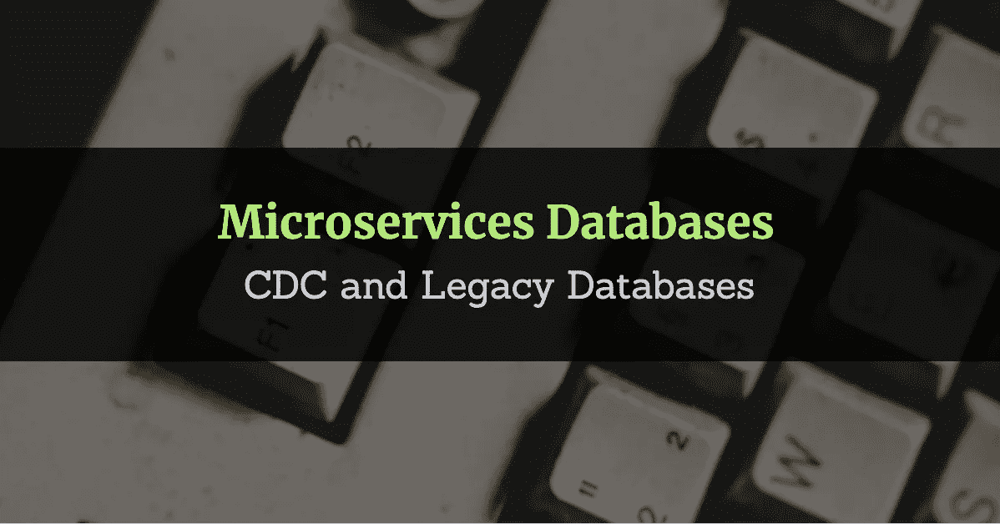

# 微服务数据库—第 2 部分

> 原文：<https://medium.com/geekculture/microservices-databases-part-2-d839a1ac32c?source=collection_archive---------6----------------------->

## CDC 和传统数据库

Microservices Databases — CDC and Legacy Databases

在之前的文章[“微服务数据库”](/swlh/microservices-databases-b4cb949d0544)中，我解释了微服务与 SOA 在数据库共享上的不同。微服务如何很好地适应事件驱动架构，以及 CDC 工具在从整体架构迁移期间简化数据集成的作用。