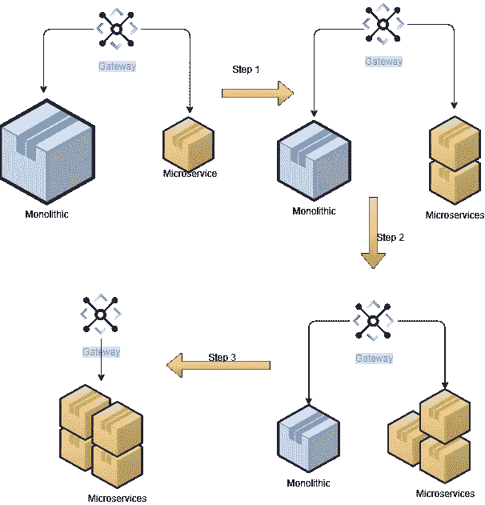
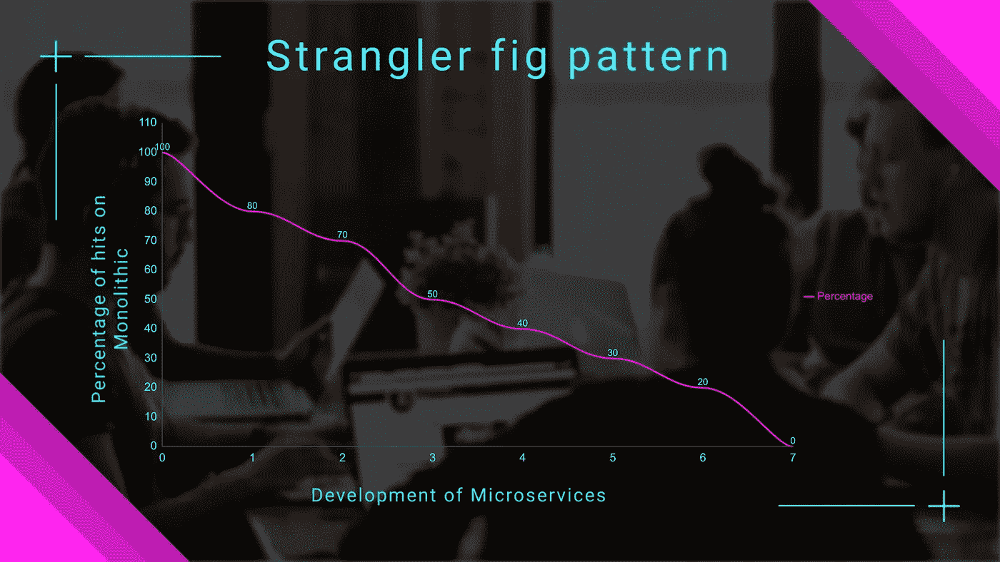

# 微服务:设计模式

> 原文：<https://medium.com/geekculture/microservices-design-patterns-34d331d84c8d?source=collection_archive---------19----------------------->

***这是微服务设计模式系列的第一部分***

微服务如今炙手可热，大多数组织正在将单片应用程序转移到微服务。这涉及到大量的重构工作、测试和发布。

有了这么多的资源和成本，重要的是要以正确的方式去做。正在开发的服务应该是可伸缩的、可独立部署的、可测试的、有弹性的、松散耦合的和高性能的。

为了以正确的方式构建微服务，让我们看看一些重要的设计模式，它们可以帮助我们创建更好的服务，并将现有的整体迁移到微服务。

# 扼杀者无花果图案

这种模式用于为新的应用程序淘汰现有的遗留系统。这种模式之所以如此命名，是因为其行为类似于扼杀者无花果树，从宿主树开始，然后完全包围它，扼杀宿主直至死亡。

在将传统应用迁移到微服务时，重要的是要考虑到并非所有功能都可以一次迁移。迁移是一个持续的增量开发过程。

一定量的流量必须首先迁移，然后是其他流量。迁移可以是基本特性，或者有时只是针对用户的迁移，类似于在大规模推广之前针对模型用户的测试版。

这种分阶段部署确保业务不受影响，同时新用户/选定用户被重定向到新应用，其他用户继续使用旧应用。

***需要注意的是，新的应用程序在若干年后还会被称为遗留应用程序，因此它们必须以一种方便移植到未来开发的方式来创建。***

# 需要考虑的要点

1.  当试图将遗留应用程序迁移到新的体系结构时，可以使用这种模式。
2.  这也可以用于引导用户使用一些新功能，而不会影响其他用户。
3.  这种模式可能不适合没有太多复杂性或特性的相当简单的应用程序。
4.  下游应用程序或后台服务(如数据库、消息代理或其他由这些应用程序使用的服务)可能必须共享，但最好独立构建。

*如果你喜欢这篇文章，请在 medium 上关注我，喜欢，支持我。我也希望能得到关于这篇文章的反馈。您可以在 Twitter 上关注我，我在 Twitter 上发布了各种主题，包括开发、架构和最佳实践。*

 [## 安基特·阿加瓦尔

### 解决方案架构师|云|微服务| Spring | Web 服务| API |

twitter.com](https://twitter.com/techie_ankit)