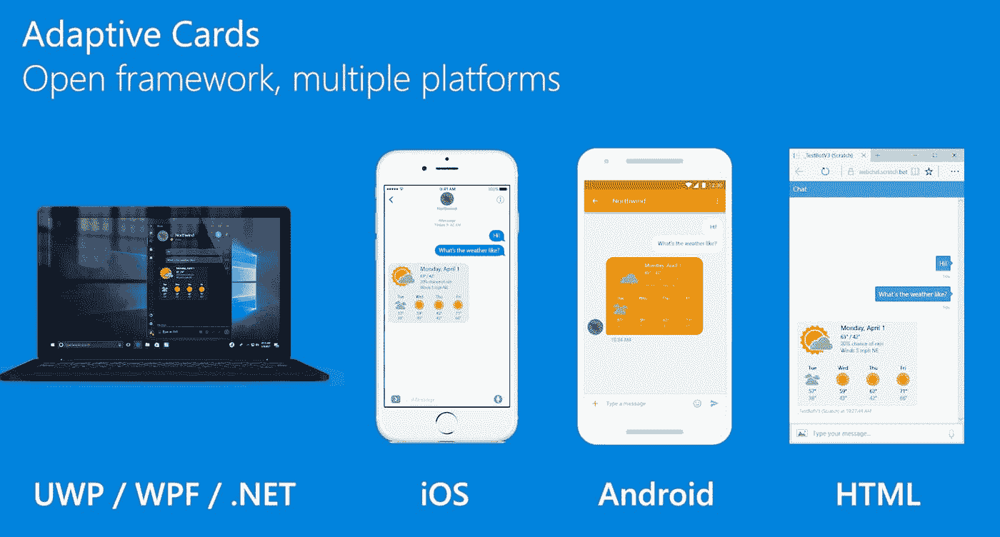
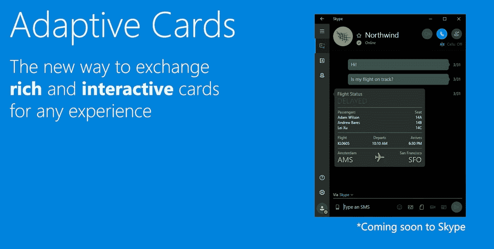
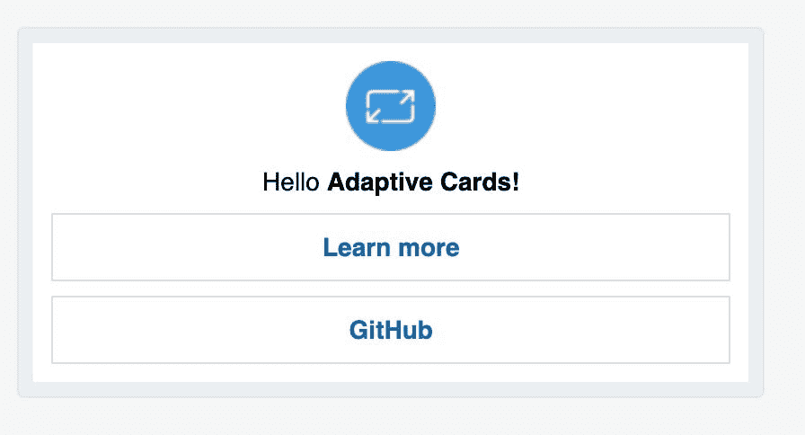
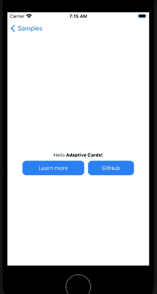
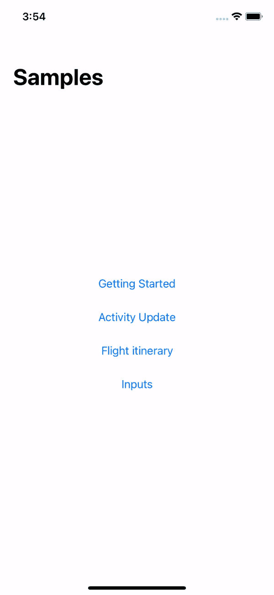

# SwiftUI 中的 Microsoft 自适应卡

> 原文：<https://medium.com/geekculture/microsoft-adaptive-cards-in-swiftui-c2b63f96122b?source=collection_archive---------8----------------------->

在这篇博文中，我将

*   向您介绍微软适配卡
*   解释如何在 SwiftUI 项目中使用其开源的 Objective-C SDK，以及
*   给你一些忠告。

[适配卡](https://adaptivecards.io/)是一种开放的卡交换格式，使开发者能够以通用和一致的方式交换 UI 内容。



> 自适应卡是平台无关的 UI 片段，由 JSON 编写，应用程序和服务可以公开交换。当交付给特定的应用程序时，JSON 被转换成一个自动适应周围环境的本机 UI。它帮助设计和集成所有主要平台和框架的轻量级 UI。

由于微软维护自适应卡，您可以在他们的产品中看到它的使用，例如微软团队或 Outlook 可操作行动。



让我们看一个简单的 JSON 代码片段声明卡片的例子。

```
{
  "type": "AdaptiveCard",
  "version": "1.0",
  "body": [
    {
      "type": "Image",
      "url": "[http://adaptivecards.io/content/adaptive-card-50.png](http://adaptivecards.io/content/adaptive-card-50.png)",
      "horizontalAlignment": "center"
    },
    {
      "type": "TextBlock",
      "horizontalAlignment": "center",
      "text": "Hello **Adaptive Cards!**"
    }
  ],
  "actions": [
    {
      "type": "Action.OpenUrl",
      "title": "Learn more",
      "url": "[http://adaptivecards.io](http://adaptivecards.io)"
    },
    {
      "type": "Action.OpenUrl",
      "title": "GitHub",
      "url": "[http://github.com/Microsoft/AdaptiveCards](http://github.com/Microsoft/AdaptiveCards)"
    }
  ]
}
```

卡片，这里有一个图像和两个动作，无需应用程序开发人员编写特定于平台的代码就可以呈现。

BotFramework WebChat 中此卡的可视化表示示例:



Outlook 可操作消息中此卡片的可视化表示示例:


使用[设计器](https://adaptivecards.io/designer/)或者在这里探索整个模式[。你可以在官方网站上找到](https://adaptivecards.io/explorer)[更多更复杂的例子](https://adaptivecards.io/samples/)。

Adaptive Cards 附带了一组本机平台渲染器:

*   Java Script 语言
*   。NET (+WPF + HTML)
*   UWP 视窗
*   机器人
*   ios

# iOS 上的适配卡

一个用 Objective-C 编写的[开源 SDK 实现](https://github.com/Microsoft/AdaptiveCards/tree/main/source/ios)，可以通过 [Cocoapods](https://cocoapods.org/about) 使用。

*请注意*:存储库确实有一个`Package.swift`文件，但是将包添加到您的项目中在 Xcode 中不起作用。

让我们创建一个在 SwiftUI 中实现的 iOS 应用程序，利用自适应卡并交互式地呈现我们的示例。



An interactive adaptive card on iOS

名为`MSAdaptiveCardExample`并支持 iOS 14 的 Xcode 项目的`Podfile`示例。

为了在 Swift 中使用代码，让我们创建一个必要的桥接报头。这里的[是一个有用的指南](https://mycodetips.com/ios/manually-adding-swift-bridging-header-1290.html)。

SDK 使用`UIKit`作为 UI 框架。下面是一个用各种 SDK APIs 创建 ViewController 的例子，比如`ACOAdaptiveCard`或`ACRRenderer`。

在 SwiftUI 中使用 UIKit ViewController 需要创建一个符合`UIViewControllerRepresentable`的`View`。

然后，该视图可以嵌入 SwiftUI 视图层次结构中的任何位置。例子

在 GitHub 上查看完整的项目，包括让渲染图像实际工作的技巧

[](https://github.com/MarcoEidinger/ms-adaptivecards-ios-example) [## GitHub-MarcoEidinger/ms-Adaptive cards-IOs-Example:渲染自适应卡的示例…

### 基于…在 iOS 上渲染适配卡(微软)的示例

github.com](https://github.com/MarcoEidinger/ms-adaptivecards-ios-example) 

A more complex interactive adaptive card on iOS

# 警告

作为一名工程师，我对构建一个“一次构建，随处运行”(跨平台)、“无/低代码 UI”(声明式)框架考虑平台间差异的想法和成本持怀疑态度。

具体到适配卡，我没有看到他们在过去 12 个月里对移动 SDK 的重大投资。更令人担忧的是，移动 SDK 仍然不支持[模板化](https://docs.microsoft.com/en-us/adaptive-cards/templating/)，这是 2020 年为 Javascript 和。NET SDKs。

最后是**没有 SwiftUI 路线图**。微软没有支持一个社区项目来实现自适应卡的本地 SwiftUI 渲染器:(

[](https://github.com/gonzalezreal/AdaptiveCardUI) [## GitHub-Gonzalez real/AdaptiveCardUI:UI 片段，用 JSON 编写，用 SwiftUI 呈现

### AdaptiveCardUI 是一个用于在 SwiftUI 中呈现自适应卡片的库。自适应卡是 UI 的片段，在…

github.com](https://github.com/gonzalezreal/AdaptiveCardUI) 

我的结论是:不要为 iOS 上的适配卡费心

*原发布于*[*https://blog . ei dinger . info*](https://blog.eidinger.info/microsoft-adaptive-cards-in-swiftui)*。*