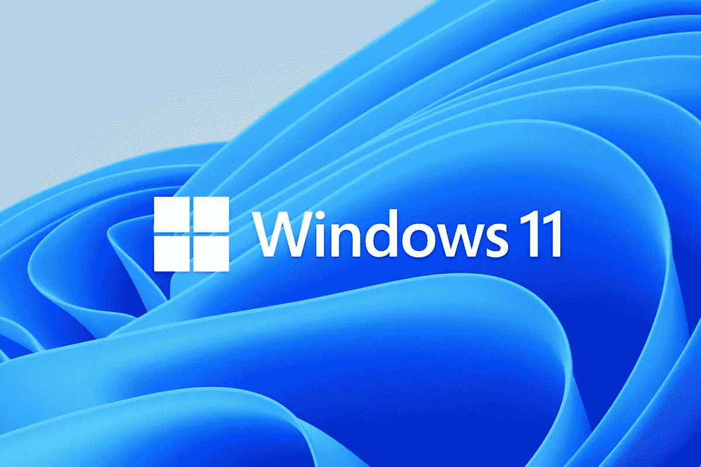
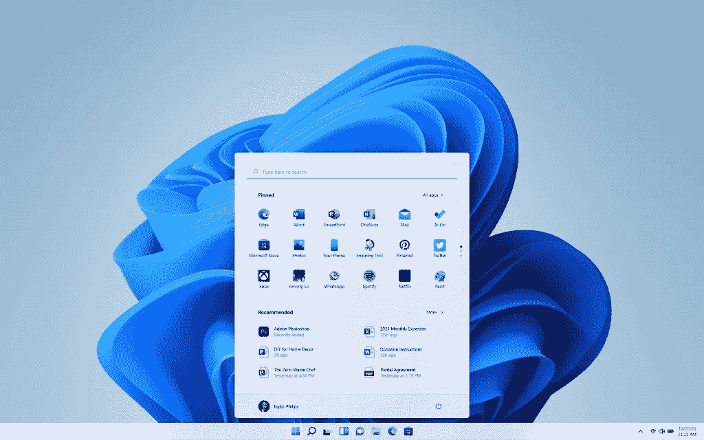
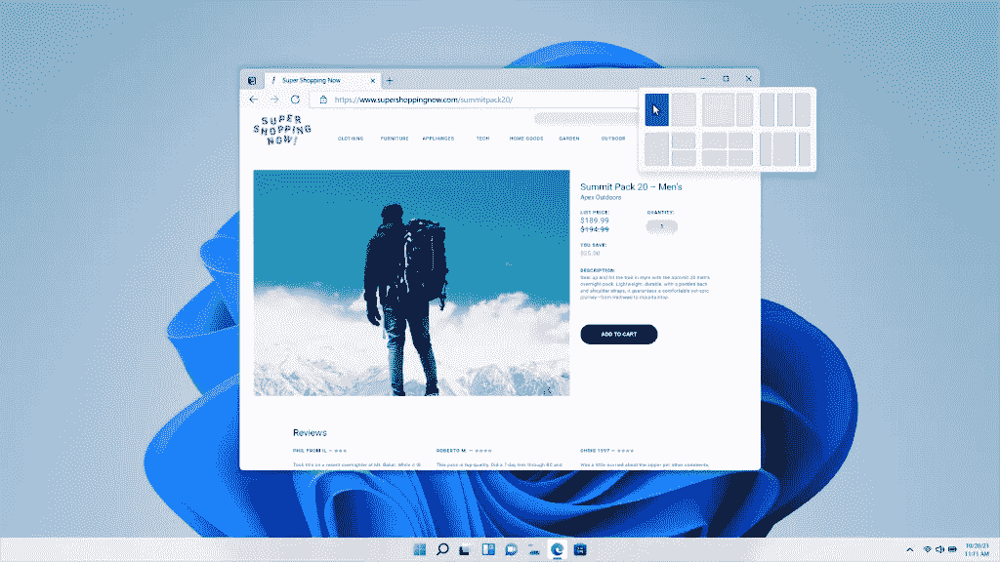
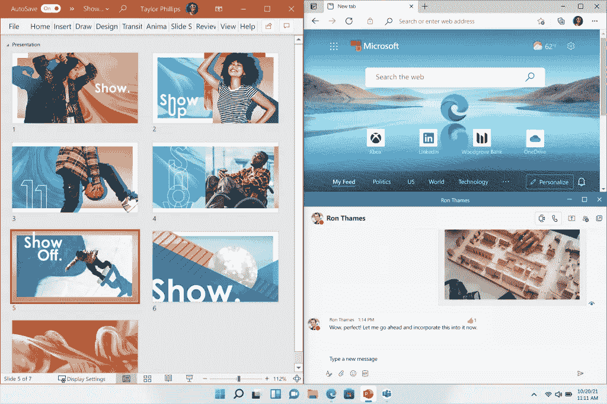
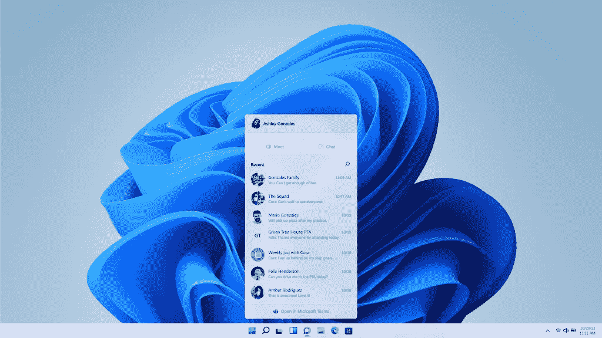
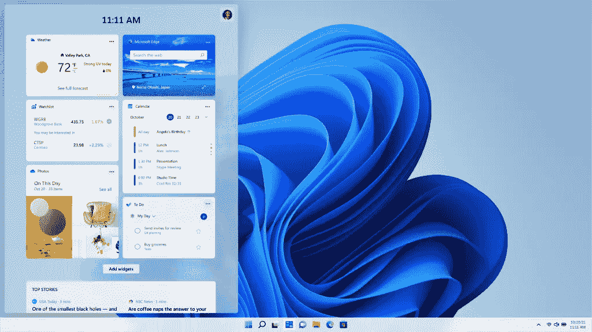
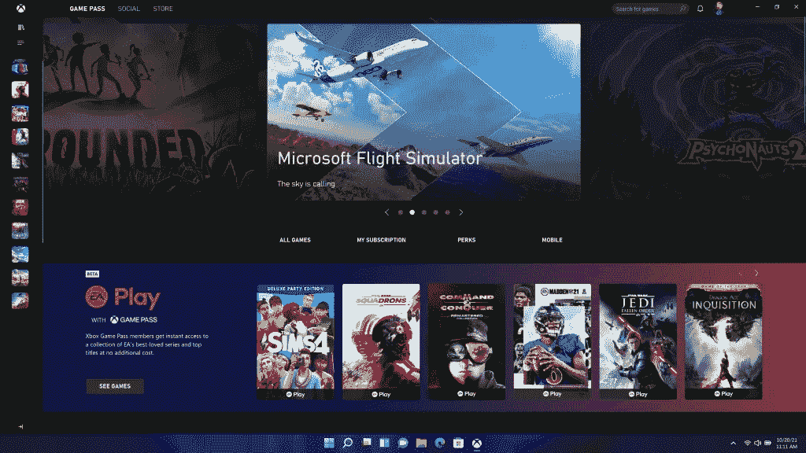
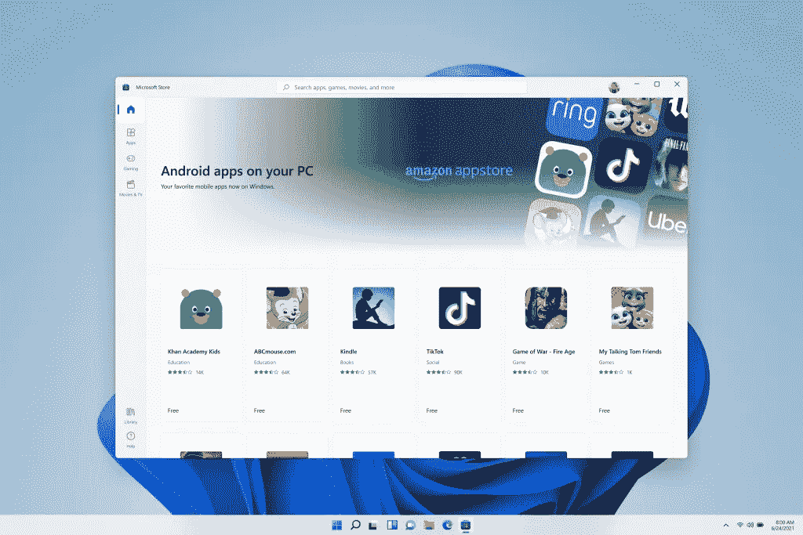

# 微软和 Windows 的下一章。

> 原文：<https://medium.com/geekculture/microsoft-and-the-next-chapter-of-windows-1a57273b2061?source=collection_archive---------64----------------------->

来自 Windows 11 的所有最佳新功能！

上周，微软宣布了 Windows 11，这是 Windows 的下一个重大更新。

此次更新为个人和商业用户提供了一些奇妙的新设计和功能，它将 Windows 带入了一个美丽的 UX 和设计的现代时代。

我之前谈到了微软去年在流畅设计和新硬件计划方面的发展方向，现在一切都开始变得明朗起来。

让我们快速看一下这次更新的一些主要特性。

**新设计**

更新后，你首先注意到的是开始屏幕的新设计和布局。

动态磁贴、列表和纯色都不见了，取而代之的是现代、干净、清晰和更友好的设计，重新设计的图标和应用程序被钉在中央的开始和任务栏上。

其中一些设计来自现已取消的 Windows 10X，当然还有 ChromeOS，我看到一些人提到了与 MacOS 类似的风格，但我认为 Windows 11 任务栏在最右边提供的快速设置比 MacOS 在显示屏右上角提供的设置要多得多。

**Windows 11 Start Menu**

这里有一些深度，包括一些 UI 和一些玻璃面板设计，比如小部件，我稍后会谈到。

**快照布局**

在 Windows 11 中，我们新增了快照布局、快照组和桌面，以提供多任务处理的新方式。这些新功能旨在帮助您整理窗口和优化屏幕，让您可以在视觉上整洁的布局中看到您需要的东西。

**The new snap layout menu.**

这个新的布局菜单选项将节省你的时间，当你忙着多任务，并给你所有的空间，你需要查看你的内容，你也将有六个布局选择选择。

**New snap layout in action with 3 apps.**

这是我最喜欢的新功能之一，非常适合同时使用 Spotify、WhatsApp 和 Edge 等多个应用的人。

**团队新消息**

过去的 18 个月改变了我们的工作方式，需要更多的在线交流，微软团队需要加强和改善在家工作的体验。

**Microsoft Teams integrated into Windows 11.**

在 Windows 11 中，我们可以从集成在任务栏中的微软团队获得聊天信息。现在，您可以随时随地通过文本、聊天、语音或视频与所有联系人联系，无论他们使用的是什么平台或设备，是 Windows、Android 还是 iOS。

如果您要连接的人尚未下载团队应用程序，您仍然可以通过双向短信与他们联系。

对于商业用户来说，这是一个很棒的特性，对于那些不太懂技术的人来说，这将会简单得多。

**微件面板**

Windows 11 为您带来了小工具和新的个性化订阅源，现在您可以直接从桌面打开面板视图来查看天气、日历、笔记和照片等实时信息。

**Widgets panel from the left side of the display.**

当你打开个性化的 feed 时，它会像一块玻璃一样滑过你的屏幕，正如我在新设计中提到的那样，这是一个可爱的新 UI，外观简洁易懂。

我喜欢使用小部件，这些看起来很棒，我希望更多的开发者加入到小部件面板中。

**Xbox 整合**

如果你像我一样是 Xbox 游戏玩家，这非常适合你，因为 Windows 11 通过自动 HDR 释放了系统硬件的全部潜力，提供了更广泛、更生动的色彩范围，带来了令人惊叹的视觉体验。

**Xbox game pass integration.**

通过 Xbox Game Pass for PC 或 Ultimate，游戏玩家可以访问 100 多种高质量的 PC 游戏，并随时添加新游戏，而且很容易通过任务栏找到一起玩的人，无论他们是在 PC 上玩还是在主机上玩。

我总是使用我的 Xbox，但是随着这些小小的改进和微软最终在 Windows 上使用 Xbox 名称，我们得到了一些整洁的集成 UI 选项，我可能最终会开始玩 PC 游戏。

**Windows 上的安卓应用。**

因此，这是一个大事件，对许多人来说是一个惊喜，因为微软首次将 Android 应用程序引入 Windows。

从今年晚些时候开始，人们将能够在微软商店发现安卓应用，并通过亚马逊应用商店下载——直接从你的电脑上使用抖音或 Snapchat。

你还可以通过 APK 安装为任何你在 app store 上找不到的应用程序下载一个应用程序，这对于那些想要访问所有应用程序的人来说非常好。

**Android apps via the Amazon app store.**

这在一定程度上弥补了 ChromeOS 和 MacOS 之间的差距，ChromeOS 支持 android 应用，MAC OS 支持 M1 macbook，也支持一些 iOS 应用。

就我个人而言，我不喜欢桌面上的移动应用，但我知道很多人喜欢，这对他们来说是一个很好的选择。

拥有选择权是最重要的，与 MacOS 相比，微软已经竭尽全力给用户提供了所有的选择。

我是一个重度 Mac 用户，但我有时会使用 Surface，这些更新真的让我考虑永久迁移。我喜欢 Windows 11 的外观和氛围，来自 Teams 和 Xbox 的新集成功能，小工具，当然还有移动应用和快照布局的选择。

这感觉就像一个完美的操作系统，看看他们从这里走向何方会很有趣。

-

Windows 11 将于今年冬天免费升级，请确保使用 PC 健康检查应用程序[T5 这里 检查您当前的 PC 是否有资格接收更新。](https://aka.ms/GetPCHealthCheckApp)

*所有图片均来自微软。*