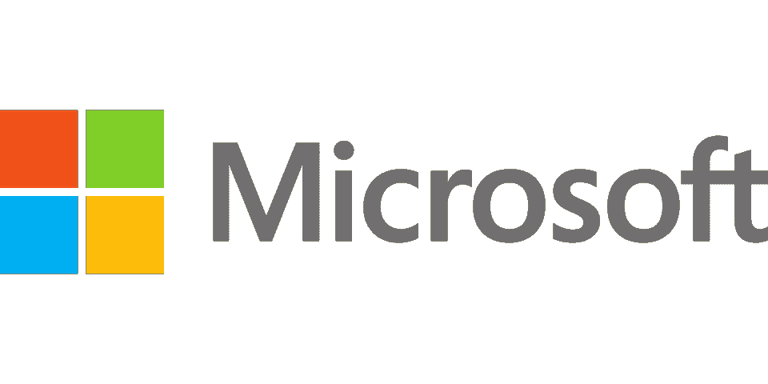

# Microsoft Defender 备忘单

> 原文：<https://medium.com/geekculture/microsoft-defender-cheatsheet-73125923c3c0?source=collection_archive---------9----------------------->

## 了解用于保护计算机系统的 Microsoft Defender

Image by [Simon](https://pixabay.com/users/simon-3/?utm_source=link-attribution&utm_medium=referral&utm_campaign=image&utm_content=80658) from [Pixabay](https://pixabay.com//?utm_source=link-attribution&utm_medium=referral&utm_campaign=image&utm_content=80658)

[什么是微软 endpoint Defender？](#ea8c)
[微软 Defender for endpoint 功能](#8e87)
∘ [扫描](#06a3)
∘ [实时防护](#d9ad)
∘ [勒索软件防护](#d202)
∘ [云端防护](#0c37)
∘ [除外条款](#2fc9)
∘ [限制条款](#5a82)
[雇佣我为你代笔！](#0b7c)
[关注获取更多内容！](#e5bb)
[给以后的题目留个建议！](#f8d8)