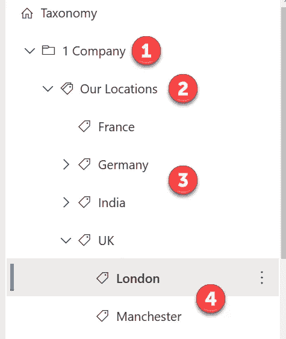
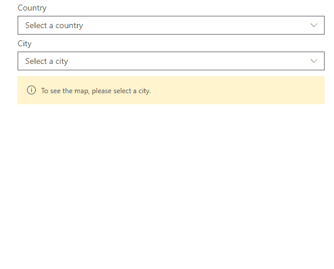

# 用于分类的 Microsoft Graph API(测试版)+ SPFx

> 原文：<https://medium.com/geekculture/microsoft-graph-api-for-taxonomy-beta-spfx-c5c252b2f5da?source=collection_archive---------27----------------------->

在这篇短文中，我们将看看如何在 SPFx web 部件中使用 Microsoft Graph API 进行分类。该端点目前处于测试阶段。

## 分类图形 API

Microsoft Graph API for taxonomy 帮助我们对 Microsoft 365 租户中的分类数据执行 CRUD 操作。更多细节可以在[这里](https://docs.microsoft.com/en-us/graph/api/resources/termstore-store?view=graph-rest-beta)找到。

在 SharePoint 网站中，分类数据可以在多个地方用于多种目的。它帮助我们对 SharePoint 内容进行分类，以便用户能够更快地找到他们需要的内容。由于分类法在 SharePoint 中起着重要的作用，了解如何在 SPFx 中与分类法进行交互对我们非常有帮助，这样我们就可以开发 web 部件/扩展来处理与分类法相关的各种场景。

## 示例代码

在这篇博客中，我们将看一个场景，在这个场景中，我们将使用 Microsoft Graph 从分类中读取数据。博客中解释的所有代码都可以在[这里](https://github.com/pnp/sp-dev-fx-webparts/tree/main/samples/react-graph-cascading-managed-metadata)找到。

## 使用 SPFx 的级联分类下拉列表

为了解释分类法 API 的用法，我们假设如下:

1.  名为“1 个公司”的术语组
2.  名为“我们的位置”的术语集
3.  作为国家/地区的父术语—法国、德国、印度和英国
4.  作为城市的第一级子术语-伦敦和曼彻斯特。

我们将看到如何从术语集中读取所有父术语(国家),然后如何读取父术语下的所有子术语(城市)。

## 使用分类法 API

SPFx web 部件是使用 React 钩子开发的，只接受一个属性作为输入，那就是术语集的 ID(我们的位置)。

当 web 部件加载时，我们获得“我们的位置”(术语集)下的所有国家(父术语)。这一点可以从`[getCountries](https://github.com/pnp/sp-dev-fx-webparts/blob/main/samples/react-graph-cascading-managed-metadata/src/webparts/cascadingManagedMetadata/components/CascadingManagedMetadata.tsx#L42)`方法中看出。在该方法中，我们调用术语集分类 API 的`[List children](https://docs.microsoft.com/en-us/graph/api/termstore-term-list-children?view=graph-rest-beta&tabs=http)`端点，它将列出术语集下的第一级子术语，在本例中是所有国家。然后，我们在国家下拉列表中填充这些国家。

当从下拉列表中选择一个国家时，我们获得所选国家的所有城市(子术语)—`[_onCountryChange](https://github.com/pnp/sp-dev-fx-webparts/blob/main/samples/react-graph-cascading-managed-metadata/src/webparts/cascadingManagedMetadata/components/CascadingManagedMetadata.tsx#L61)`方法。我们称之为术语分类 API 的`[List children](https://docs.microsoft.com/en-us/graph/api/termstore-term-list-children?view=graph-rest-beta&tabs=http)`端点，它将列出一个术语下的第一级子术语——在本例中是所有城市。这些是城市中的人口下拉列表。

目前，我们无法从分类 API 获取术语的自定义属性。然而我们可以得到一个术语的描述。因此，这可以是存储任何与术语相关联的数据的一种选择。在这个场景中，我们在描述中存储一个城市的坐标。我们使用[数据](https://github.com/pnp/sp-dev-fx-webparts/blob/main/samples/react-graph-cascading-managed-metadata/src/webparts/cascadingManagedMetadata/components/CascadingManagedMetadata.tsx#L94)来显示在 [PnP SPFx 地图控件](https://pnp.github.io/sp-dev-fx-controls-react/controls/Map/)中的准确位置。

为了向 Microsoft Graph 发送请求，我们使用了一个[助手类](https://github.com/pnp/sp-dev-fx-webparts/blob/main/samples/react-graph-cascading-managed-metadata/src/webparts/cascadingManagedMetadata/services/MSGraph.ts)。这是由 Mikael Svenson 创建的，可以在任何 SPFx 项目中使用。这个类有 4 个方法来使用 Microsoft Graph 执行 CRUD 操作。

## 贮藏

在这里解释的场景中，当用户与 web 部件交互时，分类法中的数据不会改变。因此，为了提高性能，缓存数据而不是每次都调用分类法 API 是有意义的。当我们得到一个国家下的城市术语时，我们可以将它们存储在缓存中(本地存储)。为了做到这一点，我们使用了一个类，该类具有与[向本地存储器](https://github.com/pnp/sp-dev-fx-webparts/blob/main/samples/react-graph-cascading-managed-metadata/src/webparts/cascadingManagedMetadata/services/MMDService.ts#L45)添加数据和[在需要时从本地存储器](https://github.com/pnp/sp-dev-fx-webparts/blob/main/samples/react-graph-cascading-managed-metadata/src/webparts/cascadingManagedMetadata/services/MMDService.ts#L58)获取数据相关的方法。

## 摘要

多亏了 Microsoft Graph 团队，我们现在能够与分类数据进行交互。在这篇博文中，我们看到了一种在 SPFx web 部件中读取数据的简单方法。这个 web 部件可以很容易地扩展到创建/更新/删除分类数据。在这个 API 提供的各种分类端点的帮助下，所有这些现在都很容易实现。