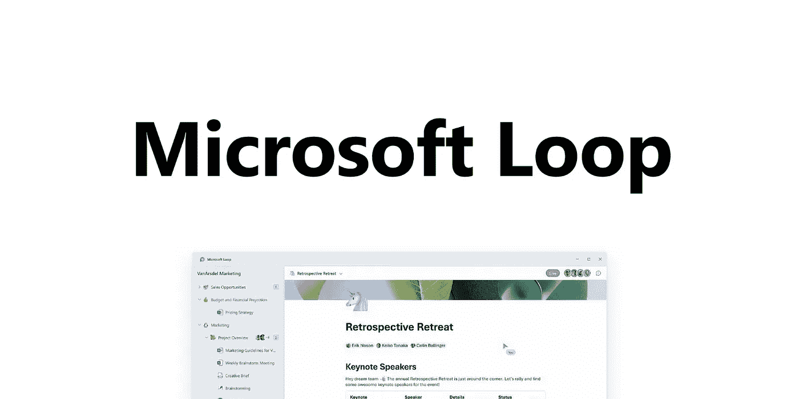

# 微软循环克隆概念

> 原文：<https://medium.com/geekculture/microsoft-loop-clones-notion-d125e5ce1bdd?source=collection_archive---------2----------------------->

## 渴望打破观念，Loop 带来了活的组件和更多

从一开始，微软就一直致力于软件创新。他们面临的最大问题之一是为人们创造下一代工作空间。

与微软团队，规划，项目，OneNote，Word，待办事项，访问和所有其他微软 365…