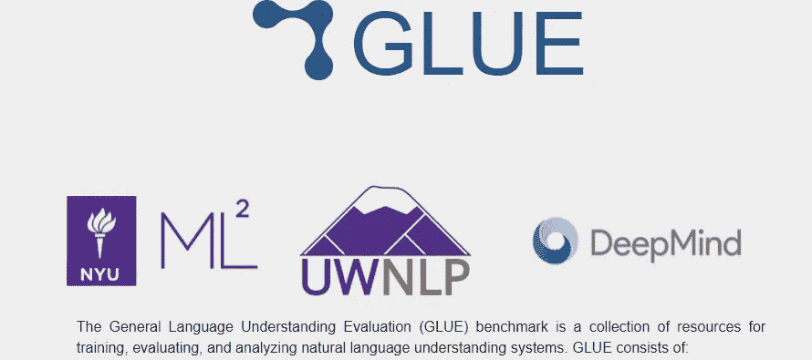
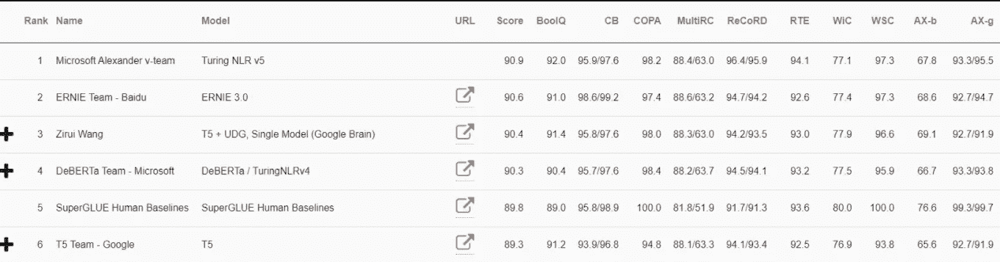
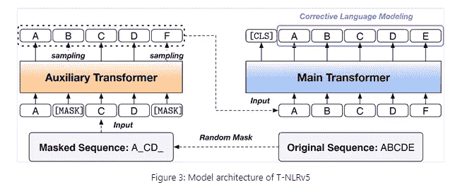
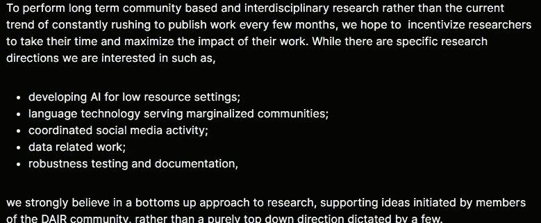
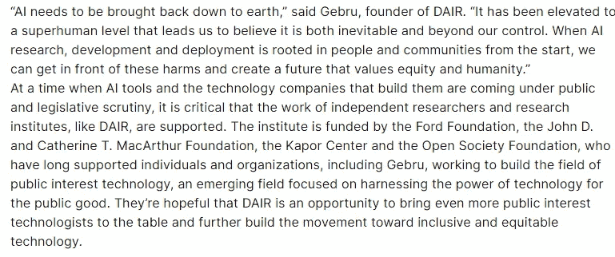

# 微软、Timnit Gebru 和谷歌人工智能

> 原文：<https://medium.com/geekculture/microsoft-timnit-gebru-and-google-ai-85384edc6af7?source=collection_archive---------6----------------------->

## 许多有趣的事情同时发生

为了帮助我了解您[请填写此调查(匿名)](https://forms.gle/7MfQmKhEhyBTMDUD7)

上周对于机器学习来说非常有趣。有很多事件对机器学习有着潜在的长期影响。本文将回顾其中的一些，以便您更多地了解机器学习的一些重要方面以及围绕它们的讨论。这些事件看起来似乎是脱节的，但它们为[提供了不同的侧面，这是机器学习中一个非常重要的讨论](https://medium.datadriveninvestor.com/the-machine-learning-research-crisis-you-should-know-about-c708b8b08ace)。

# 微软在自然语言处理方面向前迈出了一大步

GLUE(通用语言理解评估)和 SuperGLUE 是自然语言处理的基准。根据他们的网站，胶水包括:

*   九个句子或句子对语言理解任务的基准建立在已建立的现有数据集上，并选择覆盖不同范围的数据集大小、文本体裁和难度，
*   一个诊断数据集，用于评估和分析模型在自然语言中的各种语言现象方面的性能，以及
*   一个用于跟踪基准性能的公共排行榜和一个用于可视化诊断集模型性能的仪表板。

强力胶是一种经过更多测试的更硬的胶水。

微软在他们的最新出版物中取得了一些令人印象深刻的进展，“[有效地扩大了语言模型的规模，为 GLUE 和 SuperGLUE](https://www.microsoft.com/en-us/research/blog/efficiently-and-effectively-scaling-up-language-model-pretraining-for-best-language-representation-model-on-glue-and-superglue/) 上的最佳语言表示模型进行了预处理”。据称。为什么据说？

Result on SuperGLUE. MS is at the top.

如果你看一下出版物，他们不怎么分享。该出版物通常含糊不清，使用类似于“*我们还利用了为开发以前的 T-NLR 版本而优化的训练数据集和数据处理管道，包括* [*【德伯塔】*](https://www.microsoft.com/en-us/research/publication/deberta-decoding-enhanced-bert-with-disentangled-attention-2/) *和* [*UniLM*](https://www.microsoft.com/en-us/research/publication/unilmv2-pseudo-masked-language-models-for-unified-language-model-pre-training/) *，以及来自其他微软预训练研究工作的实施优化，如*[*【TUPE】*](https://arxiv.org/pdf/2006.15595.pdf)*。*

这与标准协议非常不同。通常，研究人员会分享他们的方法、处理和其他步骤。这确保了其他人可以从他们的工作中复制、评论和进步。

At least they shared their architecture.

然而，MS 是一家私人公司。他们的目标是盈利。从他们展示他们的发现的方式来看，很可能他们最终也会将该模型作为付费的 API/服务来销售。因此，对他们来说，掩盖许多细节以保持竞争优势是有意义的。MS 通过让许多重量级人物在公共排行榜上名列前茅来弥补这一点。

> *“值得注意的是，T-NLRv5 首先在 MNLI 和 RTE 上实现了人类对等，这是人类对等尚未实现的最后两个胶合任务。此外，T-NLRv5 比最近的预训练模型更高效，在参数和预训练计算成本减少 50%的情况下实现了相当的有效性。”*

# 蒂姆尼特·格布鲁和大科技

She is one of the most influential figures in AI

Timnit Gebru 是一名埃塞俄比亚裔美国计算机科学家，从事算法偏差和数据挖掘研究。她因推动人工智能的多样性而闻名。她去年被谷歌人工智能驱逐，原因是关于某篇论文的冲突。格布鲁说，这篇论文“不符合我们的出版标准”。由于她是一个众所周知的人物，这引起了巨大的反弹。你可以在这里看到一封巨大的网上抗议信。

上周，她建立了自己的机构。分布式人工智能研究所是一个独立的、基于社区的人工智能研究空间，不受大型技术的普遍影响。”

From their website

它由捐款资助。他们暂时能够筹集到资金。然而，观察研究所如何处理未来 ML 研究所需的资金将会很有趣。依赖捐赠会让他们面临传统学术界面临的许多同样的压力(并引发同样的问题)。[这篇文章更深入地探讨了由同行评审和寻找资助中的布局引起的问题。](/mlearning-ai/this-is-stifling-machine-learning-research-1796479a7da9)

走向商业化的研究将增加许多外部因素，可能会偏离该机构的宗旨。获得企业资助肯定会让他们的研究受到影响和干预。

From the press release of DAIR

这类问题非常复杂，涉及许多活动部件。这个机构是新成立的，所以不一定非要现在就成立，但这些是他们必须处理的一些问题。观察他们如何处理这些问题将对机器学习研究产生深远的影响。

# 这些是如何联系在一起的？你该怎么办？

那么它们是如何联系在一起的呢？MSs 不公开他们工作的举动清楚地表明了他们计划如何进行。这也是如今一种趋势的一部分，大型科技公司利用出版物进行炒作，而不是进行学术验证。他们分享结果，但不分享过程，这样会让其他人发现工作中的潜在问题。这是格布鲁将寻求解决的问题之一。

这些如何影响机器学习研究空间待定。要考虑的事情很多。规范大型技术方法/出版物可能会提高可复制性并有助于质量控制。但这也会阻碍他们分享知识(这是过去十年中一些最酷的发现的原因)。就目前而言，我们只能静观其变。

你能做些什么呢？现在，教育你自己。仅仅了解 ML 的机制是不够的，还要了解这个领域是如何运作的。了解该领域的激励结构、用法和偏见将有助于你理解情况的细微差别。这会让你看清形势，并在你认为重要的领域有所作为。毫无疑问，这将会影响到每个人。而且最好有所准备。

如果你喜欢这篇文章，看看我的其他内容。我定期在 Medium、YouTube、Twitter 和 Substack 上发帖(所有链接都在下面)。我专注于人工智能、机器学习、技术和软件开发。如果你正在准备编码面试，看看:[编码面试变得简单](https://codinginterviewsmadesimple.substack.com/)，我的免费每周简讯。

为一次性支持我的工作，以下是我的 Venmo 和 Paypal。任何数额都值得赞赏，并有很大帮助:

https://account.venmo.com/u/FNU-Devansh

贝宝:【paypal.me/ISeeThings 

# 向我伸出手

如果那篇文章让你对联系我感兴趣，那么这一部分就是为你准备的。你可以在任何平台上联系我，或者查看我的其他内容。如果你想讨论家教，发短信给我。如果你想支持我的工作，请使用我的免费 Robinhood 推荐链接。我们都有免费的股票，对你没有风险。**所以不使用它只是失去免费的钱。**

查看我在 Medium 上的其他文章。:[https://rb.gy/zn1aiu](https://rb.gy/oaojch)

我的 YouTube:[https://rb.gy/88iwdd](https://rb.gy/88iwdd)

在 LinkedIn 上联系我。我们来连线:[https://rb.gy/m5ok2y](https://rb.gy/f7ltuj)

我的 insta gram:[https://rb.gy/gmvuy9](https://rb.gy/gmvuy9)

我的推特:[https://twitter.com/Machine01776819](https://twitter.com/Machine01776819)

如果你正在准备编码/技术面试:[https://codinginterviewsmadesimple.substack.com/](https://codinginterviewsmadesimple.substack.com/)

获得罗宾汉的免费股票:[https://join.robinhood.com/fnud75](https://www.youtube.com/redirect?redir_token=QUFFLUhqa0xDdC1jTW9nSU91WXlCSFhEVkJ0emJvN1FaUXxBQ3Jtc0ttWkRObUdfem1DZzIyZElfcXVZNGlVNE1xSUc4aVhSVkxBVGtHMWpmei1lWWVKNzlDUXVJR24ydHBtWG1PSXNaMlBMWDQycnlIVXNMYjJZWjdXcHNZQWNnaFBnQUhCV2dNVERQajFLTTVNMV9NVnA3UQ%3D%3D&q=https%3A%2F%2Fjoin.robinhood.com%2Ffnud75&v=WAYRtSj0ces&event=video_description)