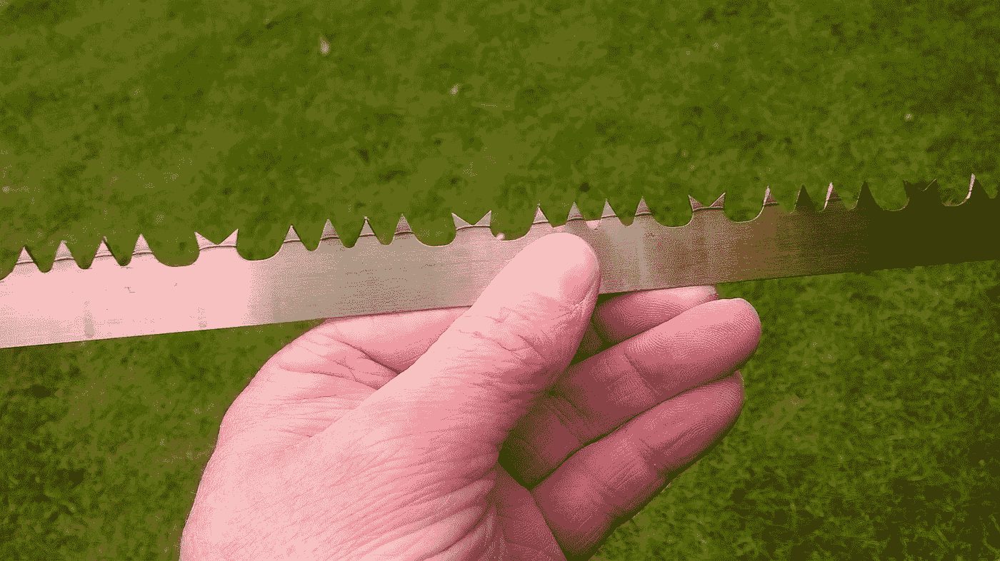

# 微软在 OneDrive 上标记我们照片的勇敢的人工智能努力。

> 原文：<https://medium.com/geekculture/microsofts-valiant-ai-effort-at-tagging-our-photos-on-onedrive-4d08fa576356?source=collection_archive---------15----------------------->

## 他们努力尝试，结果常常很有趣…

© Eugene Brennan

他们似乎已经放弃了对上传到 OneDrive 的照片进行分类的任务。太可惜了！结果往往很搞笑，但我能看出算法是从哪里来的。所以让我们来看看我的一些照片，看看人工智能抛出了什么相关的…