# 中间件组件(。网络核心)-第 1 部分

> 原文：<https://medium.com/geekculture/middleware-components-part-1-eec773b37b7a?source=collection_archive---------1----------------------->

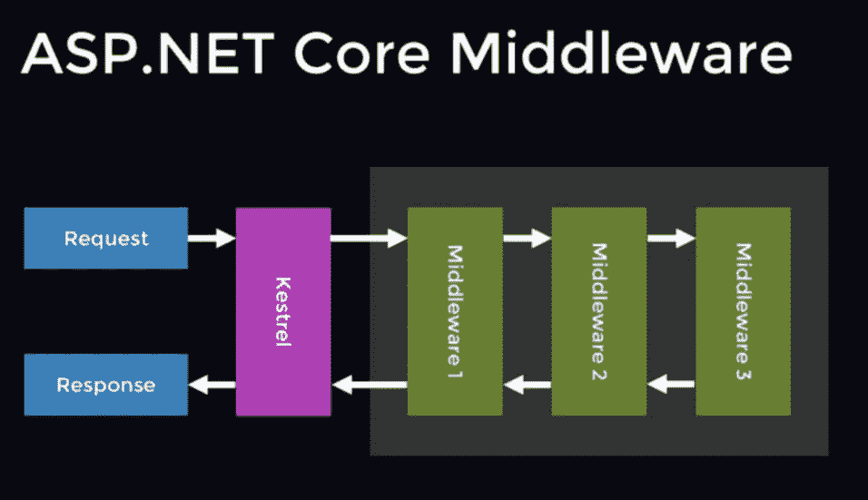

来自 ASP.Net web forms 和 ASP.Net MVC 的背景，其中一个主要的特点让我印象深刻。Net 核心是中间件组件**。如果您使用过早期版本的。Net，在 Core 之前，您可能听说过 http 处理程序和模块(尽管我花了很长时间才学会)。嗯，在。Net 核心，它们被替代了，取而代之的是一个单一的实体，它被称为“中间件组件”。因此，它们可以被视为我们可以用来拦截请求、在请求通过系统时对其进行修改的东西，也可以用来改变响应。简单地说，排列成链的中间件组件形成了请求管道。**

中间件组件是在“StartUp”类的“Configure”方法中编写(或注册)的。

主要有两种中间件组件。标准(内置)和定制中间件组件。

让我们看看一些标准的(它们也很容易理解)。

1.  **欢迎页面中间件**

我们可以为我们的创建一个简单的欢迎页面。Net 核心 app，使用“WelcomePageMiddleware”。当您第一次设置应用程序时，这是很方便的，可以确保处理请求时没有任何问题。

在 startup 类的“Configure”方法中，替换所有默认代码，只放置 app。UseWelcomePage()；

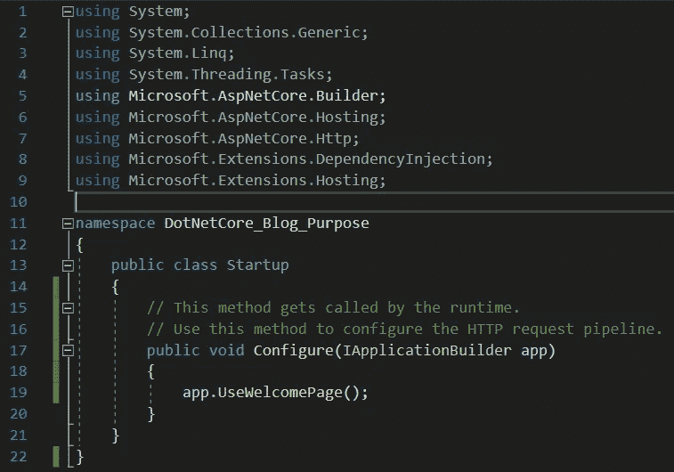

(正如我在之前的博文中提到的。Net 核心应用程序是高度模块化的。如果我们只是想要一个简单的欢迎页面，那么我们不需要用 MVC 或 Web API 组件的所有负担来启动应用程序。我们可以在需要的时候添加这些东西)

如果我们现在运行应用程序，我们可以看到一个简单但漂亮的欢迎页面

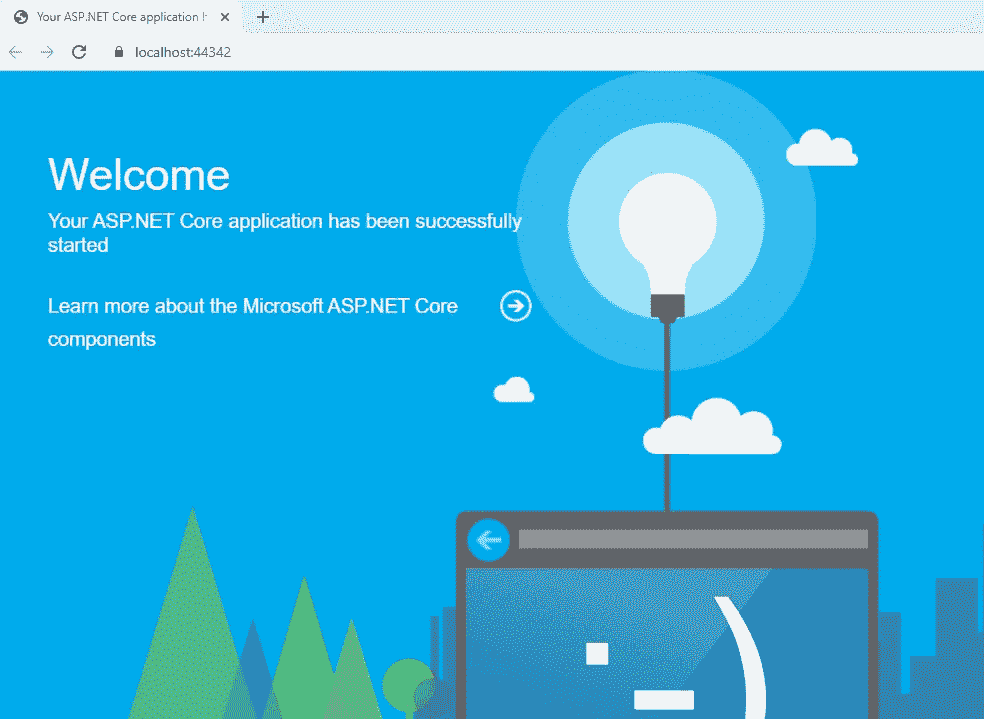

2.**静态文件中间件**

这个中间件组件用在一个应用程序中，该应用程序在被请求时只提供 wwwroot 文件夹中的静态文件。例如，我创建了一个名为 somemessage.html 的静态 html 文件，并将它放在 wwwroots 文件夹中。我还更新了**配置**方法，如下所示:

当我们点击 F5 时，我们可以看到如下结果:

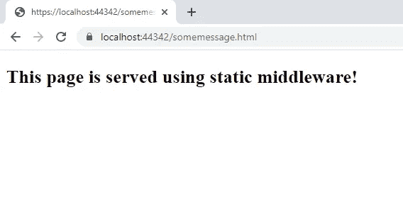

3.**状态卸载中间件**

当服务器端发生一些灾难性错误而没有得到处理时，我们通常会看到 500 内部服务器错误，或者当用户发送无效请求时，我们会看到 404 Not found 错误。如果没有正确地处理这些错误，最终用户会感到困惑，并可能认为应用程序坏了。

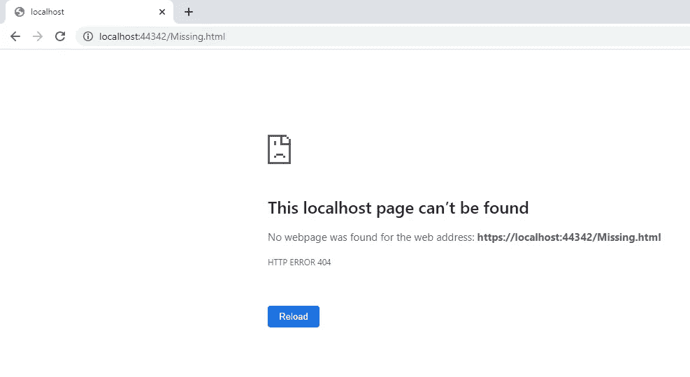

在这种情况下，我们可以使用 statuscodepagesmiddleware 来显示友好的错误代码，如下所示。

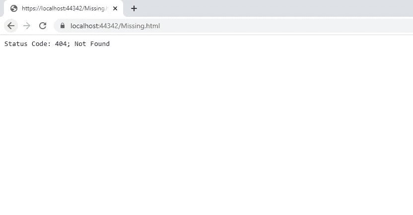

4. **DeveloperException 页面中间件**

当您处于应用程序的开发阶段时，您希望在发生错误时获得尽可能多的信息。这个中间件正好给了你这个。出于演示目的，我建立了一个示例 MVC 应用程序，并故意引入了一个空引用异常。

在这里，我将向您展示有/没有 DeveloperExceptionPage 中间件的情况。

a)不带 DeveloperExceptionPage

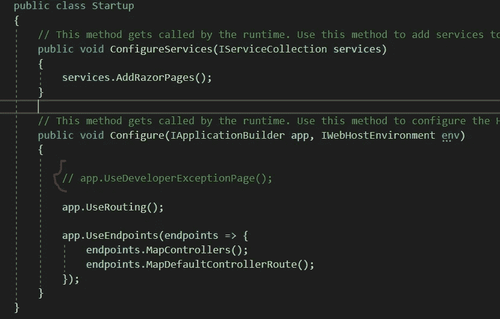

输出是:

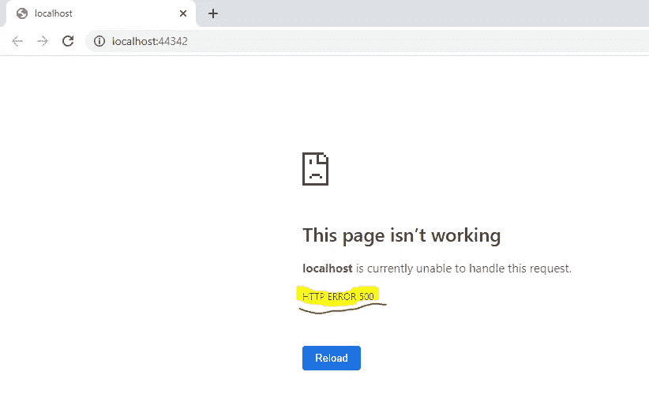

在这里，我们只是得到一个 500 内部错误。没有具体细节。现在让我们看看另一个案例

b)使用 DeveloperExceptionPage

这里我取消了 UseDeveloperExceptionPage()方法的注释。

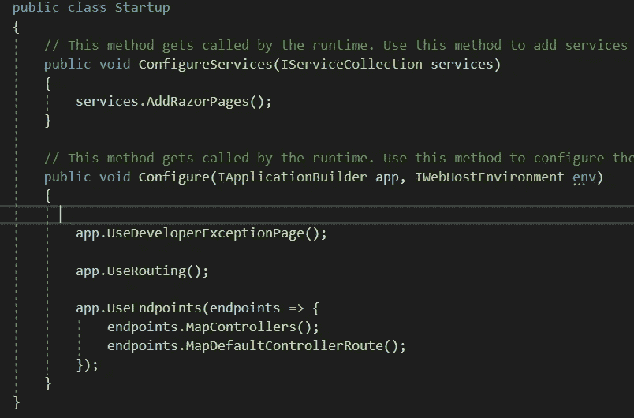

这是输出结果:

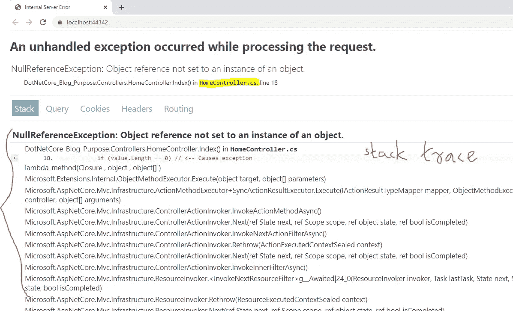

我认为照片本身是不言自明的。在这里，我们以直观的方式获得了异常的完整细节，包括堆栈跟踪。

5.**生产中的异常 HandlerMiddleware。**

当您处于应用程序的开发阶段时，DeveloperExceptionMiddleware 非常方便。但是一旦 app 被推送到生产端呢？透露错误的详细信息对恶意攻击者非常有用。为了解决这个问题，我们可以使用 ExceptionHandlerMiddleware。如果生产中出现错误，用户将被重定向到预定义的错误页面(不显示堆栈跟踪等)，这在外观上与应用程序的其他部分一致。为此，我们只需要在 Configure 方法中进行微小的修改。

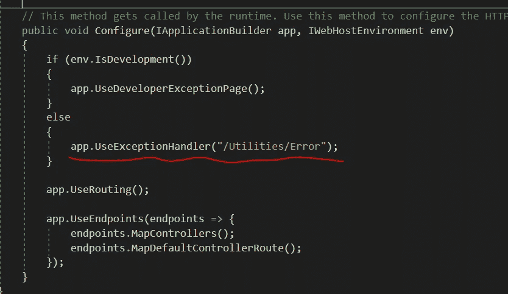

# 结论:

嗯，对于中间件组件来说，这是一个卑微的开始。让我们在下一篇文章中看看如何创建定制的中间件组件。

感谢阅读！