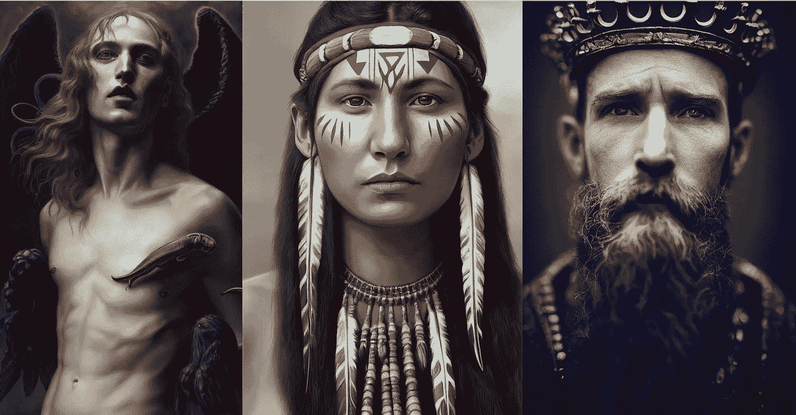

# MidJourney 的重大更新修复了其最大的缺陷

> 原文：<https://medium.com/geekculture/midjourneys-major-update-fixes-its-biggest-flaw-86dd0b353126?source=collection_archive---------1----------------------->

Image by [Jim Clyde Monge](https://medium.com/u/819323b399ac?source=post_page-----86dd0b353126--------------------------------)

今天，从简单的文本提示中生成令人难以置信的图像的人工智能模型 MidJourney 发布了一个全新的模型，该模型修复了其最大的缺陷之一——扭曲的人脸。

为了更好地说明差异，请看这两张图片。在左边，新模型被关闭，而在右边，它被打开。