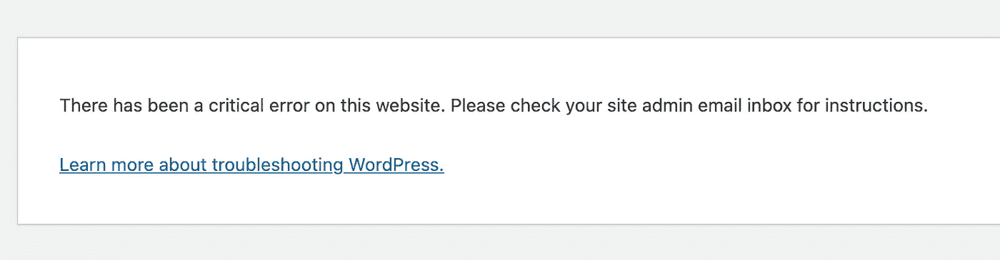
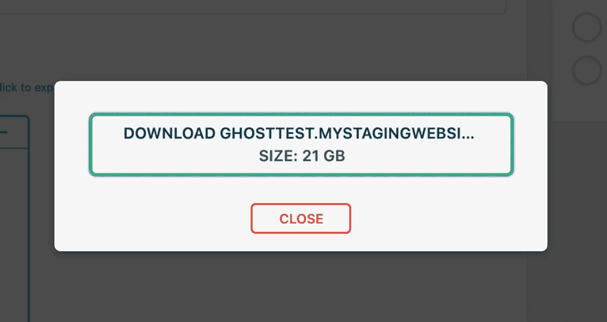
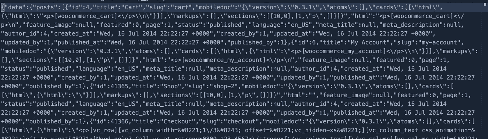
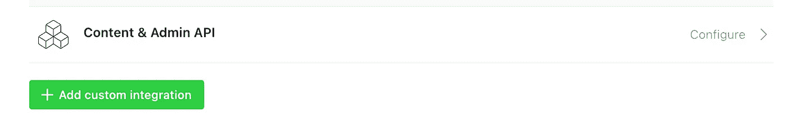
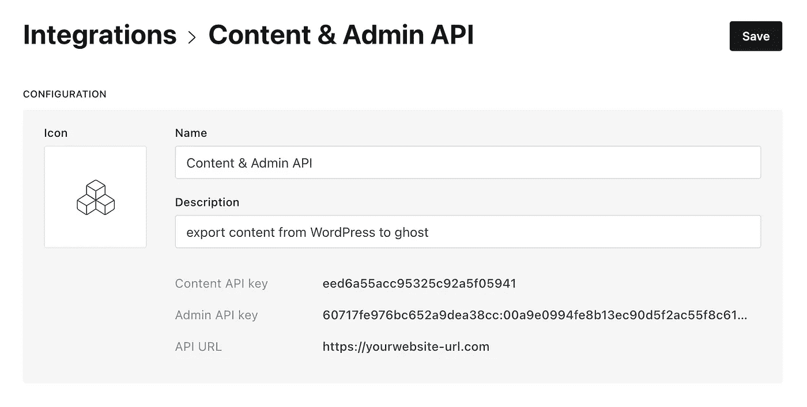
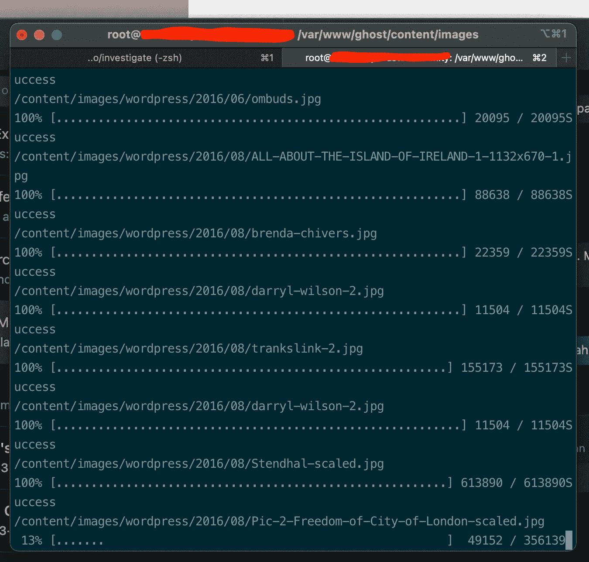

# 从 WordPress 迁移到 Ghost CMS:因为 Ghost 迁移插件是不够的

> 原文：<https://medium.com/geekculture/migrate-from-wordpress-to-ghost-cms-b19d30950520?source=collection_archive---------9----------------------->

在我写了一篇关于在亚马逊 Lightsail 上安装 Ghost 4.0 的文章后，我使用了 Bitnami 和 S3 集成以及 Mailgun

我收到了一位新客户的邮件，内容是关于帮助他将使用 WordPress 的社区新闻网站迁移到 Ghost CMS。

他想迁移到 Ghost CMS 的原因之一是因为 Ghost CMS 上的会员订阅功能非常强大。

他有成千上万的数据和每天十万的访问者。因此，将 WordPress 迁移到 Ghost CMS 可能会很痛苦。

Google 上关于从 WordPress 迁移到 ghost cms 的迁移文章可能只适用于安装了标准插件的少量数据的 WordPress 网站。

相信我，我在谷歌上尝试了许多关于如何将 WordPress 迁移到 Ghost CMS 的可用解决方案，但没有一个有效。

如果你已经安装了与你的 WordPress 文章集成的插件，Ghost CMS 迁移插件也不会工作。

我来和大家分享一下我所面临的问题，以及我解决问题的方式。

# 1.ghost 导出时出现严重错误

“该网站出现了一个严重错误。请查看您的站点管理员电子邮件收件箱以获取说明。了解更多有关 WordPress 疑难解答的信息。



这不仅仅是关于内存大小限制，最大主体大小，或者 PHP 配置或 WordPress 配置的超时问题。这是因为库行为需要巨大的内存，而我的客户机只有有限的内存资源。

**解决了**

我可以通过安装 WordPress 插件[多合一 WP 迁移](https://wordpress.org/plugins/all-in-one-wp-migration /)并导出 21GB 帖子和图片的数据来解决这个问题。



在那之后，我使用 [Docker](http://docker.com/) 在我的本地系统上安装 WordPress，在我的本地恢复由 [All-in-One WP Migration](https://wordpress.org/plugins/all-in-one-wp-migration /) 导出的数据，然后使用 [Ghost 插件](https://wordpress.org/plugins/ghost/)转换数据以便能够在 Ghost CMS 中使用。

Docker 帮助我节省时间和精力。你可以在这里跟随 docker-compose WordPress 教程[，也可以从我的公共 gist 使用我之前用过的](https://docs.docker.com/compose/wordpress/) [docker-composer.yml](https://gist.github.com/rririanto/54a40fe25838efe7130bc7ac1ce75191) 。

# 2.504 网关超时幽灵 cms

在我成功地将数据从服务器备份和恢复到我的本地系统之后。当我试图从 ghost 网站导入 Ghost 导出插件时，我遇到了一个错误。

如果我调查，我发现它的发生是因为 JSON 结构无效。导出结果留下了无效的结构关键字。



因此，我们有两个选择来解决这些问题。
1。通过使用自动化脚本(如 https://github.com/hughrun/ghost-to-wp 的[和 T2 的](https://github.com/hughrun/ghost-to-wp)[)来精炼 JSON 文件](https://github.com/hughrun/ghost-to-wp)

2.使用 Ghost [内容 API](https://ghost.org/docs/content-api/) 和[管理 API](https://ghost.org/docs/admin-api/) 创建脚本来插入数据。

我选择第二个选项，因为我想确保一切都如我所愿。

## 创建内容 API 和管理 API

我非常喜欢 Ghost CMS 的一点是它的无头特性。我们可以通过创建 API 集成来进行任何我们想要的集成。

只需进入 ***集成- >添加自定义集成***



创建集成名称**内容&管理 API**



我们将使用这些 API 凭证从我们的备份中加载帖子，并在 Ghost CMS 上创建帖子。

## 使用 Ghost CMS 管理 API 创建 Python 脚本来恢复内容

我们基本上创建了自己的脚本来将我们的帖子从 WordPress 恢复到 Ghost CMS。不要忘记安装依赖项。

用您的凭据替换它

```
CONTENT_API = "<YOUR CONTENT API>"
ADMIN_API = "<YOUR ADMIN API>"
API_URL = "<URL ENDPOINT>"
JSON_PATH = "<YOUR JSON PATH>"
```

确保 JSON 的路径文件是正确的。最好创建一个新目录，并将脚本与 JSON 文件放在同一个目录中。然后运行脚本即可。

## 恢复图像

要恢复图像，我们可以上传使用[多功能一体机](https://wordpress.org/plugins/all-in-one-wp-migration /)下载的图像。使用 SCP 或 SFTP 协议上传到目录/ghost/content/images。

## 创建 Python 脚本来恢复图像

由于我不选择图像的备份，我需要创建一个脚本来从以前的网站下载图像。基本上，在我们将主域名指向新网站(Ghost CMS 版本)之前，我们仍然有 WordPress 版本。

我把脚本上传到了/ghost/content/images 目录下。并从那里运行脚本。我其实很想用 [Ghost Admin API](https://ghost.org/docs/admin-api/#images) 上传图片，可惜不行。这么多关于图像 API 的问题，但没有一个是 Ghost 解决的。

确保您还将 JSON 文件上传到/ghost/content/images，因为脚本将加载 JSON 文件并细化路径，然后下载图像。



之后，我们用 Ghost CMS 版本将主域名指向我们的新网站。我们最终成功地将 WordPress 网站迁移到 Ghost CMS。

我知道我们可以创建一个脚本来简化这个过程。这一次，我想分解一下，这样我们就可以看到将网站迁移到 Ghost CMS 所需的每个步骤和过程。

我知道这需要技术含量，但是如果你不是技术人员，你可以给我发电子邮件。

希望这有帮助！请[给我](mailto:hi@rahmatramadhan.com)一些反馈！