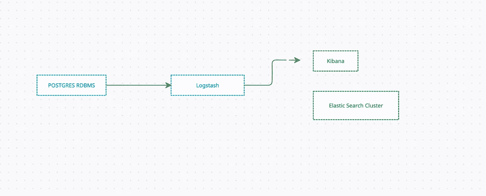
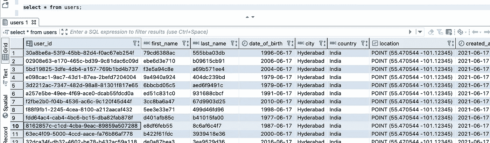

# 将几何图形和 JsonB 数据从 Postgres 迁移到来自 logstash JDBC 输入插件的 ElasticSearch

> 原文：<https://medium.com/geekculture/migrate-geometry-and-jsonb-data-from-postgres-to-elasticsearch-from-logstash-jdbc-input-plugin-d304a8ad47a6?source=collection_archive---------24----------------------->

这个故事解释了如何将 Postgres 表中的数据迁移到弹性搜索，包括使用 logstash 的几何和 JSONB 数据。最近，我开始对我们的应用用例使用弹性搜索，以避免来自微服务的交叉数据连接。

Logstash 帮助我们将不同来源的数据植入到弹性源索引中。这里，我们的源是 Postgres DB 实例。我们有广泛的用例，其中之一是将 geometry 和 JSONB 数据迁移到弹性搜索索引。

> 我必须花几个小时来破解这个，因为我是 logstash 的新手。花了几个小时来理解 JDBC 输入插件和其他过滤器。在迁移特殊类型(geometry 和 JSONB)方面，我还没有从 google 获得足够的支持。所以我想分享我的经历。

**什么是 logstash？**

Logstash 动态地接收、转换和发送您的数据，而不管其格式或复杂性如何。使用 grok 从非结构化数据中导出结构，从 IP 地址中破译地理坐标，匿名化或排除敏感字段，并简化整体处理。

当数据从源传输到存储时，Logstash 过滤器解析每个事件，识别命名字段以构建结构，并将它们转换为通用格式以实现更强大的分析和业务价值。

Logstash 可动态转换和准备您的数据，无论其格式或复杂性如何:

*   用 grok 从非结构化数据中获取结构
*   从 IP 地址破译地理坐标
*   匿名化 PII 数据，完全排除敏感字段
*   简化整体处理，独立于数据源、格式或模式。

这是用例。



**如何本地安装？**

为了在本地拥有它，我为 ELK 堆栈创建了一个 docker-compose 文件(弹性搜索和 Kibana)。后来在本地安装了 logstash。

docker-为 ES 编写文件，为 UI 编写 Kibana 文件。

es 总共考虑了三个节点。

我已经使用这个[链接](https://gist.github.com/ErikNovak/186e6021cf30db9160c673ee3145629f)在我的本地安装并启用 logstash。

**将数据从 Postgres 迁移到弹性搜索**

为此，我们必须使用 logstash。在此之前，让我们检查数据库。

我创建了一个名为`**users**`的表，表中有一个几何图形和 JSONB 数据类型。

```
**CREATE** **TABLE** public.users (
   user_id uuid **NOT** **NULL** **DEFAULT** uuid_generate_v4(),
   first_name **text** **NOT** **NULL**,
   last_name **text** **NULL**,
   date_of_birth **date** **NULL**,
   city **text** **NULL**,
   country **text** **NOT** **NULL**,
   location **geometry** **NOT** **NULL**,
   created_at **timestamp** **NOT** **NULL** **DEFAULT** **now**(),
   updated_at **timestamp** **NULL**,
   additional_data **jsonb** **NOT** **NULL** **DEFAULT** '{}'::**jsonb**,
   **CONSTRAINT** users_pkey **PRIMARY** **KEY** (user_id)
);
```

我插入了大约 500 条记录的测试数据，只是为了测试 logstash 和 ES。



数据管道通常包含三个部分:输入、过滤和输出。对于我们的用例

> **输入→ RDBMS (JDBC 插件)**
> 
> **Filter →我们用的是 Ruby，也是 mutate filter。**
> 
> **输出→弹性搜索**

**JDBC 输入插件**

通常这个插件的用途是连接 JDBC 实例，执行一个查询，并获得数据传递到后期 ie。，过滤输出。

你可以在这里 **找到 JDBC 外挂[的所有选项。](https://www.elastic.co/guide/en/logstash/current/plugins-inputs-jdbc.html)**

logstash 的配置是 conf 文件。

```
input {
  jdbc {
    jdbc_driver_library => "<Path to>/postgresql-42.2.19.jar"
    jdbc_driver_class => "org.postgresql.Driver"
    jdbc_connection_string => "jdbc:postgresql://localhost:5434/<schema>"
    jdbc_user => <username>
    jdbc_password => <password>
    jdbc_paging_enabled => true
    #schedule => "* * * * * *"
    statement => "select user_id as userId, first_name as firstName, last_name as lastName, date_of_birth as dateOfBirth, city as city, country as country, st_asgeojson(location) as location, created_at as createdAt, updated_at as updatedAt, additional_data::text as additionalData from users"
    use_column_value => true
    tracking_column => "userId"
  }
}
```

`***tracking_column***` 对我来说是主键。

首先，让我们假设没有像 Geometry 和 JSONB 这样的特殊字段，只有文本、数字、布尔和日期字段。在这种情况下，不需要任何过滤器。可以直接有一个输出插件。

```
output {
  stdout {  
        codec => json_lines  
    } 
  elasticsearch {
      hosts => ["localhost:9200"]
      index => "users_test"
      document_id => "%{userId}"
  }
}
```

但是，如果您的表有 geometry、JSONB 或任何其他特殊类型的数据类型，没有任何过滤器，您将得到下面的异常。

> [JDBC 插件—缺少完整类名的转换器处理=org.postgresql.util.PGobject，simple name=PGobject](https://discuss.elastic.co/t/jdbc-plugin-missing-converter-handling-for-full-class-name-org-postgresql-util-pgobject-simple-name-pgobject/163772)

如果您遇到这种异常，那么您必须获取文本形式的数据，并根据您的要求解析它。

**几何和 JSONB 如何解决这个问题？**

PostGIS 中的几何相当于 geo_point 或 geo_shape。我会选择 geo_point，因为我在 PostGIS 中选了 point。

`geo_point`可以用 5 种不同的方式储存。
请看这个[链接](https://www.elastic.co/guide/en/elasticsearch/reference/current/geo-point.html)

***作为对象***

```
{
   "point": { 
       "lat": 41.12,
       "lon": -71.34
    }
}
```

***为字符串***

```
{
    "point": "41.12,-71.34"
}
```

***为 GEOHASH***

```
{
    "point": "drm3btev3e86"
}
```

***为数组***

```
{
    "point": [ -71.34, 41.12 ]
}
```

***为 WKT 点图元***

```
{
    "point" : "POINT (-71.34 41.12)"
}
```

我将在选项 4 和选项 5 中进行解释。

**如何在 ES 中存储 JSONB**

JSON 数据可以存储为对象或扁平化类型。

**为地理点应用过滤器**

有很多方法可以应用滤镜，但是使用 ruby 滤镜我们可以

```
filter {
    ruby {
        code => "
            require 'json'
            begin
                point_json = JSON.parse(event.get('location'))
                event.set('lon', point_json['coordinates'][0])
                event.set('lat', point_json['coordinates'][1])
            rescue Exception => e
                event.tag('invalide boundaries json')
            end
        "
    }
}
```

**为 JSON 对象应用过滤器**

使用 Ruby JSON 函数，数据被解析为 JSON 对象。

```
filter {
    ruby {
        code => "
            require 'json'
            begin
                data_json = JSON.parse(event.get('additionaldata').to_s || {})
                event.set('data', data_json)
            rescue Exception => e
                event.tag('invalide boundaries json')
            end
        "
    }
}
```

我们需要另一个过滤器来转换和替换字段名(通常在 RDBMS 中，列名由“_”分隔)。这将被替换为 camelCase 约定)。

```
filter {
  mutate {
      ***rename => {
        "data" => "additionalData"
      }***
      ***replace => {
        "location" => "POINT(%{lon} %{lat})"
      }***
      rename => {
        "userid" => "userId"
      }
      rename => {
        "firstname" => "firstName"
      }
      rename => {
        "lastname" => "lastName"
      }
      rename => {
        "dateofbirth" => "dateOfBirth"
      }
      rename => {
        "createdat" => "createdAt"
      }
      rename => {
        "updatedat" => "updatedAt"
      }
      remove_field => ["lat", "lon", "[@version](http://twitter.com/version)", "[@timestamp](http://twitter.com/timestamp)", "additionaldata", "data"]
    }
}
```

**根据 RDBMS** 为索引创建映射

如果不创建映射，logstash 将创建一个索引，并按照第一个记录数据类型创建映射。如果映射是自动创建的，可能会有一些偏差。所以总是建议创建一个映射。

**完整的日志存储配置文件**

这是日志文件。我已经截断了日志文件中的数据日志。