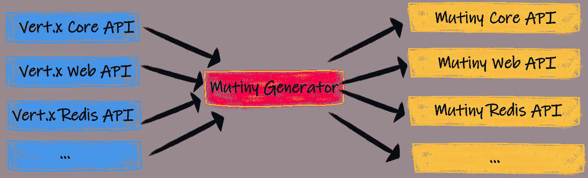

# 从 Vert.x 迁移到 Quarkus

> 原文：<https://medium.com/geekculture/migrating-from-vert-x-to-quarkus-f8441507e93f?source=collection_archive---------2----------------------->


如果你已经在使用一个基于 **Vert.x** 的应用程序，或者任何使用 **Java、**内的反应式编程库的类型，也许缺少的那块拼图就是将**云原生**和**微概要文件**兼容栈，比如 **Quarkus** 及其**生态系统**添加到你的应用程序中。无论是其 **Jakarta EE** 、 **Spring** 、 **Vert.x** 还是其他一些内部生产的堆栈，都有几种方式。

本指南将快速介绍如何从原生 Vert.x 堆栈迁移过来，以及迁移后会发生什么。

# 为什么？

Vert.x 和 Quarkus 有什么共同点？

Eclipse**[**vert . x**](https://vertx.io/)是一个构建反应式应用程序的工具包。它被设计成轻量级和可嵌入的。Vert.x 定义了一个**反应式**执行模型，并提供了一个大的生态系统。 **Quarkus** 基于 Vert.x，几乎所有与网络相关的功能都依赖于 Vert.x，而来自 **Quarkus** 的很多反应式功能*并不显示* Vert.x，而是在引擎盖下使用。最重要的是 Quarkus 能够将 JVM **字节码**编译成**本机**可执行文件。**

**这段引用自" *Vert.x in Action"* 的话框定了使用框架的常见方法。**

> **Quarkus 统一了命令式和反应式编程模型，而 Vert.x 是该框架的基石。Vert.x 不仅仅用于为网络堆栈的某些部分供电；有些客户端模块是直接基于 Vert.x 的，比如 Quarkus 邮件服务和反应路由。您还可以在 Quarkus 应用程序中使用 Vert.x APIs，反应式和命令式的统一有助于您在两个世界之间架起桥梁。Vert.x 和 Quarkus 有不同的编程范式:Vert.x 将吸引喜欢工具包方法的开发人员，或者喜欢 Node.js 的开发人员。相反，Quarkus 将吸引喜欢固执己见的堆栈方法的开发人员，这种方法具有依赖性注入和约定胜于配置。最终，两个项目一起工作，你用 Vert.x 开发的任何东西都可以在 Quarkus 中重用。**

****

**Vert.x in action by Julien Ponge**

**迁移的其他原因也可能是想要:**

*   **随着时间的推移，调查本机编译和内存使用情况**
*   **研究 MicroProfile 中的额外功能**
*   **调查应用程序的整体性能以及开发时间**

# **先决条件**

*   **关于 Vert.x 的基本知识**

# **前言**

**在开始之前，这些发现主要适用于版本≥ 4 的 Vert.x。出于范围的考虑，本文省略了 Vert.x 中相当多的客户端模块。**

# **迁移**

**假设我们有一个基于 **Vert.x** 的堆栈，过渡的过程会有多无缝？是否如社区营销的那样天衣无缝？让我们来了解一下！**

**不过，有一些要点需要考虑，您当前的应用程序是否运行了任何阻塞代码？即使是这样，Quarkus 也提供了 RESTEasy 反应路线来运行带有`@Blocking`注释的阻塞代码。稍后将详细介绍这一主题。**

**由于 Quarkus 框架从一开始就严重依赖于 **Vert.x 线程池**，当你买到一个*云原生堆栈*作为便宜货时，迁移的好处可能会超过坏处，即使你没有想到一个反应式应用程序，也可能会有其他好处。**

# **SmallRye 兵变 Vert.x 绑定**

**有了 Quarkus，你还可以得到**哗变**，这是一个直观的事件驱动的 Java 反应式编程库。Vert.x 绑定简化了纯 **Vert.x** 和 **Quarkus** 应用的反应式编程。哗变 Vert.x 是所有**vert . x API**的松散包装。**

**所以如果你熟悉 Vert.x，你就知道 Vert.x 提供了不同的 API 模型。 *bare* Vert.x API 使用回调，兵变变种使用`Uni`和`Multi`。**

**绑定由下面的注释包装。**

```
@MutinyGen(<Vert.x client class>)
```

****

**Mutiny generator produces Vert.x bindings (from quarkus.io)**

# **访问 Vert.x**

**你可以在你的 **Quarkus** 应用豆中注入两种`Vertx`和`EventBus`中的任何一种。**

**您将根据您的用例选择其中之一。**

*   **`bare`:对于高级用途，或者如果您有想要在 Quarkus 应用程序中重用的现有 Vert.x 代码**
*   **`mutiny`:兵变使用两种反应:`Uni`和`Multi`。这是目前*推荐的* API。**

**一旦添加了`quarkus-vertx`扩展，您就可以使用`@Inject`访问*管理的* Vert.x 实例，这取决于您的选择。**

*   **`@Inject io.vertx.mutiny.core.Vertx vertx` *兵变 api***
*   **`@Inject io.vertx.core.Vertx vertx` *裸 api***

**我将给出两种不同的客户端扩展的几个例子。然而，在下面你可以找到一个广泛的清单，列出了 smallrye 兵变目前支持的 **Vert.x 绑定**。**

**[](https://github.com/smallrye/smallrye-mutiny-vertx-bindings/tree/main/vertx-mutiny-clients) [## small rye/small rye-兵变-vertx-绑定

### 这个项目产生了 Vert.x API 的哗变变种。要生成兼容性报告，您需要:生成…

github.com](https://github.com/smallrye/smallrye-mutiny-vertx-bindings/tree/main/vertx-mutiny-clients) 

# 抽象垂直的

假设您当前的 Vert.x 项目扩展了这个基本抽象类。

```
import io.vertx.core.AbstractVerticle;
```

将它迁移到 Quarkus，您将开始添加 quarkus-vertx 扩展。

```
<dependency>
  <groupId>io.quarkus</groupId>
  <artifactId>quarkus-vertx</artifactId>
</dependency><dependency>
  <groupId>io.quarkus</groupId>
  <artifactId>quarkus-vertx-web</artifactId>
</dependency>
```

在 Quarkus 中，这自然会解析为这个包含 Vert.x 实例上下文的导入和抽象类，并可通过 **CDI** 解析。

```
import io.smallrye.mutiny.vertx.core.AbstractVerticle;
```

# 使用 Vert.x web 客户端

正如您可以注入上面看到的 Vert.x 实例一样，您可以以类似的方式在 Quarkus 应用程序中使用 Vert.x 客户端。本节以`WebClient`为例。添加扩展，通过使用以下扩展来公开裸 API 及其对应的 Vert.x 哗变包装器。

```
<dependency>
  <groupId>io.smallrye.reactive</groupId>
  <artifactId>smallrye-mutiny-vertx-web-client</artifactId>
</dependency>
```

# 使用

*裸 api*

```
import io.vertx.ext.web.client.WebClient;
```

或者*兵变 API*

```
import io.vertx.mutiny.ext.web.client.WebClient;
```

# 使用 Vert.x postgres 数据库客户端

这同样适用于 postgres 数据库客户端的实例

```
<dependency>
  <groupId>io.quarkus</groupId>
  <artifactId>quarkus-reactive-pg-client</artifactId>
</dependency>
```

一旦导入，您就可以开始使用这两个 API 中的任何一个。

*裸 API*

```
import io.vertx.sqlclient.SqlClient;
```

*兵变 API*

```
import io.vertx.mutiny.sqlclient.SqlClient;
```

换句话说。如果认为有必要进行更高级的使用，总是有可能退回到裸 api。

# 我们当前的主要垂直

假设我们在下面的 Vert.x 本地应用程序中有下面的**vertical**，它公开了不同的 CRUD 路径，我们将如何处理不同的方法？

# 裸 API 迁移方法

如前所述，从一个 **Vert.x bare API** 的角度来看，没有什么真正的变化。当使用必要的哗变客户端扩展或者仅仅使用 **quarkus-vertx** 扩展时，所有裸露的 API 都是暴露的。现在，bean 可以由 CDI 上下文管理，该上下文将 Vert.x 实例作为 CDI bean，我们可以用它来注册自定义路由。这是通过观察应用程序的启动事件的方法来完成的。

```
public void init(@Observes StartupEvent e, Vertx vertx, MainVerticle verticle, Router router) {

    router.route().handler(BodyHandler.*create*());
    registerRoutes(router);
    vertx.deployVerticle(verticle).await().indefinitely();
}
```

然而，如果 want 真的想揭穿所有的魔术，这里有一篇很好的文章描述了如何以编程方式设置在 Quarkus 中运行的 **Vert.x** 实例。

[](https://quarkus.io/blog/magic-control/) [## 厌倦了魔术？

### Quarkus 应用程序是 Java 应用程序。因此，在某个地方有一个公共的静态 void main(String...args)。当……

quarkus.io](https://quarkus.io/blog/magic-control/) 

# 哗变 API 迁移方法

更进一步，在这种方法中，如果有人开始为 postgres db 客户端使用包装的**哗变 API** ，他将不得不从**quar kus-reactive-pg-client**扩展中解析他们的新导入。

*裸 API*

```
import io.vertx.mutiny.pgclient.PgPool;
import io.vertx.mutiny.sqlclient.SqlClient;
```

*兵变 api*

```
import io.vertx.mutiny.sqlclient.SqlClient;
import io.vertx.mutiny.pgclient.PgPool;
```

用法如下

```
// Create the client pool
SqlClient client = PgPool.*client*(connectOptions, poolOptions);
client.query("<DB QUERY>").execute().toMulti();
```

变化很小，现在我们可以开始使用我们的`Uni`和`Multi`响应类型。然而，这可能会有一定的代价，对于**兵变**反应式 API 有不同的学习曲线。

# 反应路线方法

反应式路由提出了另一种实现 HTTP 端点的方法，在这里声明并链接*路由*。Quarkus 还提供了使用反应路线的可能性。您可以仅使用路由实现 REST API，或者将它们与 JAX-RS 资源和 servlets 相结合，就像我们将在最后一步演示的那样。

# 使用兵变 API 方法轻松应对路线

最后一步，在之前的**vertical**示例和 **Vert.x** 路由器的基础上，我们可以通过用`JAX-RS`注释的方法分层来改造我们的路由器，并通过使用 **RESTEasy Reactive** 来完成全程，跳过路由的手动注册。大多数繁重的工作可能是使用哗变 API，所以这通常只是为您的服务增加一个额外的层，以变得更加连贯。

# 什么是高枕无忧反应？

> **一个全新的 JAX-RS 实现**从头开始编写，在我们的公共 **Vert.x** 层上工作，因此完全**反应式**，同时也非常**紧密地与 Quarkus** 集成，因此将许多框架特定工作(如注释扫描和元模型生成)转移到**构建时间**。

**高枕无忧反应式**支持 C *DI* ，*安全*，*度量*， *JSON* ， *Qute* ， *Bean 验证*， *OpenAPI* 等其社区有针对性、有需求的丰富特性。

让我们在示例中演示一下。

# 阻止通话的理由

有些情况下，阻塞操作是不可避免的，可能来自 none Vert.x 堆栈。Quarkus 提供了一种处理这类调用的方法，强制它们使用工作线程池。这是通过用`@Blocking`注释该方法来完成的

由于 **RESTEasy Reactive** 是使用两种主要线程类型实现的，因此有两种不同的线程模型可用。

*   事件循环线程:负责从 HTTP 请求中读取字节，并将字节写回 HTTP 响应
*   工作线程:它们被汇集在一起，可以用来卸载长时间运行的操作

Quarkus 中的许多模块都是以一种被动的方式编写的，这就是为什么如果您要从一个调用阻塞调用的应用程序中迁移出来，就需要这个显式的注释。

一个额外的步骤是进一步查看不同的 **MicroProfile** 函数，看看它们在应用程序的安全性、弹性、监控或跟踪方面提供了什么。

[](https://microprofile.io/) [## 主页—微型文件

### MicroProfile 4.0 版本现已推出！更新包括:在 MicroProfile 下发布的第一个版本…

microprofile.io](https://microprofile.io/) 

如果你考虑向**夸库**和**微文件**发展，希望这篇指南能对你有所帮助。很多这些步骤都是基于下面链接中的发现。

祝你好运！

[](https://quarkus.io/guides/vertx) [## Quarkus -使用 Eclipse Vert.x

### Verticles 是由 _Vert.x_ 提供的“一个简单的、可扩展的、类似 actor 的部署和并发模型”。这款车型确实…

quarkus.io](https://quarkus.io/guides/vertx) [](https://quarkus.io/guides/getting-started-reactive) [## Quarkus -反应式入门

### 夸库斯是被动的。如果你看看引擎盖下，你会发现一个反应引擎驱动你的 Quarkus 应用程序…

quarkus.io](https://quarkus.io/guides/getting-started-reactive) [](https://quarkus.io/guides/reactive-event-bus) [## Quarkus -使用事件总线

### 让我们重新访问一个问候 HTTP 端点，并使用异步消息传递将调用委托给一个独立的 bean…

quarkus.io](https://quarkus.io/guides/reactive-event-bus) [](https://quarkus.io/blog/io-thread-benchmark/) [## 一个 IO 线程和一个 worker 线程走进一个酒吧:一个微基准测试的故事

### Quarkus 对于命令式和反应式工作负载都具有出色的性能。因为夸库斯本身就是基于…

quarkus.io](https://quarkus.io/blog/io-thread-benchmark/) [](https://quarkus.io/blog/resteasy-reactive/) [## 宣布 RESTEasy 反应

### 似乎熟悉的 API 和新扩展改进的运行时特性还不够，我们增加了…

quarkus.io](https://quarkus.io/blog/resteasy-reactive/)**