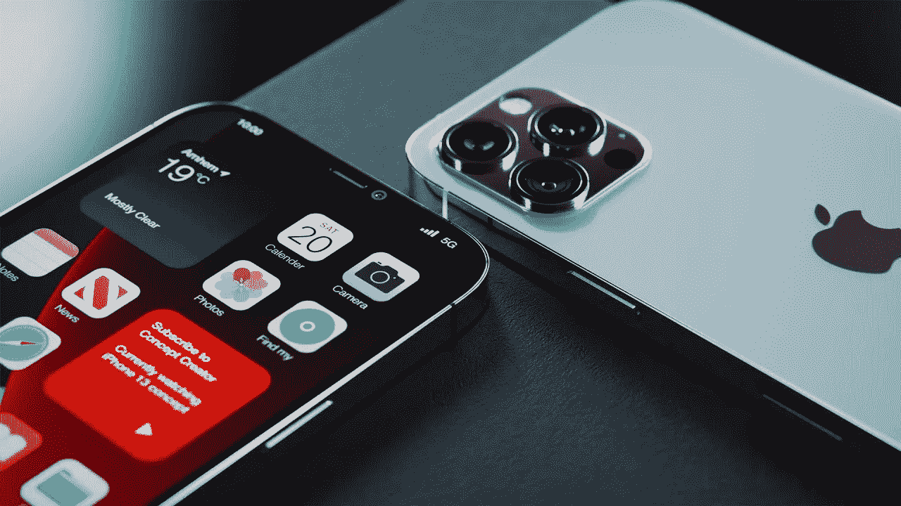

# 数以百万计的 iPhone 用户正受到苹果公司代价高昂的冲击。

> 原文：<https://medium.com/geekculture/millions-of-iphone-users-are-getting-a-costly-shock-from-apple-5edc519049a9?source=collection_archive---------35----------------------->

Retrieved from cdn.mos.cms.futurecdn.ne

随着全球大量客户竞相购买苹果最新款手机，iPhone 13 的交易量正在飙升。无论如何，这些众多的新业主目前在可怕的惊讶。

iFixit 的一份教育报告揭示，每款 iPhone 13 都包含“另一个屏幕修复陷阱，可能会改变…