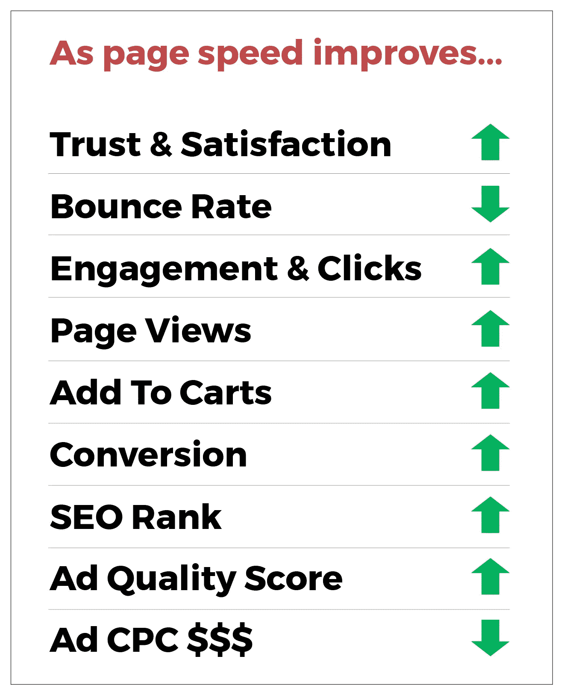
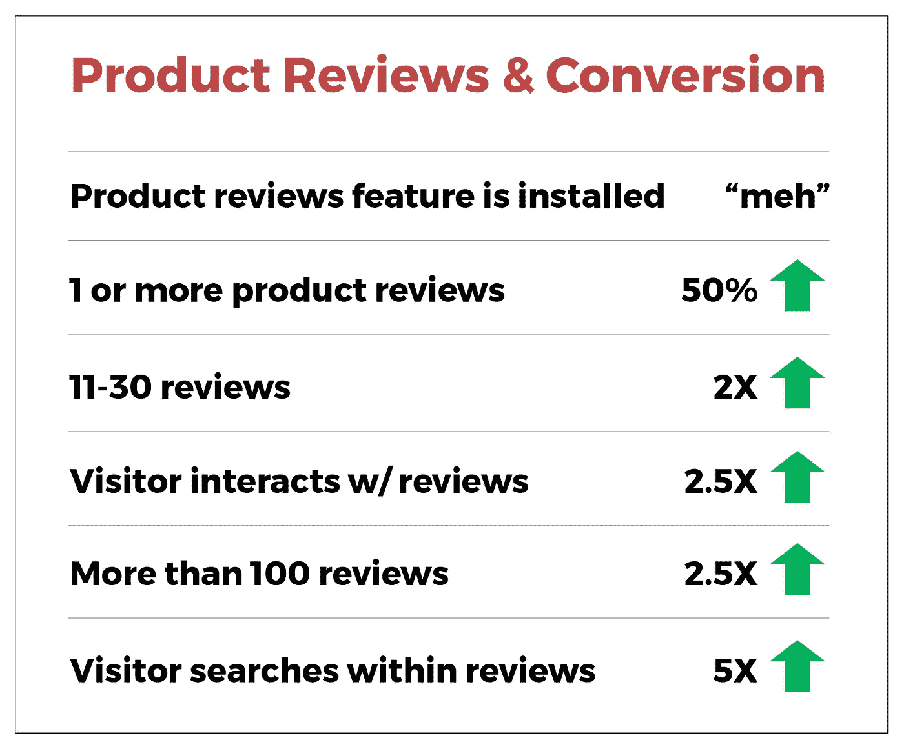
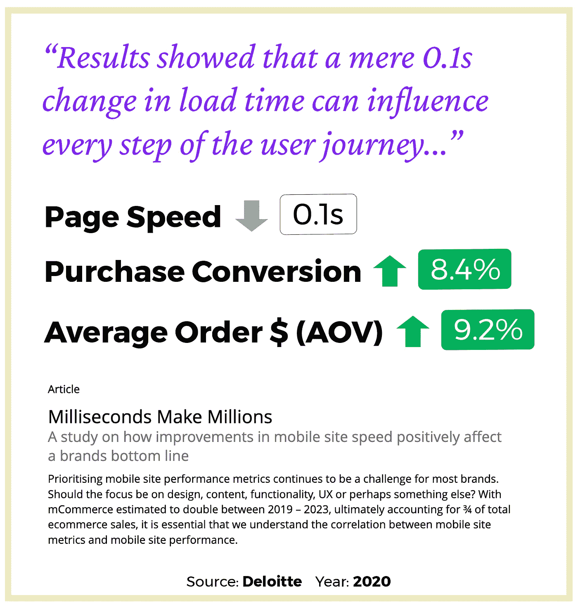
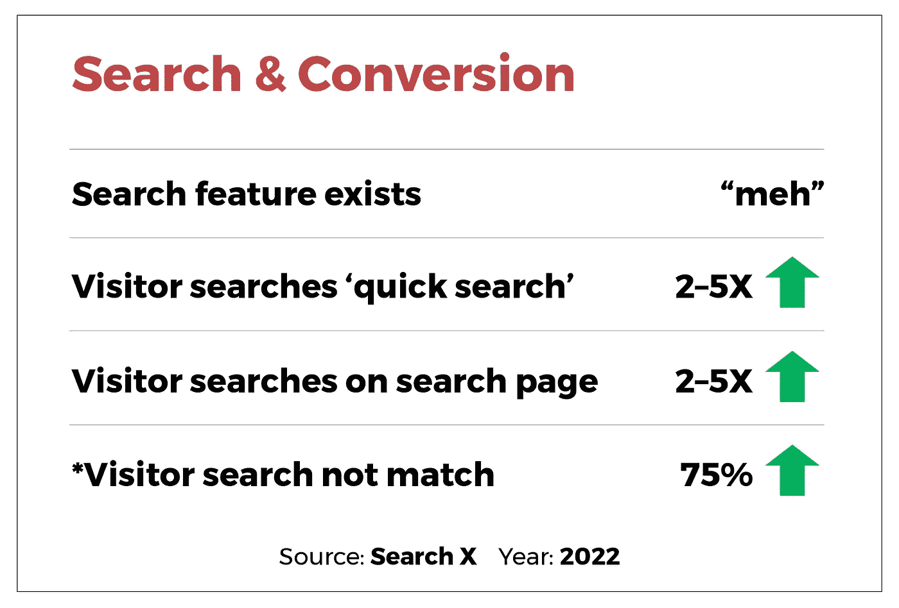
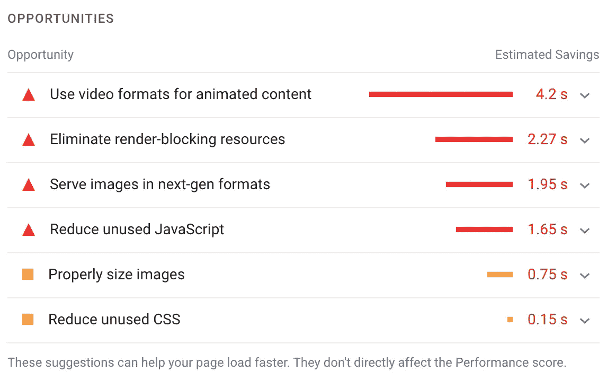
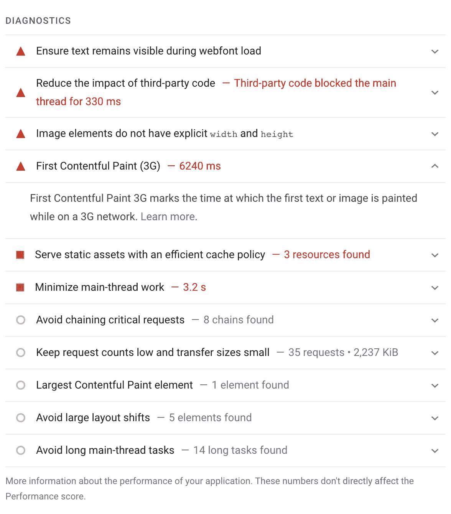

# 毫秒赚钱:Shopify 网站的速度，转换，和搜索引擎优化排名概述。

> 原文：<https://medium.com/geekculture/milliseconds-make-money-the-shopify-site-speed-conversion-and-seo-ranking-overview-808947ade335?source=collection_archive---------3----------------------->

## 我们还需要多少证据来证明我们致力于页面速度和参与度表现？

每个人似乎都同意页面速度优化有多重要，但我仍然很惊讶让 Shopify 品牌改变他们的行为、应用和工具以主动提高页面速度有多困难。

*特别是对于 Shopify 应用程序，如果你还没有考虑为你的 Shopify 产品评论( [**快速评论**](https://www.rapidreviews.pro) )和搜索( [**搜索 X**](https://www.getsearchx.com) )使用[我的应用程序](https://apps.shopify.com/partners/william-belk)，你就错过了。快速评论和搜索 X 是你能安装的最快和最注重性能的应用，无一例外。

# 让我们建立一个页面速度和参与度改进的简单案例

网络上有很多关于页面速度、转换和 SEO 的评论。一些建议的技术有时是有问题的。尽管有一些有问题的方法，我们不希望将研究问题化到限制我们页面速度的程度。我们希望激励我们的团队不断进步！让我们为 Shopify 页面速度的提高建立一个更新和简洁的案例。

# 高级理解

简而言之，随着页面速度的提高(即页面加载/呈现时间的减少)，以下事情会全面发生:

*   访客**信任**，好感和满意度**增加**
*   **反弹** **比率** **减少**(页面加载完成时有多少人退出)
*   访客**参与度**和点击量**增加**
*   **页面浏览量增加**
*   **“添加到购物车”增加**
*   **转换增加**
*   **SEO 排名提高**
*   **广告成本下降**

As page speed improves…

# 页面速度提高品牌信任度

对于未来的客户来说，随着时间的推移，他们对与你的品牌互动的感受与本文讨论的任何事情一样重要。使用更快的页面，访问者会感到更加满意和自信。

# 更快的页面降低广告成本

许多公司都在努力控制网络广告成本。许多设备上的安全变化导致广告网络上的报告和透明度的大量归属问题。随着 [iOS14 的变化](https://support.google.com/google-ads/answer/10625151?hl=en)，这变得更加糟糕。

公司现在必须深入挖掘，优化影响广告成本的其他业务。页面速度应该是影响广告成本的首要因素。

网页速度对广告成本的影响会因你的广告网络而异。至少，糟糕的页面速度性能将通过更高的跳出率和更短的页面停留时间来推高成本，这自然会导致更低的整体参与度和更低的转化率。

谷歌的广告网络将登陆页面体验作为质量得分的加权因素进行评估，从而影响 CPC(每次点击成本)。

无论是简单的情况，还是谷歌广告的情况，都有一个强大的财务激励来提高页面速度。

# 产品评论-2-5X 你的参与度和数量的转换-不仅仅是存在

产品评论作为**(页面上的评论数量，结合*参与度&互动)*** 的函数影响我们的页面转换。也就是说，在我们的 Shopify 页面上有大量的产品评论极大地提高了我们的转化率。然后，对于与我们的评论互动(点击、滚动、&搜索)的访客，会造成购买转化率的又一次大规模提升！

* *试试我的 Shopify 商品评论 app， [**快速评论**](https://www.rapidreviews.pro) ，它最快！

Product reviews conversion

# 只需几分之一秒的时间

我可以与你分享 10 个链接，声称与页面速度相关的巨大转换%收益。你可能已经看到了所有的共同联系。让我们往小的方面想。以较小的页面速度改进为目标更可行(对开发人员来说也更有趣)。

我们不需要每次在页面速度和性能上工作的时候都减少整秒的页面加载时间。即使只有 0.1 秒(100 毫秒)也有帮助！如果我们减少了 0.3 秒、0.4 秒、0.1 秒和 0.1 秒，那就是我们整个一秒钟的进步。

下面的研究声称，页面速度仅仅提高 0.1 秒，就可以使你的购买转化率提高 8%，增加购物车行为提高 9%。***免责声明:**我必须说，在阅读了本研究提供的文档后，我对方法和控制有*严重的*疑问，但我喜欢这种感觉:即使 0.1 秒的改进也是值得的！对此我完全同意。每一毫秒都很重要！我们的电子商务商店获得的流量越多，随着时间的推移，这些毫秒级的改进将增加更多的收入。

[Source: Deloitte](https://www2.deloitte.com/ie/en/pages/consulting/articles/milliseconds-make-millions.html)

# 搜索——提高你的转换率 2.5——通过参与提高 5X——而不仅仅是生存

让我们考虑一个许多电子商务网站的常见场景:

*   我们的网站上有搜索功能
*   然而我们并不推广它
*   而且使用搜索功能并不是一个很有帮助的体验。

在上面的例子中，很少有访问者使用我们的网站搜索，要么是因为低信心，低能见度，等等。

让我们将这与追求卓越的搜索进行对比。如果我们提供一个高度可见的、*快速的、吸引人的*搜索界面，我们可以提高与我们网站搜索互动的访问者的转化率，最高可达 5X。

我的 Shopify 搜索应用程序的内部数据显示， [**Search X**](https://www.getsearchx.com) 的购买转化率增加了 2.5 倍——对于那些*使用*和 Search X widgets 进行搜索的访问者来说是 5X。

非常令人惊讶的是，即使搜索不返回任何结果，也会导致转化率增加 75%。多么伟大的结局！

Source: Search X

# 页面速度影响有机搜索排名

我们总是可以自信地宣称“内容为王”。我们还知道，当涉及到页面排名时，参与度是非常重要的。谷歌经常重申这两点。

除了内容和参与度，我们知道页面速度能够并将会影响谷歌搜索排名。页面速度对排名的最终影响程度很难测量，也很难研究。谷歌明确表示页面速度会影响排名，但不会说影响有多大。谷歌也没有公布不同页面速度指标的权重。这是可以理解的，因为排名来自于一个页面超过 100 个组件的影响矩阵。

看看[这项研究](https://crystallize.com/blog/this-is-how-much-site-speed-affects-google-seo-ranking-with-data)中，针对相同的关键字创建了三个相同的网站。这三个网站的页面速度分数分别为 100 分、50/100 分和 20/100 分。最快的网站在有机搜索排名中击败了其他网站。

[这里的另一项研究](https://neilpatel.com/blog/does-speed-impact-rankings/)显示谷歌排名第一和第六的速度相差 20%。显然，这推断出了内容分析之外的页面速度和排名关系，但这项研究显示了谷歌首页位置之间非常明显的差异。

# Shopify 绩效改进清单

使用 Shopify 开发，我们在一定程度上受限于页面速度性能的提高。尽管有这些限制，页面速度差是没有理由的。我们还是可以建立一个快得冒烟的电子商务商店。

问问自己，“我真的需要安装第 15 个 Shopify 应用吗？”你收集的应用程序可能会降低你的页面速度。

您的开发人员使用的 Javascript 库呢？这可能会节省一点时间，但也可能会降低你的页面速度。

以下是提高您的 Shopify 页面速度的可行列表:

*   移除不用的 Shopify 应用程序(大多数应用程序会将缓慢的脚本注入你的网站)
*   删除运行缓慢的 Shopify 应用程序(并迫使他们降低负载，让他们的应用程序加载更快)
*   安装我的[产品评论](https://www.rapidreviews.pro)和[搜索](https://www.getsearchx.com)应用。他们是最快的！
*   在上传到 Shopify 之前，适当压缩你的图片(参见[我的认证类](https://www.webfun101.com/)了解更多关于图片格式、分辨率、长宽比和压缩的信息)
*   切换到面向性能的 Shopify 主题，使用较少的动画和较小的 javascript 文件
*   移除/替换缓慢的 Javascript 库和小部件(像 jQuery、Vue 这样的库，像媒体集、传送带和幻灯片放映这样的元素)
*   遵循谷歌在 PageSpeed Insights 上的建议(如下截图)——这些建议通常都很棒

*在*[*WilliamBelk.com*](https://www.williambelk.com)*找我。关注我* [*推特*](https://twitter.com/wbelk) *。*