# 用 Python 实现小型化市场组合模型

> 原文：<https://medium.com/geekculture/miniaturized-market-mix-model-with-python-c73d23067f2e?source=collection_archive---------8----------------------->

## 4Ps 的 3M，SciKit，Pandas 和 Seaborn 的实验研究

市场组合建模是一个我们可能经常听到的术语，不可否认，对我来说，它听起来像是一个非常复杂的模型和市场混合在一个多维空间中的构造。令我欣慰的是，事情还没那么复杂。这里简单回顾一下在营销或其他方面的课程中铭刻在记忆中的 4Ps 产品、价格、促销、地点。


Photo by [Ricardo Gomez Angel](https://unsplash.com/@ripato?utm_source=medium&utm_medium=referral) on [Unsplash](https://unsplash.com?utm_source=medium&utm_medium=referral)

第一个 P(产品)是非常直接的，即正在营销的产品或服务。价格是指所采用的定价策略，无论是市场撇取还是渗透，以及所使用的相应定价策略。促销涉及到广泛的营销传播活动。Place 实际上是用于营销和销售产品的渠道——数字形式的电视、社交媒体、电子邮件、应用程序通知和文本，或者线下的广告牌、蜗牛邮件和店内广告等方式。

随着企业不遗余力地争夺潜在客户的注意力，他们在哪里投资对他们获得的营销投资回报(MROI)有很大的影响。这就是 MMM 发挥作用的地方，因为它提出了一种管理 Ps 生态系统的统计方法，这样你就可以明智地花钱(营销预算)。

用最简单的术语来说，它将特定产品、服务或品牌产生的销售额进行分解，并将其归因于用于营销它的不同渠道。这将有助于营销人员了解什么对他们有效，什么无效，这样他们就知道从哪里拔掉插头，从哪里注入更多的现金，从而更好地为他们规划下一阶段的预算。

# 线性回归的基本市场组合模型

来自 [Kaggle](https://www.kaggle.com/harrimansaragih/dummy-advertising-and-sales-data) 的数据集

这里用于演示目的的数据集是一个乌托邦式的 ideal_database.table 的精选汇编，它使我们的回归任务比通常使用真实世界数据要容易得多。

在这个版本中，经销商选择的语言是 Python，我们将使用流行的 Pandas 库进行数据辩论和准备。使用 plotly 和 seaborn 进行可视化是我个人的偏好，因为我一直觉得这些库既高效又有吸引力。

```
# Importing necessary libraries
import pandas as pd
import numpy as np
import seaborn as sns
import matplotlib.pyplot as plt
import plotly.express as px
%matplotlib inline
import plotly.graph_objects as go
from plotly import __version__
import cufflinks as cf
from plotly.offline import download_plotlyjs,init_notebook_mode,plot,iplot
cf.go_offline()# Defining colour palette to be used in the notebook for plotly and seaborn plots
notebook_colours=["plum","slateblue","navy","firebrick",                                 "darksalmon","slateblue","maroon","lightskyblue","blue","darkmagenta"]
```

# **数据准备**

```
## Reading the dataset
market_mix_data=pd.read_csv("Sales & Marketing Dummy Data.csv")
market_mix_data.head()
```

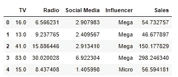

Head of the Dataset

变量非常简单，销售额以百万计，营销费用也以百万计。这里的一个假设是，这种销售纯粹是由营销驱动的。可以理解的是，在一个真实的例子中，这可能不是它真正的工作方式。区分销售流以隔离仅来自营销活动的收入通常具有挑战性，因为许多外部因素也在起作用，包括但不限于天气、季节性和周期性。

回到这个演示，我们有渠道方面的营销支出变量——电视、广播和社交媒体，以百万计。

```
market_mix_data.info()
```

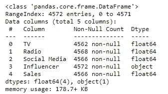

Info about the dataset

```
market_mix_data.describe()
```

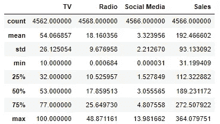

Statistical summary of numerical variables

```
market_mix_data.describe(include=np.object)
```

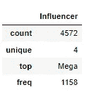

Summary of Categorical Variable — Influencer

```
market_mix_data.Influencer.value_counts() # Dataset is balanced between all the influencer types
```

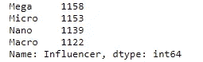

Distribution of different influencer types

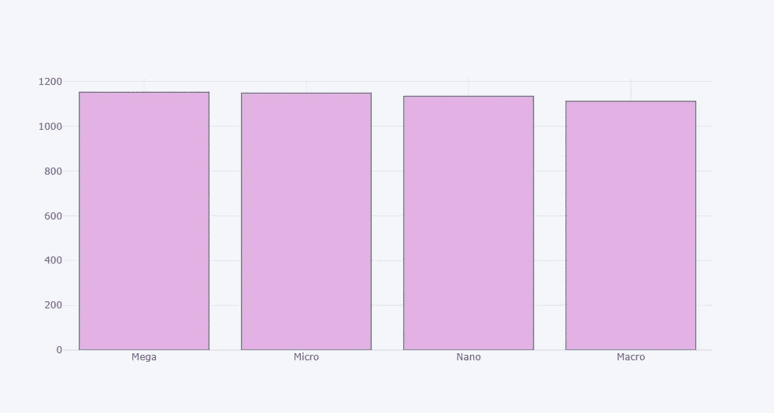

The different influencer types are evenly distributed across the dataset

我们还有一个名为 Influencer 的分类字符串变量，它指示使用了哪种类型的影响因素—大型、宏观、微观和纳米。可以看到，数据集在四种类型的影响者之间均匀地分割。

**检查空值**

肮脏的数据集是每个分析师的噩梦，这就是为什么检查数据集中缺失的值、特殊字符或任何其他差异是数据准备的首要步骤之一。同样，由于这是一个经过筛选的数据集，这些问题都不会出现在需要专门努力的级别，但是作为一个卫生步骤，总是建议检查是否有空值。

```
market_mix_data.isnull().sum()
```

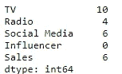

Check for nulls

在数据集中的 4572 条记录中，上述记录在一些变量中包含空值。由于这些案例占整个数据集的不到 10%,我们决定在进一步的分析中删除这些值。

```
## Choosing to drop nulls in this case 
market_mix_data=market_mix_data.dropna(axis=0)
market_mix_data.isnull().sum()
```

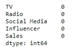

Nulls have been dropped and the remaining dataset appears clean

**渠道费用单变量分布图**

由于人类的大脑对颜色和形状的反应比单调的数字更好，所以绘制一些单变量图来检查数据的分布总是一个好主意。这使得标记和调查数据中出现的任何异常变得更加容易。

```
plot(cf.subplots([market_mix_data['TV'].figure(kind='hist',color=notebook_colours[0]),
                   market_mix_data['Radio'].figure(kind='hist',color=notebook_colours[1]),
                   market_mix_data['Social Media'].figure(kind='hist',color=notebook_colours[2])],shape=(1,3)))
```


Distribution of Spends across Channels — TC, Radio and Social Media

电视支出的变量遵循不均匀但非常模糊的双峰分布，而广播，尤其是社交媒体，遵循向右倾斜的分布，因为它们向右尾部变平。

我们还发现销售在整个数据集中大致均匀分布。

```
sns.distplot(market_mix_data['Sales'],color=notebook_colours[2])
```

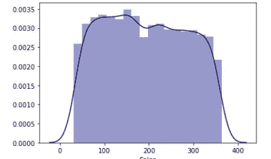

Distribution of Sales ($ Mn)

关联图有助于理解所有数字变量之间的*关联*，即该数据集中的支出和销售。每个变量总是与自身完美相关，因此相关系数( *r* )为 1。

```
sns.heatmap(market_mix_data.corr(),cmap=notebook_colours,annot=True,)
```

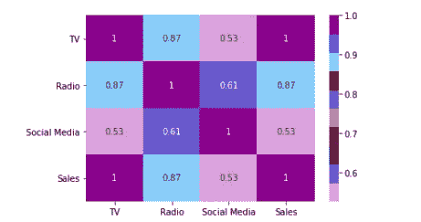

Correlation Plot

这里的每个变量组合的相关系数( *r* )都大于 0.5，这意味着它们之间是强正相关的。

**为影响者创建虚拟变量**

由于该变量中存在 4 个不同的类别，我们将一次性编码并将其拆分为 4 个不同的二进制变量，以表明用于相应销售的影响者类型。

*边注在这里，我们实际上只需要(n-1)个虚拟变量用于一个具有 n 个类别的分类变量，逻辑上这些类别是互斥的，并且集合起来是穷举的。例如，如果销售没有使用大型、宏观或微观影响者，则默认理解为使用了纳米影响者，从而不需要纳米的第四个二元指示变量。*

```
# Dummy variable for Influencer
infl=pd.get_dummies(market_mix_data.Influencer)# Binding it back to the orignal dataset and dropping categorical variable Influencer
model_data=pd.concat([market_mix_data,infl], axis=1)
model_data.drop('Influencer',inplace=True,axis=1)model_data.head()
```

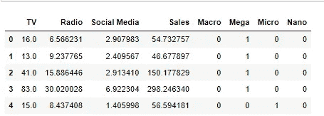

Dataset prepared for feeding into the Linear Regression Model

# **构建模型**

正在实施一个非常简单的线性回归模型，以了解销售如何归因于这些营销支出中的每一项。通过这个练习，我们将得到一个使用支出变量预测销售额的等式，如下所示

> Y= Y0 + B1X1 + B2X2 + B3X3 +....BnXn

这里 *Y0* 是截距，这是即使没有这些营销支出也会产生的基线销售额。

*X1、X2、X3……Xn*是不同渠道的营销支出——广播、社交媒体、电视等。这些变量的系数— *B1，B2* 等。有自己有趣的含义；他们量化了每单位营销支出增加所带来的销售额增长。例如，如果 *X1* 和 *B1* 表示电视支出的变量和系数，只要所有其他支出保持不变，电视支出每增加 1 百万美元，销售额就会增加 1 百万美元(*B1*Y)。

下面的演示将更好地理解这个数字概念。

**训练模型**

```
X = model_data.loc[:, model_data.columns != 'Sales']
y = model_data['Sales']
```

我们将数据集分成因变量( *Y* )和自变量( *X* )的数组，以输入到模型中。由于回归(估计)是一种有监督的学习方法，这里我们有了*训练和测试集*的概念。我们将使用 65%的数据集来训练机器学习模型。一旦模型被训练，我们就使用剩余的 35%的不相关的数据集，并判断它是否能够正确地预测销售，给定它以前没有见过的数据的营销花费。

```
X_train, X_test, y_train, y_test = train_test_split(X, y ,test_size=0.35, random_state=101) 
# Random state set to 101 to get same results in every iteration
```

使用 SciKitlLearn 库进行线性回归

```
from sklearn.linear_model import LinearRegression# Initializing the Linear Regression model
lm = LinearRegression()# Fitting the model to the train set
lm.fit(X_train,y_train)
```

# **结果和评估**

```
# print the intercept
print(lm.intercept_)
```

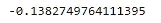

The intercept (Y0)

```
coeff_df = pd.DataFrame(lm.coef_,X.columns,columns=['Coefficient'])
coeff_df
```

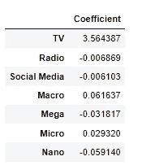

Coefficients of Spend Variables

**解释系数**

如果我们仔细观察以上内容，我们会发现电视支出与销售额之间存在正因果关系，因为电视支出每增加 100 万美元，销售额就会增加 360 万美元。然而，有趣的是，广播和社交媒体对销售额有负面影响，因为每多花一百万美元，销售额就会减少几千美元。

现在，由于 Macro、Mega、Micro 和 Nano 是二元变量，它们的系数意味着每当变量被标记为 1 时，也就是说，假设使用了一个宏观影响因素，销售额增加了大约 6 万美元。

```
# Predicting Sales for the test set
y_pred = lm.predict(X_test)# Plotting predicted values vs actual values available for the test set
plt.scatter(y_test,y_pred,c=notebook_colours[0])
```

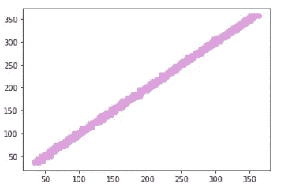

Predicted vs Actual Sales for Test Set

```
# Evaluating the Model
from sklearn import metricsprint('MAE:', metrics.mean_absolute_error(y_test, y_pred))
print('MSE:', metrics.mean_squared_error(y_test, y_pred))
print('RMSE:', np.sqrt(metrics.mean_squared_error(y_test, y_pred)))
print('R-Square',metrics.r2_score(y_test,y_pred))
```

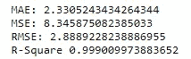

Model Evaluation Metrics

上面计算了一些用于评估线性回归模型的流行指标。突出最相关的部分——

1.  RSquare 为 0.99 意味着独立变量，即各渠道的营销支出，能够成功解释数据集销售中 99%的可变性。
2.  平均绝对误差(MAE)计算为测试数据集的预测销售额和给定的实际销售额之间的绝对差值的平均值。这里，在销售的预测值和实际值之间有一个大约 230 万美元的*波动*,考虑到给定数据集中 1 . 91 亿美元的平均销售额，这并不坏。
3.  均方根误差(RMSE)是衡量实际销售和预测销售之间波动的另一个转换变量。发现它是 280 万美元，这也接近于 MAE 报道的。

总之，线性模型表现良好，因为销售额可以相当准确地归因于给定的营销支出；考虑到数据集的大小和简单性，这并不奇怪。一个*真实世界的数据集*(可以这么说)，在数据质量、数量、维度和粒度方面可能不那么简单——仅提及几个挑战。

***那都是乡亲们！***

这结束了使用基本线性模型对 MMM 的介绍性研究。这种回归销售的方法并不是一种适用于所有情况的解决方案，因为在大多数情况下，这种方法很简单，因此偏差很大。根据销售和其他独立变量之间关系的复杂性，可能存在需要高级算法的 MMM 问题。在这种情况下，数据可能会更好地响应非参数方法，如回归树，这些回归树在森林中集合或包装在其他打包和提升技术中。希望很快能在一篇文章中对此进行更多的分析和报道！

在此之前，感谢您的阅读&请随时在下面的评论中留下您的想法、大声喊出来和建议！

一些有用的资源—

1.  [探索 MMM 中的粒度数据:更新的模型，更好的见解—埃森哲](https://www.accenture.com/_acnmedia/PDF-92/Accenture-Market-Mix-Optimization.pdf)
2.  [营销组合建模:营销专业人士需要知道什么](https://www.nielsen.com/wp-content/uploads/sites/3/2019/04/marketing-mix-modeling-what-marketers-need-to-know.pdf) —尼尔森