# 中的最小 API。NET 6 —完全指南(初学者+高级)

> 原文：<https://medium.com/geekculture/minimal-apis-in-net-6-a-complete-guide-beginners-advanced-fd64f4da07f5?source=collection_archive---------0----------------------->

## 有了真实世界例子


Photo by [Fotis Fotopoulos](https://unsplash.com/@ffstop?utm_source=unsplash&utm_medium=referral&utm_content=creditCopyText) on [Unsplash](https://unsplash.com/?utm_source=unsplash&utm_medium=referral&utm_content=creditCopyText)

。NET 6 于上周发布，被誉为“最快的”。微软还没有推出“NET”。它带来了许多令人兴奋的新功能，[语言](https://devblogs.microsoft.com/dotnet/welcome-to-csharp-10/)和[性能改进](https://devblogs.microsoft.com/dotnet/performance-improvements-in-net-6/)。这是 LTS 自 1998 年以来的首次发布。NET Core 3.1，将支持三年。

在本文中，我们将讨论以下主题:

*   最低限度的 API 是什么？
*   创建真实世界的示例(使用 SqlServer DB 和 EFCore)
*   如何使用 Swagger 添加 OpenAPI 规范
*   如何使用 JWT 认证保护最小 API

## 最低限度的 API 是什么？

. NET6 使得编写具有最小依赖性的 REST APIs 变得极其简单。初看起来，极简 API 似乎是微软对提供极简 API 的 NodeJS(带 ExpressJS) HTTP server 的回答。

考虑以下代码:

```
var express = require("express");var app = express(); app.listen(3000, () => {console.log("Server running on port 3000");});app.get("/platforms", (req, res, next) => {res.json(["Windows", "Mac", "Linux", "Unix"]);});
```

这是一个非常标准的使用 ExpressJS 的 API，它提供了一个 GET 端点来使用 NodeJS 服务器访问所有可用的平台。

现在，让我们看看在。网络 6

```
var builder = WebApplication.CreateBuilder(args);var app = builder.Build();app.MapGet(“/platforms”, () => “Windows,Mac,Linux,Unix”);app.Run();
```

就是这样！这是极简主义的极致——不再有 Startup.cs、API 控制器、额外的依赖等等。您只需要这 4 行代码来生成以下输出:

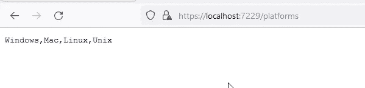

.NET 6 Minimal APIs

不再赘述，让我们开始吧:

## 先决条件:

*   [下载。NET 6 SDK](https://dotnet.microsoft.com/download/dotnet/6.0) 和 ASP.NET 核心运行时(带有 IIS 托管包)
*   [Visual Studio 2022](https://visualstudio.microsoft.com/vs/preview/) (可惜。Visual Studio 2019 不支持 NET 6)

## 1.创建新项目

使用 Visual Studio 2022 创建一个新项目，并选择“ASP。NET Core Empty "项目模板。


Visual Studio — Create a new project

使用默认设置(确保框架设置为。NET 6.0)

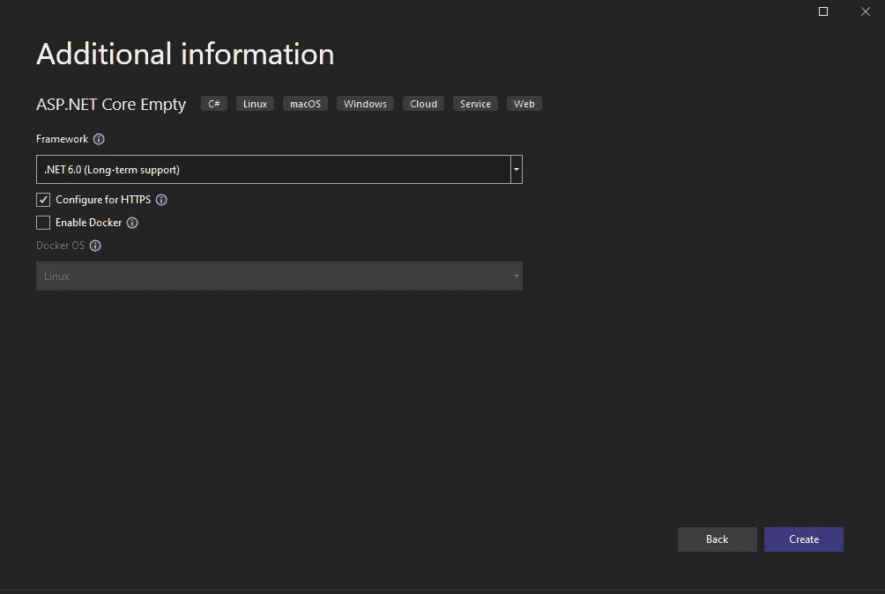

Visual Studio — Create a new project

您可以在 ASP.NET 核心项目中看到 Program.cs 文件，其中包含 hello world API。

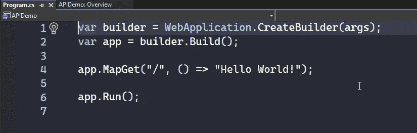

Minimal APIs — A Simple Hello World

您可能想知道标准 using 语句发生了什么变化？

这是的另一个伟大的新功能。NET 6 — " **隐式全局 using**"自动生成不可见的 using 语句并全局声明它们，这样您就不必处理在每个文件中重复声明名称空间的混乱情况。

编辑您的。Csproj 文件，您会注意到有一个新的 ImplicitUsing 条目，它被设置为 true。

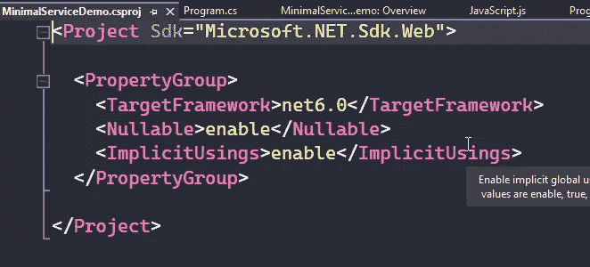

Minimal APIs —Project Settings

您可以检查 obj/Debug/net6.0 文件夹，以查看隐藏的自动生成文件—[project name]. global using s . g . cs。您可以定义一个单独的类，将您的所有 using 语句保存在[的一个位置](https://github.com/csehammad/MinimalAPIDemo/blob/main/globalUsing.cs)。

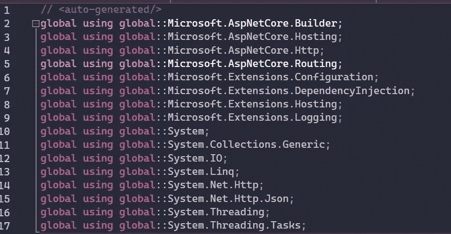

Minimal APIs — Global Using

如果您不想使用此功能，可以在中禁用该标志。csproj 文件。

注意:如果您想在一个特定的端口上运行 API，您可以在 run 方法中指定它。

```
app.Run(“http://localhost:3000");
```

您甚至可以在多个端口上运行您的 API。

```
app.MapGet(“/”, () => “Hello World!”);app.Urls.Add(“http://localhost:3000");app.Urls.Add(“http://localhost:4000");app.Run();
```

在上面的例子中，app。MapGet 方法正在使用一个**内联 lambda 表达式**。在许多情况下，您可能希望使用静态或实例方法。

```
var builder = WebApplication.CreateBuilder(args);var app = builder.Build();app.MapGet(“/”, MyHandler.Hello);app.Run();class MyHandler{public static string Hello(){ return “Hello World!”; }}
```

## POST，PUT，Delete 等呢？

Web application builder 为这些请求提供了不同的方法。

*   app。地图发布()
*   app。地图输入()
*   app。映射删除()

## 中的最小 API。NET 6 —一个真实世界的例子

在以下示例中，我们将使用 Azure SQL DB 来连接我们的 API，它将提供以下 CRUD 功能:

*   获取所有书籍
*   添加新书
*   按关键字搜索图书
*   按 ID 更新书名

除此之外，我们还将学习如何添加 openapi specification—SwaggerUI 来创建文档，以及一些高级概念，如使用 JWT 令牌添加身份验证和授权。

1.  **让我们创建一个简单的数据库，并定义保存书籍和作者信息的表。**

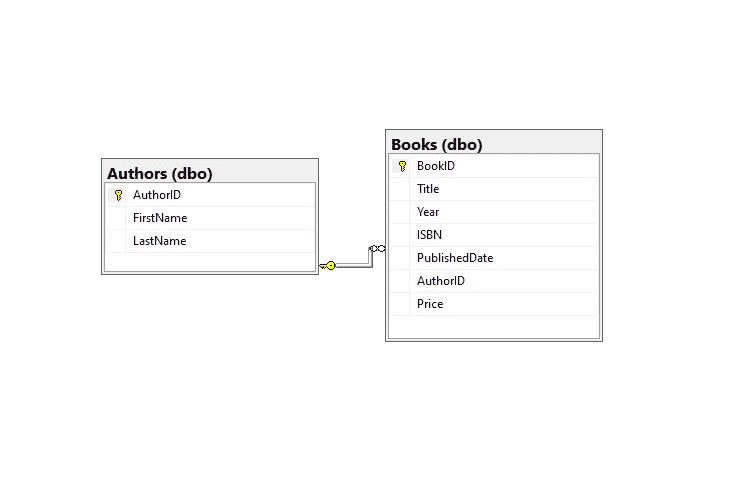

Minimal APIs — A Real World App Database

注意:您可以使用这个[脚本](https://github.com/csehammad/MinimalAPIDemo/blob/main/DB/AuthorsDB_Script.sql)来创建上面的表格，并用一些示例数据填充它们。

**2。创建新项目**

安装下列软件包:

```
Install-Package Azure.Extensions.AspNetCore.Configuration.Secrets -Version 1.2.1Install-Package Azure.Identityinstall-package Microsoft.EntityFrameworkCore
```

现在我们需要添加一些 POCO 类。让我们创建一个新的文件夹“模型”来放置我们项目中的所有模型类，比如 [Book.cs](https://github.com/csehammad/MinimalAPIDemo/blob/main/Models/Book.cs) ，而不是将它添加到 program.cs 中

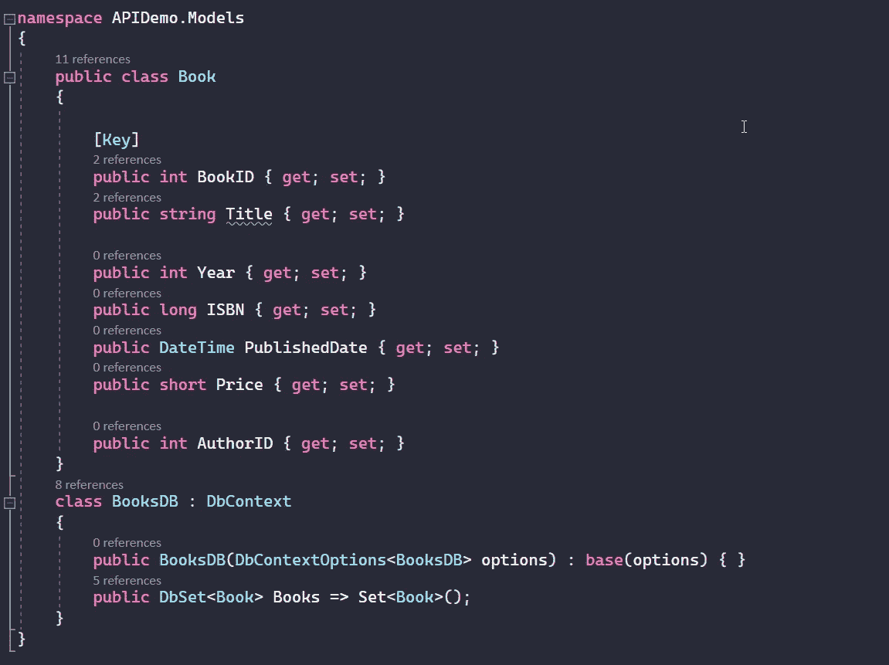

Minimal APIs — EF Core POCO Classes

现在我们需要如下初始化 DBContext:

```
builder.Services.AddDbContext<BooksDB>(options =>{options.UseSqlServer(Environment.GetEnvironmentVariable(“AzureConnectionString”)); });
```

. NET6 通过引入 WebApplicationBuilder 简化了许多繁琐的任务，WebApplicationBuilder 提供了对新的配置生成器、服务集合、环境、主机(IHostBuilder)、WebHost (IWebHostBuild)的访问，并提供了向 DI 容器注入依赖项的直接方法。

## 最小 API 示例# 1:从数据库中获取所有书籍

让我们编写第一个端点，从数据库中获取所有可用的书籍。

```
app.MapGet(“/books”, async (BooksDB db) =>await db.Books.ToListAsync());
```

在上面的方法中，BooksDB 是从服务中注入的，因此我们可以在我们的方法中使用它来执行各种 DB 操作。

我们现在可以调用端点，并将响应视为一个 JSON 数组。

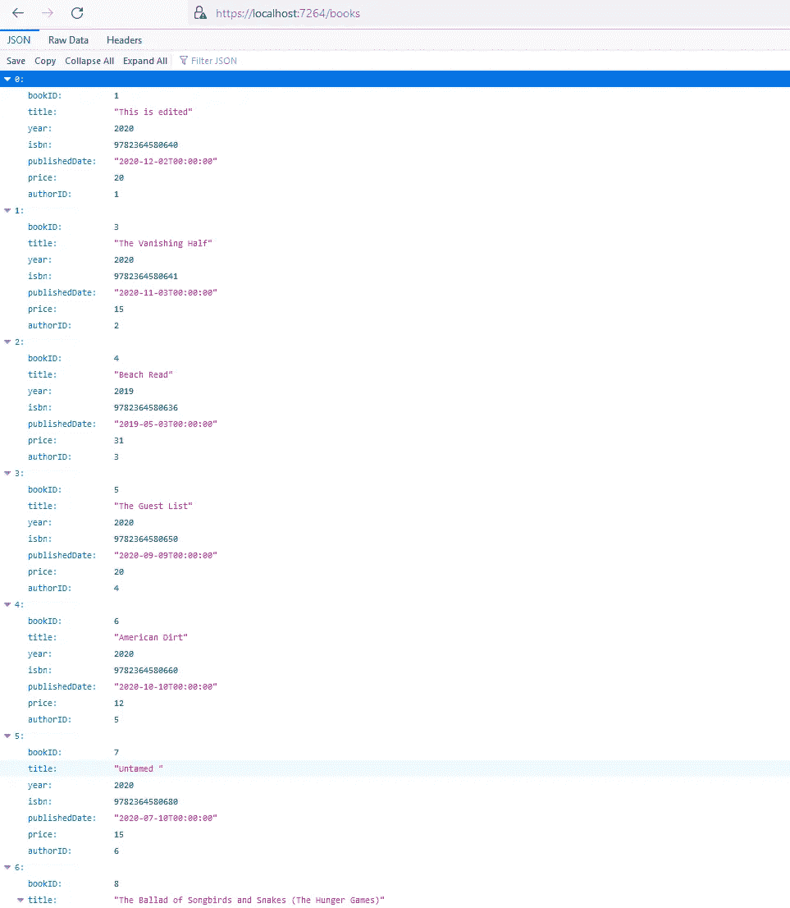

Minimal APIs — Get All Books Method Result

在我们添加更多端点之前，让我们看看最小 API 是如何支持开放 API 规范的。

. NET6 中的最小 API 支持使用 Swashbuckle 生成 swagger 文档。

以下是步骤:

1.  安装 ASP.NET 核心的 swashbuckler 包

```
install-package Swashbuckle.AspNetCore
```

2.在您的 web 应用程序构建器中注入 swagger 服务。

```
builder.Services.AddEndpointsApiExplorer();builder.Services.AddSwaggerGen();
```

3.通过添加中间件来呈现 Swagger UI，在应用程序中使用 Swagger。

```
app.UseSwagger();app.UseSwaggerUI();
```

构建并运行应用程序，您将能够在/swagger/index.html 上看到 swagger UI

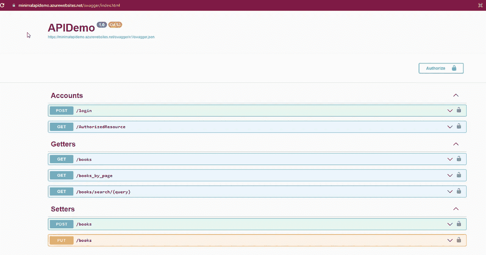

Minimal APIs — Swagger UI

现在，是时候通过注释 API 方法来记录 API 了。我们可以用老式的方法使用属性来实现。但是，在. NET6 中，您可以使用最小 API 附带的扩展方法。

```
app.MapGet(“/books”, async (BooksDB db) =>await db.Books.ToListAsync()).Produces<List<Book>>(StatusCodes.Status200OK).WithName(“GetAllBooks”).WithTags(“Getters”);
```

*   产生→定义返回类型和预期状态。
*   with name→唯一标识端点。
*   WithTags →将所有相关端点分组。

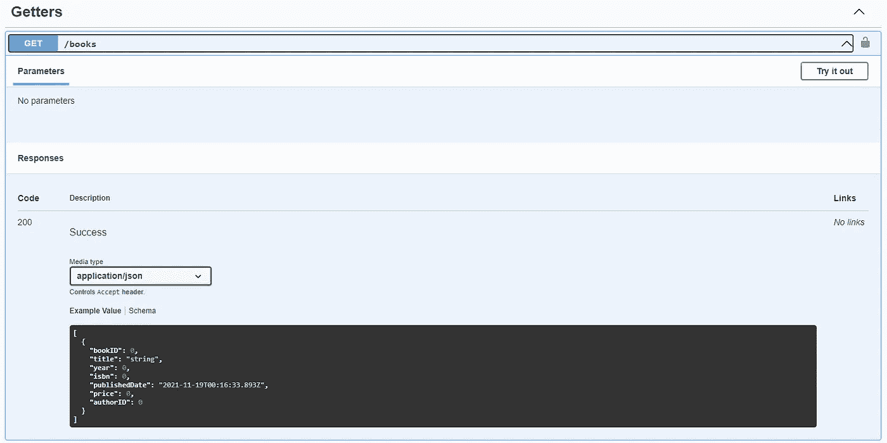

Minimal APIs — Generated using OpenAPI Specification

如果您想从 swagger 描述中排除任何方法，您可以通过添加如下所示的 **ExcludeFromDescription()** 扩展方法来实现:

```
app.MapGet(“/”, () => “Hello! This is .NET 6 Minimal API Demo on Azure App Service”)
.ExcludeFromDescription();
```

现在我们已经完成了 Swagger 的工作，让我们把剩下的方法添加到我们的 API 中。

## 最小 API 示例#2:向数据库添加新记录

为了向数据库添加新条目，我们将使用 MapPost 方法和显式参数绑定。

```
// Add new book to Sql Server DBapp.MapPost(“/books”,async ([FromBody] Book addbook,[FromServices] BooksDB db, HttpResponse response) =>{db.Books.Add(addbook);await db.SaveChangesAsync();response.StatusCode = 200;response.Headers.Location = $”books/{addbook.BookID}”;}).Accepts<Book>(“application/json”).Produces<Book>(StatusCodes.Status201Created).WithName(“AddNewBook”).WithTags(“Setters”);
```

这里我们使用了两个属性来显式声明参数的绑定位置。

*   例如，**【from body】**属性用于指定 JSON 对象将作为参数传递给我们的 ModelBinder。
*   [FromServices]用于指定该参数 DB 将从服务 DI 容器注入。

因为这是一个 POST 方法，所以我们必须使用扩展方法对其进行注释——Accepts 来指定请求体和内容类型。

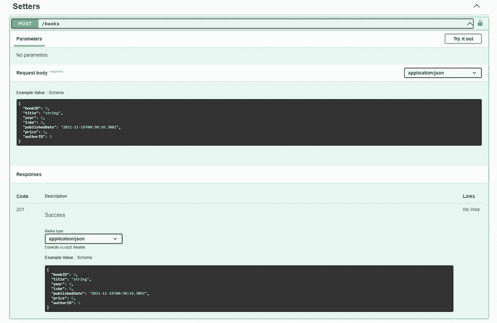

Minimal APIs — POST Method

## 最小 API 示例#3:使用 ID 更新现有的书名

要更新现有记录，我们将使用如下所示的 MapPut 方法:

```
app.MapPut("/books",[AllowAnonymous] async (int bookID,string bookTitle, [FromServices] BooksDB db, HttpResponse response) =>{var mybook = db.Books.SingleOrDefault(s => s.BookID == bookID);if (mybook == null) return Results.NotFound();mybook.Title = bookTitle;await db.SaveChangesAsync();return Results.Created("/books",mybook);}).Produces<Book>(StatusCodes.Status201Created).Produces(StatusCodes.Status404NotFound).WithName("UpdateBook").WithTags("Setters");
```

可以看到，我们没有使用 JSON 对象，而是使用了两个参数 bookID 和 Title(待更新)。在方法实现中，我们只是使用 bookID 获取记录，如果找到了记录，就会更新书名并将其返回给状态为 201 Created 的响应。

我们使用多种扩展方法来表明，如果没有找到记录，也可以用 404 状态来响应。


Minimal APIs — PUT Method

让我们尝试一下，通过提供所需的值来执行请求，您将看到请求成功完成。

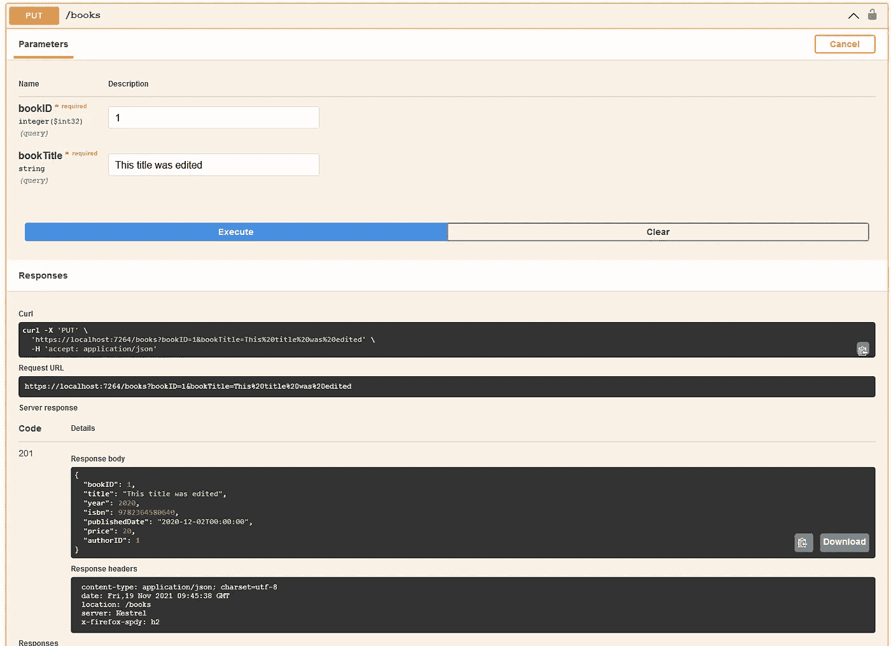

Minimal APIs — PUT Method Response

## 最小 API 示例#4:使用 ID 获取单个记录

```
app.MapGet("/books/{id}", async (BooksDB db, int id) =>await db.Books.SingleOrDefaultAsync(s => s.BookID == id) is Book mybook ? Results.Ok(mybook) : Results.NotFound()).Produces<Book>(StatusCodes.Status200OK).WithName("GetBookbyID").WithTags("Getters");
```

在上面的例子中，如果找到记录，我们只是返回 JSON 对象，否则将返回 404。

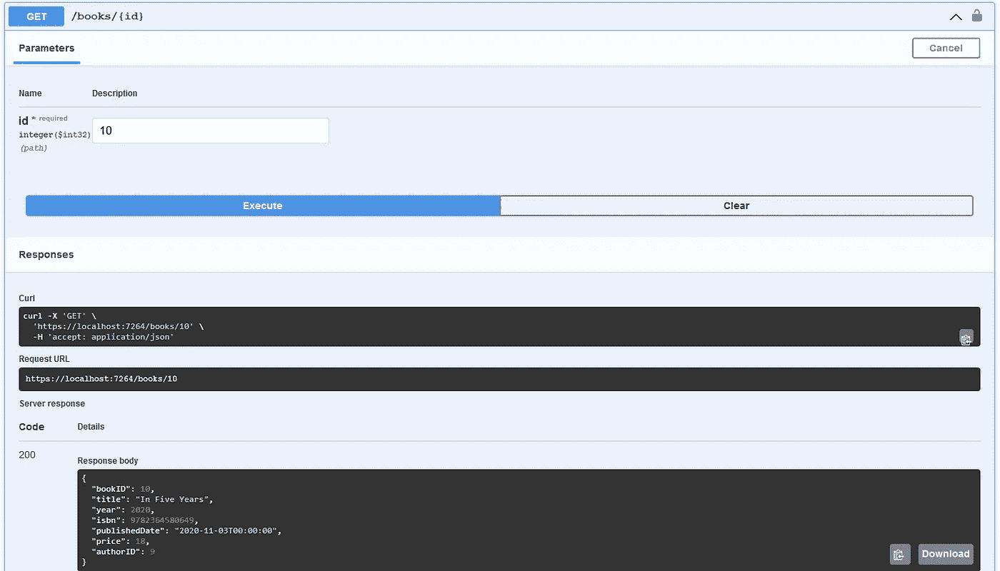

Minimal APIs — Fetch record by ID

## 最小 API 示例#5:对给定的关键字执行搜索

```
app.MapGet(“/books/search/{query}”,(string query, BooksDB db) =>{var _selectedBooks = db.Books.Where(x => x.Title.ToLower().Contains(query.ToLower())).ToList();return _selectedBooks.Count>0? Results.Ok(_selectedBooks): Results.NotFound(Array.Empty<Book>());}).Produces<List<Book>>(StatusCodes.Status200OK).WithName(“Search”).WithTags(“Getters”);
```

如果书名与给定的关键字匹配，本示例返回图书列表。

## 最小 API 示例#6:获取分页的结果集

```
app.MapGet(“/books_by_page”, async (int pageNumber,int pageSize, BooksDB db) =>await db.Books.Skip((pageNumber — 1) * pageSize).Take(pageSize).ToListAsync()//await db.Books.ToListAsync()).Produces<List<Book>>(StatusCodes.Status200OK).WithName(“GetBooksByPage”).WithTags(“Getters”);
```

该方法采用两个参数——page number 和 pageSize，并从数据库返回分页的结果。

例如'/books_by_page？' pageNumber=2&pageSize=5 '产生以下响应。

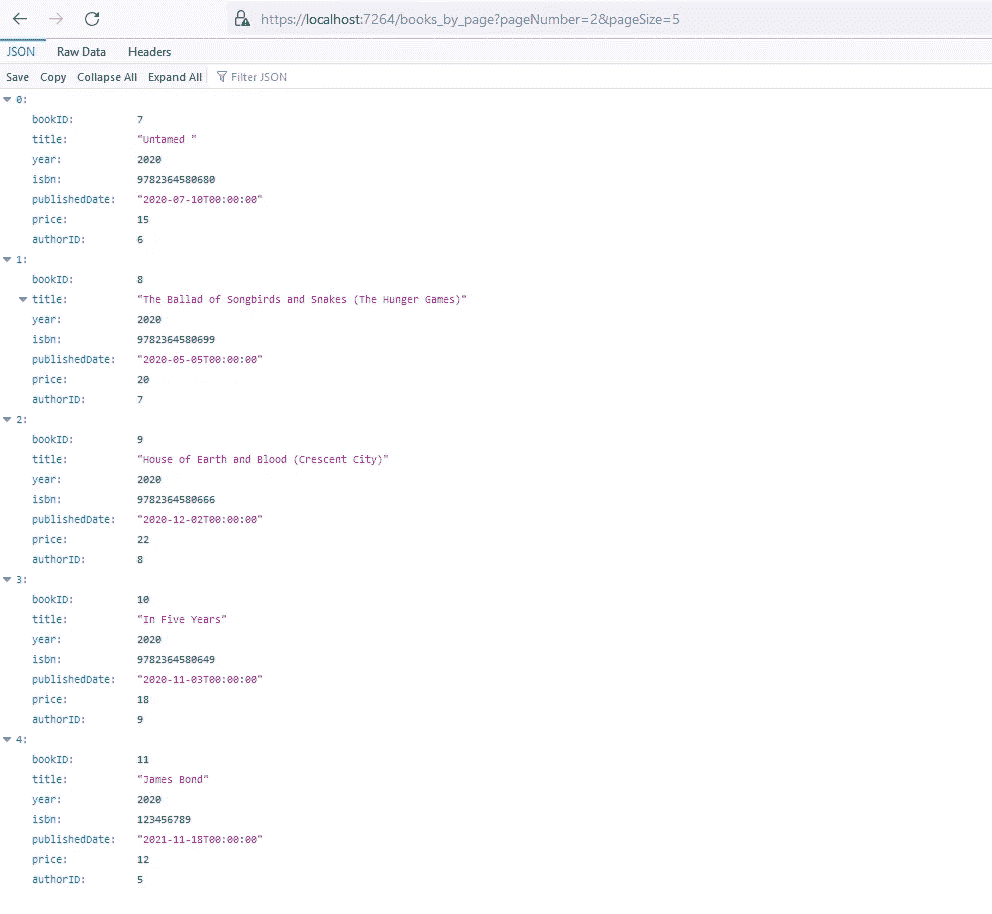

Minimal APIs — Paginated response

在下一节中，我们将看到如何在最小的 API 中使用 JWT 添加身份验证和授权。

## 最小 APIs 使用 JWT 添加身份验证和授权

确保您安装了以下软件包。

```
Install-Package Microsoft.AspNetCore.Authentication.JwtBearer 
Install-Package Microsoft.IdentityModel.Tokens 
```

现在让我们创建下面的类

```
public record UserDto(string UserName, string Password);public record UserModel{[Required]public string UserName { get; set; }[Required]public string Password { get; set; }}public interface IUserRepositoryService{UserDto GetUser(UserModel userModel);}public class UserRepositoryService : IUserRepositoryService{private List<UserDto> _users => new(){new(“admin”, “abc123”),};public UserDto GetUser(UserModel userModel){return _users.FirstOrDefault(x => string.Equals(x.UserName, userModel.UserName) && string.Equals(x.Password, userModel.Password));}}
```

在上面的代码中，我们创建了 UserDTO 和 model 类来模拟内存中的用户存储，并创建了一个存储库方法来验证凭证。

接下来，我们为 JWT 令牌的实现和生成创建类。

```
public interface ITokenService{string BuildToken(string key, string issuer,string audience, UserDto user);}public class TokenService : ITokenService{private TimeSpan ExpiryDuration = new TimeSpan(0, 30, 0);public string BuildToken(string key, string issuer,string audience,  UserDto user){var claims = new[]{new Claim(ClaimTypes.Name, user.UserName),new Claim(ClaimTypes.NameIdentifier,Guid.NewGuid().ToString())};var securityKey = new SymmetricSecurityKey(Encoding.UTF8.GetBytes(key));var credentials = new SigningCredentials(securityKey, SecurityAlgorithms.HmacSha256Signature);var tokenDescriptor = new JwtSecurityToken(issuer, audience, claims,expires: DateTime.Now.Add(ExpiryDuration), signingCredentials: credentials);return new JwtSecurityTokenHandler().WriteToken(tokenDescriptor);}}
```

为了清晰起见，您可以将这些类添加到一个单独的文件夹中。

是时候在 WebApplicationBuilder 服务中注入我们的依赖关系了

```
builder.Services.AddSingleton<TokenService>(new TokenService());builder.Services.AddSingleton<IUserRepositoryService>(new UserRepositoryService());
```

现在我们需要配置认证和授权服务。

```
builder.Services.AddAuthorization();builder.Services.AddAuthentication(JwtBearerDefaults.AuthenticationScheme).AddJwtBearer(opt =>{opt.TokenValidationParameters = new(){ValidateIssuer = true,ValidateAudience = true,ValidateLifetime = true,ValidateIssuerSigningKey = true,ValidIssuer = builder.Configuration[“Jwt:Issuer”],ValidAudience = builder.Configuration[“Jwt:Audience”],IssuerSigningKey = new SymmetricSecurityKey(Encoding.UTF8.GetBytes(builder.Configuration[“Jwt:Key”]))};});
```

注意:确保您的 appsettings.json 包含以下键/值对

```
“Jwt”: {“Key”: “your-secret-key”,“Issuer”: "”,“Audience”: “"}
```

最后，我们可以简单地添加用于认证和授权的中间件

```
app.UseAuthentication();app.UseAuthorization();
```

现在我们需要添加 API 方法，如 **/login** 来验证用户的凭证并发布 JWT 令牌。

```
app.MapPost("/login",   [AllowAnonymous] async ([FromBodyAttribute]UserModel userModel,  TokenService tokenService, IUserRepositoryService userRepositoryService, HttpResponse response) => {var userDto = userRepositoryService.GetUser(userModel);
if (userDto == null)
{response.StatusCode = 401;return;}var token = tokenService.BuildToken(builder.Configuration["Jwt:Key"], builder.Configuration["Jwt:Issuer"], userDto);await response.WriteAsJsonAsync(new { token = token });return;}).Produces(StatusCodes.Status200OK).WithName("Login").WithTags("Accounts");
```

在这个方法中，我们简单地获取包含用户名和密码的 UserModel 类型的 JSON 对象，其他参数被隐式地传递给[from services]——它根据内存存储验证给定的凭证，并在成功验证后发布 JWT 令牌。我们还使用[AllowAnonymous]属性来确保这个端点在没有承载令牌的情况下是可访问的。

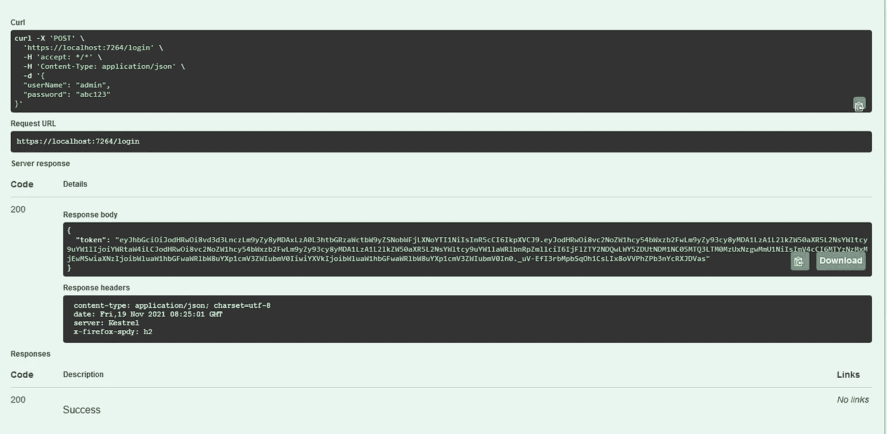

Minimal APIs — JWT Security — Login method

让我们创建一个受保护的资源，以确保它是否按预期工作

```
app.MapGet(“/AuthorizedResource”, (Func<string>)([Authorize] () => “Action Succeeded”)).Produces(StatusCodes.Status200OK).WithName(“Authorized”).WithTags(“Accounts”).RequireAuthorization();
```

RequireAuthorization()扩展方法表明，如果不在请求标头中传递 JWT 承载令牌，就无法调用此方法。

因为我们使用 Swagger UI 来执行和测试我们的端点，所以我们需要添加一点调整，这样我们就可以在 Swagger 中存储我们的 JWT 令牌，然后继续执行受保护的端点，而不必处理请求头。

```
builder.Services.AddSwaggerGen(c =>{var securityScheme = new OpenApiSecurityScheme{Name = “JWT Authentication”,Description = “Enter JWT Bearer token **_only_**”,In = ParameterLocation.Header,Type = SecuritySchemeType.Http,Scheme = “bearer”, // must be lower caseBearerFormat = “JWT”,Reference = new OpenApiReference{Id = JwtBearerDefaults.AuthenticationScheme,Type = ReferenceType.SecurityScheme}};c.AddSecurityDefinition(securityScheme.Reference.Id, securityScheme);c.AddSecurityRequirement(new OpenApiSecurityRequirement{{securityScheme, new string[] { }}});});
```

上面的代码将 Authorize 按钮添加到 swagger UI 中，该 UI 可以为后续请求存储 JWT 无记名令牌。

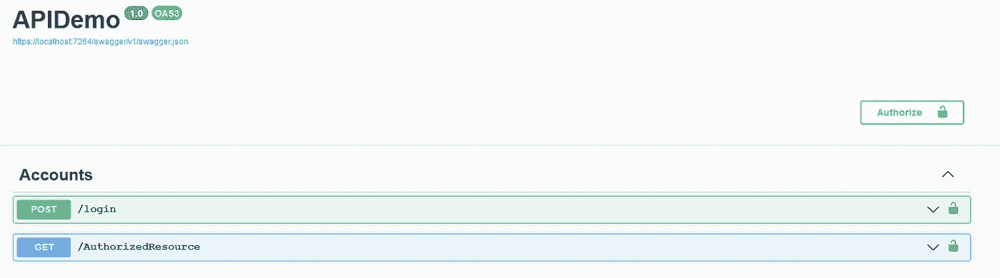

Minimal APIs — Accounts endpoints

执行登录端点并提供用户凭据(admin/abc123) —在 Auth 窗口中复制并粘贴令牌(如下所示)，然后单击 Authorize。

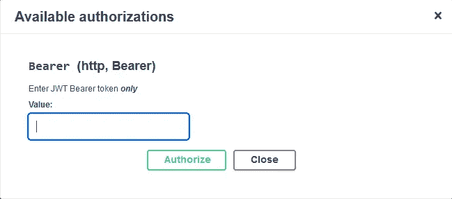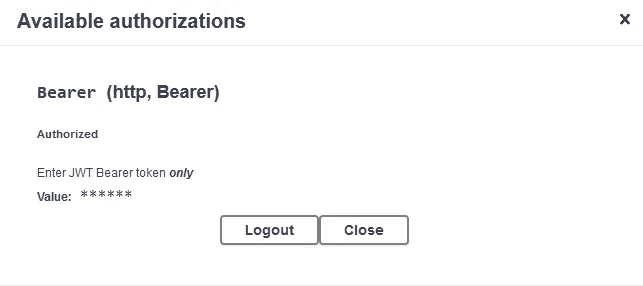

Minimal APIs — Swagger Authorize Feature

您现在已经登录，将能够执行授权的端点(不记名令牌将由 Swagger UI 自动传递)

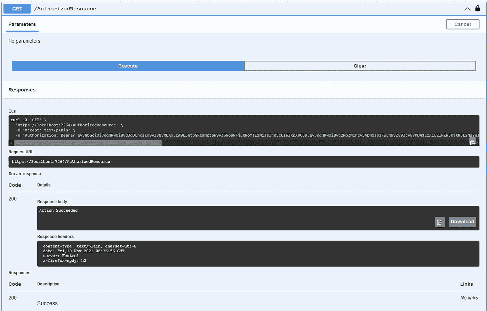

Minimal APIs — Accessing Protected Resources

# 结论

在本文中，我们已经了解了。NET 6，还探索了如何执行各种 CRUD 和其他数据库操作，生成基于 Swagger 的文档，以及实现基于 JWT 的身份验证和授权。

你可以从[这个回购](https://github.com/csehammad/MinimalAPIDemo/)下载完整的源代码，也可以看到它[在行动](https://minimalapidemo.azurewebsites.net/swagger/index.html)。