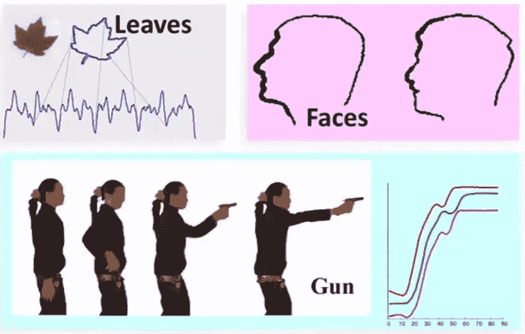
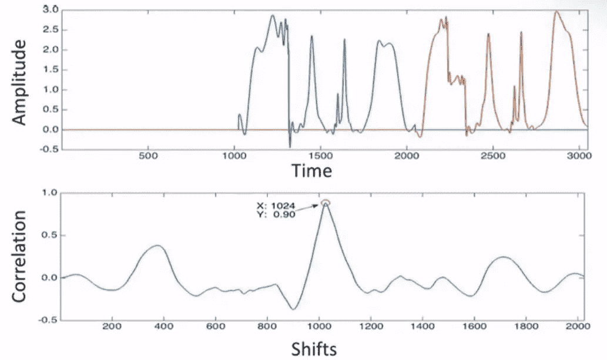
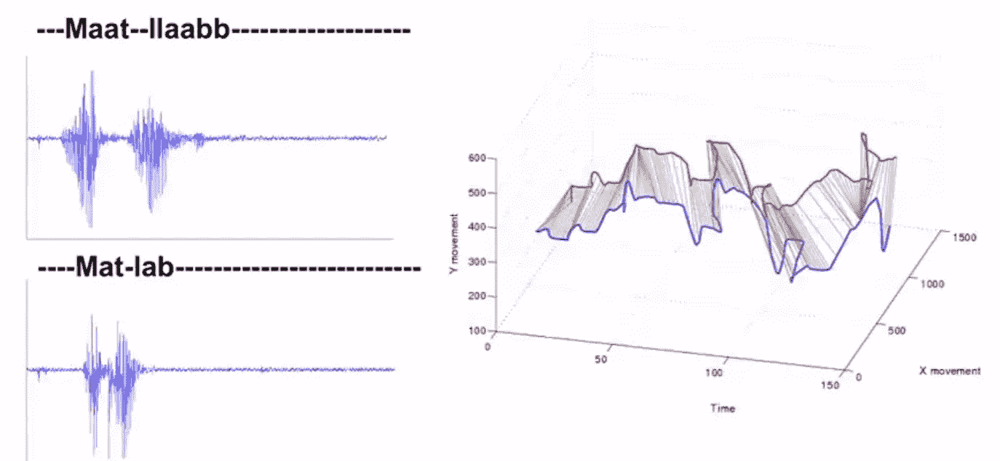
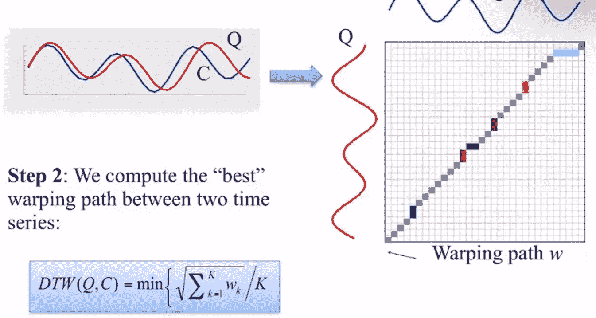
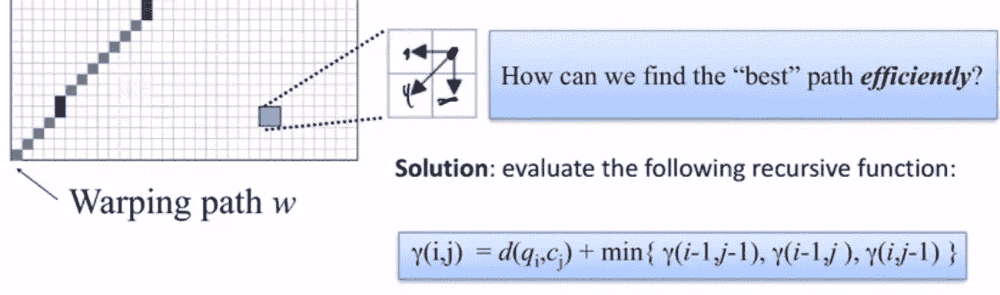
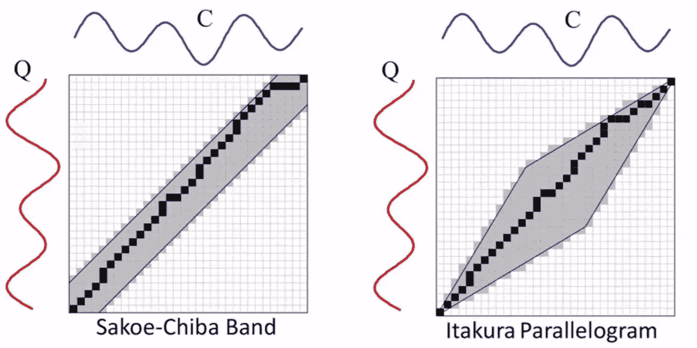
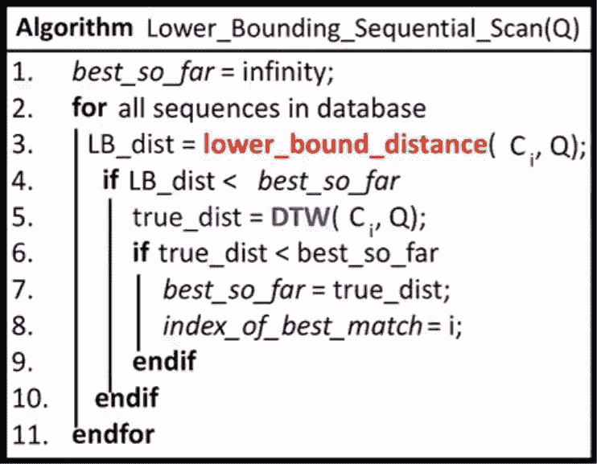

# 挖掘时间序列数据

> 原文：<https://medium.com/geekculture/mining-times-series-data-a944e8a1357e?source=collection_archive---------1----------------------->

如何度量序列数据上的相似性，如何通过预处理更快地度量？

## 介绍

如今，时间序列数据无处不在。除了常见的股票数据或天气数据，这显然是连续的，我们还可以从其他形式中得出时间序列，如下图所示。

对于时间序列分析，最直观的问题是:给定一个查询(序列数据)，我们数据库中 top-k 的相似数据是什么？要回答这个问题，我们必须知道时间序列数据的相似性度量和一些常见的做法，以使它在时间和计算能力方面更有效。

本文是 UChicago 的博士后研究员 John Paparrizos 的演讲摘要。我从幻灯片上借了很多照片。总的来说，内容是关于:

1.  如何度量序列数据的相似性？
2.  如何通过预处理更快的测出来？

## 互相关测量

保持一个序列不变，滑动另一个序列以计算每次移位的相关性(即内积),

## 动态时间弯曲距离(DTW 距离)

首先用于语音识别，用于识别以不同速度说出的单词。主旨:多次复制一个元素，以达到更好的匹配。

Maat Llaabb sounds different from Mat lab, but they should be the same if it’s in a speech recognition application.

Euclidean distance VS DTW distance

“多次复制一个元素，然后进行比较”等同于从一对一线性对齐更改为一对多非线性对齐。

DTW 计算:

1.  给定两个数据线程:Q 和 C，创建一个|Q|乘|C|的矩阵。
2.  计算两个时间序列之间的最佳弯曲路径。
3.  弯曲路径的性质:边界/连续性/单调性。通过递归搜索有效地找到最佳的下一步。

Warping path example

由于搜索空间大，导致成本高。引入全局约束(bound)来修剪搜索空间以便加速。

Calculation should be faster but why higher accuracy?

另一个窍门是简化原始数据，计算下界距离。让 DTW 计算有条件，这样我们可以避免昂贵的计算。

Pseudocode for lower_bounding_sequential_scan

## 分段聚集近似(PAA)

数据压缩的层次:时间序列→PAA →SAX

这样做的好处是节省了匹配数据和距离的时间和计算能力。这个预处理步骤的另一个方面是，原始数据包含我们无法控制和不关心的噪声。因此，噪声，也称为“失真”，可以在不损失太多有用信息的情况下被消除。

四个扭曲:

*   偏移平移:可以通过减去平均值来处理
*   幅度缩放:(数据平均值(数据))/标准值(数据)
*   线性趋势:减去线性拟合线以去除趋势
*   噪点:用邻居平滑点(大概用卷积滤镜？)

## 问题

聚类:将时间序列放入“相似”的组中(层次聚类/分区聚类——更快——次优)

分类:与查询相比，哪个组更相似

如果我们丢失了数据，有噪声，或者时间序列很长，相似性度量将给出很差的结果。在这种情况下，我们希望使用高级功能。传统特征有:均值/标准差/峰度—峰值/偏斜度。最近，ML 模型可以为我们提供其他可以使用欧几里德距离度量的特征(在去除噪声/线性趋势等之后)。).

为什么欧几里得胜过 DTW？速度和精度的权衡。