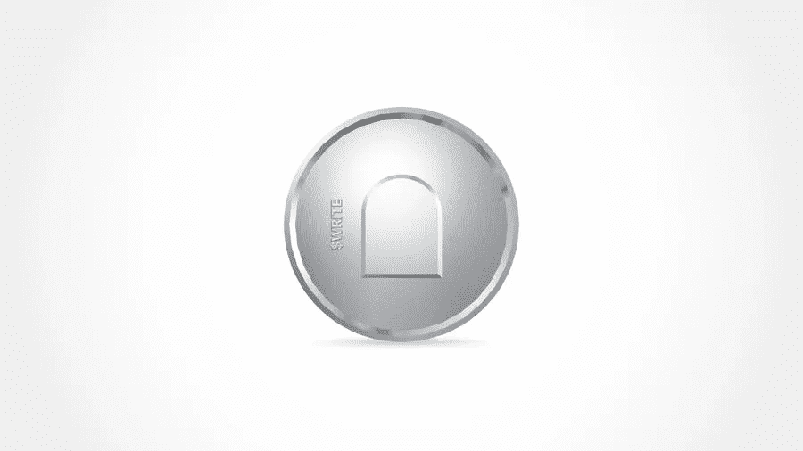

# 镜子为每一个创造者打开大门

> 原文：<https://medium.com/geekculture/mirror-to-open-the-gate-for-every-creator-f5658e685de1?source=collection_archive---------23----------------------->

WRITE — Token

## Mirror 与 Medium 非常相似，但受到以太坊区块链之眼订阅和一些新功能的推动。

**简而言之**
*以前的方法:*
1) Mirror 对作家开放，让他们以最大的自由发表自己的想法，前提是他们是由社区现有成员(WRITE Race)投票选出的。投票将在每周三下午进行。
*最新更新:*
1)用户无需参与写作竞赛(社区投票来发表自己的想法)

**什么是镜子？**
符号交流(通过文字交流)的历史有规律的更新，镜子是下一件大事。Mirror 的最终目标是通过用户拥有的分散的、基于加密的网络，彻底改变人们表达、分享和赚钱的方式。
Mirror 与 Medium 非常相似，但是采用了一种分散的方式来存储和发布内容。Mirror 引入了大量的原生加密功能，这将帮助基于加密的公司和作者无缝地共享他们的更新。Mirror 基于基于以太坊的分散式博客协议，允许用户通过连接以太坊钱包来登录和表达。利用 Arweave，一种基于区块链的存储协议来永久备份内容，并增强他们的审查抵抗力，Mirror 脱颖而出。

**不再写种族！尽管去年 12 月推出的 Mirror 计划向所有创作者敞开大门，但它并没有发挥应有的作用。直到它的最新更新，作家们只有在镜报的每周写作比赛中获得足够的选票后才能访问镜报。WRITE race 是一项社区投票活动，允许 WRITE token 持有者选择社区的新参与者。排名前十的作家(根据投票数)将获得一个免费的写作令牌，他们将被允许兑换一个镜像托管的. xyz 博客。比方说，如果你拥有一个名为 writerhood 的加密货币博客，你可以将你的镜像子域命名为 writerhood.Mirror.xyz。**

**Mirror——使用案例**
Mirror 是首个此类分散式博客协议，它为用户提供了各种以加密为中心的经济元素:

*   用户货币化
*   提供 NFT 收藏品的能力
*   发起众筹活动
*   举行拍卖
*   共享社区更新的加密方式
*   以分散的方式公开分享长期信息

4 月，作家艾米丽·西格尔通过《镜报》资助了她的下一部小说。7 月份，ETH 为即将上映的以太坊纪录片筹集了 190 万美元的资金。